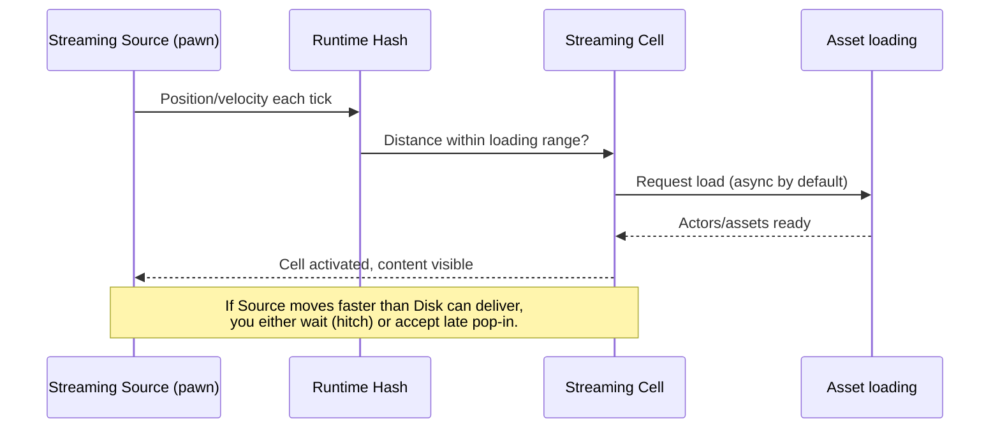

# Streaming and budgets

## Why this matters

Every streaming system in this folder — World Partition cells, Data Layer state, HLOD swaps, PCG runtime
generation — ultimately competes for the same thing: a per-frame budget of loading, decompression, and
memory bandwidth. A design that's individually correct (right cell size, right HLOD layer, right Data
Layer toggles) can still hitch in practice if too many of those systems ask for work on the same frame.
Understanding streaming sources and how loads get prioritized is what turns "it works in the editor" into
"it doesn't hitch when the player sprints toward a cell boundary."

## Mental model



Streaming is fundamentally a race between how fast a source moves through the world and how fast content
can load in response. Every budget conversation in this document is about managing that race: how far
ahead you predict (loading range), how much you're willing to block for it (blocking vs. async), and how
much load you avoid needing in the first place (HLODs, Data Layer discipline).

## The mechanics

### Streaming sources drive everything

As covered in [World Partition](./world-partition.md), a **streaming source** is anything implementing
`IWorldPartitionStreamingSourceProvider` — most commonly a `UWorldPartitionStreamingSourceComponent` on a
pawn. Each source reports its location, and optionally its shape and priority
(`FWorldPartitionStreamingSource`), so the runtime hash can decide which cells to request. A source can
mark itself as should-block-on-slow-streaming, which changes the failure mode when loading falls behind:
blocking sources stall the game to guarantee content is ready; non-blocking sources let the player run
ahead of fully-loaded content and accept visible pop-in instead.

Multiple simultaneous streaming sources (split-screen, a spectator plus a player, cinematic cameras) each
pull their own loading radius — every additional source is additional concurrent streaming demand, not
free.

### Legacy level streaming volumes

Pre-World-Partition streaming (and still relevant for smaller maps or sublevel-based projects) uses
`ALevelStreamingVolume` actors: a player standing inside a volume's bounds triggers load/unload of the
sublevel(s) it's associated with. `UWorld::ProcessLevelStreamingVolumes` is what evaluates local players
against these volumes each relevant tick. The Level Details window (per streaming sublevel) exposes
performance-relevant settings like minimum unload request time, which prevents a level from being
loaded and unloaded repeatedly if a player oscillates near a volume's boundary.

:::note
Legacy `ALevelStreamingVolume`-based streaming and World Partition's runtime hash are different systems —
volumes don't apply to World Partition maps, and mixing the two mental models on the same project is a
common source of confusion. Confirm which streaming model a given map actually uses before reasoning about
its budget.
:::

### Where budget actually goes

| Cost center | What drives it | Primary lever |
|---|---|---|
| Cell loading | Grid cell size, loading range, actor density per cell | Cell size, HLODs at distance |
| Data Layer transitions | How many actors flip `Unloaded ↔ Activated` per event | Batch transitions; avoid per-frame toggling |
| HLOD swap | Distance thresholds, outdated HLOD count | Keep HLODs built and current (`GetNumOutdatedHLODActors`) |
| PCG runtime generation | Generation trigger, generation source movement | Generate-on-load for static content; scope runtime triggers narrowly |
| Async load queue | Total concurrent streaming sources, asset size/compression | Reduce simultaneous sources; prioritize by source |

### Watching it happen

Diagnosing a hitch starts with knowing whether it's a loading-queue problem (too much requested at once)
or a main-thread problem (too much synchronous work processing what loaded). `stat levels` and
`stat streaming`-style stat commands (exact names vary by engine version) surface pending streaming
requests and level state, which is the first place to look before assuming a specific cell or Data Layer
is at fault.

```cpp title="Reacting to HLOD staleness as a coarse budget signal"
void AWorldBudgetMonitor::CheckHLODHealth()
{
    if (const UWorldPartitionHLODRuntimeSubsystem* HLODSubsystem =
            GetWorld()->GetSubsystem<UWorldPartitionHLODRuntimeSubsystem>())
    {
        if (HLODSubsystem->GetNumOutdatedHLODActors() > 0)
        {
            UE_LOG(LogTemp, Warning, TEXT("Outdated HLODs present — distant content may be loading full detail instead."));
        }
    }
}
```

## Gotchas

:::warning Blocking streaming sources hide budget problems until they don't
A blocking source (`bBlockOnSlowStreaming`-style behavior) makes streaming look fine in normal play because
it stalls rather than pops content in late. That stall is still a hitch — it just happens as a frame-time
spike instead of visible pop-in. Don't mistake "no visible pop-in" for "no streaming cost."
:::

:::caution Outdated HLODs mean you're paying full detail cost at distance
If HLODs aren't rebuilt after content changes, the runtime subsystem may fall back to full-detail content
further than intended, quietly blowing the budget the HLOD layer was supposed to protect. Rebuilding HLODs
is part of the content pipeline, not a one-time setup step.
:::

:::caution Data Layer toggling in bulk is a streaming event, not a flag flip
Activating a Data Layer that tags thousands of actors is functionally a large streaming request. Batch and
stagger large Data Layer transitions the same way you would think about loading a new sublevel, rather
than treating `SetDataLayerRuntimeState` as an instantaneous call.
:::

## See also

- [World Partition](./world-partition.md) — grids, cells, and streaming sources this budget model builds
  on.
- [Level Instances and Data Layers](./level-instances-and-data-layers.md) — Data Layer transitions as a
  streaming cost.
- [Procedural content generation](./procedural-content-generation.md) — runtime generation as an
  additional, often underestimated, streaming/CPU cost.
- [Epic — World Partition](https://dev.epicgames.com/documentation/unreal-engine/world-partition-in-unreal-engine)
