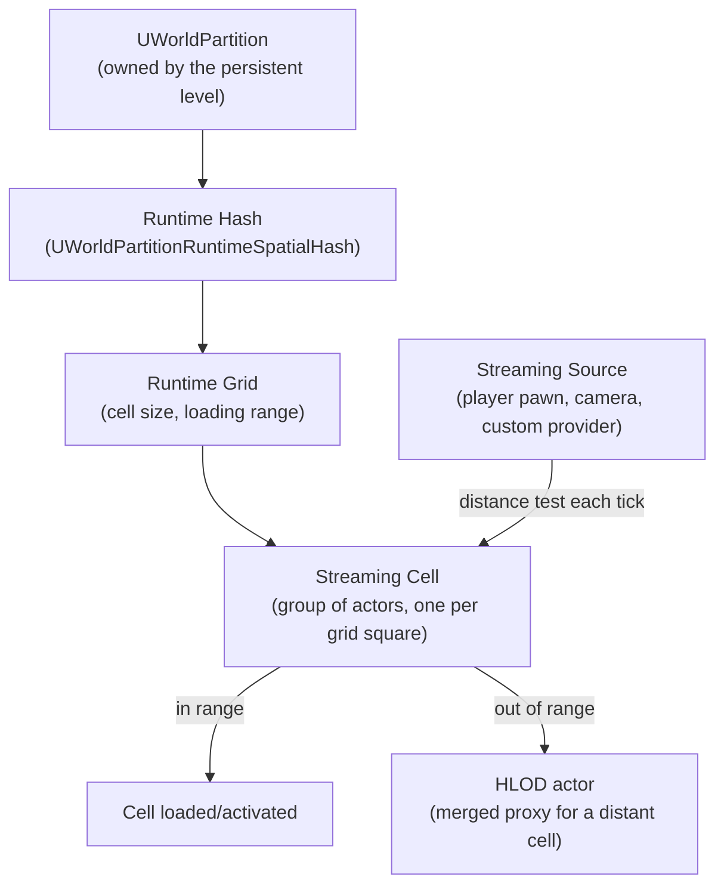

# World Partition

## Why this matters

Before World Partition, a large open world meant hand-authored persistent + streaming sublevels, and
every designer touching the map fought the same problem: two people editing the same `.umap` couldn't
merge. World Partition replaces that with automatic grid-based streaming and one file per actor, so a
100km² map behaves like a single seamless level in the editor while still only loading what's near the
player at runtime. Skip understanding the grid/cell/HLOD model and you'll either load the whole world at
once (memory blowup) or leave gaps where content pops in late (visible streaming hitches).

## Mental model

World Partition takes ownership of a persistent level's content and streams it through a spatial grid
instead of manually-placed sublevels. You don't place streaming levels anymore — you place actors
anywhere in the world, and the runtime hash decides which grid cell each actor belongs to based on its
bounds.



Each actor is spatially loaded by default — it belongs to exactly one cell, determined by its bounds —
unless you mark it "always loaded," in which case it lives outside the grid and streams in with the
persistent level itself. HLODs stand in for a cell's content at a distance so you're never looking at
empty space where a cell just unloaded.

## The mechanics

### Grids and cells

A World Partition map is configured with one or more **runtime grids**, each with a cell size and a
loading range. The default `UWorldPartitionRuntimeSpatialHash` divides the world into square cells at
that size; an actor is assigned to a cell based on which square its bounds fall into. Larger cells mean
fewer, coarser streaming units (less overhead, coarser granularity); smaller cells mean tighter culling at
the cost of more concurrent streaming requests. Most projects run more than one grid — a coarse one for
large actors like landscape and a fine one for dense actors like foliage or set dressing.

An actor's `GetIsSpatiallyLoaded()` result controls whether it's subject to grid streaming at all —
non-spatially-loaded actors (lights that affect the whole map, gameplay singletons) are always resident.

### Streaming sources

A cell loads because something in the world is close enough to want it. That "something" is a
**streaming source** — any object implementing `IWorldPartitionStreamingSourceProvider`. The engine
provides `UWorldPartitionStreamingSourceComponent`, an `UActorComponent` that already implements the
interface, so the common case is just adding it to a pawn:

```cpp title="MyPlayerPawn.h — opting a pawn into World Partition streaming"
UCLASS()
class MYGAME_API AMyPlayerPawn : public APawn
{
    GENERATED_BODY()

public:
    AMyPlayerPawn();

protected:
    UPROPERTY(VisibleAnywhere, Category = "Streaming")
    TObjectPtr<class UWorldPartitionStreamingSourceComponent> StreamingSource;
};
```

```cpp title="MyPlayerPawn.cpp"
AMyPlayerPawn::AMyPlayerPawn()
{
    StreamingSource = CreateDefaultSubobject<UWorldPartitionStreamingSourceComponent>(TEXT("StreamingSource"));
}
```

A `PlayerController`'s possessed pawn is registered as a streaming source automatically in most project
setups, but spectators, replay playback (`AWorldPartitionReplay::GetReplayStreamingSources`), and
non-player systems (cinematic cameras, AI-heavy regions) need their own explicit source if you want
content to load around them.

### The actor-per-file model

World Partition stores each actor as its own package under an `__ExternalActors__` folder next to the
map, instead of serializing every actor into one `.umap`. This is what makes World Partition maps usable
with real version control at scale: two designers editing unrelated actors touch unrelated files, so
there's nothing to merge. The runtime cost of this is indirection — `FWorldPartitionActorDescInstance`
holds lightweight actor metadata (bounds, data layers, HLOD layer, runtime grid) without loading the full
actor, so the editor and the runtime hash can reason about a cell's contents before any actor is actually
loaded into memory.

### HLODs

Hierarchical Level of Detail actors (`AWorldPartitionHLOD`) are auto-generated merged proxies that
replace a cell's real actors once the player is far enough away that the detail wouldn't be visible
anyway. You assign actors to an `HLODLayer` asset (visible via `GetHLODLayer()` on the actor desc), and a
build step (the World Partition HLODs builder, run from the editor or as a commandlet) bakes a merged
mesh or imposter per cell for that layer. At runtime, `UWorldPartitionHLODRuntimeSubsystem` swaps the real
cell for its HLOD actor as the streaming source moves out of range, and swaps back on approach —
`CanMakeVisible` / `CanMakeInvisible` gate that transition per cell.

```cpp title="Querying HLOD state from a gameplay system"
if (const UWorldPartitionHLODRuntimeSubsystem* HLODSubsystem =
        GetWorld()->GetSubsystem<UWorldPartitionHLODRuntimeSubsystem>())
{
    const uint32 OutdatedCount = HLODSubsystem->GetNumOutdatedHLODActors();
    // Non-zero means HLODs need a rebuild before they match current source content.
}
```

## Gotchas

:::warning Cell size is not free to change late
Changing a runtime grid's cell size after a lot of content has been placed reshuffles which actors belong
to which cell, which touches a large number of external actor packages at once. Decide grid size early,
based on your loading range and typical actor density, rather than tuning it iteratively on a full map.
:::

:::caution "Always loaded" actors bypass the whole point of World Partition
Marking something always-loaded is sometimes necessary (a manager actor, a skybox), but every
always-loaded actor is memory you pay regardless of where the player is. Audit this list — it's an easy
place for stray actors to silently opt out of streaming.
:::

:::note
Exact console commands and the HLOD builder commandlet name can differ across engine versions and project
setup (some teams wrap it in their own build scripts). Verify the invocation against your engine version
before scripting a build pipeline around it.
:::

## See also

- [Level Instances and Data Layers](./level-instances-and-data-layers.md) — the two ways to organize
  content *within* a World Partition map.
- [Streaming and budgets](./streaming-and-budgets.md) — tuning loading range, avoiding hitches, and how
  streaming sources interact with frame budgets.
- [World and levels](../03-gameplay-framework/world-and-levels.md) — how `UWorld` and persistent levels
  relate to World Partition's single-level model.
- [Epic — World Partition](https://dev.epicgames.com/documentation/unreal-engine/world-partition-in-unreal-engine)

