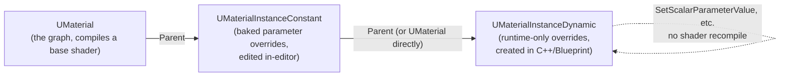

# Materials and the material graph

## Why this matters

A `UMaterial` compiles to a different shader permutation depending on three largely independent
choices — domain, blend mode, and shading model — and a fourth decision (instance vs. dynamic
instance) determines whether changing a parameter at runtime is free or triggers a shader recompile.
Getting any of these wrong doesn't usually crash anything; it just quietly costs performance (an
unnecessary translucent pass, a `UMaterialInstanceConstant` edited at runtime forcing a stall) or
produces a material that silently ignores lighting because it was authored for the wrong domain. The
material graph itself is a visual shader compiler front end — understanding what it compiles *to*
explains why some node choices are expensive and others are free.

## Mental model



A parent `UMaterial` owns the graph and therefore the shader permutations that get compiled — domain,
blend mode, and shading model are all baked in at that level and changing any of them recompiles
shaders. A `UMaterialInstanceConstant` overrides exposed parameter values without touching the graph,
so it's cheap to make many visual variants of one material without paying per-variant shader compiles.
A `UMaterialInstanceDynamic` is the runtime-only version of that same idea — created and mutated in
C++ or Blueprint, with parameter changes taking effect immediately and with no recompilation, which is
exactly why gameplay code that needs to tint, pulse, or fade a material at runtime should be creating
and writing to a `UMaterialInstanceDynamic`, never editing a `UMaterialInstanceConstant` from code.

## The mechanics

### Material domains

The **Material Domain** picks what kind of thing the graph is compiling a shader for, and it changes
which inputs are even meaningful:

| Domain | Used for |
|---|---|
| Surface | Ordinary opaque/masked/translucent surface shading — the default and most common domain |
| Deferred Decal | Projected decals blended into the G-buffer |
| Light Function | Modulating a light's color/intensity by a projected pattern |
| Volume | Volumetric materials (fog, clouds) |
| Post Process | Full-screen or region post-process passes, see [Post process and view extensions](./post-process-and-view-extensions.md) |
| User Interface | UMG/Slate-facing materials |

A material authored for the wrong domain doesn't necessarily fail to compile — it can just produce
nothing visible, because inputs like Base Color mean something entirely different (or nothing) outside
the Surface domain.

### Blend modes

Blend Mode controls how the shaded pixel combines with what's already in the frame: **Opaque**,
**Masked** (alpha tested, no blending), **Translucent**, **Additive**, **Modulate**, **AlphaComposite**
(premultiplied alpha), and **AlphaHoldout**. Translucent materials are meaningfully more expensive than
Opaque or Masked — they can't use the deferred G-buffer path the same way and typically don't receive
the same lighting features (see the [Nanite](./nanite.md) material-support constraints, which only
accept Opaque/Masked).

### Shading models

Shading Model picks the lighting model the pixel is shaded with — Default Lit, Unlit, Subsurface,
Subsurface Profile, Clear Coat, and others. A material can expose multiple shading models and select
between them per-pixel via a node, at extra cost versus a single fixed shading model.

**Substrate** is UE5's newer, modular material authoring framework — it replaces the fixed set of
blend modes and shading models with composable material "slabs" that can be layered and mixed. It's a
project-level toggle rather than the default authoring path in every project.

:::note
Substrate's node set and exact interaction with the legacy blend-mode/shading-model system continues
to evolve; verify whether your project has Substrate enabled before assuming which authoring path a
given material graph is using.
:::

### Creating and driving a dynamic material instance

```cpp title="MyWeaponComponent.h"
UCLASS(ClassGroup = (Custom), meta = (BlueprintSpawnableComponent))
class MYGAME_API UMyWeaponComponent : public UActorComponent
{
    GENERATED_BODY()

public:
    void SetHeatLevel(float NewHeatLevel);

protected:
    virtual void BeginPlay() override;

    UPROPERTY(EditDefaultsOnly, Category = "Weapon|Material")
    TObjectPtr<UMaterialInterface> BarrelMaterial;

    UPROPERTY(VisibleAnywhere, Category = "Weapon|Material")
    TObjectPtr<UMaterialInstanceDynamic> BarrelMID;

    UPROPERTY(EditDefaultsOnly, Category = "Weapon|Material")
    FName HeatParameterName = TEXT("HeatLevel");
};
```

```cpp title="MyWeaponComponent.cpp"
void UMyWeaponComponent::BeginPlay()
{
    Super::BeginPlay();

    if (BarrelMaterial)
    {
        // Creates a runtime-only instance parented to BarrelMaterial (or a UMaterialInstanceConstant).
        BarrelMID = UMaterialInstanceDynamic::Create(BarrelMaterial, this);
    }
}

void UMyWeaponComponent::SetHeatLevel(float NewHeatLevel)
{
    if (BarrelMID)
    {
        // No shader recompile — this just writes a parameter value the graph already exposed.
        BarrelMID->SetScalarParameterValue(HeatParameterName, NewHeatLevel);
    }
}
```

The mesh component using this material must actually be set to `BarrelMID`, not the original
`BarrelMaterial` — `UMaterialInstanceDynamic::Create` doesn't retroactively rebind anything that was
already assigned the parent material.

## Gotchas

:::warning[Never edit a UMaterialInstanceConstant at runtime]
Modifying a `UMaterialInstanceConstant`'s parameters through code forces the material system to treat
it like an editor edit — expensive, and not what it's designed for at runtime. Create a
`UMaterialInstanceDynamic` for anything gameplay code needs to change per-frame or per-instance.
:::

:::caution[Translucent materials are not a drop-in replacement for Opaque]
Beyond the blending cost itself, translucent materials lose some deferred-rendering features and, per
[Nanite](./nanite.md), aren't supported on Nanite meshes at all — an unsupported blend mode there falls
back silently to a default material.
:::

:::warning[A material built for the wrong domain fails quietly]
There's no compile error for putting Surface-domain logic into a Post Process material — inputs just
mean something different or evaluate to nothing. Confirm domain first when a material "does nothing"
after assignment.
:::

## See also

- [Custom shaders (HLSL)](./custom-shaders-hlsl.md) — the Custom node's HLSL escape hatch inside a
  material graph, and when a global shader is the better tool instead.
- [Nanite](./nanite.md) — the blend-mode constraint Nanite geometry imposes on materials.
- [Post process and view extensions](./post-process-and-view-extensions.md) — the Post Process domain
  in practice.
- [Epic — Substrate Materials](https://dev.epicgames.com/documentation/unreal-engine/substrate-materials-in-unreal-engine)

