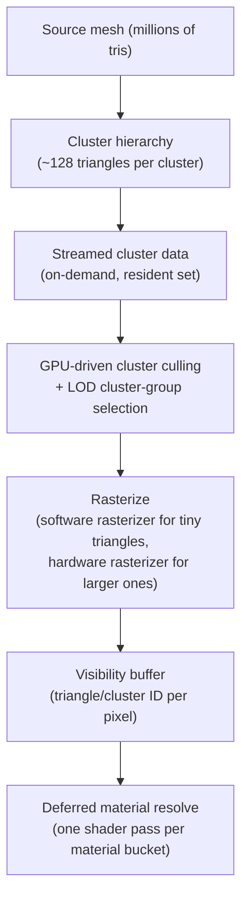

# Nanite virtualized geometry

## Why this matters

Nanite is easy to mentally file as "unlimited polygons, no LODs, just turn it on" — and for static
opaque meshes that's close enough to true to be useful. The trouble starts when that mental model gets
applied to a masked foliage material, a skeletal mesh, or anything relying on per-triangle wireframe
or mesh decals, because Nanite silently falls back to a default material or refuses to apply in ways
that only show up as a warning in the log, not a build error. Knowing what Nanite actually virtualizes
— and what it explicitly does not support — is what keeps an art team from discovering the fallback
mid-production instead of at asset-import time.

## Mental model



A Nanite mesh isn't rendered as a single LOD chain the way a traditional static mesh is. At import,
the mesh is broken into small clusters, organized into a hierarchy of precomputed simplifications so
the renderer can pick a per-cluster level of detail rather than swapping the whole mesh between
discrete LODs. Only the clusters actually needed for the current view are streamed in and rasterized;
Nanite decides per pixel, not per object, how much detail to show. Rasterization itself is split
between a software rasterizer (efficient for the very small triangles Nanite produces at distance) and
the hardware rasterizer for larger triangles. Instead of writing shaded pixels directly, the raster
step writes a visibility buffer — which cluster and triangle covers each pixel — and material shading
is deferred to a separate pass that groups pixels by material to avoid redundant shader invocations.

## The mechanics

### What Nanite actually replaces

Nanite geometry sidesteps the traditional LOD workflow (hand-authored or auto-generated LOD meshes,
manual LOD distance tuning) and the draw-call-per-mesh-instance model, because visibility and detail
selection happen at the cluster level inside the renderer, not per `UStaticMeshComponent`. This is
why Nanite scenes can hold far more unique geometric detail than the traditional pipeline — the cost
is roughly proportional to pixels covered, not triangle count of the source asset.

### Material support

Nanite supports materials using the **Opaque** or **Masked** blend mode only. A material using an
unsupported blend mode (Translucent, Additive, and the like) on a Nanite mesh falls back to a default
material, with a warning — silently, from the artist's point of view, unless someone is watching the
log. Nanite meshes can receive regular decals, but do not support Mesh Decals. The Wireframe view
checkbox has no effect on Nanite geometry. Vertex Interpolator and Custom UV nodes are evaluated up to
three times per pixel on Nanite materials, which makes them noticeably more expensive there than on
non-Nanite materials using the same nodes.

```cpp title="Enabling Nanite on a static mesh at import/build time"
void UMyMeshImportUtility::ForceEnableNanite(UStaticMesh* Mesh)
{
    check(Mesh);
    FMeshNaniteSettings& NaniteSettings = Mesh->NaniteSettings;
    NaniteSettings.bEnabled = true;
    Mesh->PostEditChange(); // triggers a rebuild with Nanite enabled
}
```

### Fallback meshes

Nanite still keeps a coarse, non-Nanite fallback mesh for cases the virtualized path can't cover (for
example, platforms or code paths that read raw triangle data, like some collision or ray tracing
setups). `ENaniteFallbackTarget` controls how that fallback is generated — `Auto`, `PercentTriangles`,
or `RelativeError` — trading fallback fidelity against its cost.

```cpp title="Nanite fallback target enum (informational, not something you construct directly)"
enum ENaniteFallbackTarget
{
    Auto,
    PercentTriangles,
    RelativeError
};
```

### Skeletal meshes and World Position Offset

Nanite support for skinned/skeletal meshes and for World Position Offset (WPO) has expanded across
5.x releases, including distance-based controls for when pixel-programmable materials (WPO among them)
are still evaluated on distant Nanite instances.

:::note
The exact skeletal-mesh Nanite feature set and its interaction with WPO/pixel-programmable distance
settings changed across recent 5.x releases. Verify current behavior and any relevant CVars against
your specific 5.7 build rather than assuming parity with older documentation.
:::

## Gotchas

:::warning A masked material on foliage is not a free win
Masked Nanite materials are supported, but per-pixel Vertex Interpolator/Custom UV evaluation cost
(up to 3x) plus alpha-test overhead adds up fast on dense foliage. Don't assume "Nanite supports
Masked" means masked foliage costs the same as an opaque Nanite mesh — profile it.
:::

:::caution An unsupported blend mode fails quietly
Assigning a Translucent or Additive material to a Nanite mesh doesn't error at compile or cook time —
it falls back to a default material and logs a warning. Put a log-warning check for Nanite fallback
materials into your CI or asset validation pass rather than relying on someone noticing visually.
:::

:::warning Don't expect Wireframe or Mesh Decals to work
Wireframe display and Mesh Decals are both explicitly unsupported on Nanite geometry. If your
debug tooling or a gameplay system depends on either, it needs a non-Nanite path.
:::

## See also

- [Lumen](./lumen.md) — the GI/reflection system Nanite's dense geometry and visibility buffer are
  designed to feed efficiently.
- [Render thread model](./render-thread-model.md) — where cluster culling and the visibility buffer
  sit relative to the game/render thread split.
- [Landscape and foliage](../11-world-building/landscape-and-foliage.md) — Nanite's most common
  large-scale use case and where masked-material cost tends to show up first.
- [Epic — Nanite Virtualized Geometry](https://dev.epicgames.com/documentation/unreal-engine/nanite-virtualized-geometry-in-unreal-engine)

