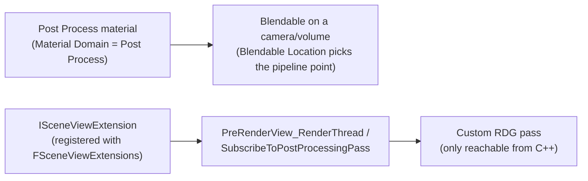

# Post process materials and scene view extensions

## Why this matters

There are two very different ways to inject custom work into the rendering pipeline, and picking the
wrong one either overengineers a simple screen effect or underdelivers on something that needs real
render-thread hooks. A **post process material** is the right tool for a screen-space visual effect
authored largely in the material graph. An **`ISceneViewExtension`** is the right tool for C++ code
that needs to hook specific points in the view/frame setup — injecting an RDG pass, modifying view
parameters, or running before/after specific engine passes — none of which a material graph alone can
do. Confusing the two means either fighting the material graph to do something it wasn't built for, or
writing a full view extension for an effect that a Post Process domain material would have handled in
an afternoon.

## Mental model



A post process material is data — it lives entirely inside the material system, gets attached as a
blendable, and the engine decides when and how to run it based on Blendable Location. An
`ISceneViewExtension` is code — a C++ object registered once with the engine's `FSceneViewExtensions`
registry, invoked at specific named hooks during view setup and rendering. The two aren't layered on
top of each other so much as parallel entry points into the same pipeline: a material-only effect never
needs a view extension, and a view extension that wants to add an RDG pass never needs a post process
material. They meet only when a view extension's hook (`SubscribeToPostProcessingPass`) is used
specifically to wrap around a named post-process pass.

## The mechanics

### Post process materials

A post process material is an ordinary `UMaterial` with its Material Domain set to **Post Process**
(see [Materials and the material graph](./materials-and-material-graph.md) for domains generally). It
gets applied as a full-screen or region pass over the rendered frame, and is added to a camera or
post-process volume as a **blendable**. Where in the pipeline it runs is controlled by **Blendable
Location**, which includes options such as before/after Depth of Field, within translucency rendering,
before Bloom, or even replacing the tonemapper entirely — each location differs in what resolution it
executes at and what color space it's working in, which changes both the visual result and the cost.

```cpp title="Adding a post process material blendable to a camera at runtime"
void AMyPlayerCameraManager::ApplyDamageVignette(UMaterialInterface* VignetteMaterial, float Weight)
{
    if (VignetteMaterial)
    {
        PostProcessSettings.WeightedBlendables.Array.Add(
            FWeightedBlendable(Weight, VignetteMaterial));
    }
}
```

For rendering a post process material outside the normal per-view blendable chain — for example,
running it standalone before the regular scene render — `AddPostProcessMaterialPass` supports a
standalone mode:

```cpp title="Running a post process material pass outside the normal blendable chain"
AddPostProcessMaterialPass(MaterialInterface, /*bAllowPostProcessMaterial=*/true, EPostProcessMaterialPhase::Standalone);
```

### ISceneViewExtension

`ISceneViewExtension` is the interface for hooking into view setup and rendering from C++, independent
of the material system entirely. `FSceneViewExtensions` is the engine's registry of every active
extension; a common base to derive from is `FSceneViewExtensionBase`, and `FWorldSceneViewExtension`
is a ready-made variant scoped to all viewports/scenes sharing one `UWorld` rather than a single view.

```cpp title="MySceneViewExtension.h"
class FMySceneViewExtension : public FSceneViewExtensionBase
{
public:
    FMySceneViewExtension(const FAutoRegister& AutoRegister)
        : FSceneViewExtensionBase(AutoRegister)
    {
    }

    // ISceneViewExtension
    virtual void SetupViewFamily(FSceneViewFamily& InViewFamily) override {}
    virtual void SetupView(FSceneViewFamily& InViewFamily, FSceneView& InView) override {}
    virtual void PreRenderView_RenderThread(FRDGBuilder& GraphBuilder, FSceneView& InView) override;
    virtual void SubscribeToPostProcessingPass(
        EPostProcessingPass PassId,
        const FSceneView& InView,
        FAfterPassCallbackDelegateArray& InOutPassCallbacks,
        bool bIsPassEnabled) override;
};
```

`PreRenderView_RenderThread` is called on the render thread before a view renders, and is the natural
place to add an RDG pass of your own via the `FRDGBuilder` passed in — this is where a view extension
and a hand-rolled RDG pass ([Render Dependency Graph](./render-dependency-graph.md)) meet.
`SubscribeToPostProcessingPass` hooks a specific named engine post-processing pass, letting you inject
a callback before or after it runs rather than replacing the whole post-process chain.

### Registration and activity

A view extension registers itself (commonly through the `FAutoRegister` mechanism in its constructor)
with `FSceneViewExtensions`, and whether it's actually active for a given view/frame can be scoped with
a `TSceneViewExtensionIsActiveFunction` — letting one registered extension decide per-frame, per-view,
whether it should do anything at all rather than always running once registered.

## Gotchas

:::warning[Post process materials can't reach outside their Blendable Location's data]
A material set to run before Bloom doesn't have access to the same buffers as one running after
Tonemapping — Blendable Location isn't just "when," it changes resolution and color space too. Picking
the wrong location for what the material actually needs to sample produces a visually wrong result, not
a compile error.
:::

:::caution[A view extension outlives the object that registered it if you're not careful]
`ISceneViewExtension`-derived objects are typically ref-counted and held by `FSceneViewExtensions`
independent of whatever gameplay object created them. If a `UMyComponent` creates and holds a
`TSharedPtr<FMySceneViewExtension>`, destroying the component doesn't automatically deregister the
extension — make sure teardown explicitly stops it (for example, gating it inactive via
`TSceneViewExtensionIsActiveFunction` before the owning object goes away).
:::

:::warning[Don't reach for a view extension for something a post process material can do]
Writing a full `ISceneViewExtension` with `PreRenderView_RenderThread` and a hand-written RDG pass is
substantially more code and more places to get threading wrong than authoring a Post Process domain
material. Reserve the C++ path for work a material graph genuinely can't express — reading arbitrary
non-material state, injecting a custom compute pass, or hooking a specific named engine pass.
:::

## See also

- [Materials and the material graph](./materials-and-material-graph.md) — the Post Process material
  domain in the context of domains generally.
- [Render Dependency Graph](./render-dependency-graph.md) — what to add inside
  `PreRenderView_RenderThread` when a post process material alone isn't enough.
- [Render thread model](./render-thread-model.md) — why `PreRenderView_RenderThread` runs where it
  does relative to game-thread view setup.
- [Epic — Post Process Effects](https://dev.epicgames.com/documentation/unreal-engine/post-process-effects-in-unreal-engine)

