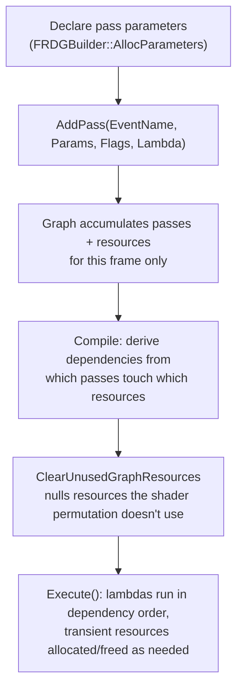

# Render Dependency Graph for custom render passes

## Why this matters

Before RDG, writing a custom render pass meant manually managing transient render target lifetimes,
manually inserting resource barriers, and manually reasoning about which passes could run in parallel
— all error-prone, all easy to get subtly wrong in ways that show up as GPU corruption or a validation
layer complaint on one platform and not another. RDG exists to take that bookkeeping away from you:
you describe a pass and the resources it reads and writes, and the graph derives dependencies, manages
transient resource lifetime, and inserts the correct barriers for you. Writing a custom pass without
going through RDG in modern UE code is both harder and more fragile than writing it with RDG.

## Mental model



RDG is built and torn down once per frame (per `FRDGBuilder` instance) — it's not a persistent object
graph, it's a description of this frame's rendering work that gets compiled and executed, then
discarded. You never talk to the RHI directly to create a transient texture and destroy it later;
instead you declare a pass, tell RDG which resources it touches through a parameter struct, and RDG
works out both the execution order and the resource lifetimes from that declaration. This is why RDG
resources should only be declared when a pass genuinely needs them — every declared resource is an
edge in the dependency graph RDG has to reason about.

## The mechanics

### Adding a compute pass

```cpp title="Adding a custom compute pass to the graph"
void AddMyComputePass(FRDGBuilder& GraphBuilder, TShaderMapRef<FMyComputeShaderCS> ComputeShader)
{
    FMyComputeShaderCS::FParameters* PassParameters =
        GraphBuilder.AllocParameters<FMyComputeShaderCS::FParameters>();

    FRDGTextureRef InputTexture = /* ...obtained from an earlier pass or registered external texture... */ nullptr;
    FRDGTextureUAVRef OutputUAV = /* ...created via GraphBuilder.CreateUAV(...)... */ nullptr;

    PassParameters->InputTexture = GraphBuilder.CreateSRV(InputTexture);
    PassParameters->OutputTexture = OutputUAV;
    PassParameters->InvTextureSize = FVector2f(1.0f / 1920.0f, 1.0f / 1080.0f);

    GraphBuilder.AddPass(
        RDG_EVENT_NAME("MyComputePass"),
        PassParameters,
        ERDGPassFlags::Compute,
        [ComputeShader, PassParameters](FRHIComputeCommandList& RHICmdList)
        {
            SetComputePipelineState(RHICmdList, ComputeShader.GetComputeShader());
            SetShaderParameters(RHICmdList, ComputeShader, ComputeShader.GetComputeShader(), *PassParameters);
            RHICmdList.DispatchComputeShader(240, 135, 1);
        });
}
```

`AllocParameters` allocates the parameter struct from RDG's own linear allocator rather than the stack
or heap directly — RDG guarantees that memory stays valid until the graph executes, which is exactly
the lifetime a lambda captured by reference into `Execute()` needs. Any RDG resource pointer (a texture,
an SRV, a UAV) assigned into the parameter struct becomes an edge RDG uses to compute dependencies and
manage transient allocation; a plain scalar like `InvTextureSize` is ignored by the dependency graph
and only consumed by `SetShaderParameters` when the pass actually runs.

### Managing lifetimes deliberately

RDG's own linear allocator has a few entry points depending on what you're allocating: `AllocPOD` for
trivial types, `AllocObject` for C++ objects that need their destructor tracked, `Alloc` for raw
memory, and `AllocParameters` specifically for pass parameter structs. Everything allocated this way
persists until the `FRDGBuilder` instance is destroyed at the end of the frame — you don't (and can't)
free it early.

`ClearUnusedGraphResources` is the utility for nulling out parameter struct fields the actual shader
permutation being used this pass doesn't reference — necessary because a shader with permutations can
end up not touching every field the parameter struct declares, and RDG needs to know which resources a
pass genuinely depends on versus which are just unused struct members.

### Profiling scopes

RDG has three distinct profiling scope macros, each feeding a different tool:

- `RDG_EVENT_SCOPE` — GPU profile scopes consumed by RenderDoc and RDG Insights.
- `RDG_GPU_STAT_SCOPE` — feeds the `stat gpu` console command's breakdown.
- `RDG_CSV_STAT_EXCLUSIVE_SCOPE` — feeds the CSV profiler.

All three correctly account for RDG's separate setup (CPU, building the graph) and execute (GPU,
running the passes) timelines, rather than conflating the two.

## Gotchas

:::warning[Don't hold onto RDG resource pointers past graph execution]
`FRDGTextureRef`, `FRDGBufferRef`, and friends are only meaningful for the lifetime of the
`FRDGBuilder` that created them. Trying to reuse one across frames, or stash it somewhere that outlives
`Execute()`, is using a transient handle after the thing it points at may have been freed.
:::

:::caution[Declare only the resources a pass actually needs]
Every resource in a pass parameter struct becomes a dependency edge. Over-declaring resources "just in
case" doesn't just waste a few bytes — it can force RDG to keep resources alive longer or serialize
passes that could otherwise run in parallel. Use `ClearUnusedGraphResources` when a shader has
permutations that don't all touch every parameter.
:::

:::warning[Match the profiling scope to the tool you're using]
`RDG_EVENT_SCOPE` (RenderDoc/Insights), `RDG_GPU_STAT_SCOPE` (`stat gpu`), and
`RDG_CSV_STAT_EXCLUSIVE_SCOPE` (CSV profiler) aren't interchangeable — adding only one means the other
two tools show your pass as unattributed time.
:::

## See also

- [Custom shaders (HLSL)](./custom-shaders-hlsl.md) — where the `FGlobalShader` an RDG pass dispatches
  actually comes from.
- [Render thread model](./render-thread-model.md) — RDG's builder lives and executes on the render
  thread, within the ownership rules that doc covers.
- [GPU profiling](./gpu-profiling.md) — reading the `RDG_GPU_STAT_SCOPE`/`RDG_EVENT_SCOPE` output back
  out with `stat gpu`, ProfileGPU, and RenderDoc.
- [Epic — Render Dependency Graph](https://dev.epicgames.com/documentation/unreal-engine/render-dependency-graph-in-unreal-engine)

