# Render thread model

## Why this matters

Unreal splits a frame across at least two threads — game and render — and on platforms with
supported RHIs, a third: the RHI thread. Code that reaches across that split without going through
the engine's rules touches memory another thread owns mid-write, or reads a `UObject` the garbage
collector has already reclaimed. These bugs are intermittent, thread-timing-dependent, and painful
to reproduce — exactly the kind that survive QA and show up as a crash report from a player with no
repro steps. Understanding which thread owns what, and how data legally crosses between them, is what
lets you add a render-side feature (a scene proxy update, a custom draw call, a compute pass) without
introducing that class of bug.

## Mental model

```mermaid
flowchart LR
    subgraph GT["Game Thread"]
        GTick["Actor/Component Tick"]
        GProxy["UPrimitiveComponent state"]
    end
    subgraph RT["Render Thread (~1 frame behind)"]
        RCmd["Enqueued render commands"]
        RProxy["FPrimitiveSceneProxy state"]
        RDGBuild["RDG graph build"]
    end
    subgraph RHIT["RHI Thread"]
        RHICmds["Translated platform graphics API calls"]
    end
    GPU["GPU"]

    GTick --> GProxy
    GProxy -->|"ENQUEUE_RENDER_COMMAND"| RCmd
    RCmd --> RProxy
    RProxy --> RDGBuild
    RDGBuild -->|"platform-agnostic commands"| RHICmds
    RHICmds -->|"DX12 / Vulkan / etc."| GPU
```



The renderer originally ran entirely on the render thread, with the game thread only enqueuing
commands for it to execute. On platforms where the RHI supports it, the render thread now acts as a
frontend that queues platform-agnostic graphics commands, and a separate RHI thread translates and
submits those to the actual graphics API — letting RHI submission run in parallel with render thread
scene setup. The game thread, render thread, and RHI thread are each typically one or more frames
ahead of the stage after them; the render thread commonly runs a frame behind the game thread. That
lag is deliberate — it's what lets the game thread keep simulating while the render thread and GPU
are still working through the previous frame's draw commands — but it means "the render thread" is
never looking at "this frame's" game state, it's looking at whatever was enqueued for it last.

## The mechanics

### Two objects, two threads, one relationship

The core ownership pattern in the renderer is the split between a game-thread object and its
render-thread mirror. `UPrimitiveComponent` is the game-thread-owned representation; `FPrimitiveSceneProxy`
is its render-thread counterpart, created when the component registers with the scene. After that
point, the game thread never reads or writes `FPrimitiveSceneProxy` members directly, and the render
thread never reads or writes the `UPrimitiveComponent` directly — every property that needs to cross
the boundary is copied across via an enqueued command, not shared by pointer.

### Getting data across correctly

`ENQUEUE_RENDER_COMMAND` is how game-thread code hands the render thread work and data:

```cpp title="Updating a scene proxy's color from the game thread"
void UMyPrimitiveComponent::SetTintColor(const FLinearColor& NewColor)
{
    check(IsInGameThread());
    TintColor = NewColor; // game-thread-owned copy, safe to keep here

    if (FMyPrimitiveSceneProxy* Proxy = static_cast<FMyPrimitiveSceneProxy*>(SceneProxy))
    {
        FLinearColor ColorToSend = NewColor; // copy captured by value, not by reference
        ENQUEUE_RENDER_COMMAND(UpdateTintColorCommand)(
            [Proxy, ColorToSend](FRHICommandListImmediate& RHICmdList)
            {
                Proxy->SetTintColor_RenderThread(ColorToSend);
            });
    }
}
```

The lambda captures a value copy, never a raw pointer into game-thread memory that might be freed or
mutated before the command actually runs — the render thread could execute this several milliseconds
(and one or more game-thread ticks) later. `check(IsInGameThread())` and `check(IsInRenderingThread())`
are the standard asserts for documenting and enforcing which thread a function is meant to run on;
sprinkle them on both sides of the boundary rather than trusting comments.

### Waiting on the render thread

Occasionally game-thread code needs to know the render thread has caught up — before destroying an
object it just enqueued a command for, for instance. `FRenderCommandFence` is the primitive for that:
you enqueue it after the commands you care about, then call `Wait()` on the game thread to block until
the render thread has processed everything up to that point.

## Gotchas

:::warning[Never cache a game-thread pointer inside a scene proxy]
A classic bug: a scene proxy constructor caches the owning `AActor*` or `UActorComponent*`, then a
render-thread function later dereferences it to read some property. The game thread owns all
`AActor`/`UObject` state and may write to it — or the garbage collector may reclaim it — at any point.
Mirror the specific values you need into the proxy at update time instead of reaching back through a
cached pointer.
:::

:::caution[The render thread is looking at last frame, not this frame]
Because the render thread trails the game thread, any render-thread work that reads back into game
state (screenshot capture, GPU readbacks used for gameplay decisions, blocking on `FRenderCommandFence`
every tick) either sees stale data or forces an expensive sync that erases the parallelism the split
exists to provide. Design render-thread-facing features assuming the data they see is one frame old.
:::

:::warning[Don't guess at RHI thread specifics]
Whether an RHI thread runs at all, and how much work it does versus the render thread, is platform-
and RHI-dependent, and console-specific behavior isn't something this doc verifies. Treat "render
thread" and "RHI thread" as distinct ownership domains, but don't assume identical behavior across
every platform without checking your target RHI.
:::

## See also

- [Garbage collection](../02-cpp-in-unreal/garbage-collection.md) — why a scene proxy holding a raw
  `UObject*` across threads is a use-after-free waiting to happen.
- [Render Dependency Graph](./render-dependency-graph.md) — what the render thread actually builds
  once your data has safely arrived.
- [GPU profiling](./gpu-profiling.md) — tools for seeing where time actually goes once work has
  crossed onto the render thread and GPU.
- [Epic — Threaded Rendering](https://dev.epicgames.com/documentation/unreal-engine/threaded-rendering-in-unreal-engine)
