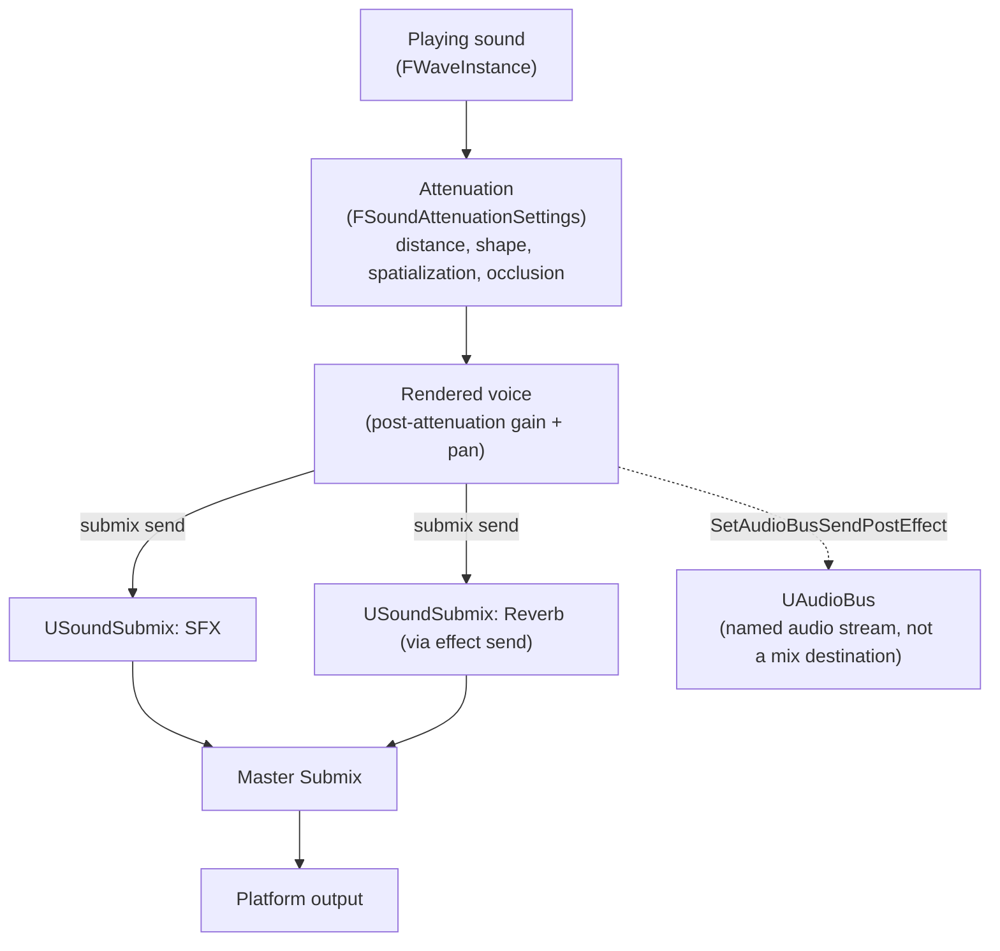

# Attenuation and submixes

Two separate systems decide what a sound sounds like once it's playing: attenuation decides how loud,
panned, and occluded a single sound is based on distance and geometry; the submix graph decides how
groups of sounds are summed, processed, and routed to the output device. Confusing the two is a common
source of "why won't this reverb apply to everything" or "why does changing this curve do nothing" bugs
— attenuation is per-sound and distance-driven, submixes are per-group and routing-driven, and the
fixes for problems in one are almost never in the other.

## Why this matters

Distance attenuation and spatialization are configured per `USoundBase` (or overridden per
`UAudioComponent`) and answer "how does this one sound change as the listener moves relative to it."
Submixes exist above that layer: every voice ultimately sends its processed output into one or more
`USoundSubmix` assets, which can apply DSP (reverb, EQ, dynamics) to everything routed through them and
mix down into a master submix before reaching the platform. Get attenuation wrong and one sound behaves
oddly at range; get submix routing wrong and entire categories of audio (all dialogue, all footsteps)
misbehave together.

## Mental model



Attenuation happens first, per sound, and produces a gain/pan/occlusion result for that one voice.
Submixes happen after, and are shared infrastructure: many voices feed into the same `USoundSubmix`,
which applies its effect chain once to the sum rather than once per voice — which is also why submix
effects are cheaper than per-source effects at scale. Audio buses are a related but distinct concept:
a named audio stream any source can send to (pre- or post-source-effects) for purposes like sidechain
ducking or feeding a visualizer, without necessarily being a mix destination in the submix graph itself.

## The mechanics

### Attenuation: shape, distance, and falloff

Attenuation settings live in `FBaseAttenuationSettings` (and the fuller `FSoundAttenuationSettings`
built on it), authored either inline on a `USoundBase` or as a shared, reusable `USoundAttenuation`
asset referenced by multiple sounds. Key knobs:

- **`AttenuationShape`** (`EAttenuationShape::Type`) — the volume falls off from a sphere, box, capsule,
  or cone, not just a point-radius model. `AttenuationShapeExtents` sizes that shape.
- **`DistanceAlgorithm`** (`EAttenuationDistanceModel`) — the curve family used as a function of
  distance (linear, natural sound / logarithmic, custom curve). `CustomAttenuationCurve`
  (`FRuntimeFloatCurve`) is available when you need a hand-authored response instead of a formula.
- **`FalloffDistance`** — the distance over which attenuation happens; beyond it, `FalloffMode`
  (`ENaturalSoundFalloffMode`) decides whether the sound keeps attenuating, goes silent, or holds its
  last volume.
- **`dBAttenuationAtMax`** — for the natural-sound distance algorithm specifically, the volume in
  decibels at the falloff distance, letting you tune how "gone" a sound is at max range without it being
  a hard cliff.
- **Cone-specific fields** (`ConeOffset`, `ConeSphereRadius`, `ConeSphereFalloffDistance`) refine the
  cone shape with an optional spherical falloff region, useful for directional emitters like speakers or
  vehicle exhausts.

`Evaluate` / `AttenuationEval*` are the functions the engine calls internally to turn a listener-to-sound
distance and the configured shape into an actual attenuation multiplier — you don't call these directly
from gameplay code, but they're worth knowing about when reading engine source to understand exactly how
a curve is being sampled.

### Attenuation: per-instance overrides

Attenuation settings on the asset are defaults; a `UAudioComponent` can override them per playing
instance without touching the shared asset:

- **`AdjustAttenuation(const FSoundAttenuationSettings&)`** applies new attenuation settings to a
  specific component's current sound.
- **`SetAttenuationOverrides(FSoundAttenuationSettings)`** sets a full override block the same way.
- **`BP_GetAttenuationSettingsToApply(FSoundAttenuationSettings& Out)`** reads back the settings actually
  in effect for that instance — asset defaults merged with any override — which is the right thing to
  inspect when debugging "why does this sound have the wrong falloff," rather than re-reading the
  asset's raw defaults.

### Occlusion

Occlusion is computed separately from distance attenuation and combines with it multiplicatively at the
wave-instance level: `FWaveInstance::GetOcclusionAttenuation()` and
`GetDistanceAndOcclusionAttenuation()` expose the occlusion-only and combined values respectively, and
`SetOcclusionAttenuation` is how the engine writes the result back after a trace. Occlusion checks run as
asynchronous line traces between listener and source; `FAudioDevice::NotifyActiveSoundOcclusionTraceDone`
is the callback that reports a completed trace's `bIsOccluded` result back onto the active sound, which
is why occlusion response lags a frame or more behind an object suddenly stepping between the listener
and the source — it's waiting on an async trace, not evaluated synchronously every tick.

:::note
The exact trace channel and interpolation-time properties exposed on `USoundAttenuation` for occlusion
(commonly an occlusion trace channel plus attack/release interpolation times) were not confirmed in
full detail against 5.7 in the sources consulted — check the Occlusion category on your project's
`USoundAttenuation` asset for the exact fields available in your engine version.
:::

### Spatialization

Spatialization — deriving a stereo or surround pan (or full binaural/HRTF processing on supported
platforms) from the listener/source relative position — is configured alongside attenuation on the same
asset, since both are functions of listener-relative geometry. UE5's Audio Mixer supports pluggable
spatialization plugins (binaural/HRTF-style processing on top of the default panning model) selected at
the project level; which plugin is active changes the *quality* of the spatial cue but not the
attenuation curve driving overall loudness — the two settings are independent axes.

### The submix graph

A `USoundSubmix` is a named mix bus: sources and other submixes send their output into it, it applies
its own effect chain, and it can itself send into a parent submix, ultimately terminating at the engine's
master submix. Because the effect chain runs once on the *sum* of everything routed in, submix effects
are the right place for anything that should apply uniformly to a category of sound — a underwater
low-pass on everything routed through a "Diegetic" submix, reverb shared across every gunshot in a level,
loudness/dynamics processing on the master bus.

- **`AddSubmixEffect(USoundSubmix*, FSoundEffectSubmixPtr)`** (on `FMixerDevice`) appends an effect to a
  submix's chain at runtime.
- **`FAudioDevice::SetSubmixEffectChainOverride(USoundSubmix*, TArray<FSoundEffectSubmixPtr>, float
  InCrossfadeTime)`** replaces a submix's entire effect chain, crossfading over the given time — useful
  for a state change like entering/leaving an underwater volume, where you swap the whole processing
  chain rather than tweaking one effect's parameters.
- Structs like `FSubmixEffectDynamicsProcessorSettings` and `FSubmixEffectReverbSettings` are the typed
  settings blocks for the built-in submix effect types (dynamics/compression, reverb) you attach to a
  chain.

### Audio buses

`UAudioBus` is a distinct concept from a submix: it's a named audio stream that sources can send into
without necessarily being part of the submix mix-down graph, most commonly used for sidechain-style
ducking (route dialogue's level into a bus, use that bus as a dynamics processor's key input elsewhere)
or for pulling a signal out for visualization/analysis. `UAudioComponent::SetAudioBusSendPostEffect`
sets how much of a given component's *post-source-effect* signal it sends to a target `UAudioBus`, and
`ESubmixEffectDynamicsKeySource` (`Default` / `AudioBus` / `Submix`) is how a submix dynamics processor
chooses what signal to key its compression/ducking off of — letting a ducking effect be sidechained from
an audio bus instead of just its own input.

## Code

```cpp title="Reusable attenuation asset applied to a weapon, with a per-instance override"
UCLASS()
class MYGAME_API AMyWeapon : public AActor
{
    GENERATED_BODY()

protected:
    UPROPERTY(EditDefaultsOnly, Category = "Audio")
    TObjectPtr<USoundBase> FireSound;

    // Shared USoundAttenuation asset — reused across every weapon of this type.
    UPROPERTY(EditDefaultsOnly, Category = "Audio")
    TObjectPtr<USoundAttenuation> FireSoundAttenuation;

    UPROPERTY(VisibleAnywhere, Category = "Components")
    TObjectPtr<UAudioComponent> WeaponAudioComponent;

public:
    void PlayIndoorMuffledFire()
    {
        FSoundAttenuationSettings Override;
        Override.DistanceAlgorithm = EAttenuationDistanceModel::Linear;
        Override.FalloffDistance = 1200.f;   // Shorter falloff indoors than the outdoor default.
        Override.dBAttenuationAtMax = -40.f;

        WeaponAudioComponent->SetSound(FireSound);
        WeaponAudioComponent->AdjustAttenuation(Override);
        WeaponAudioComponent->Play();
    }
};
```

```cpp title="Sending a component's output to an audio bus for sidechain ducking"
void AMyDialogueSpeaker::BeginPlay()
{
    Super::BeginPlay();

    if (DuckingBus)
    {
        // Send this dialogue's post-effect signal into the shared ducking bus;
        // a submix dynamics processor elsewhere keys off that bus to ducking music/SFX.
        VoiceAudioComponent->SetAudioBusSendPostEffect(DuckingBus, /*AudioBusSendLevel=*/1.0f);
    }
}
```

```cpp title="Swapping a submix's entire effect chain on a state change"
void AUnderwaterVolume::OnActorEnter(AActor* EnteringActor)
{
    if (FAudioDevice* AudioDevice = GetWorld()->GetAudioDeviceRaw())
    {
        AudioDevice->SetSubmixEffectChainOverride(
            SfxSubmix,
            UnderwaterEffectChain,
            /*InCrossfadeTime=*/0.5f);
    }
}
```

## Gotchas

:::warning[Submix effects run on the sum, not per-source]
An effect added via `AddSubmixEffect` processes the mixed-down signal of everything routed into that
submix — it cannot target one source differently from another once they're in the same submix. If you
need per-source processing (a unique filter on one specific emitter), that belongs on the source effect
chain or the attenuation settings, not a submix effect.
:::

:::warning[Occlusion lags because it's asynchronous]
Occlusion is resolved via async line traces (`NotifyActiveSoundOcclusionTraceDone` fires once a trace
completes), not synchronously every tick. Expect a frame or more of latency between geometry changing
and the occlusion attenuation updating — don't chase "why is occlusion one frame late" as if it were a
bug.
:::

:::caution[Attenuation shape extents don't auto-scale with actor scale]
`AttenuationShapeExtents` is authored in world units on the attenuation asset/settings block; scaling
the actor the sound is attached to does not resize the attenuation shape to match. If you scale an actor
up or down at runtime, adjust the attenuation override to match, or the sound's falloff radius will
visibly disagree with the object producing it.
:::

:::caution[A shared USoundAttenuation asset is shared — edits are global]
Because `USoundAttenuation` assets are meant to be reused, editing one in the editor changes falloff
behavior for every sound referencing it project-wide, not just the one you're currently tuning. Use a
per-instance `AdjustAttenuation`/`SetAttenuationOverrides` call in C++ when you need a one-off variant
instead of forking the shared asset.
:::

:::note
The specific spatialization plugin architecture (which HRTF/binaural plugins ship with the engine versus
are third-party, and how a project selects one) was not confirmed in detail against 5.7 in the sources
consulted — check your project's platform audio settings for the active spatialization plugin.
:::

## See also

- [Audio engine overview](./audio-engine-overview.md) — where attenuation and submix routing sit in the
  overall playback pipeline, from asset to output.
- [MetaSounds](./metasounds.md) — MetaSound Sources are `USoundBase`-derived and go through the same
  attenuation and submix routing described here.
- [Collision channels and responses](../06-collision-and-physics/collision-channels-and-responses.md) —
  the trace-channel model occlusion checks are built on.
- [Epic — Spatialization and sound attenuation](https://dev.epicgames.com/documentation/unreal-engine/spatialization-and-sound-attenuation-in-unreal-engine)

