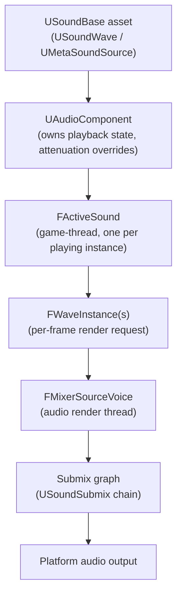

# Audio engine overview

Every gunshot, footstep, and music cue in a UE5 project passes through the same pipeline before it
reaches a speaker: an asset gets played on a component, the component spawns an `FActiveSound`, that
active sound generates per-frame `FWaveInstance`s, and the Audio Mixer sums those instances through a
submix graph before handing samples to the platform. If you only ever drag a `USoundBase` onto an
`Ambient Sound` actor, you can ignore all of that — but the moment something doesn't sound right
(a sound won't stop, a volume change on a `SoundClass` does nothing, a submix effect never runs) the
bug is almost always in one of these stages, and you need the map to find it.

## Why this matters

UE5's audio backend is **Unreal Audio Mixer** (`AudioMixer`), which replaced the old per-platform
"legacy" audio backends as the default in UE5. It unified audio processing into one cross-platform DSP
graph and is the foundation MetaSounds, submix effects, and audio buses are built on. Understanding the
pipeline — asset, component, active sound, wave instance, submix — tells you where to intervene: change
volume on the component, not the asset; add an effect on a submix, not per-sound; route ducking through
a submix send, not a global volume multiplier.

:::note
Sound Cues, Sound Class Mix, and Audio Volumes are deprecated as of UE5 in favor of MetaSounds,
Modulation/Submixes, and a newer volume system, respectively. This tranche of docs assumes MetaSounds,
not Sound Cues, as the procedural audio graph — see [MetaSounds](./metasounds.md).
:::

## Mental model

Playing a sound is not "the engine reads a file and plays it." It's a chain of objects, each with a
different lifetime, that exists so many simultaneous sounds can be mixed, spatialized, and processed
without the game thread doing per-sample work:



- **`USoundBase`** is the asset-level abstraction — `USoundWave` (a raw audio asset) or
  `UMetaSoundSource` (a procedural graph) both derive from it, so most playback APIs take a
  `USoundBase*` and don't care which one you hand them.
- **`UAudioComponent`** is the actor-attachable playback handle. It owns per-instance state: volume,
  pitch, attenuation overrides, parameters. `UGameplayStatics::SpawnSoundAtLocation` and similar helpers
  create one under the hood; `PlaySoundAtLocation` (fire-and-forget) does not give you one back at all.
- **`FActiveSound`** is the game-thread-side "this is currently playing" record. It's not a `UObject` —
  it's a lightweight struct the audio engine ticks every frame to decide what needs to render.
- **`FWaveInstance`** is generated per render update from the active sound; it's what the mixer actually
  schedules. Distance and occlusion attenuation are computed onto the wave instance (`GetOcclusionAttenuation`,
  `GetDistanceAndOcclusionAttenuation`) each tick.
- **The submix graph** is where individually-rendered voices get summed, processed by submix effects,
  and ultimately reach the output submix. See [Attenuation and submixes](./attenuation-and-submixes.md).

## The mechanics

### Playback entry points

Most gameplay code never touches `FActiveSound` directly — it goes through one of a small set of
entry points, chosen by whether you need a handle back:

| API | Returns a component? | Use when |
|---|---|---|
| `UGameplayStatics::PlaySound2D` | No | Fire-and-forget UI/non-spatial sound |
| `UGameplayStatics::PlaySoundAtLocation` | No | Fire-and-forget spatial one-shot |
| `UGameplayStatics::SpawnSoundAtLocation` | Yes (`UAudioComponent*`) | Spatial sound you need to stop/adjust later |
| `UGameplayStatics::SpawnSoundAttached` | Yes | Sound that should follow a component (footsteps, engine loop) |
| `UAudioComponent::Play` | N/A — you already own the component | Component placed in the editor or created in C++ |

Fire-and-forget variants exist because most sounds (impacts, one-shot barks) never need to be stopped
or adjusted mid-flight — paying for a `UAudioComponent`'s bookkeeping for those is wasted allocation.
Reach for the `Spawn*` variants only when you actually need the handle.

### The Audio Mixer backend

`AudioMixer` (module `Runtime/AudioMixer`) is the cross-platform audio rendering backend that
processes all sound sources and submixes on a dedicated audio render thread, decoupled from the game
thread. Platform-specific output is abstracted behind `IAudioMixerPlatformInterface`, which exposes the
device management, buffer submission, and hardware-specific hooks each platform backend implements —
you don't call into it directly from gameplay code, but it explains why audio keeps rendering even when
the game thread hitches: the render thread has its own buffer of scheduled voices.

Each currently-playing sound becomes an `FMixerSourceVoice` on the render thread. Voices are a finite,
configurable resource — `MaxChannels` and related concurrency settings in `Audio Settings` cap how many
can render simultaneously; when you exceed that, the engine virtualizes the quietest/least-important
voices instead of hard-cutting them off.

### Components own per-instance state, assets don't

A `USoundBase` asset is shared and immutable at runtime; anything that varies per-playing-instance
(current volume multiplier, attenuation override, active MetaSound parameters) lives on the
`UAudioComponent`, not the asset. This is why `UAudioComponent::AdjustAttenuation` and
`SetAttenuationOverrides` take an `FSoundAttenuationSettings` and apply it to *this playback*, and why
querying `BP_GetAttenuationSettingsToApply` gives you back the settings actually in effect for that
instance (asset defaults merged with any override) rather than the asset's raw defaults.

### Concurrency and virtualization

Before a sound is even allowed to start, `Sound Concurrency` settings (a `USoundConcurrency` asset
referenced from the `USoundBase`) decide whether it's allowed to play at all — how many instances of
"gunshot" can be audible at once, whether a new one steals the oldest or is rejected outright. This is
a separate gate from attenuation-based virtualization, which happens *after* a sound is already playing
and decides whether it still deserves a real voice as it becomes quiet or distant.

### Where MetaSounds and Sound Cues fit

`USoundBase` is deliberately abstract about what generates the actual samples. Historically that was a
`USoundCue` — a node graph of concatenation, modulation, and randomization nodes evaluated once at
playback start. **Sound Cues are deprecated in UE5** in favor of **MetaSounds**, which replace a
fire-and-once node graph with a real per-sample DSP graph that runs continuously for the life of the
sound — see [MetaSounds](./metasounds.md) for the full model.

## Code

```cpp title="Spawning a spatial one-shot with a handle you can stop later"
void AMyWeapon::PlayFireSound()
{
    if (!FireSound)
    {
        return;
    }

    UAudioComponent* SpawnedComp = UGameplayStatics::SpawnSoundAttached(
        FireSound,
        MuzzleFlash, // USceneComponent to attach to
        NAME_None,
        FVector::ZeroVector,
        EAttachLocation::SnapToTarget,
        /*bStopWhenAttachedToDestroyed=*/true);

    if (SpawnedComp)
    {
        SpawnedComp->SetVolumeMultiplier(CurrentFireVolumeScale);
    }
}
```

```cpp title="MyWeapon.h — the properties referenced above"
UCLASS()
class MYGAME_API AMyWeapon : public AActor
{
    GENERATED_BODY()

protected:
    UPROPERTY(EditDefaultsOnly, Category = "Audio")
    TObjectPtr<USoundBase> FireSound;

    UPROPERTY(VisibleAnywhere, Category = "Components")
    TObjectPtr<USceneComponent> MuzzleFlash;

    UPROPERTY(EditAnywhere, Category = "Audio")
    float CurrentFireVolumeScale = 1.0f;

    void PlayFireSound();
};
```

```cpp title="Overriding attenuation on a placed UAudioComponent"
void AMyAmbientEmitter::BeginPlay()
{
    Super::BeginPlay();

    FSoundAttenuationSettings Override;
    Override.FalloffDistance = 3000.f;
    Override.DistanceAlgorithm = EAttenuationDistanceModel::Linear;

    AmbientAudioComponent->AdjustAttenuation(Override);
}
```

## Gotchas

:::warning Fire-and-forget helpers give you nothing to stop
`PlaySoundAtLocation` and `PlaySound2D` don't return a component — there is nothing to call
`FadeOut`/`Stop` on later. If a sound might need to be interrupted (a looping engine sound, a voice
line that can be skipped), use `SpawnSoundAtLocation`/`SpawnSoundAttached` from the start rather than
retrofitting a handle in later.
:::

:::warning Voice count is finite — virtualization is not a bug
When many sounds play at once, quiet/distant ones lose their real render voice ("virtualize") rather
than getting cut instantly, then reallocate a voice if they become audible again. If a sound seems to
randomly cut and resume, check `MaxChannels` and per-sound concurrency settings before assuming a scripting
bug.
:::

:::caution Don't confuse the asset with the instance
`USoundBase` is shared across every actor playing it. Mutating something you think is "this instance's
volume" by editing the asset changes it for every concurrent playback, everywhere. Per-instance state
lives on the `UAudioComponent` (`SetVolumeMultiplier`, `AdjustAttenuation`, `SetTriggerParameter`), never
on the asset.
:::

:::note
The exact virtual-voice reactivation heuristics and default `MaxChannels` value were not confirmed
against 5.7 in the sources consulted — verify against your project's `Audio Settings` and platform
target.
:::

## See also

- [MetaSounds](./metasounds.md) — the procedural graph system that generates the samples a
  `UMetaSoundSource` feeds into this pipeline.
- [Attenuation and submixes](./attenuation-and-submixes.md) — how distance, spatialization, and the
  submix graph shape what comes out of the mixer.
- [Delegates and events](../02-cpp-in-unreal/delegates-and-events.md) — the pattern behind
  `UAudioComponent`'s completion callbacks (`OnAudioFinished`, `OnAudioPlaybackPercent`).
- [Epic — Audio Mixer overview](https://dev.epicgames.com/documentation/unreal-engine/API/Runtime/AudioMixer)

