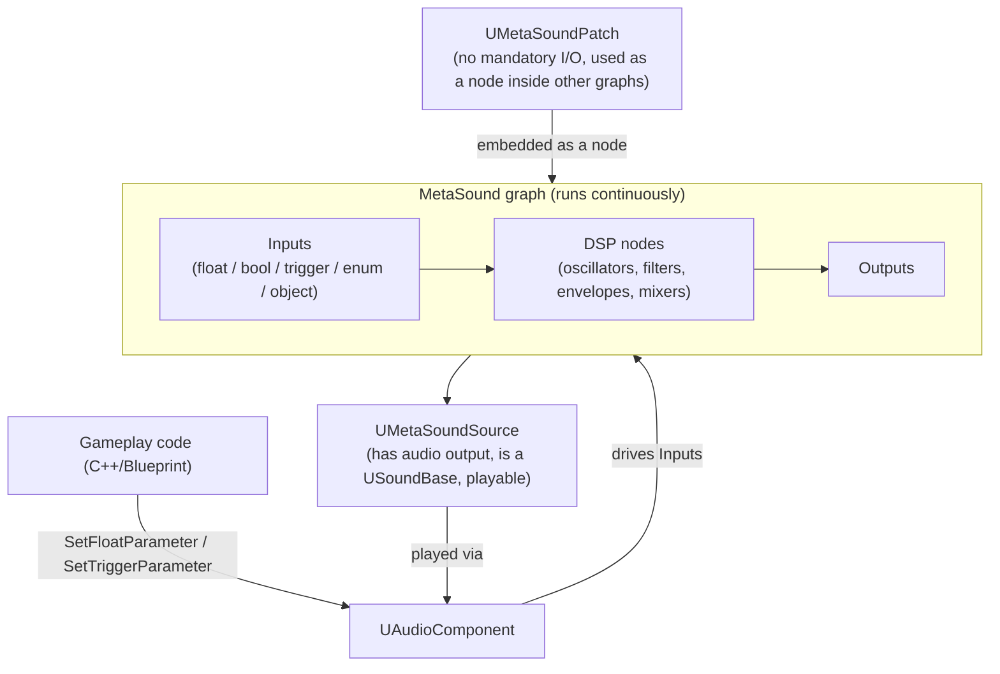

# MetaSounds

MetaSounds replace Sound Cues as UE5's procedural audio graph system. Where a Sound Cue graph runs once
at playback start to pick which wave to play, a MetaSound graph is a real per-sample DSP network that
keeps running for the sound's entire lifetime — which is what makes runtime-driven audio (an engine
pitch tied to speed, a footstep filtered by surface, a weapon that layers loop + tail dynamically)
possible without hand-rolled `Tick` logic in C++. If you're still reaching for a Sound Cue in a new UE5
project, you're building on a deprecated system and losing this entire capability.

## Why this matters

Sound Cues evaluate their graph once, at the moment a sound starts, to decide *what* to play — the
graph itself has no further influence once playback begins. MetaSounds evaluate continuously, sample by
sample, so the graph *is* the sound: parameters can change mid-playback, triggers can fire new events
into a running instance, and the whole thing can be driven from C++ or Blueprint gameplay code exactly
like any other reflected UObject interface. Understanding MetaSound Source vs. Patch, and how triggers
differ from continuous inputs, is the difference between building a sound that reacts to gameplay and
building one that's just a differently-shaped Sound Cue.

## Mental model



A **MetaSound Source** (`UMetaSoundSource`) is the playable asset — it derives from `USoundBase`, has a
defined audio output format, and is what you assign to a `UAudioComponent` or pass to
`UGameplayStatics::SpawnSoundAtLocation`. A **MetaSound Patch** (`UMetaSoundPatch`) is not directly
playable: it has no mandatory inputs or outputs, and exists purely to be dropped as a reusable node
*inside* other MetaSound graphs — think of it as a function you factor out once and reuse across many
Sources, rather than a sound in its own right.

## The mechanics

### Source vs. Patch

| | `UMetaSoundSource` | `UMetaSoundPatch` |
|---|---|---|
| Derives from | `USoundBase` | `UObject` (MetaSound-specific base) |
| Has audio output | Yes — output format is configured on the asset (`SetFormat` / `EMetaSoundOutputAudioFormat`) | No requirement |
| Playable directly | Yes | No — only usable as a node inside another graph |
| Typical use | A gunshot, an engine loop, a music stinger | A shared "apply a low-pass sweep" or "ADSR envelope" subgraph reused by many Sources |

Reach for a Patch when you find yourself copying the same cluster of nodes into multiple Source graphs
— factor it into one Patch and instance it everywhere instead, the same instinct as factoring a
Blueprint function library out of duplicated Blueprint logic (see
[Blueprint function libraries](../04-blueprint-interop/blueprint-function-libraries.md)).

### Inputs, outputs, and triggers

MetaSound graph pins carry a small set of data types, and the two categories that matter for
gameplay-driven audio are:

- **Continuous inputs** (float, bool, int, enum, string, object reference) — a value that's just
  "current state," sampled by the graph whenever it needs it. A movement speed feeding an engine pitch
  is a continuous float input.
- **Triggers** — a discrete, edge-triggered event with no persistent value: it fires once and the graph
  reacts to *that instant*, the same mental model as a Blueprint exec pin rather than a data pin. Firing
  a trigger is how you tell a running MetaSound "the gun just fired again" or "the footstep just
  landed," as opposed to setting a value that stays set.

Both directions exist: an Input pin lets gameplay code push data or events *into* the graph; an Output
pin lets the graph expose data or trigger events *out* to the calling component (for example, "this
one-shot layer just finished," consumed the same way `UAudioComponent::OnAudioFinished` is consumed for
plain sound assets).

### Calling into a MetaSound from C++

Two mechanisms cover the vast majority of runtime interaction, both operating on the `UAudioComponent`
that's playing the `UMetaSoundSource` — you don't reach into the graph directly:

1. **`FAudioParameter`** is the generic value container used to push a named parameter of any supported
   type into a playing instance. `UAudioParameterConversionStatics` provides conversion helpers
   (`ObjectToAudioParameter`, `FloatArrayToAudioParameter`, and similar) for building one from a raw
   value, and `UMetaSoundBuilderSubsystem::CreateMetaSoundLiteralFromParam` converts an `FAudioParameter`
   into the literal type the graph's builder API expects.
2. **`UAudioComponent`'s typed setters** (`SetFloatParameter`, `SetTriggerParameter`, and their bool/int
   equivalents) are the direct, common-case entry point: name the input pin, pass the value, and the
   next audio render block picks it up.

For cases where you need a persistent handle to the running graph instance itself rather than just
pushing parameters at its owning component — for example, to read output values back — use
`FMetasoundGeneratorHandle::Create`, which takes a `TWeakObjectPtr<UAudioComponent>` and hands back a
`TSharedPtr<FMetasoundGeneratorHandle>` bound to that component's live generator.

### Building graphs procedurally

Beyond hand-authoring a graph in the MetaSound editor, `UMetaSoundBuilderSubsystem` exposes a builder
API for constructing graphs at runtime or in editor tooling — creating patch builders, preset builders
for transient MetaSound UObjects, and source builders that configure output format and one-shot
behavior programmatically. This is the mechanism behind, for example, generating a MetaSound Source
per-loadout at runtime instead of hand-authoring one asset per weapon variant.

:::note
The full `UMetaSoundBuilderSubsystem` node-wiring API (adding nodes, connecting pins programmatically)
goes deep enough that it's out of scope here — treat this doc as "how to drive an already-authored
graph from C++," and consult the builder subsystem API reference directly if you need to construct
graphs procedurally.
:::

## Code

```cpp title="MyWeapon.h — a weapon whose fire sound is a MetaSound Source"
UCLASS()
class MYGAME_API AMyWeapon : public AActor
{
    GENERATED_BODY()

public:
    AMyWeapon();

    UFUNCTION(BlueprintCallable, Category = "Audio")
    void Fire();

protected:
    UPROPERTY(EditDefaultsOnly, Category = "Audio")
    TObjectPtr<UMetaSoundSource> FireMetaSound;

    UPROPERTY(VisibleAnywhere, Category = "Components")
    TObjectPtr<UAudioComponent> WeaponAudioComponent;
};
```

```cpp title="MyWeapon.cpp — playing it and driving inputs from C++"
AMyWeapon::AMyWeapon()
{
    WeaponAudioComponent = CreateDefaultSubobject<UAudioComponent>(TEXT("WeaponAudioComponent"));
    WeaponAudioComponent->SetupAttachment(RootComponent);
    WeaponAudioComponent->bAutoActivate = false;
}

void AMyWeapon::Fire()
{
    if (!FireMetaSound)
    {
        return;
    }

    if (WeaponAudioComponent->GetSound() != FireMetaSound)
    {
        WeaponAudioComponent->SetSound(FireMetaSound);
    }

    if (!WeaponAudioComponent->IsPlaying())
    {
        WeaponAudioComponent->Play();
    }

    // Continuous input: current ammo heat, read by the graph every block.
    WeaponAudioComponent->SetFloatParameter(TEXT("BarrelHeat"), CurrentBarrelHeat);

    // Trigger input: fire the "shot" event for this instant.
    WeaponAudioComponent->SetTriggerParameter(TEXT("OnShotFired"));
}
```

```cpp title="Reading a running MetaSound generator handle"
void AMyWeapon::BindToGenerator()
{
    if (TSharedPtr<FMetasoundGeneratorHandle> Handle =
            FMetasoundGeneratorHandle::Create(WeaponAudioComponent))
    {
        // Handle is bound to this component's live graph instance for the
        // lifetime of the returned shared pointer.
        CachedGeneratorHandle = Handle;
    }
}
```

## Gotchas

:::warning[Triggers are edges, not state]
Setting a trigger doesn't leave a "true" value sitting around for the graph to poll — it fires once, on
the render block it was received in. If a shot happens between render blocks in a way that gets
coalesced, or you call `SetTriggerParameter` before the component has actually started playing, the
event can be missed entirely. Call `Play()` (or confirm `IsPlaying()`) before firing gameplay-driven
triggers on a component you don't `bAutoActivate`.
:::

:::warning[A Patch cannot be played directly]
`UMetaSoundPatch` deliberately has no mandatory inputs or outputs and is not a `USoundBase` — trying to
assign one where a playable sound is expected (an `UAudioComponent::SetSound` call, a
`SpawnSoundAtLocation`) is a type error, not a runtime warning. If you authored something as a Patch and
later want to play it standalone, wrap it as a node inside a Source graph rather than trying to
reclassify the asset.
:::

:::caution[Parameter names must match the graph's pin names exactly]
`SetFloatParameter`/`SetTriggerParameter` take an `FName` that has to match an input pin's name in the
graph verbatim. There's no compile-time check tying your C++ string literal to the graph — a renamed
pin in the MetaSound editor silently breaks every C++ call site using the old name, with no error beyond
"nothing happens." Centralize these names as constants near the component that owns the MetaSound
rather than repeating string literals at each call site.
:::

:::note
The precise threading/latency guarantees for when a parameter set on the game thread becomes audible
(which render block picks it up) were not confirmed against 5.7 in the sources consulted — treat
parameter changes as "next block, not this sample" rather than assuming sample-accurate timing from C++.
:::

## See also

- [Audio engine overview](./audio-engine-overview.md) — how a `UMetaSoundSource` fits into the broader
  `USoundBase` → `UAudioComponent` → Audio Mixer pipeline.
- [Attenuation and submixes](./attenuation-and-submixes.md) — how a MetaSound Source's output is routed
  and spatialized once it leaves the graph.
- [Exposing C++ to Blueprint](../04-blueprint-interop/exposing-cpp-to-blueprint.md) — the
  `UFUNCTION(BlueprintCallable)` pattern used above to let designers trigger `Fire()` from Blueprint.
- [Epic — MetaSounds overview](https://dev.epicgames.com/documentation/unreal-engine/API/Plugins/MetasoundEngine)

