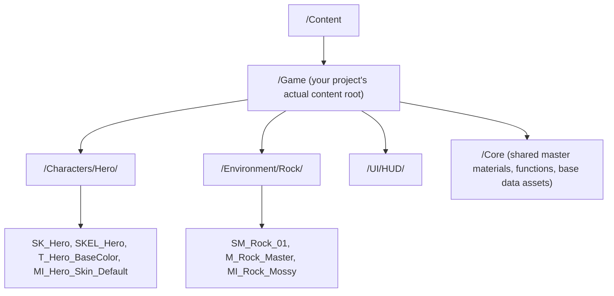

# Asset naming and folder organization

A prefix typo or an inconsistent folder means a designer searches the Content Browser by scrolling
instead of typing, a cook includes a stray test asset because "test" and "Test" sorted differently, or
an artist duplicates a material that already exists three folders over because they couldn't find it.
None of this is enforced by the engine — it's a convention your team either has or doesn't, and the gap
between "has one" and "doesn't" compounds every month the project grows.

## Why this matters

The Content Browser has no schema. `_category_.json`-style structure exists for Docusaurus docs; Unreal
gives you nothing equivalent for `.uasset` files beyond folder paths and, optionally, asset naming
prefixes you enforce by convention and (optionally) by an editor validation plugin. A convention that
works at 200 assets and silently breaks at 5,000 (because "Textures" as a single flat folder becomes
unsearchable, or two people both create `M_Metal` in different folders) is worse than a slightly more
verbose one that survives the growth — you pay the naming-convention design cost once; you pay a bad
convention's cost every day thereafter.

## Mental model



Two independent axes exist and both need a convention: **where** an asset lives (folder structure, by
feature/system, not by asset type at the top level) and **what** it's called (a type prefix plus a
descriptive name, consistent enough that alphabetical sort groups related assets together).

## The mechanics

### Folder structure: by feature, not by type

A common early mistake is a top-level split by asset type: `/Meshes`, `/Textures`, `/Materials`,
`/Blueprints`. This looks organized at 50 assets and becomes unusable at 2,000, because everything
related to one feature (a weapon, a character, a level) is scattered across five parallel folder
trees. Prefer organizing by feature/system first, with type as a subfolder if needed:

```text title="Feature-first folder layout"
/Game
  /Characters
    /Hero
      SK_Hero.uasset
      SKEL_Hero.uasset          (shared skeleton, if not reused across characters)
      /Materials
        M_Hero_Master.uasset
        MI_Hero_Skin_Default.uasset
      /Textures
        T_Hero_BaseColor.uasset
        T_Hero_Normal.uasset
    /Enemy_Grunt
      ...
  /Environment
    /Rock
      SM_Rock_01.uasset
      M_Rock_Master.uasset
  /Weapons
    /Rifle
      SK_Rifle.uasset
      BP_Rifle.uasset
  /Core                          <- shared, cross-feature: master materials, base PrimaryDataAsset classes
    /Materials
      M_Master_Opaque.uasset
    /DataAssets
      DA_WeaponType.uasset
  /UI
    /HUD
      WBP_HUD.uasset
```

`/Core` (or `/Shared`, name it consistently) holds anything genuinely reused across features — master
materials, material functions, base `UPrimaryDataAsset` classes — so it's obvious at a glance that
`M_Master_Opaque` is a foundation other things build on, not one feature's private material.

### Naming: type prefix + descriptive name

The convention Epic's own historical style guide and most studios converge on is `Prefix_Name_Variant`,
where the prefix identifies the asset *type* (not its folder — the prefix should be redundant with the
folder in a good structure, which is fine; redundant-but-clear beats implicit) and the name/variant
disambiguates within that type.

| Prefix | Asset type |
|---|---|
| `SM_` | Static Mesh |
| `SK_` | Skeletal Mesh |
| `SKEL_` | Skeleton (some teams instead fold this into `SK_`, pick one and be consistent) |
| `M_` | Material (master material) |
| `MI_` | Material Instance |
| `MF_` | Material Function |
| `T_` | Texture |
| `BP_` | Blueprint class |
| `WBP_` | Widget Blueprint (UMG) |
| `DA_` | Data Asset (`UPrimaryDataAsset` / `UDataAsset`) |
| `DT_` | Data Table |
| `PS_` | Particle System / Niagara System (teams vary between `PS_` and `NS_` for Niagara specifically) |
| `AC_` | Audio Cue (or `MSS_` for MetaSounds Source, per your audio pipeline convention) |
| `AN_` | Anim Blueprint / Anim Instance related assets (teams vary; `ABP_` is also common for Anim Blueprints specifically) |

Texture suffixes carry meaning too and are worth being just as strict about, since they encode the
sRGB/compression decision from
[Importing meshes and textures](./importing-meshes-and-textures.md):

| Suffix | Meaning |
|---|---|
| `_BC` or `_D` | Base Color / Diffuse (sRGB on) |
| `_N` | Normal map (sRGB off, `TC_Normalmap`) |
| `_ORM` or `_RMA` | Packed Occlusion/Roughness/Metallic (or Roughness/Metallic/AO — pick one channel order and document it) (sRGB off, `TC_Masks`) |
| `_M` | Metallic (if unpacked) |
| `_R` | Roughness (if unpacked) |
| `_EM` | Emissive |

:::note
Prefix/suffix tables like the ones above reflect widely-used community and historical Epic style-guide
convention, not a single canonical rule enforced by the engine — the engine does not require any
prefix. Treat this table as a strong, consistent starting point to adapt, not a spec to match exactly.
:::

### Enforcing the convention

Two levels of enforcement exist, in increasing strictness:

- **Team discipline + code review of content**, the same way you'd review code — works for small
  teams, degrades as headcount grows.
- **Editor validation** — Unreal's asset validation framework (`UEditorValidatorBase` subclasses, run
  via the Data Validation system) can be wired to check naming patterns and folder placement as part of
  a pre-submit or CI content check, failing a submission that puts `SM_Rock_01` in `/Textures` or names
  a material without the `M_`/`MI_` prefix.

```cpp title="A minimal naming-convention validator (conceptual shape)"
UCLASS()
class MYGAME_API UStaticMeshNamingValidator : public UEditorValidatorBase
{
    GENERATED_BODY()

protected:
    virtual bool CanValidateAsset_Implementation(const FAssetData& AssetData, UObject* InAsset,
        FDataValidationContext& InContext) const override
    {
        return InAsset && InAsset->IsA<UStaticMesh>();
    }

    virtual EDataValidationResult ValidateLoadedAsset_Implementation(const FAssetData& AssetData,
        UObject* InAsset, FDataValidationContext& InContext) override
    {
        if (!InAsset->GetName().StartsWith(TEXT("SM_")))
        {
            InContext.AddError(FText::FromString(TEXT("Static Meshes must use the SM_ prefix.")));
            return EDataValidationResult::Invalid;
        }
        return EDataValidationResult::Valid;
    }
};
```

:::note
The exact `UEditorValidatorBase` API surface (method names, override signatures) shown above reflects
the general shape of Unreal's Data Validation framework from model recall and was not independently
re-verified against the current engine version's exact signatures in this pass — check the header
(`EditorValidatorBase.h`) for your engine version before shipping a validator built from this template.
:::

### Level and folder naming for streaming/World Partition projects

Projects using World Partition (see
[World Partition](../11-world-building/world-partition.md)) still benefit from a naming convention for
Data Layers and level instances — prefix Data Layer names by their loading strategy intent (`DL_Always_`
vs `DL_Streamed_`) so a designer can tell from the outliner alone whether a layer is expected to always
be resident.

## Gotchas

:::warning[Case-only differences between assets break on case-sensitive platforms]
`Content Browser` search and Windows filesystems are case-insensitive by default, but cooked builds on
some platforms and source control systems (git on Linux/macOS) are case-sensitive. Two assets differing
only in case (`SM_Rock` vs `SM_rock`) can both exist in your working copy and silently collide or
duplicate on a teammate's case-sensitive checkout. Never rely on case alone to disambiguate.
:::

:::caution[Renaming and moving assets requires "Fix Up Redirectors," not just a rename]
Renaming or moving a `.uasset` in the Content Browser leaves a redirector (a thin stub pointing to the
new location) so existing hard references don't break immediately. Redirectors accumulate silently and
add lookup indirection; run "Fix Up Redirectors in Folder" after bulk renames, and don't rename/move
assets by manipulating files directly on disk outside the editor — that breaks references without even
leaving a redirector behind.
:::

:::warning[A convention nobody enforces decays within a few sprints]
The single biggest predictor of whether a naming convention survives is whether it's checked somewhere
other than code review memory — either an automated validator (above) or a recurring, lightweight audit
pass. A convention that lives only in a wiki page gets followed by the person who wrote the wiki page
and drifts everywhere else.
:::

## See also

- [Asset types and references](./asset-types-and-references.md) — why folder/reference structure and
  hard-vs-soft reference discipline are two sides of the same memory-budget problem.
- [Material authoring workflow](./material-authoring-workflow.md) — naming for master materials and
  instance hierarchies specifically.
- [AssetManager and soft references](./asset-manager-and-soft-references.md) — how consistent, grouped
  folder placement makes `ScanPathsForPrimaryAssets` cheap and predictable.
- [Epic — Recommended Asset Naming Conventions](https://dev.epicgames.com/documentation/unreal-engine/recommended-asset-naming-conventions-in-unreal-engine-projects)
