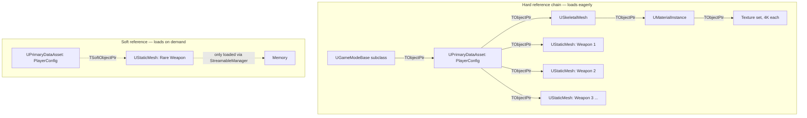

# Asset types and the hard-vs-soft reference distinction

Every mesh, texture, material, and data table in your project is a `UObject` serialized into a
`.uasset` package on disk. That much is easy to internalize. What's easy to miss is that the way you
*point* at one of these objects from C++ — a plain `UPROPERTY(TObjectPtr<UStaticMesh>)` versus a
`TSoftObjectPtr<UStaticMesh>` — decides whether that mesh loads the instant your class is loaded, or
only when you explicitly ask for it. Get this wrong on a handful of widely-referenced classes and you
can turn a game that should use 2 GB of memory into one that uses 12, because a chain of hard
references pulled in assets nobody asked for.

## Why this matters

A hard reference is a load-time guarantee: "this object cannot exist in memory without that other
object also being in memory." That guarantee is exactly what you want for a character's skeletal mesh,
but it's exactly what you don't want for the twelve variant weapon meshes a loot table might spawn, or
the boss-fight cinematic asset referenced once. Reference type is a design decision with a memory
budget attached, not a technicality — and it's invisible in the editor unless you go looking with the
Reference Viewer or Size Map, which is why unbounded hard-reference chains are one of the most common
memory bugs in Unreal projects that "grew organically."

## Mental model



Loading `GM` (a `UClass`, which triggers its class default object to load) walks every `TObjectPtr` /
`UPROPERTY(EditAnywhere) UStaticMesh*`-style hard reference transitively, pulling in every weapon mesh,
every material, every texture reachable through that chain — whether or not the current level ever
uses them. A `TSoftObjectPtr` breaks that chain: the property only stores a path (`FSoftObjectPath`)
until something explicitly asks the loader to resolve it.

## The mechanics

### The pointer family and when to reach for each

| Type | What it stores | Garbage-collected? | Loads automatically? | Use for |
|---|---|---|---|---|
| `T*` (raw) | Direct memory address | Not tracked outside `UPROPERTY` | N/A | Local variables, function parameters, short-lived, non-serialized references |
| `TObjectPtr<T>` | Direct pointer, GC-tracked, replaces raw `T*` in `UPROPERTY` since UE5 | Yes | Yes, eagerly, transitively | Persistent `UPROPERTY` references that must always be resident with the owner |
| `TWeakObjectPtr<T>` | Weak handle to a `UObject` that may be destroyed | Doesn't keep the object alive | No | Caches, non-owning back-references, avoiding accidental keep-alive |
| `TSoftObjectPtr<T>` | An `FSoftObjectPath` (string-like path) plus a cached weak pointer once loaded | No (before load) | No — must be explicitly resolved | Assets you want to defer, batch-load, or avoid pulling in for every consumer of the owning class |
| `TSoftClassPtr<T>` | Same as above but for a `UClass` | No | No | Deferred class references (e.g. "which Blueprint class to spawn") |
| `FSoftObjectPath` | Raw path string + object name, no type safety | No | No | Lower-level API underneath `TSoftObjectPtr`; used directly by `StreamableManager` and `AssetRegistry` APIs |
| `TStrongObjectPtr<T>` | Strong reference from *non*-`UObject` code (plain C++ classes/structs) | Keeps object alive | N/A | Holding a `UObject` alive from outside the `UObject` graph, e.g. a plain C++ singleton |

`TObjectPtr<T>` is the UE5 default for `UPROPERTY` object references — it's a drop-in replacement for
raw `T*` in reflected properties, adding access tracking used by the Cook and the editor (for things
like fast incremental cook invalidation), but at runtime it behaves like the hard pointer it always
was. Switching a property from `TObjectPtr<T>` to `TSoftObjectPtr<T>` is the actual decision that
changes load behavior — the `TObjectPtr` vs raw-pointer choice is not.

### What "resolving" a soft reference means

`TSoftObjectPtr<T>` wraps an `FSoftObjectPath`. Until you load it, calling `.Get()` returns `nullptr`
(or a stale pointer if the object happens to already be in memory for unrelated reasons — never rely on
that). To actually bring the asset into memory you either:

- Call `.LoadSynchronous()` on the soft pointer — blocks the calling thread until the package is
  loaded. Fine on a loading screen, a stall anywhere else.
- Hand the underlying `FSoftObjectPath` to `FStreamableManager::RequestAsyncLoad` (or the
  `UAssetManager`'s streamable manager) and get a callback when it's ready — see
  [AssetManager and soft references](./asset-manager-and-soft-references.md) for the full async story.
- Convert between hard and soft in Blueprint via the `Convert to Soft Reference` / `Convert to Hard
  Reference` `K2Node_ConvertAsset` node, historically named after the old term "asset ID."

```cpp title="WeaponDefinition.h — a data asset with both reference styles"
UCLASS()
class MYGAME_API UWeaponDefinition : public UPrimaryDataAsset
{
    GENERATED_BODY()

public:
    // Hard reference: this mesh is always resident whenever a UWeaponDefinition is loaded.
    // Fine for a starter weapon everyone always has.
    UPROPERTY(EditDefaultsOnly, Category = "Weapon")
    TObjectPtr<UStaticMesh> StarterMesh;

    // Soft reference: the path is stored, but the 4K texture set and mesh behind it
    // only load when something explicitly requests them.
    UPROPERTY(EditDefaultsOnly, Category = "Weapon")
    TSoftObjectPtr<UStaticMesh> RareVariantMesh;

    // Soft class reference: defer which Blueprint actor class to spawn until needed.
    UPROPERTY(EditDefaultsOnly, Category = "Weapon")
    TSoftClassPtr<AActor> ProjectileClass;
};
```

```cpp title="Resolving a soft reference synchronously (loading-screen context only)"
void AWeaponSpawner::SpawnRareVariant(UWeaponDefinition* Definition)
{
    if (Definition->RareVariantMesh.IsNull())
    {
        return;
    }

    // Blocks until loaded — acceptable during a loading screen, not mid-gameplay.
    UStaticMesh* Mesh = Definition->RareVariantMesh.LoadSynchronous();
    MeshComponent->SetStaticMesh(Mesh);
}
```

### Tracing a reference chain

The editor gives you two tools to catch chains before they become a memory problem:

- **Reference Viewer** (right-click an asset → Reference Viewer) shows what references the asset and
  what it references, transitively, as a graph.
- **Size Map** (right-click an asset → Size Map) shows the cumulative on-disk size of an asset plus
  everything it hard-references — this is the tool that actually answers "how much does loading this
  one Blueprint cost."

Neither tool distinguishes hard from soft visually by default in older versions, so if a Size Map looks
suspiciously large, open Reference Viewer and check whether the fan-out is coming through
`TObjectPtr`/hard properties or something that should have been soft.

### Finding hard references programmatically

For a repeatable check (e.g. a commandlet or editor tool that flags newly-added hard references in
CI), `IAssetRegistry::GetDependencies` accepts a dependency filter so you can ask specifically for hard
dependencies rather than eyeballing a graph:

```cpp title="Listing only hard dependencies of an asset"
void ListHardDependencies(const FName PackageName)
{
    const IAssetRegistry& AssetRegistry = IAssetRegistry::GetChecked();

    UE::AssetRegistry::EDependencyQuery HardOnly = UE::AssetRegistry::EDependencyQuery::Hard;

    TArray<FName> Dependencies;
    AssetRegistry.GetDependencies(PackageName, Dependencies,
        UE::AssetRegistry::EDependencyCategory::Package, HardOnly);

    for (const FName& Dep : Dependencies)
    {
        UE_LOG(LogTemp, Log, TEXT("Hard dependency: %s"), *Dep.ToString());
    }
}
```

Running this over every `UPrimaryDataAsset` or every class you register with the AssetManager (see
[AssetManager and soft references](./asset-manager-and-soft-references.md)) and flagging any hard
dependency count above a threshold catches a runaway hard-reference chain before it ships, rather than
after a memory-budget review finds it.

## Gotchas

:::warning[A single hard reference on a widely-used class taxes every consumer]
If your base `AWeaponActor` C++ class hard-references a `UDataTable` of all weapon stats, then loading
*any* subclass of `AWeaponActor` — including ones that only ever need their own row — loads the entire
table's referenced assets. Push wide, rarely-fully-needed data behind `TSoftObjectPtr` or split it into
smaller per-weapon `UPrimaryDataAsset`s instead of one giant table with asset-valued columns.
:::

:::caution[Blueprint hard references are invisible in C++ diffs]
A Blueprint graph can hard-reference an asset (e.g., a `Static Mesh` pin default) with nothing in the
C++ header to show for it. When you're chasing an unexplained memory spike, check Blueprint-only
subclasses too — the Reference Viewer doesn't care where the reference was authored, but grepping
`.h`/`.cpp` files for `TObjectPtr` will miss it entirely.
:::

:::warning[`TSoftObjectPtr::Get()` after garbage collection]
Once a soft reference's target has been garbage collected (nothing else keeps it alive), `.Get()`
silently goes back to returning `nullptr` even though `.ToSoftObjectPath()` still holds a valid path.
Don't cache the raw pointer across frames without also holding a strong keep-alive (a
`TStrongObjectPtr`, an `FStreamableHandle`, or a hard-referencing owner) if you need it to stay resident.
:::

:::note
The exact incremental-cook / access-tracking behavior that motivated `TObjectPtr` over raw `T*` in
UE5's reflection system is implementation detail of the editor and cooker, not something you interact
with directly from gameplay code — treat `TObjectPtr<T>` as "the `UPROPERTY` pointer type," full stop.
:::

## See also

- [Importing meshes and textures](./importing-meshes-and-textures.md) — the import-time settings that
  determine what a hard-referenced asset actually costs in memory.
- [AssetManager and soft references](./asset-manager-and-soft-references.md) — turning soft references
  into a deliberate, async-loaded content strategy at project scale.
- [Asset naming and organization](./asset-naming-and-organization.md) — folder structure that keeps
  reference chains legible as the project grows.
- [Epic — Object Pointers in Unreal Engine](https://dev.epicgames.com/documentation/unreal-engine/object-pointers-in-unreal-engine)
