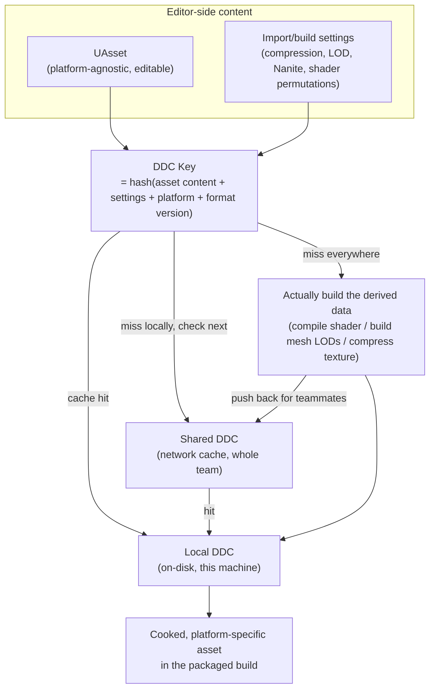

# Cooking and the derived data cache

The first cook on a fresh machine can take hours; the same project's cook on a machine with a warm
shared DDC can take minutes. That gap isn't a fluke — it's the entire reason the derived data cache
exists, and understanding it is what separates "why is cooking so slow today" from being able to answer
that question yourself instead of waiting on it.

## Why this matters

Cooking is the step that turns editor-only, platform-agnostic asset data into the platform-specific,
runtime-ready form a packaged build actually ships — compiled shaders, platform-specific texture
formats, packaged levels. None of that is free to produce, and almost none of it needs to be reproduced
from scratch every time, because most of it is a pure function of (source asset content, import/build
settings, target platform). The derived data cache is what lets the engine skip recomputing that
function when the inputs haven't changed — for one person on one machine across sessions (local DDC),
and for an entire team sharing the same already-built results (shared DDC).

## Mental model



The DDC is a cache keyed by a hash of everything that determines the output — change the source asset,
change an import setting, or change engine/shader format versions, and the key changes, forcing a
rebuild. It is not a database of "the current state of your assets"; it's disposable, content-addressed
storage that can be deleted and safely regenerated (slowly) at any time.

## The mechanics

### What cooking actually does

Cooking (`RunUAT BuildCookRun` / the editor's File → Cook Content for a platform) walks your project's
content for the target platform and produces:

- **Compiled shaders** for every material/shader permutation actually reachable in the cooked content
  (static switches, quality levels, and platform capabilities all multiply this out — see
  [Material authoring workflow](./material-authoring-workflow.md) for why unused static switch
  combinations are worth avoiding).
- **Platform-specific texture formats** — the compression format chosen at import
  (see [Importing meshes and textures](./importing-meshes-and-textures.md)) is translated into the
  actual GPU texture format the target platform expects (e.g. different block-compression variants
  across desktop/console/mobile).
- **Built mesh render data** — LODs, Nanite streaming data, collision — baked from the source mesh and
  its import/LOD-group settings.
- **Packaged levels and asset registry data** used by the runtime to resolve soft references and
  Primary Assets (see
  [AssetManager and soft references](./asset-manager-and-soft-references.md)) without needing the full
  editor-side asset registry.
- Only assets actually reachable from what the `CookRule`/chunk rules say should cook (see the
  `PrimaryAssetRules` `CookRule=AlwaysCook`/`Unknown` example in the AssetManager doc) — an asset that's
  registered but nothing references and no rule forces in is not necessarily included.

None of these outputs are hand-editable — they're derived, in the literal sense the "derived data
cache" name implies: throw them away and the engine can always reproduce them from the source asset
plus its settings.

### Local vs shared DDC

- **Local DDC** lives on the machine doing the cook (or the editor session doing any operation that
  needs derived data — opening a material editor triggers shader compilation the same way cooking
  does). It's fast, private to that machine, and the first place any lookup checks.
  `FDerivedDataCacheInterface::GetUsingSharedDDC()` reports whether the shared cache is currently
  configured and in use.
- **Shared DDC** is a network-accessible cache the whole team points at, so once *any* teammate builds
  the derived data for a given asset+settings+platform combination, everyone else's lookup for that
  same key is a cache hit instead of a rebuild. This is the single biggest lever for team-wide cook and
  editor-startup time — a shared DDC turns "everyone independently pays the shader-compile cost for
  every material" into "one person pays it once."
- Cache lookups are content-addressed and safe to fan out across both tiers — `CachedDataProbablyExists`
  / `AllCachedDataProbablyExists` check existence without pulling the full payload, which is what lets
  tooling ask "is this going to be a cache hit" cheaply before committing to a fetch.
- `GatherUsageStats` / `GatherResourceStats` / `GatherSummaryStats` on `FDerivedDataCacheInterface`
  expose hit/miss rates and per-resource-type breakdowns — useful for diagnosing whether a slow cook is
  actually a cold-cache problem or something else (e.g. genuinely large content, or an unreachable
  shared DDC endpoint).

Shared DDC is typically configured project- or engine-wide via config (an DDC backend graph pointing at
a network share or an HTTP-based cache service); the exact backend configuration syntax is
environment-specific (network share path, cache service URL) and isn't a single fixed value this doc
can give you — check your project's `Engine.ini` / `BaseEngineIni` DDC backend graph settings, or your
studio's DevOps setup, for the actual endpoint in use.

### What drives cook time in practice

- **Cold local cache, no shared DDC** — worst case, every derived-data build happens on this machine
  from scratch. This is the "first cook on a fresh machine takes hours" scenario.
- **Cold local cache, warm shared DDC** — most builds become cache hits pulled from the network cache
  instead of rebuilt; still slower than warm local (network fetch vs. disk read) but far faster than a
  full rebuild.
- **Warm local cache** — fastest; almost everything is a local disk hit.
- **Changed import settings or engine/shader-format version bumps invalidate broadly** — an engine
  upgrade that changes shader compiler version, or a project-wide texture compression policy change,
  invalidates the DDC key for every affected asset simultaneously, producing a "why is this cook
  suddenly slow again after being fast for months" cook that's actually expected behavior, not a
  regression.
- **`bEnableBuildDDCInBackground`** (`UCookerSettings`, Project Settings → Cooker) lets the editor
  pre-build DDC data in the background for your "launch on" target platform ahead of time, so the
  explicit "Launch On Device" cook that follows has fewer cold-cache misses to pay for up front.

```cpp title="Reading DDC availability/usage in tooling code (conceptual)"
if (GetDerivedDataCacheRef().GetUsingSharedDDC())
{
    FDerivedDataCacheSummaryStats Stats;
    GetDerivedDataCacheRef().GatherSummaryStats(Stats);
    // Inspect Stats for hit/miss ratios when diagnosing a slow cook.
}
```

```ini title="DefaultEditor.ini or Engine config — enabling background DDC build for launch-on"
[/Script/UnrealEd.CookerSettings]
bEnableBuildDDCInBackground=True
```

### Incremental cooking

Cooking supports incremental behavior — re-cooking only content that changed (or whose dependencies
changed) since the last cook for a given platform, rather than the entire project every time. This is
separate from the DDC itself (DDC caches the *build outputs* of individual assets; incremental cook
tracking decides *which assets need to be considered at all* for this cook pass), but the two compound:
a project with both a warm shared DDC and a valid incremental cook state does the least possible work
on a typical iteration cook.

## Gotchas

:::warning[A cold DDC after an engine upgrade is expected, not a regression]
Upgrading engine versions frequently changes shader compiler versions and derived-data format versions,
which changes the DDC key for a huge swath of your project's assets simultaneously. The first cook (and
often the first several editor sessions, since opening a material triggers the same shader-compile
path) after an engine upgrade being dramatically slower than usual is the DDC doing exactly what it's
supposed to — rebuilding invalidated data — not a sign something is broken.
:::

:::caution[Local DDC is disposable — don't treat it as backup or source of truth]
Deleting your local DDC folder is always safe from a correctness standpoint (everything in it is
reproducible from source assets and settings) but not free — expect the next cook or the next several
editor operations to be slow while it rebuilds. Never rely on the DDC as a substitute for actually
committing source assets to version control; it caches build *outputs*, not the assets themselves.
:::

:::warning[Shared DDC being unreachable silently degrades to local-only, not a hard failure]
If the shared DDC endpoint is misconfigured or unreachable, builds typically fall back to treating
every lookup as a local miss rather than erroring loudly — which shows up as "cooks got mysteriously
slow for the whole team" rather than an obvious connection-failure message. `GetUsingSharedDDC()` and
the usage-stats gathering functions are the tools to confirm whether the shared tier is actually being
hit before assuming the shared DDC itself is the bottleneck.
:::

:::note
Specific shared-DDC backend configuration (network share vs. HTTP cache service syntax in the DDC
backend graph) and exact incremental-cook invalidation rules are environment- and version-specific and
were not fully re-verified against a single UE 5.x point release in the sources consulted here — treat
the general local/shared/rebuild model above as reliable, but confirm exact config keys against your
project's own `Engine.ini` DDC backend graph and your target engine version's cooking documentation.
:::

## See also

- [Importing meshes and textures](./importing-meshes-and-textures.md) — the import settings that are
  direct inputs to the DDC key for mesh and texture derived data.
- [Material authoring workflow](./material-authoring-workflow.md) — how static switch permutations
  multiply the shader-compilation work a cook has to do (or find cached).
- [AssetManager and soft references](./asset-manager-and-soft-references.md) — `ChunkId`/`CookRule`
  primary asset rules that determine what a cook actually includes.
- [Epic — Cooking Content and Creating Chunks](https://dev.epicgames.com/documentation/unreal-engine/cooking-content-and-creating-chunks-in-unreal-engine)

