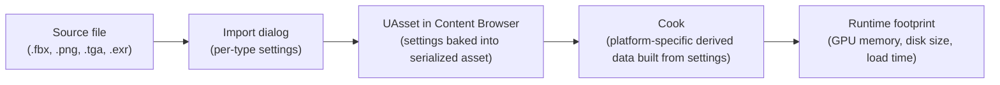

# Importing meshes and textures

The import dialog you click through in five seconds sets compression, LOD, and streaming behavior that
you will not revisit until a texture looks wrong on console, a mesh's collision is missing, or the
build size report shows one asset eating a disproportionate share of package size. Import settings are
mostly one-time decisions baked into the asset — getting them right on the way in is cheaper than
re-importing hundreds of assets after the fact.

## Why this matters

A texture imported with the wrong compression setting or the wrong sRGB flag doesn't error — it just
renders subtly wrong (banding on a normal map treated as color data, washed-out output on a mask
treated as sRGB when it isn't) and the fix ships months later as a visual bug ticket. A static mesh
imported without Nanite when it should have it, or with it when it shouldn't, either wastes the
Nanite pipeline's benefits or pays its cost for a mesh that never needed it. These are configuration
mistakes, not code mistakes, and they're consistent across everyone who imports content into your
project — which is exactly why documenting the *right* defaults per asset category pays off.

## Mental model



Import settings are not cosmetic — they're inputs to the derived-data build that happens at cook time
(see [Cooking and the derived data cache](./cooking-and-derived-data-cache.md)). Changing a
compression setting after import means re-cooking that asset's derived data, not just re-saving a
file.

## The mechanics

### Static meshes

Static mesh import (via FBX, or Interchange for glTF and newer pipelines) exposes, among others:

- **Build Nanite** — enables Nanite virtualized geometry for the mesh. Nanite meshes support multiple
  UVs and vertex colors and let materials be assigned per mesh section without a baking step; they
  don't require a bake to support material variety the way traditional LOD baking sometimes implied.
  Nanite settings also exist at the project level (Project Settings → Engine → Rendering → Nanite) in
  addition to the per-asset override in the Static Mesh Editor's Details panel.
- **LOD Group** — assigns a `FStaticMeshLODGroup` preset (from `UTextureLODSettings`-adjacent mesh LOD
  config) that drives default LOD generation/reduction settings so meshes of the same category (props,
  foliage, characters) share a consistent LOD policy instead of each artist hand-tuning reduction
  percentages.
- **Generate Missing Collision** — auto-generates simple collision if the source file has none.
- **Import Materials / Import Textures** — pulls in referenced materials/textures from the FBX; usually
  worth disabling once you have a real material authoring workflow (see
  [Material authoring workflow](./material-authoring-workflow.md)) so re-imports don't spawn duplicate
  auto-generated materials.

```cpp title="Reading a mesh's Nanite state at runtime (diagnostic use)"
if (UStaticMesh* Mesh = MeshComponent->GetStaticMesh())
{
    const bool bIsNaniteEnabled = Mesh->HasValidNaniteData();
    UE_LOG(LogTemp, Log, TEXT("%s Nanite: %s"), *Mesh->GetName(), bIsNaniteEnabled ? TEXT("on") : TEXT("off"));
}
```

:::note
Nanite eligibility and behavior differ meaningfully by UE version (5.0 vs 5.3+ changed several
defaults around masked materials and skeletal mesh Nanite support). Cross-check the Nanite section in
your target engine version's docs before assuming a setting from an older tutorial still applies —
this doc describes the general model, not a specific 5.x point release's exact defaults.
:::

### Skeletal meshes

Skeletal mesh import shares the FBX pipeline with static meshes but adds skeleton-specific concerns:

- **Skeleton** asset — either creates a new `USkeleton` or imports onto an existing one. Reusing one
  `USkeleton` asset across all meshes that should share animations (a full cast of humanoid characters,
  for instance) is what makes animation retargeting and shared anim Blueprints possible — see
  [Skeletons and skeletal meshes](../07-animation/skeletons-and-skeletal-meshes.md).
- **Import Morph Targets** — brings in blend shapes from the FBX for facial animation or corrective
  shapes.
- **Nanite for skeletal meshes** — later engine versions extended Nanite support to skeletal meshes;
  verify availability and caveats (cloth, morph targets, per-bone visibility) against your engine
  version before committing a character pipeline to it.
- **Physics Asset** generation — a `UPhysicsAsset` can be auto-generated from the skeleton for
  ragdoll/simulated-physics use; see
  [Physics constraints and simulation](../06-collision-and-physics/physics-constraints-and-simulation.md).

### Textures

Texture import settings live on the `UTexture` asset and are read at both edit time and cook time via
`UTextureLODSettings`, which resolves per-LOD-group defaults (`GetTextureMipGenSettings`) unless the
individual texture overrides them:

| Setting | What it controls | Common mistake |
|---|---|---|
| `CompressionSettings` | Which compressed format family the texture cooks to (color, normal map, grayscale/mask, HDR) | Leaving a normal map on the default color compression — normal maps need `TC_Normalmap` so the reconstruction of the Z channel and reduced chroma compression artifacts are handled correctly |
| `ColorSpaceMode` / sRGB | Whether the source pixel data is treated as sRGB-encoded (color/albedo) or linear (masks, normal maps, roughness/metallic, most non-color data) | Leaving sRGB **on** for a mask or normal map — this remaps the data through gamma curves it was never authored in, corrupting the values silently |
| `MipGenSettings` | How mipmaps are generated (standard box filter, no mips, sharpened variants, etc.) | Leaving mip generation on for UI textures that are always rendered at native resolution, wasting memory on mips that never get sampled |
| `LODGroup` | Which `TextureGroup` preset (`TEXTUREGROUP_World`, `TEXTUREGROUP_UI`, `TEXTUREGROUP_Character`, etc.) supplies default compression/mip/streaming behavior | Leaving everything on `TEXTUREGROUP_World` regardless of actual use, so UI and world textures share streaming pool budgets that were tuned for neither |
| `NoAlpha` | Discards the alpha channel during compression | Keeping an unused alpha channel around, which increases compressed size for BC formats that store alpha (e.g. BC3/BC7) |
| Virtual Texturing (`bVirtualTexture` / `Adjust Virtual Texture Size`) | Enables per-texture virtual texturing (streamed sparsely, tile by tile) instead of standard mip streaming | Enabling VT project-wide without budgeting VT memory/tile cache, or enabling it on small textures where it adds overhead for no streaming benefit |

```cpp title="UTextureFactory-relevant fields (conceptual — set via the editor, not usually via code)"
// These map to properties you set in the Texture Editor / import dialog, shown here
// for the concepts they correspond to, not as a runtime API you call per-frame.
// CompressionSettings: TC_Normalmap for normal maps, TC_Masks for non-color masks, TC_Default otherwise.
// ColorSpaceMode: sRGB for authored color art; linear for masks, normal maps, ORM packs.
// MipGenSettings: TMGS_NoMipmaps for UI; TMGS_FromTextureGroup (default) otherwise.
```

Virtual textures are recommended alongside Nanite — both target the same problem (avoid paying full
cost for detail you don't need at the current view distance) from the mesh side and the texture side
respectively, though virtual textures are not mandatory to use Nanite.

### Enabling virtual textures project-wide

Per-texture VT is gated behind a project setting — `bVirtualTextures` under Project Settings → Engine →
Rendering → Virtual Textures must be enabled before the per-texture `bVirtualTexture` checkbox in the
Texture Editor has any effect. Flip the project setting on before asking artists to start enabling VT
on individual textures, or the per-asset setting silently has no effect and the texture streams the
normal, non-virtualized way regardless of what the checkbox says.

### Batch-checking import settings from C++

Auditing hundreds of already-imported textures for the sRGB/compression mistakes in the table above is
a case for an editor script or commandlet rather than opening each asset by hand:

```cpp title="Flagging masks that were imported with sRGB left on"
void AuditTextureSRGB(const TArray<FAssetData>& TextureAssets)
{
    for (const FAssetData& AssetData : TextureAssets)
    {
        if (UTexture2D* Texture = Cast<UTexture2D>(AssetData.GetAsset()))
        {
            const bool bLooksLikeMask = Texture->GetName().Contains(TEXT("_ORM"))
                || Texture->GetName().Contains(TEXT("_N"))
                || Texture->GetName().Contains(TEXT("_RMA"));

            if (bLooksLikeMask && Texture->SRGB)
            {
                UE_LOG(LogTemp, Warning, TEXT("%s: mask/normal texture still has sRGB enabled"),
                    *Texture->GetName());
            }
        }
    }
}
```

Pairing this kind of check with the naming convention from
[Asset naming and organization](./asset-naming-and-organization.md) is what makes the check reliable —
without a consistent suffix, you can't tell a mask from a color texture by name alone and the audit
degrades into manually opening every texture anyway.

### The import pipeline itself: legacy vs Interchange

Newer engine versions route imports (particularly FBX, glTF, USD) through the **Interchange**
framework rather than the legacy `FbxImporter` path. Interchange is pipeline-based and scriptable
(you can define reusable import pipelines as assets), while the legacy importer exposes the same
concepts through the classic modal import dialog. Which one is active depends on your project's
Editor preferences (Experimental → Interchange Framework, promoted to default in later 5.x releases).
The settings above (compression, LOD group, Nanite, sRGB) are conceptually the same regardless of which
importer produced them — Interchange just lets you template and re-run the same settings as a pipeline
asset instead of re-clicking the same dialog per file.

## Gotchas

:::warning sRGB is per-texture, and its default follows file type, not content
An import dialog defaults sRGB **on** for most 8-bit color formats regardless of whether the content is
actually color data. A roughness mask saved as a `.png` will default to sRGB on — you must manually
turn it off. This is the single most common "why does my material look wrong only on this platform"
bug reported by artists who imported a mask without checking the sRGB checkbox.
:::

:::caution Re-importing overwrites hand-tuned settings unless you're careful
"Reimport" (right-click → Reimport) by default keeps existing asset settings and only refreshes
geometry/pixel data from the source file — but "Import Materials"/"Import Textures" style options on a
mesh reimport can spawn new auto-generated material instances that shadow your hand-authored ones if
left enabled. Disable auto material import once you have a real material workflow in place.
:::

:::warning LOD Group changes don't retroactively fix already-imported assets
Changing a mesh's `LODGroup` after import updates the *default* generation settings for the *next*
LOD build, not existing baked LOD data. If a whole prop category was imported under the wrong LOD
group, you need to force a rebuild (Static Mesh Editor → LOD settings → regenerate), not just flip the
dropdown.
:::

:::note
Exact Interchange-vs-legacy-importer defaults and which is the out-of-the-box default in your specific
engine version were not directly confirmed in the sources consulted here — verify which importer path
is active in your project (Editor Preferences → General → Experimental) before writing internal
pipeline documentation that assumes one or the other.
:::

## See also

- [Asset types and references](./asset-types-and-references.md) — how a hard reference to an
  over-imported texture inflates the memory cost of everything that references it.
- [Material authoring workflow](./material-authoring-workflow.md) — how imported textures feed into
  master materials and instances.
- [Nanite](../12-rendering/nanite.md) — the rendering-side detail on Nanite's virtualized geometry.
- [Cooking and the derived data cache](./cooking-and-derived-data-cache.md) — what happens to these
  settings at cook time.
- [Epic — Nanite Virtualized Geometry](https://dev.epicgames.com/documentation/unreal-engine/nanite-virtualized-geometry-in-unreal-engine)
