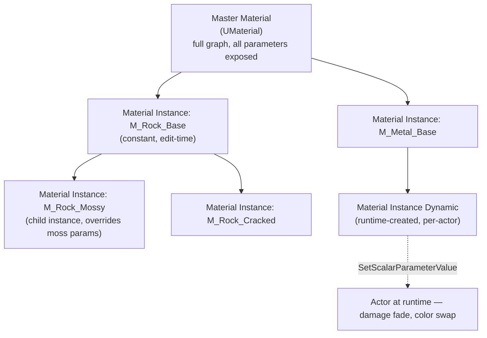

# A repeatable material authoring workflow

Every material graph you compile from scratch is a new shader permutation the engine has to build, and
every hand-wired parameter is a UI element an artist has to remember exists. A master-material-plus-
instances workflow trades a bit of up-front graph design for a system where 90% of surface variation
never touches the shader compiler again — it's the difference between "add a new material" meaning
"open the graph, wire nodes, wait for compile" and meaning "duplicate an instance, drag three sliders."

## Why this matters

Unreal compiles a shader per unique material *graph*, not per material *instance* — so a project with
one well-parameterized master material and two hundred instances compiles roughly one shader family,
while a project with two hundred hand-built materials compiles two hundred. Beyond compile time, this
workflow is what makes runtime parameter changes (damage decals fading in, a team-color system, a
weapon skin swap) cheap: `UMaterialInstanceDynamic` parameter writes are just memory writes, no shader
recompilation, no hitch.

## Mental model



A `UMaterialInstance` inherits its entire graph from its parent (a master material or another
instance) and can only override exposed *parameters* — it cannot add nodes, so the shader stays shared.
Instances can chain (an instance's parent can itself be an instance), which is how you build a
category hierarchy (`M_Master` → `MI_Rock_Base` → `MI_Rock_Mossy`) instead of every leaf material
inheriting flatly from the root.

## The mechanics

### Master material design

A master material earns its name by anticipating the variation its instances will need, expressed as
parameters:

- **Scalar parameters** (`Roughness Multiplier`, `Emissive Intensity`) for continuous tuning.
- **Vector parameters** (`Base Color Tint`, `Team Color`) for color/vector tuning.
- **Texture parameters** (`Base Color Texture`, `Normal Texture`, `ORM Texture`) so instances swap
  texture sets without touching the graph.
- **Static switch parameters** (`Use Detail Normal`, `Enable Vertex Paint Blend`) — unlike scalar/vector
  parameters, these compile out unused branches entirely, producing a genuinely different shader
  permutation per switch combination. Use them for structural on/off variation (an optional feature
  branch), not for anything that needs to change at runtime — a static switch bakes into the compiled
  shader per instance and can't be changed on a `UMaterialInstanceDynamic`.
- **Material functions** (`UMaterialFunction`) package a reusable sub-graph (a triplanar projection, a
  parallax occlusion function, a standard detail-blend setup) that multiple master materials can share
  without copy-pasting nodes — the equivalent of extracting a shared subroutine.

Keep the master material graph itself in as few variants as your rendering paths actually need
(opaque, masked, translucent are different compiled shaders regardless of parameterization) rather than
one mega-graph switching between wildly different looks via static switches — every static switch
combination that's actually reachable in the project is a shader permutation someone pays to compile
and the shader cache has to store.

### Instance hierarchy design

Design instance parents the way you'd design a class hierarchy: shared defaults at the top, specific
overrides lower down.

```text title="Example instance hierarchy for an environment art set"
M_Master_Opaque                     (UMaterial — full graph)
├── MI_Rock_Base                    (sets texture set, default roughness curve)
│   ├── MI_Rock_Mossy               (overrides moss mask intensity + tint)
│   ├── MI_Rock_Cracked              (overrides detail normal strength)
│   └── MI_Rock_Wet                 (overrides roughness multiplier, specular)
└── MI_Metal_Base
    ├── MI_Metal_Rusted
    └── MI_Metal_Painted
```

A change to `MI_Rock_Base` (say, swapping the base texture set for a re-authored one) propagates to
every child instance automatically — that's the entire point of the hierarchy. Flattening everything
to instance directly off the master material loses that propagation and turns "update the base rock
look" into "update forty rock instances by hand."

### Setting parameters from C++

Static, edit-time instances (`UMaterialInstanceConstant` in the editor, exposed as `UMaterialInstance`
at runtime) are for content authored once and left alone. For anything that changes during gameplay,
create or fetch a `UMaterialInstanceDynamic` (MID) instead — never mutate a shared constant instance at
runtime, since every component using that same instance would see the change.

```cpp title="ApplyingDamageDecal.h"
UCLASS()
class MYGAME_API ADamageableProp : public AActor
{
    GENERATED_BODY()

public:
    ADamageableProp();
    void SetDamageAmount(float NewDamage01);

protected:
    UPROPERTY(VisibleAnywhere, Category = "Components")
    TObjectPtr<UStaticMeshComponent> Mesh;

    // Not serialized as a hard reference to a specific instance — created at runtime.
    UPROPERTY(Transient)
    TObjectPtr<UMaterialInstanceDynamic> DynamicMaterial;
};
```

```cpp title="ApplyingDamageDecal.cpp"
ADamageableProp::ADamageableProp()
{
    Mesh = CreateDefaultSubobject<UStaticMeshComponent>(TEXT("Mesh"));
    RootComponent = Mesh;
}

void ADamageableProp::SetDamageAmount(float NewDamage01)
{
    if (!DynamicMaterial)
    {
        // Creates a MID that overrides Mesh's material at element 0, parented to whatever
        // material instance was assigned in the editor.
        DynamicMaterial = Mesh->CreateAndSetMaterialInstanceDynamic(0);
    }

    // Cheap: a parameter write, no shader recompilation, no hitch.
    DynamicMaterial->SetScalarParameterValue(TEXT("DamageAmount"), NewDamage01);
}
```

Parameter names passed to `SetScalarParameterValue` / `SetVectorParameterValue` /
`SetTextureParameterValue` must match the parameter name in the master material's graph exactly — there
is no compile-time check tying the string to the graph, so a typo fails silently (the call is a no-op
against a parameter that doesn't exist).

### Material Layers (for large, shared multi-look materials)

For material families with genuinely swappable *sets* of parameters — a landscape material that blends
several ground types, a character material shared across many skins — Material Layers let an instance
select which `Material Layer` (itself a reusable sub-graph with its own parameters) fills each layer
slot, plus a blend between them, without every combination being a separate hand-built master material.
This is a heavier authoring investment than a flat parameter set and is worth it specifically when the
number of "looks" you need is large and share a common structural pattern (e.g., N ground types blended
in M combinations).

## Gotchas

:::warning Never call `SetScalarParameterValue` on a shared constant instance
If a `UStaticMeshComponent`'s material slot still points at a `UMaterialInstanceConstant` you never
converted to a MID, calling a `Set*ParameterValue` on it either fails or (in older engine behavior)
mutates the asset, corrupting the editor-authored asset shared by every other actor using it. Always go
through `CreateAndSetMaterialInstanceDynamic` (or `UMaterialInstanceDynamic::Create`) before writing
parameters at runtime.
:::

:::caution Static switch parameters are not free, and they're not dynamic
Every distinct combination of static switch values *that some instance actually uses* is a separate
compiled shader permutation, cached and loaded independently. A master material with five independent
static switches has up to 32 theoretical permutations — the engine only compiles the ones actually
reachable by an existing instance, but an artist toggling switches experimentally can accidentally
generate and cache permutations nobody ships with. And because they're baked at compile time, a
`UMaterialInstanceDynamic` cannot change a static switch value at runtime — that requires a scalar/
vector parameter or a texture parameter instead.
:::

:::warning Parameter name typos fail silently
`SetScalarParameterValue(TEXT("Damage"), Value)` against a master material that actually exposes
`DamageAmount` compiles, runs, and does nothing — there's no warning. If a runtime parameter tweak
appears to have no visual effect, verify the parameter name against the master material graph before
assuming a logic bug elsewhere.
:::

## See also

- [Materials and the material graph](../12-rendering/materials-and-material-graph.md) — the rendering-
  side detail on how material graphs compile and evaluate.
- [Importing meshes and textures](./importing-meshes-and-textures.md) — how texture import settings
  (sRGB, compression) feed the texture parameters a master material exposes.
- [Asset naming and organization](./asset-naming-and-organization.md) — naming conventions for master
  materials, functions, and instance hierarchies.
- [Epic — Unreal Engine Materials](https://dev.epicgames.com/documentation/unreal-engine/unreal-engine-materials)

