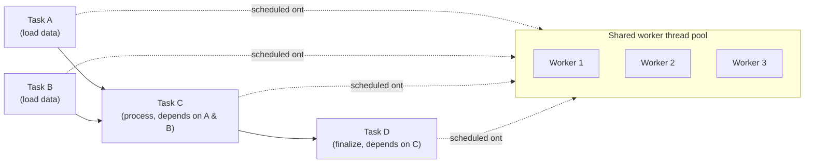

# Async tasks and the Task Graph

## Why this matters

Spawning a raw `FRunnable` thread every time you want to do background work doesn't scale — a level with
a few dozen systems each wanting "some background work" would spawn a few dozen OS threads, most of them
idle most of the time. Unreal instead gives you a shared worker pool and a dependency-aware scheduler so
background work competes for a fixed number of threads instead of oversubscribing the CPU. Which API you
reach for — `UE::Tasks`, the older Task Graph, or `FAsyncTask` — depends on what the work looks like:
one-off parallel work with dependencies, a fire-and-forget job, or a cancellable long-running background
job. Picking the wrong one, or wiring dependencies incorrectly, is how you get a task quietly reading data
before the task that was supposed to produce it has finished.

## Mental model



A task is a unit of work plus a set of prerequisites — other tasks that must complete before this one is
eligible to run. The scheduler (Task Graph, or the newer `UE::Tasks` system built on top of the same
worker pool) doesn't run tasks in the order you create them; it runs whichever ready task a free worker
picks up next. That's the whole point — parallelism — but it also means task bodies must not assume
anything about execution order beyond the prerequisite edges you actually declared.

## The mechanics

### UE::Tasks — the current recommended API

`UE::Tasks` is Epic's newer, preferred entry point for parallelizable work; it sits on top of the same
worker pool the Task Graph uses but gives you a cleaner handle type (`UE::Tasks::FTask` for work with no
result, `TTask<ResultType>` for work that produces one) and explicit prerequisite wiring instead of
manually managing `FGraphEventRef`s.

```cpp title="Launching dependent background tasks with UE::Tasks"
#include "Tasks/Task.h"

void UInventoryStreamer::BuildInventorySnapshotAsync()
{
    UE::Tasks::FTask LoadItemDefs = UE::Tasks::Launch(TEXT("LoadItemDefs"), [this]()
    {
        // Background thread: plain data only, no UObject reads/writes here.
        CachedItemDefs = LoadItemDefsFromDisk();
    });

    UE::Tasks::FTask LoadPlayerSaves = UE::Tasks::Launch(TEXT("LoadPlayerSaves"), [this]()
    {
        CachedPlayerSaves = LoadPlayerSavesFromDisk();
    });

    // Runs only after both loads complete; declared as prerequisites, not assumed by ordering.
    UE::Tasks::FTask BuildSnapshot = UE::Tasks::Launch(
        TEXT("BuildInventorySnapshot"),
        [this]() { MergedSnapshot = MergeItemDefsAndSaves(CachedItemDefs, CachedPlayerSaves); },
        UE::Tasks::Prerequisites(LoadItemDefs, LoadPlayerSaves));

    // Hop back to the game thread only once the whole chain is done, to touch UObject state safely.
    UE::Tasks::Launch(TEXT("ApplySnapshotOnGameThread"), [this]()
    {
        AsyncTask(ENamedThreads::GameThread, [this]() { ApplyMergedSnapshot(MergedSnapshot); });
    }, UE::Tasks::Prerequisites(BuildSnapshot));
}
```

A `TTask<ResultType>` returns a value from its body; call `GetResult()` on it to retrieve it, which blocks
until the task completes if it hasn't already — useful when you genuinely need the result synchronously,
but avoid it on the game thread in a hot path since it turns your parallel task back into a stall.

### The older Task Graph

Before `UE::Tasks`, the same worker pool was driven through `FGraphEvent`/`TGraphTask`, addressed by
`ENamedThreads::Type` (`GameThread`, `AnyBackgroundThreadNormalTask`, `AnyHiPriThreadNormalTask`, and
similar). You'll still find this API throughout older engine and licensee code, and it's what `AsyncTask`
itself is built on. Epic's current guidance is to prefer the Tasks System for new code — it is described
as the more robust and efficient option, with `FRunnable` reserved for cases that genuinely need direct,
low-level control over a dedicated OS thread rather than pool-scheduled work.

### FAsyncTask and FNonAbandonableTask — cancellable background jobs

For a long-running background job that has its own start/poll/complete lifecycle — a bake, a large asset
import, a landscape grass-instance build — the engine provides `FAsyncTask<T>` wrapping a task class that
derives from `FNonAbandonableTask`. "Non-abandonable" means once it starts running, it must run to
completion; you can wait on it or poll it, but you cannot yank it out from under the worker mid-execution.

```cpp title="A cancellable-by-polling background bake using FAsyncTask"
class FGrassInstanceBuildTask : public FNonAbandonableTask
{
public:
    friend class FAsyncTask<FGrassInstanceBuildTask>;

    FGrassInstanceBuildTask(FGrassBuildParams InParams)
        : Params(MoveTemp(InParams))
    {
    }

    void DoWork()
    {
        // Runs on a pool worker thread — plain data in, plain data out, no UObject access.
        Result = BuildGrassInstancesFromParams(Params);
    }

    FORCEINLINE TStatId GetStatId() const
    {
        RETURN_QUICK_DECLARE_CYCLE_STAT(FGrassInstanceBuildTask, STATGROUP_ThreadPoolAsyncTasks);
    }

    FGrassBuildParams Params;
    FGrassBuildResult Result;
};

void UGrassSubsystem::KickOffBuild(const FGrassBuildParams& Params)
{
    PendingBuild = MakeUnique<FAsyncTask<FGrassInstanceBuildTask>>(Params);
    PendingBuild->StartBackgroundTask();
}

void UGrassSubsystem::Tick(float DeltaTime)
{
    if (PendingBuild.IsValid() && PendingBuild->IsDone())
    {
        ApplyGrassResult(PendingBuild->GetTask().Result); // game thread: safe to touch UObjects now
        PendingBuild.Reset();
    }
}
```

Polling `IsDone()` from `Tick()` avoids blocking the game thread; `EnsureCompletion()` is available when
you genuinely need to block until the task finishes (level teardown, for instance).

### Avoiding data races without a lock on every access

The cheapest way to avoid a data race is to not share mutable state at all: give each task its own copy
of the input, let it compute into its own output, and merge results back on whichever thread owns the
destination data (the game thread, for `UObject` state). When tasks genuinely must share mutable state —
a counter, a small cache — reach for `FCriticalSection`/`FRWLock` around the specific critical section, or
a lock-free container if the engine already provides one for your case, rather than sprinkling manual
atomics through task bodies.

## Gotchas

:::warning FNonAbandonableTask cannot be cancelled mid-run
The "non-abandonable" contract means the task will finish once started, even if the system that requested
it no longer needs the result. If a job genuinely needs to be interruptible, design it to check a
cancellation flag from inside `DoWork()` and exit early — the task framework itself won't stop it for you.
:::

:::warning Don't touch UObjects from inside a task body
Whether it's `UE::Tasks::Launch`, the Task Graph, or `FAsyncTask::DoWork()`, the body runs on a pool
worker thread, not the game thread. Read [Engine threading model](./engine-threading-model.md) for why
that makes any `UObject` read or write there a crash risk, and hop back via
`AsyncTask(ENamedThreads::GameThread, ...)` before touching one.
:::

:::caution Declared prerequisites are the only ordering guarantee you get
Tasks without a prerequisite edge between them can and will run in any order, including simultaneously.
"It happened to run in the right order in my testing" is not a guarantee — wire the actual dependency with
`UE::Tasks::Prerequisites(...)` (or the Task Graph's `FGraphEventArray`) instead of relying on submission
order.
:::

:::note
The exact `TTask`/`UE::Tasks::Launch` overload set (priority and extended-priority parameters, event-based
prerequisites via `FTaskEvent`) is broader than shown here — verify the specific overload against your
engine version's `Tasks/Task.h` before relying on a signature not shown above.
:::

## See also

- [Engine threading model](./engine-threading-model.md) — which thread owns what, and why a task body
  can't touch `UObject` state.
- [Unreal Insights](./unreal-insights.md) — seeing task scheduling and worker-thread occupancy in a trace.
- [Garbage collection](../02-cpp-in-unreal/garbage-collection.md) — why `UObject` access needs the game
  thread specifically.
- [Epic — Common Memory and CPU Performance Considerations](https://dev.epicgames.com/documentation/unreal-engine/common-memory-and-cpu-performance-considerations-in-unreal-engine)

