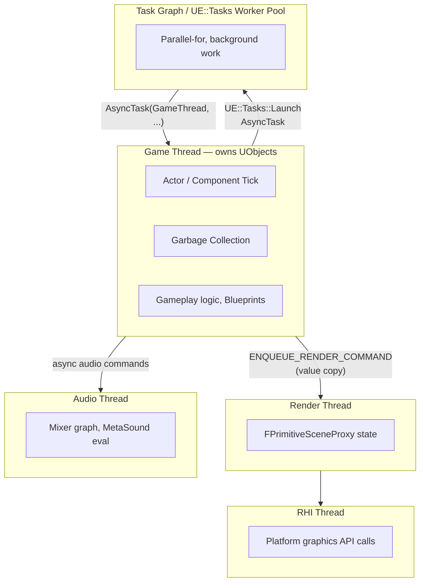

# Engine threading model

## Why this matters

Unreal is not single-threaded, and it is not "just use `std::thread` and be careful" multi-threaded
either — it is a fixed set of named threads and a worker pool, each with a specific job and a specific
set of data it alone is allowed to touch. Code that calls into a `UObject` from the wrong thread doesn't
reliably crash the first time; it corrupts state that the garbage collector or the game thread reads
moments later, and the crash lands somewhere unrelated, often on a different machine entirely. Knowing
which thread owns what — and the one legal way to move data between them — is what separates "async work
that just works" from "async work that crashes in shipping builds only, under load, roughly once a day."

## Mental model



Every one of these threads runs concurrently with the others. The game thread is the one thread that
owns `UObject` state — every `AActor`, every `UActorComponent`, every gameplay system's data lives there
and is assumed, engine-wide, to only be read or written from it. Everything else either gets a mirrored
copy of the data it needs (the render thread's scene proxies, described in
[Render thread model](../12-rendering/render-thread-model.md)) or works on plain data that was never a
`UObject` in the first place (worker-pool tasks, `FRunnable` threads).

## The mechanics

### The fixed threads

| Thread | Owns | Notes |
|---|---|---|
| Game thread | `UObject` graph, Actor/Component tick, gameplay logic, garbage collection | The only thread allowed to create, destroy, or mutate `UObject`s |
| Render thread | `FSceneView`, `FPrimitiveSceneProxy`, RDG graph building | Mirrors game-thread data via `ENQUEUE_RENDER_COMMAND`; see [Render thread model](../12-rendering/render-thread-model.md) |
| RHI thread | Translated platform graphics API calls | Present on RHIs/platforms that support it; the render thread queues platform-agnostic commands for it |
| Audio thread | Mixer graph state, submix processing, MetaSound graph evaluation | Runs its own tick, decoupled from the game thread's frame rate |
| Task Graph / `UE::Tasks` worker pool | Whatever data you explicitly hand it | A shared pool of worker threads; see [Async tasks and the Task Graph](./async-tasks-and-task-graph.md) |

Each of these has a matching `IsInXThread()` query: `IsInGameThread()`, `IsInRenderingThread()`,
`IsInRHIThread()`, `IsInAudioThread()`, `IsInSlateThread()`. These aren't just diagnostics — `check()`ing
them at the top of a function is the idiomatic way to document and enforce which thread a function is
meant to run on, the same way the rendering code does at the game/render boundary.

### Named threads and priority tiers

`ENamedThreads::Type` is how you address a specific destination when scheduling work — it's the same
enum both `AsyncTask` and the Task Graph use. The named, fixed threads (`GameThread`,
`ActualRenderingThread`, `RHIThread`) sit alongside a set of priority tiers for the shared worker pool
rather than individual named workers, since the pool itself is sized dynamically:

| Value | Meaning |
|---|---|
| `ENamedThreads::GameThread` | The single game thread |
| `ENamedThreads::ActualRenderingThread` | The render thread, when one exists separately from the game thread |
| `ENamedThreads::RHIThread` | The RHI thread, where present |
| `ENamedThreads::AnyThread` | No specific thread requirement; scheduler picks whichever is free |
| `ENamedThreads::AnyBackgroundThreadNormalTask` / `AnyHiPriThreadNormalTask` | Worker-pool tiers, normal vs. high priority |

You rarely need more precision than "game thread" vs. "some background worker" — reach for a specific
named thread only when the work genuinely has to run there (touching `UObject`s means game thread;
touching a scene proxy means render thread).

### The audio thread and Slate

The audio thread runs its own update loop independently of the game thread's frame cadence — mixer graph
evaluation, submix processing, and MetaSound graph evaluation happen there so audio processing isn't
gated on render-thread or game-thread frame spikes. Like the render thread, it works from data hopped
across a boundary rather than reaching directly into `UObject` state; see
[Audio engine overview](../13-audio/audio-engine-overview.md) for the audio-specific version of this
split. Slate (the UI framework backing the editor and most runtime widgets) normally runs on the game
thread, but has its own `IsInSlateThread()` check for the narrower cases where Slate does off-thread work
(certain text layout and font operations) — most gameplay-facing UI code never needs to think about this
distinction and can assume it's on the game thread.

### Why touching a UObject off the game thread is a crash

The garbage collector walks the `UObject` reference graph assuming nothing else is mutating it
concurrently — no locks protect `UProperty` reads and writes, `TArray` reallocation, or the reference
graph itself. A worker thread that reads an `AActor`'s member data while the game thread is mid-write (or
after the GC has reclaimed it) doesn't get a clean exception; it gets a torn read, a dangling pointer
dereference, or a reference count the GC now disagrees with. The engine's own scene proxy code hits this
exact bug class when someone caches an owning `AActor*` and dereferences it later from the render thread:
the actor may have been destroyed, or some unrelated property may be mid-write, in between.

The rule that falls out of this: never call a `UFUNCTION`, read a `UPROPERTY`, or destroy/construct a
`UObject` from anywhere but the game thread. If a background task needs to act on `UObject` state, it
hops back to the game thread first.

### Crossing thread boundaries correctly

`AsyncTask` is the general-purpose way to schedule a lambda onto a specific named thread and return
immediately without blocking the caller:

```cpp title="Hopping from a worker thread back onto the game thread"
void UMyLoaderSubsystem::LoadPayloadAsync(const FString& Path)
{
    // Kick real work onto a background worker (see async-tasks-and-task-graph.md for UE::Tasks details).
    AsyncTask(ENamedThreads::AnyBackgroundThreadNormalTask, [this, Path]()
    {
        // Background thread: do NOT touch `this`'s UObject state here.
        TArray<uint8> RawBytes = LoadFileFromDiskBlocking(Path); // plain data, not a UObject

        // Hand the result back to the game thread before touching anything UObject-owned.
        AsyncTask(ENamedThreads::GameThread, [this, RawBytes = MoveTemp(RawBytes)]()
        {
            check(IsInGameThread());
            ApplyLoadedPayload(RawBytes); // safe: back on the thread that owns `this`
        });
    });
}
```

The pattern is always the same: capture plain data by value (or move), never a raw `UObject*` you intend
to dereference off the game thread, and do the `UObject`-touching half of the work only after hopping
back with `AsyncTask(ENamedThreads::GameThread, ...)`.

### Weak references across the hop

Because the object that queued the background work might be destroyed before the work finishes, capture
a `TWeakObjectPtr` rather than a raw `this`/`UObject*` whenever the hop-back isn't guaranteed to happen in
the same frame:

```cpp title="Guarding against the object dying before the hop-back runs"
void UMyLoaderSubsystem::LoadPayloadAsyncSafe(const FString& Path)
{
    TWeakObjectPtr<UMyLoaderSubsystem> WeakThis(this);

    AsyncTask(ENamedThreads::AnyBackgroundThreadNormalTask, [WeakThis, Path]()
    {
        TArray<uint8> RawBytes = LoadFileFromDiskBlocking(Path);

        AsyncTask(ENamedThreads::GameThread, [WeakThis, RawBytes = MoveTemp(RawBytes)]()
        {
            if (UMyLoaderSubsystem* Strong = WeakThis.Get()) // re-checked on the game thread
            {
                Strong->ApplyLoadedPayload(RawBytes);
            }
        });
    });
}
```

`TWeakObjectPtr::Get()` is only safe to resolve on the game thread — resolving it elsewhere races the same
GC that makes raw `UObject*` unsafe in the first place.

### When you genuinely need to share mutable state

Not every cross-thread interaction fits the "compute on a worker, apply on the game thread" shape — a
progress counter a background job updates that the game thread polls, for instance. For small, plain
(non-`UObject`) shared state like this, a lock around the specific access is simpler and safer than trying
to restructure the work to avoid sharing entirely:

```cpp title="A small piece of state shared between a worker and the game thread"
class FImportProgress
{
public:
    void SetPercent(float NewPercent)
    {
        FScopeLock Lock(&Mutex);
        Percent = NewPercent;
    }

    float GetPercent() const
    {
        FScopeLock Lock(&Mutex);
        return Percent;
    }

private:
    mutable FCriticalSection Mutex;
    float Percent = 0.f;
};
```

Keep the locked region tiny — a plain float or small struct copy — and never take a lock and then call
back into engine code that might itself try to touch the game thread, which is how these turn into
deadlocks instead of the small synchronization points they're meant to be.

## Gotchas

:::warning A `check(IsInGameThread())` at the top of a function is not decoration
It's the fastest way to convert a silent, timing-dependent memory corruption bug into an immediate, loud
assert failure at the exact call site that got it wrong — instead of a crash report from a player with no
repro steps three weeks later. Add it to any function that assumes game-thread ownership.
:::

:::warning Capturing `this` by reference in an async lambda is a lifetime bug waiting to happen
If the owning object can be destroyed before the lambda runs (almost always true for anything that
outlives a single frame), capture a `TWeakObjectPtr` and re-validate it once you're back on the game
thread, not a raw pointer captured "because it was convenient."
:::

:::caution Blocking one thread on another defeats the reason the split exists
Calling `Wait()`/`BusyWait()` on a task, or blocking the game thread on a render-thread fence, every
frame reintroduces the serial bottleneck the whole threading model exists to avoid. Reserve blocking waits
for teardown and rare synchronization points, not steady-state per-frame code.
:::

## See also

- [Render thread model](../12-rendering/render-thread-model.md) — the game/render/RHI split in detail,
  including `ENQUEUE_RENDER_COMMAND` and `FRenderCommandFence`.
- [Async tasks and the Task Graph](./async-tasks-and-task-graph.md) — `UE::Tasks`, the older Task Graph,
  and `FAsyncTask`/`FNonAbandonableTask`.
- [Garbage collection](../02-cpp-in-unreal/garbage-collection.md) — why the GC assumes single-threaded
  access to the `UObject` graph.
- [Epic — Threaded Rendering in Unreal Engine](https://dev.epicgames.com/documentation/unreal-engine/threaded-rendering-in-unreal-engine)

