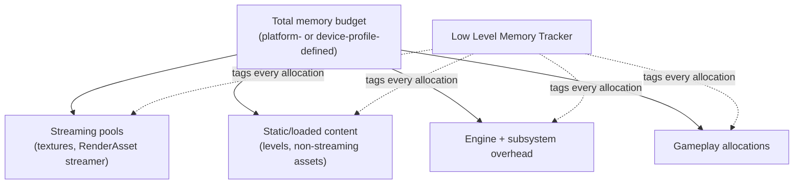

# Memory budgets and profiling

## Why this matters

A project that never checks its memory footprint discovers its budget the hard way — a console
certification failure, a low-end mobile device that starts getting killed by the OS, or a texture pool
that silently starts evicting mid-session and stutters every time it does. Unlike frame time, memory
problems don't show up as a single bad frame you can point Insights at; they show up as "this device runs
out of memory after twenty minutes" or "this platform's cert process rejected the build." Knowing where
memory actually goes — not where you assume it goes — is the only way to hit a hard platform budget
instead of discovering it's blown after the fact.

## Mental model



Rather than one aggregate number, think of memory as several pools with different owners and different
tools for inspecting them: the texture/render-asset streaming pool has its own size and its own "over
budget" signal; the rest of the engine's allocations are visible through the Low Level Memory Tracker's
scoped tags; and a point-in-time snapshot of everything (loaded levels, RHI stats, pool sizes) comes from
a memory report.

## The mechanics

### The Low Level Memory Tracker (LLM)

LLM tracks memory usage using a scoped-tag system: every allocation the engine or the OS makes is
attributed to a tag (a subsystem, an asset type, a category) as it happens, so the aggregate breakdown
reflects where memory actually went rather than a guess. Once tracking is active, the `stat llm` family of
console commands surfaces it directly in the on-screen overlay:

```bash
stat llm         # top-level LLM tag breakdown
stat llmfull     # full detail across all tags
stat llmoverhead # LLM's own tracking overhead
stat llmplatform # platform-level LLM counters
```

`stat list LLM` (using the general `stat list <Group>` mechanism covered in
[Stat commands and console](./stat-commands-and-console.md)) lists the specific tags available in your
build, which varies by platform and by what subsystems are compiled in.

:::note
Not confirmed against 5.7 in the sources consulted: the exact command-line switch to enable LLM tracking
at startup and its precise build-configuration requirements. LLM tracking is commonly gated behind a
startup flag because of its overhead — verify the flag and any required build define for your engine
version before relying on it in a profiling script.
:::

### Texture and render-asset streaming budget

Streamed texture/render-asset memory has its own explicit pool size, controlled by the console variable
`r.Streaming.PoolSize` (in megabytes). Device profiles set this per memory tier so a low-memory mobile
device gets a smaller streaming pool than a desktop target:

```ini title="DeviceProfiles.ini — texture streaming pool per memory bucket"
[Mobile DeviceProfile]
+CVars_Default=r.Streaming.PoolSize=180
+CVars_Smaller=r.Streaming.PoolSize=150
+CVars_Smallest=r.Streaming.PoolSize=70
+CVars_Tiniest=r.Streaming.PoolSize=16
```

`IRenderAssetStreamingManager` exposes the runtime state behind that budget: `GetPoolSize()` for the
current budget, `GetRequiredPoolSize()` for what the streamer would use with no limit at all (the gap
between the two tells you how starved the pool is), and `GetMemoryOverBudget()` for how far over the
allocated budget the streamer currently sits.

```cpp title="Reading streaming pool pressure from code"
void UMemoryDiagnosticsSubsystem::LogStreamingPoolPressure() const
{
    if (IRenderAssetStreamingManager* Streamer = IStreamingManager::Get().GetRenderAssetStreamingManager())
    {
        const int64 PoolSize = Streamer->GetPoolSize();
        const int64 RequiredSize = Streamer->GetRequiredPoolSize();
        const int64 OverBudget = Streamer->GetMemoryOverBudget();

        UE_LOG(LogTemp, Log, TEXT("Streaming pool: %lld / required %lld, over budget by %lld"),
            PoolSize, RequiredSize, OverBudget);
    }
}
```

### RHI-level memory stats

`FRHIMemoryStats` gives a lower-level snapshot of GPU-visible memory: available and used memory for both
local (dedicated video) and system memory, the OS/driver-assigned budget for each, and how much is
currently over that budget (`DemotedLocal`/`DemotedSystem`), with `IsOverBudget()` as the quick check.
This is the layer to inspect when the question is specifically "is the GPU's own memory budget, as
reported by the platform, being exceeded" rather than "how much did my game allocate."

```cpp title="Using an FRHIMemoryStats snapshot once you have one"
void UMemoryDiagnosticsSubsystem::LogRHIMemoryPressure(const FRHIMemoryStats& Stats) const
{
    if (Stats.IsOverBudget())
    {
        UE_LOG(LogTemp, Warning, TEXT("RHI local memory over budget: used %llu / budget %llu"),
            Stats.UsedLocal, Stats.BudgetLocal);
    }
}
```

Unlike the render-asset streaming pool (which the engine manages and can gracefully demote), an RHI-level
over-budget condition reflects pressure the OS/driver itself is applying — it's a stronger signal that
something upstream (streaming pool size, non-streaming asset footprint, or both) needs to come down.

:::note
Not confirmed against 5.7 in the sources consulted: the exact call used to obtain a live `FRHIMemoryStats`
snapshot (the accessor is RHI- and platform-specific). Verify against your target RHI's header rather than
assuming a single cross-platform entry point.
:::

### Full memory reports

`memreport -full`, run from the in-game console, writes a `.memreport` text file to
`Saved/Profiling/Memreports` containing allocated memory, pool sizes, currently loaded levels, RHI stats,
and more — a full point-in-time snapshot rather than a live overlay. Because it reflects the actual
cooked/packaged data (compression, stripped content, and similar) when run against a packaged build, it's
the report to trust for an accurate on-device memory picture rather than an in-editor PIE session.

```bash
memreport -full
```

### Catching leaks with FMallocLeakReporter

Where LLM tells you where memory currently sits, `FMallocLeakReporter` is aimed specifically at catching
allocations that grow unbounded over time — a leak, as opposed to a large-but-stable allocation. It tracks
allocations above a given size and periodically reports on ones that look like leaks:

```cpp title="Starting a leak-tracking pass"
FMallocLeakReporter::Get().Start(/*FilterSize=*/ 1024, /*ReportOnTime=*/ 60.f);
```

`SetDefaultAllocReportOptions` and `SetDefaultLeakReportOptions` let you tune what counts as worth
reporting (minimum size, age thresholds) versus what's just normal allocation churn, so a long soak-test
session doesn't drown you in noise from short-lived allocations that were never a leak in the first place.

### Setting a budget, not just measuring against one

A memory budget is only useful if something enforces it. In practice that means: picking a target device
tier's total memory ceiling up front, allocating a portion of it to each pool (streaming, static content,
engine overhead, gameplay) the way the device-profile example above does for `r.Streaming.PoolSize`, and
treating `GetMemoryOverBudget()`/`stat llm` regressions as build-breaking the same way a broken test would
be — not something to notice only once cert fails.

## Gotchas

:::warning A PIE memory number is not a shipping memory number
The editor keeps editor-only data resident that a packaged build never loads, and a Development build's
allocator behavior differs from Shipping. Always validate a real memory budget against a packaged,
platform-target build, not a PIE session in the editor.
:::

:::caution Over-budget streaming doesn't fail loudly
When the render-asset streamer exceeds its pool, it doesn't crash — it demotes mip levels and evicts,
which shows up as textures popping to lower resolution under memory pressure rather than an error. Check
`GetMemoryOverBudget()` or the streaming stat groups proactively; don't wait for visibly blurry textures
to notice the pool is undersized.
:::

:::note
Not confirmed against 5.7 in the sources consulted: the specific LLM tag taxonomy (which tag names exist
by default vs. which require a subsystem to register its own) and whether `r.Streaming.PoolSize` behaves
identically across all RHIs. Verify tag names and CVar behavior against your target platform.
:::

## See also

- [Stat commands and console](./stat-commands-and-console.md) — the `stat memory`/`stat llm` overlay
  commands referenced above.
- [Unreal Insights](./unreal-insights.md) — capturing memory events over time instead of a single
  snapshot.
- [Streaming and budgets](../11-world-building/streaming-and-budgets.md) — level- and world-partition-side
  streaming budget concerns that compound with the texture streaming pool covered here.
- [Epic — Optimizing Packaged Game Size for iOS Projects](https://dev.epicgames.com/documentation/unreal-engine/optimizing-packaged-game-size-for-ios-projects-in-unreal-engine)

