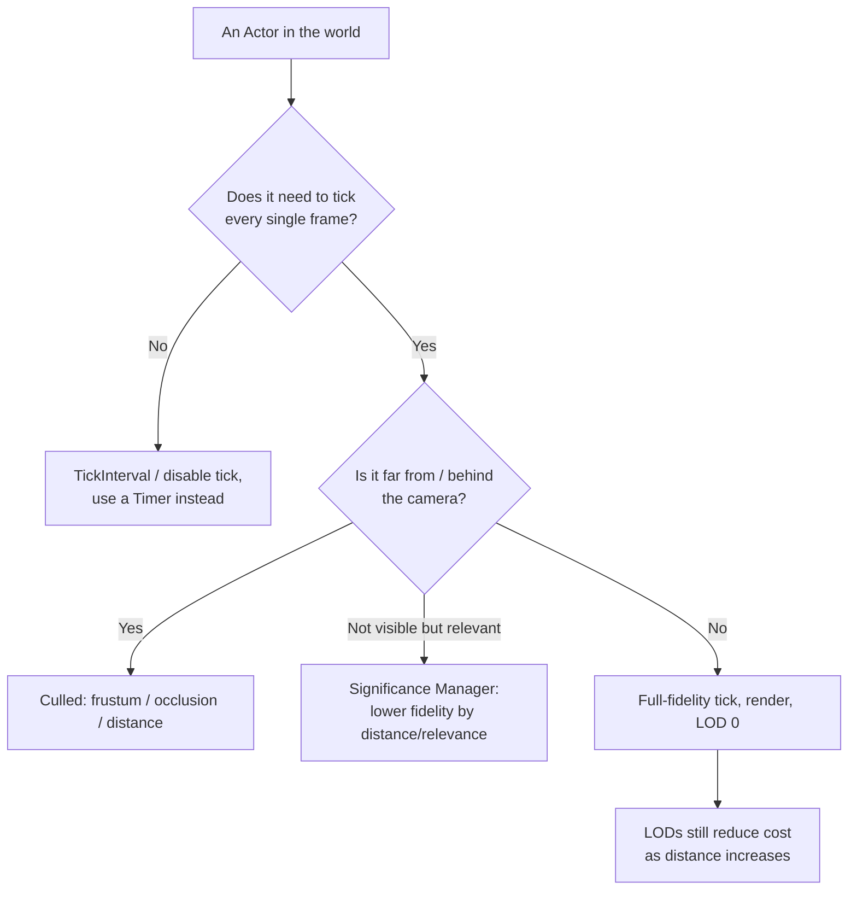

# Optimization patterns

## Why this matters

Most performance problems in a shipping Unreal project aren't exotic — they're a hundred actors each
ticking every frame when a handful would do, a spawn/destroy churn that pressures the garbage collector,
or every actor in a large level rendering and simulating at full fidelity regardless of whether the player
is anywhere near it. None of these need a profiler to fix once you know the pattern; they need someone to
have applied it. The patterns below are the recurring, cheap wins that show up across almost every project
that ships on more than one hardware tier — apply them before reaching for something more invasive.

## Mental model



Every one of these is a variation on the same idea: don't spend full-fidelity CPU/GPU work on something
the player can't perceive right now. Ticking, rendering detail, and even instance lifetime are all knobs
you can turn down for the actors that don't currently matter, freeing budget for the ones that do.

## The mechanics

### Tick management

Every `AActor` has a `PrimaryActorTick` (an `FActorTickFunction`), and every `UActorComponent` has its own
`PrimaryComponentTick`. Both default to ticking every frame if enabled, and both can be tuned or turned off
entirely:

```cpp title="Disabling and throttling tick in a constructor"
AMyBackgroundProp::AMyBackgroundProp()
{
    PrimaryActorTick.bCanEverTick = false; // this actor never needs to tick at all
}

AMyPeriodicScanner::AMyPeriodicScanner()
{
    PrimaryActorTick.bCanEverTick = true;
    PrimaryActorTick.TickInterval = 0.5f; // tick twice a second, not sixty times
}
```

For components, the same idea applies through `PrimaryComponentTick`, which defaults to disabled and must
be explicitly enabled:

```cpp title="Enabling component tick only when needed"
UMyScannerComponent::UMyScannerComponent()
{
    PrimaryComponentTick.bCanEverTick = true;
    PrimaryComponentTick.SetTickFunctionEnable(false); // start disabled, enable on demand
}

void UMyScannerComponent::BeginScanning()
{
    PrimaryComponentTick.SetTickFunctionEnable(true);
}

void UMyScannerComponent::EndScanning()
{
    PrimaryComponentTick.SetTickFunctionEnable(false);
}
```

Runtime toggles exist too — `SetActorTickEnabled(bool)` and `SetActorTickInterval(float)` — for actors
whose tick needs change dynamically rather than being fixed at construction:

```cpp title="Runtime tick toggling"
MyActor->SetActorTickEnabled(false);
MyActor->SetActorHiddenInGame(true);
MyActor->SetActorEnableCollision(false);
```

For work that needs to happen periodically but not on every tick and not at a fixed interval baked into
the tick function itself, a timer (`FTimerManager`/`SetTimer`) or accumulating a counter inside `Tick()`
and only acting once it crosses a threshold both avoid the cost of running full logic every frame while
keeping the actor's own tick enabled for anything else it still needs per-frame.

### LODs

Level-of-detail reduces the cost of rendering and (for skeletal meshes) animating something as it moves
further from the camera or becomes less visually important, without removing it from the scene. Static
mesh LODs swap to simplified geometry at distance; skeletal meshes additionally reduce bone count and
animation evaluation cost per LOD — see
[Skeletons and skeletal meshes](../07-animation/skeletons-and-skeletal-meshes.md) for the skeletal side.
Nanite geometry handles a large part of the static-mesh LOD problem automatically by streaming detail at
the resolution actually needed per-pixel — see [Nanite](../12-rendering/nanite.md) for how that changes
the usual manual-LOD-authoring workflow.

### Culling

The renderer doesn't draw what it doesn't need to: frustum culling discards anything outside the camera's
view volume, and occlusion culling discards anything fully hidden behind other geometry, both before spending
GPU time on them. Distance-based culling (cull distance volumes, per-component cull distance) goes further
and stops rendering small or unimportant objects once they're far enough away to be visually negligible,
independent of whether they're technically visible. None of this is something gameplay code drives
directly per-object in the common case — it's a renderer-side behavior you configure (cull distances,
occlusion settings) rather than code you write per actor.

### Object pooling

Repeatedly spawning and destroying actors — bullets, hit-effect actors, short-lived VFX — churns the
`UObject` allocator and adds to the garbage collector's workload every time a batch of them gets destroyed
in the same frame. Pooling keeps a reusable set of already-constructed instances around, deactivating one
back into the pool instead of destroying it, and repurposing it from the pool instead of spawning a new
one:

```cpp title="A minimal actor pool for a frequently spawned projectile"
UCLASS()
class MYGAME_API AProjectilePool : public AActor
{
    GENERATED_BODY()

public:
    AProjectile* AcquireProjectile(const FTransform& SpawnTransform)
    {
        AProjectile* Projectile = FreeList.Num() > 0 ? FreeList.Pop() : SpawnFreshProjectile();

        Projectile->SetActorTransform(SpawnTransform);
        Projectile->SetActorHiddenInGame(false);
        Projectile->SetActorEnableCollision(true);
        Projectile->SetActorTickEnabled(true);
        Projectile->OnReactivated();
        return Projectile;
    }

    void ReleaseProjectile(AProjectile* Projectile)
    {
        Projectile->SetActorHiddenInGame(true);
        Projectile->SetActorEnableCollision(false);
        Projectile->SetActorTickEnabled(false);
        FreeList.Push(Projectile);
    }

private:
    AProjectile* SpawnFreshProjectile()
    {
        return GetWorld()->SpawnActor<AProjectile>(ProjectileClass);
    }

    UPROPERTY()
    TArray<TObjectPtr<AProjectile>> FreeList;

    UPROPERTY(EditDefaultsOnly, Category = "Pooling")
    TSubclassOf<AProjectile> ProjectileClass;
};
```

Deactivate-and-return (hide, disable collision, disable tick) rather than `Destroy()` is the whole trick —
the object stays alive and initialized, so re-acquiring it skips construction and `BeginPlay()` entirely.

### Significance Manager

For scenes with many actors of varying importance — a crowd, a large batch of AI, background props — the
`SignificanceManager` plugin gives you a framework for scoring how significant each managed object
currently is (by distance, screen size, gameplay relevance, or a custom function you provide) and reacting
to that score by dialing behavior up or down, rather than hand-rolling a distance check in every system
that cares. Enable the plugin and add the module to your `Build.cs`:

```csharp title="MyGame.Build.cs"
PublicDependencyModuleNames.AddRange(new string[]
{
    "Core", "CoreUObject", "Engine", "InputCore", "SignificanceManager"
});
```

`USignificanceManager` (accessed as a subsystem) lets you register an object along with a significance
function; the manager re-evaluates significance and calls back into your code so you can, for example,
disable a low-significance actor's tick, drop its animation update rate, or swap it to a cheaper
representation, all driven from one central scoring pass instead of duplicating "how far is the player"
logic in every subsystem that wants to scale down.

## Gotchas

:::warning TickInterval isn't free once you're below the frame rate
Setting `TickInterval` shorter than the actual frame time has no effect — the actor still only ticks once
per rendered frame. Use it to *reduce* tick frequency below full rate, not as a way to request finer
granularity than the engine is running at.
:::

:::warning Object pools leak state if you don't reset it on both acquire and release
A pooled object that isn't fully reset (velocity, timers, attached components, gameplay tags) will carry
stale state into its next use, producing bugs that only reproduce after the object has been recycled at
least once — much harder to repro than a fresh-spawn bug. Reset everything the object's behavior depends
on in both `AcquireProjectile` and `ReleaseProjectile`, not just the obviously visual bits.
:::

:::caution Culling and LOD settings tuned in the editor viewport don't validate a real budget
Cull distances and LOD transition distances that look fine in an empty test level can still blow the
frame budget once real level density, real AI counts, and real camera distances are in play. Validate
these settings against `stat unit`/`stat scenerendering` in a representative gameplay scenario, not an
isolated asset preview.
:::

## See also

- [Engine threading model](./engine-threading-model.md) — why moving work off the game thread (rather
  than just doing less of it) is the other lever available once tick/LOD/culling tuning is exhausted.
- [Stat commands and console](./stat-commands-and-console.md) — `stat game` and `stat unit` for measuring
  whether a tick/LOD/culling change actually helped.
- [Memory budgets and profiling](./memory-budgets-and-profiling.md) — the memory-side cost that spawn
  churn adds, which pooling avoids.
- [Blueprint performance](../04-blueprint-interop/blueprint-performance.md) — the same tick/LOD patterns
  from the Blueprint-authoring side.
- [Epic — Significance Manager in Unreal Engine](https://dev.epicgames.com/documentation/unreal-engine/significance-manager-in-unreal-engine)

