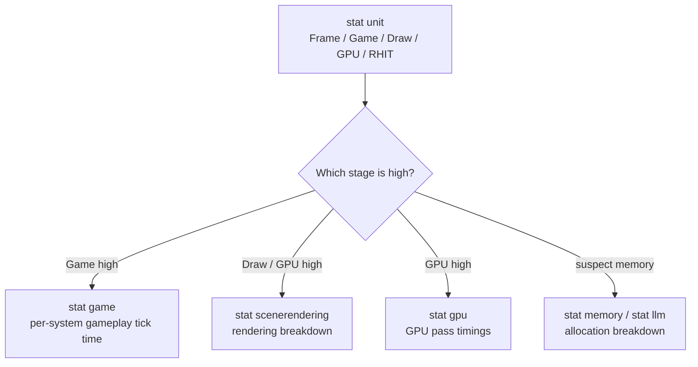

# Stat commands and the console

## Why this matters

Before opening Unreal Insights, opening a trace, and hunting through timing tracks, there's a much
cheaper question worth asking first: is the game thread, render thread, or GPU the one actually running
long this frame? `stat` console commands answer that in seconds, live, in a running PIE session or
packaged build, with zero capture-and-reopen overhead. They're not a replacement for a full trace — they
don't show you causality or overlap across threads — but they're the fastest way to point yourself at
which of those threads deserves a deeper look, and often that's all you need.

## Mental model

`stat` commands are grouped counters, toggled on and off by name, that render as an on-screen overlay
updated every frame. Each group targets a different layer of the frame:



`stat unit` is the entry point specifically because it's a triage tool — it tells you which of the later,
more detailed `stat` groups is worth turning on next, rather than making you guess.

## The mechanics

### stat unit — the first thing to run

`stat unit` displays overall frame time plus a per-stage breakdown: Frame, Game, Draw, GPU, RHIT
(RHI thread), and DynRes (dynamic resolution), each as its own number. Run it in a non-debug build (a
Debug build's overhead skews every number) by opening the console and typing:

```bash
stat unit
```

If **Game** is the largest number, your bottleneck is game-thread work — gameplay logic, Blueprint VM
time, physics, or tick overhead — and `stat game` is the next step. If **Draw** or **GPU** dominates, the
renderer or the GPU itself is the bottleneck, and `stat scenerendering` / `stat gpu` are next.

### stat game — gameplay tick breakdown

`stat game` reports the duration of the various gameplay ticks: how long actor/component ticking,
gameplay-specific subsystems, and related per-frame gameplay work are taking on the game thread. This is
where "which system is actually eating my game-thread budget" gets answered, once `stat unit` has told you
the game thread is the bottleneck.

```bash
stat game
```

### stat gpu and stat scenerendering — the render side

`stat gpu` breaks down GPU time by rendering pass (shadow depth, base pass, translucency, post-process,
and similar), letting you see which pass is actually consuming the GPU budget rather than just knowing
"GPU is high." `stat scenerendering` covers general rendering statistics — draw call counts, primitives
drawn, and related renderer-internal counters — and is the recommended starting point specifically for
narrowing down slow rendering before reaching for a full GPU profiler capture.

```bash
stat gpu
stat scenerendering
```

### Memory stat groups

Several `stat` groups exist purely for memory: `stat memory` reports memory usage across engine
subsystems, `stat memoryallocator` and `stat memoryplatform` narrow that to allocator- and platform-level
detail, and the `stat llm` family (`stat llm`, `stat llmfull`, `stat llmoverhead`, `stat llmplatform`)
surfaces the Low Level Memory Tracker's counters directly in the overlay rather than requiring a separate
report. See [Memory budgets and profiling](./memory-budgets-and-profiling.md) for how LLM tracking is
enabled and what its scoped-tag breakdown actually means.

```bash
stat memory
stat llm
```

### Other frequently useful stat groups

Beyond the triage path above, a handful of other groups answer specific, common questions directly rather
than requiring a full trace:

| Command | What it shows |
|---|---|
| `stat anim` | Time taken by skinned meshes per tick — animation evaluation cost |
| `stat asyncload` / `stat asyncloadgamethread` | Asynchronous asset loading performance, including the portion that runs on the game thread |
| `stat collision` / `stat collisiontags` | Collision-related performance, debug, and memory information |
| `stat component` | Per-component performance information |
| `stat commandlistmarkers` | A list of commands with their performance data |
| `stat gc` | Garbage collection statistics |

```bash
stat anim
stat gc
```

`stat gc` in particular is worth checking whenever `stat game` shows periodic game-thread spikes that
don't correlate with any specific gameplay system — a GC sweep running on the game thread is a common,
easy-to-miss cause of a recurring hitch.

### Listing and combining stat groups

`stat list <Groups/Sets/Group>` shows the statistics available within a named group or a previously saved
set, which is the way to discover what a given `stat` group actually exposes without guessing at counter
names. Multiple `stat` groups can be active simultaneously — turning one on doesn't turn a previous one
off — so a common workflow is layering `stat unit` with whichever detail group the triage points you
toward, then toggling the detail group off again by re-issuing the same command.

```bash
stat list
```

### Reproducing a hitch on demand

For an intermittent frame-time spike that's hard to catch live, `snapshothitches -start` (with a `stat`
group like `stat default` active) arms hitch detection using the stats system; when a hitch is detected,
it automatically saves a trace snapshot and a screenshot to `Saved/Profiling/Hitches`, so you don't have
to be watching the overlay at the exact moment it happens. `snapshothitches -stop` disarms it.

```bash
stat default
snapshothitches -start
```

### Turning stats on at launch instead of typing them every run

For a build you're going to profile repeatedly (a nightly perf-check build, a QA build), it's faster to
have the relevant `stat` commands already active on launch than to type them into the console every time.
`-ExecCmds` runs one or more console commands as part of startup:

```bash
YourProject.exe -ExecCmds="stat unit, stat game"
```

This is the same `-ExecCmds` mechanism used to run arbitrary console commands from the command line in
general — useful for scripting a repeatable profiling pass rather than relying on someone remembering
which `stat` groups to enable by hand each time.

## Gotchas

:::warning Numbers from a Debug build are not representative
`stat unit` and friends measure real wall-clock time on each thread, and a Debug (or non-optimized)
build's overhead dwarfs the difference you're trying to measure. Always profile in a Development (or
better, Test/Shipping-with-stats) configuration.
:::

:::caution stat unit tells you which stage, not which system
A high **Game** number tells you the game thread is the bottleneck; it does not tell you which actor,
component, or subsystem inside that number is responsible. Don't stop at `stat unit` and start guessing —
drop into `stat game` (or Unreal Insights, for a full breakdown) before touching code.
:::

:::note
Not confirmed against 5.7 in the sources consulted: the full list of individual counters displayed under
`stat scenerendering` and `stat gpu`, and any device- or RHI-specific variation in what each group shows.
Treat the pass/counter names in your own capture as the source of truth over any name not explicitly
listed here.
:::

## See also

- [Unreal Insights](./unreal-insights.md) — the deeper capture-and-analyze tool once a `stat` command has
  told you where to look.
- [Memory budgets and profiling](./memory-budgets-and-profiling.md) — the memory-focused `stat` groups and
  LLM in more depth.
- [GPU profiling](../12-rendering/gpu-profiling.md) — dedicated GPU-side tooling beyond `stat gpu`.
- [Epic — Stat Commands in Unreal Engine](https://dev.epicgames.com/documentation/unreal-engine/stat-commands-in-unreal-engine)

