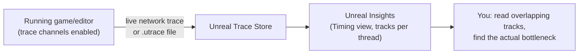

# Unreal Insights

## Why this matters

`stat` commands (covered in [Stat commands and console](./stat-commands-and-console.md)) tell you a
number is high; they don't tell you why, on which thread, in what order, relative to what else happened
that frame. Unreal Insights captures a timeline — every named CPU scope, GPU event, and (with the right
channels enabled) task, memory, and load event, correlated across the game thread, render thread, RHI
thread, and worker pool at once. It's the tool you reach for once `stat unit` has told you *which* stage
is slow and you need to see *why*, or when a hitch is intermittent enough that a live `stat` readout
isn't going to catch it happening.

## Mental model



A trace is just a stream of timestamped events tagged with a channel (`cpu`, `frame`, and others,
enabled or disabled independently) and, for a live session, a thread. Insights doesn't compute anything
you couldn't in principle compute by hand from that stream — it renders it as a set of stacked,
zoomable tracks, one per thread, so you can see what the game thread, render thread, and worker pool were
each doing at the same wall-clock instant.

## The mechanics

### Capturing a trace

The most direct way to start tracing is a command-line argument on launch. A minimal capture that turns
on CPU profiling looks like:

```bash
# Launch with CPU profiling trace enabled, sending to a local trace store
YourProject.exe -tracehost=127.0.0.1 -cpuprofilertrace
```

Channels can also be requested with the more general `-trace=` argument, which takes a comma-separated
channel list:

```bash
# Enable specific trace channels by name
YourProject.exe -messaging -tracehost=192.168.1.100 -trace=audio,audiomixer
```

The same pattern extends to a device that can't take command-line flags directly (a console, a mobile
device): drop the arguments into a `UECommandline.txt` file the platform's launch path reads, for example
`-tracehost=127.0.0.1 -cpuprofilertrace` for a mobile build being profiled over the network.

:::note
This doc confirms `cpu`/`cpuprofilertrace`, `audio`, and `audiomixer` as real channel names from Epic's
own examples. The complete channel list (memory, task, bookmark, load-time, and others) is engine-version-
dependent — check the channel listing exposed in the Unreal Insights UI itself, or your engine's
`Trace.h`/channel registration sites, rather than assuming a name not shown here exists in your version.
:::

### Reading a captured trace

Opening a `.utrace` file (or connecting Insights to a running instance's live session) gives you the
Timing view: one horizontal track per thread — game thread, render thread, RHI thread, worker pool
threads — each showing the named scopes that were active on it over time, stacked to show nesting. Widen
the time range to see the shape of a whole play session; narrow it down to a single frame to see the
actual call structure that produced that frame's `stat unit` numbers.

What you're looking for when hunting a specific spike:

- **Gaps between threads.** If the render thread's track shows idle time immediately after the game
  thread finishes its frame, the render thread is waiting on something upstream — not itself the
  bottleneck.
- **A single scope dominating a track.** A named scope that consistently eats most of a frame's game-
  thread time is where optimization effort pays off first; scattering effort across many small scopes
  rarely moves the needle as much.
- **Worker-pool occupancy.** If task-related channels are enabled, you can see whether background work is
  actually spread across workers or serialized behind a single long-running task with everything else
  queued behind it — a sign of a missing or over-broad prerequisite, see
  [Async tasks and the Task Graph](./async-tasks-and-task-graph.md).

### Recording your own scopes

Custom systems can add their own named scopes to a trace with the CPU profiler macros so your own
gameplay/subsystem code shows up as first-class tracks alongside engine scopes, rather than only seeing
engine-internal names in the capture. Wrap the section you care about; the scope name becomes what you
see as a labeled block in the Timing view.

```cpp title="Adding a custom scope so a gameplay system shows up in the capture"
void UInventorySubsystem::RebuildDerivedStats()
{
    TRACE_CPUPROFILER_EVENT_SCOPE(UInventorySubsystem_RebuildDerivedStats);

    for (const FInventoryEntry& Entry : Entries)
    {
        ApplyEntryToDerivedStats(Entry);
    }
}
```

Without this, everything your gameplay code does gets attributed to whatever engine-level scope happens
to be active on the call stack at the time (typically the actor/component tick that called into it) —
useful for a first pass, but not enough to tell two unrelated systems' costs apart once both are ticking
under the same generic "Tick" scope.

### Standalone Insights vs. the in-editor Session Frontend

You can view a trace two ways: the standalone Unreal Insights application (`UnrealInsights.exe`), which
connects to the Trace Store and opens `.utrace` files directly, or the Session Frontend inside the editor
for a quick look at a session you're already running in-editor. The standalone app is the one you'd hand
to someone profiling a packaged build on another machine — it doesn't need the target project open at all,
just the trace file or a live connection to the device.

### Live session vs. file capture

A live trace streams events to Insights in real time as the target runs, which is useful for watching a
long play session unfold or catching a hitch as it happens; a file capture (`.utrace` written locally,
pulled off a device afterward) is more reliable for anything running on hardware that can't stay
network-connected to your workstation for the whole session — most consoles and many mobile test rigs.
Prefer file capture for reproducibility (the exact same trace can be re-opened and re-analyzed later) and
live sessions for interactive, exploratory profiling.

### Counters, beyond raw CPU/GPU scopes

Some systems expose numeric counters into a trace rather than just timed scopes — a count of shadow map
invalidations, a queue depth, anything better read as a graph over time than a nested duration. These show
up under a dedicated Counters view rather than the Timing view's stacked tracks, and are enabled the same
way as any other channel:

```bash
trace.enable counters, vsm
```

### A worked triage example

Say `stat unit` shows the **Game** number spiking every few seconds, but `stat game` doesn't point at any
one obvious system. Capturing a short trace around one of the spikes and opening it in Insights lets you
narrow further than either `stat` command can on its own:

1. Capture with `-cpuprofilertrace` running, reproduce the spike, stop.
2. Open the Timing view and jump to one of the spike frames.
3. Look at the game thread's track for that frame: which named scope is unusually wide compared to the
   surrounding frames?
4. If the wide scope is inside engine code (GC, asset streaming), cross-check against `stat gc` /
   `stat asyncload`; if it's inside a scope you added yourself (see below), you've already found the
   system responsible.

This is the workflow the `stat` commands can't complete alone — they tell you a number is high on average,
Insights tells you which specific frame and which specific scope, at the moment it actually happened.

## Gotchas

:::warning Tracing has a cost — don't leave every channel on by default
Every enabled channel adds overhead to the run being profiled, and some (memory tracking in particular)
are expensive enough to visibly change frame time while capturing. Enable only the channels relevant to
the question you're asking, and prefer a short, targeted capture window over "trace everything for the
whole session."
:::

:::caution A live network trace needs the host reachable
`-tracehost=<ip>` only works if the capturing machine (running Insights) is actually reachable from the
device under test — a firewall, a different subnet, or a console's network sandboxing can silently make
a "live" trace never connect while showing no obvious error. If a live session won't connect, capture to
a local `.utrace` file instead and pull it off the device afterward.
:::

:::note
Not confirmed against 5.7 in the sources consulted: the exact Insights UI workflow for annotating a
capture, saving bookmarks, and the full set of built-in analysis views (Memory Insights, Asset Loading
Insights, and similar specialized modes) beyond the core Timing view. Verify the specific view names and
menu locations against your installed engine version.
:::

## See also

- [Stat commands and console](./stat-commands-and-console.md) — the fast first look, before reaching for
  a full trace capture.
- [Async tasks and the Task Graph](./async-tasks-and-task-graph.md) — what a healthy vs. starved worker
  pool looks like in a trace.
- [GPU profiling](../12-rendering/gpu-profiling.md) — the GPU-side counterpart when the bottleneck is on
  the render thread or GPU rather than the game thread.
- [Epic — Unreal Insights Overview](https://dev.epicgames.com/documentation/unreal-engine/unreal-insights-overview)
