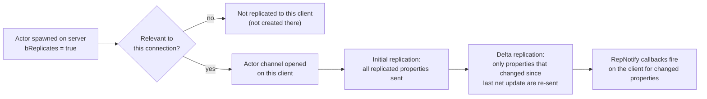

# Actor and property replication

Getting an actor to exist on every client, and getting its properties to match the server's values, are
two separate systems that a lot of first networking bugs come from conflating. An actor can replicate
its existence perfectly while a property on it silently never updates because you forgot one line in
`GetLifetimeReplicatedProps`. Understanding the two halves — actor spawning/relevancy, and per-property
replication — is what turns "replication just doesn't work" into a five-minute fix.

## Why this matters

Replication is how the server's authoritative world becomes visible on clients at all: without it,
clients would see nothing the server does after the initial join. But replication is opt-in at every
level — actors don't replicate unless told to, properties don't replicate unless registered, and each
client only receives the subset of actors currently relevant to it. Missing any one of these opt-ins
produces the same symptom (the client doesn't see the change), which is why this is one of the more
frustrating things to debug blind.

## Mental model



Actor replication answers "does this actor exist on this client at all, and when." Property replication
answers "which fields of that actor's state does the client receive, and how often." Both are
server-driven — the server decides what to create and what to send; the client only receives.

## The mechanics

### Making an actor replicate

An actor must opt in explicitly:

```cpp title="MyProjectile.cpp — constructor"
AMyProjectile::AMyProjectile()
{
    bReplicates = true;              // this actor exists on clients at all
    SetReplicateMovement(true);      // its transform/velocity replicate via the built-in movement replication
}
```

`SetReplicates(bool)` is the runtime equivalent of setting `bReplicates` — use it when an actor's
network status needs to change after construction (for example, an actor that starts client-only for a
cosmetic preview and later needs to become networked). Only the server's call to `SetReplicates` has any
effect; calling it on a client is a no-op because the client never owns the decision to replicate an
actor.

`SetReplicateMovement(true)` covers position, rotation, and velocity for actors that don't use
`UCharacterMovementComponent` (which replicates movement through its own prediction system instead —
see [Movement replication and prediction](./movement-replication-and-prediction.md)).

### Relevancy drives channel creation

An actor being `bReplicates = true` doesn't mean every client receives it. The server evaluates
relevancy per connection (distance, `NetCullDistanceSquared`, `bAlwaysRelevant`, custom
`IsNetRelevantFor` overrides — see
[Relevancy and Replication Graph](./relevancy-and-replication-graph.md)) and only opens an **actor
channel** to a client once the actor becomes relevant to it. Until that channel exists, the actor
doesn't exist on that client at all — no properties, no RPCs, nothing. This is why an actor that's
"replicating fine" for one player can be completely invisible to a distant player: it was never
relevant, so no channel was ever opened for that connection.

### Registering replicated properties

A property only replicates if it's marked `UPROPERTY(Replicated)` (or one of its variants) *and* listed
in `GetLifetimeReplicatedProps`. Missing either half means the property never leaves the server.

```cpp title="MyCharacterHealthComponent.h"
UCLASS(ClassGroup = (Custom), meta = (BlueprintSpawnableComponent))
class MYGAME_API UMyCharacterHealthComponent : public UActorComponent
{
    GENERATED_BODY()

public:
    UMyCharacterHealthComponent();

    virtual void GetLifetimeReplicatedProps(TArray<FLifetimeProperty>& OutLifetimeProps) const override;

    UFUNCTION()
    void OnRep_CurrentHealth(float OldHealth);

protected:
    UPROPERTY(ReplicatedUsing = OnRep_CurrentHealth, EditDefaultsOnly, Category = "Health")
    float CurrentHealth = 100.f;

    UPROPERTY(Replicated)
    float MaxHealth = 100.f;
};
```

```cpp title="MyCharacterHealthComponent.cpp"
UMyCharacterHealthComponent::UMyCharacterHealthComponent()
{
    SetIsReplicatedByDefault(true); // components need this too, in addition to the owning actor's bReplicates
}

void UMyCharacterHealthComponent::GetLifetimeReplicatedProps(TArray<FLifetimeProperty>& OutLifetimeProps) const
{
    Super::GetLifetimeReplicatedProps(OutLifetimeProps);

    DOREPLIFETIME(UMyCharacterHealthComponent, CurrentHealth);
    DOREPLIFETIME(UMyCharacterHealthComponent, MaxHealth);
}

void UMyCharacterHealthComponent::OnRep_CurrentHealth(float OldHealth)
{
    // Runs on clients only, after CurrentHealth has already been updated locally.
    OnHealthChanged.Broadcast(OldHealth, CurrentHealth);
}
```

`DOREPLIFETIME(Class, Property)` is the macro form of registering a property with no special condition —
it expands to a call that adds an `FLifetimeProperty` entry for that property to `OutLifetimeProps`.
Always call `Super::GetLifetimeReplicatedProps(OutLifetimeProps)` first so parent-class replicated
properties are preserved.

### RepNotify — reacting to a changed value on the client

`ReplicatedUsing = FunctionName` (equivalently `RepNotify`) tells the engine to call `FunctionName` on
clients whenever the property arrives with a new value. The function must be a `UFUNCTION()` and, by
convention, is named `OnRep_PropertyName`. It runs **after** the property has already been set to the
new value, and only on machines where the property actually changed over the network — the server never
calls its own `OnRep_` functions from a local assignment, only from replication.

```cpp title="Manual OnRep signature with the old value for comparison"
UFUNCTION()
void OnRep_CurrentHealth(float OldHealth); // parameter is optional, but useful for diffing
```

Because `OnRep_` only fires on clients (not on the server, and not on a standalone game with no
network), any side effect that must happen everywhere — like updating a health bar — needs to also be
called from the code path that changes the value on the server, or driven by a helper both paths call.

### Replication conditions — sending less data on purpose

`DOREPLIFETIME_CONDITION(Class, Property, Condition)` restricts *who* receives a property, which is both
a bandwidth optimization and, for owner-only data, a cheat-prevention measure (don't tell every client
another player's ammo count or cooldowns).

```cpp title="Conditional replication examples"
void AMyPlayerState::GetLifetimeReplicatedProps(TArray<FLifetimeProperty>& OutLifetimeProps) const
{
    Super::GetLifetimeReplicatedProps(OutLifetimeProps);

    // Only this player's own client receives their exact currency balance.
    DOREPLIFETIME_CONDITION(AMyPlayerState, Currency, COND_OwnerOnly);

    // Every client except the owner receives this (owner already knows locally / predicts it).
    DOREPLIFETIME_CONDITION(AMyPlayerState, DisplayedRank, COND_SkipOwner);

    // Sent once at spawn/join and never updated afterward.
    DOREPLIFETIME_CONDITION(AMyPlayerState, SpawnSeed, COND_InitialOnly);
}
```

The common `ELifetimeCondition` values you'll reach for:

| Condition | Sends to |
|---|---|
| `COND_None` | Everyone the actor is relevant to (default, same as plain `DOREPLIFETIME`). |
| `COND_OwnerOnly` | Only the owning connection (the client that possesses/owns this actor). |
| `COND_SkipOwner` | Everyone except the owning connection. |
| `COND_SimulatedOnly` | Only connections where this actor is `ROLE_SimulatedProxy`. |
| `COND_AutonomousOnly` | Only the connection where this actor is `ROLE_AutonomousProxy`. |
| `COND_InitialOnly` | Sent once, at the point the actor becomes relevant, never again afterward. |
| `COND_Custom` | Gated by `DOREPLIFETIME_ACTIVE_OVERRIDE` at runtime per-property instead of a fixed rule. |

:::note
The exact enumerated list of `ELifetimeCondition` values and their precise names were not directly
confirmed against 5.7 API docs in the sources consulted for this pass — the table above reflects
long-stable Unreal replication conditions used since UE4's replication system. Cross-check
`Engine/Source/Runtime/Engine/Public/Net/Core/Connection/NetEnums.h` (or the `ELifetimeCondition` header
in your installed engine) if you rely on a less common condition like `COND_Custom` or the
ownership-relative ones.
:::

### Actor owner and NetConnection

`COND_OwnerOnly` / `COND_SkipOwner` depend on the actor's **Owner**, set via `SetOwner()` — usually the
controller that possesses the pawn, or the player controller itself for a `PlayerState`. Owner is
distinct from possession; setting it explicitly is what makes owner-relative replication conditions
resolve to the connection you expect.

```cpp title="Wiring ownership so COND_OwnerOnly resolves correctly"
void AMyPlayerController::OnPossess(APawn* InPawn)
{
    Super::OnPossess(InPawn);
    InPawn->SetOwner(this); // usually already true for Character/Pawn possession, shown for clarity
}
```

## Gotchas

:::warning Forgetting GetLifetimeReplicatedProps silently drops the property
Marking a property `UPROPERTY(Replicated)` without registering it in `GetLifetimeReplicatedProps` fails
silently — no compile error, no runtime warning, the property just never leaves the server. If a
replicated field "does nothing," check this file first.
:::

:::caution Components need their own opt-in
`bReplicates` on the owning actor is not enough for a component's properties to replicate — the
component itself must call `SetIsReplicatedByDefault(true)` (or `SetIsReplicated(true)` at runtime) and
implement its own `GetLifetimeReplicatedProps`. An actor that replicates fine but whose component's
properties never update almost always means this step was skipped.
:::

:::warning RepNotify functions don't run on the server
Don't put logic in `OnRep_X` that the server also needs to run — the server sets the value directly and
its own `OnRep_` never fires from that local write. Call a shared helper from both the server-side
setter and the `OnRep_` function if both sides need the same reaction.
:::

:::caution Relevancy can make replication look broken when it's really invisibility
If a property "isn't replicating" only for some clients, check whether the actor is even relevant to
those connections before debugging the property itself — no channel means no replication at all,
regardless of how correctly the property is registered.
:::

## See also

- [Network model and authority](./network-model-and-authority.md) — who is allowed to change the values
  you're replicating.
- [Remote procedure calls](./remote-procedure-calls.md) — the complementary mechanism for one-shot
  events instead of persistent state.
- [Relevancy and Replication Graph](./relevancy-and-replication-graph.md) — what actually controls
  whether an actor channel exists for a given client.
- [Epic — Actor replication](https://dev.epicgames.com/documentation/unreal-engine/actor-replication-in-unreal-engine)
