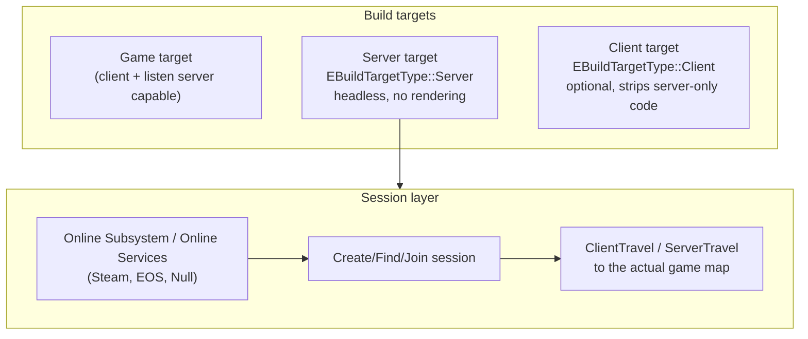

# Dedicated servers and Online Subsystem

Replication and RPCs describe how actors talk to each other once a game session exists. Dedicated
servers and the Online Subsystem are about how that session comes to exist at all: building a headless
server binary, and finding/creating/joining sessions through a platform (Steam, EOS, or a null/offline
fallback). Skipping this until "later" tends to mean discovering, well into a project, that your game
was never actually buildable as a real dedicated server — it just happened to run as a listen server in
every test so far.

## Why this matters

A listen server (a client that also hosts) is convenient for testing but not what most multiplayer games
ship: it wastes the host's client CPU/GPU budget on server work, gives the host player a latency
advantage, and is a poor foundation for anything that needs to run unattended (a match server, a
persistent world). A **dedicated server** build strips out rendering, audio, and input entirely, running
only the authoritative simulation. Getting there requires both build-system configuration
(`Build.cs`, target files) and — if the game needs matchmaking, sessions, or platform identity — an
Online Subsystem or Online Services backend wired in from early on, because retrofitting session/
matchmaking code onto gameplay that assumed direct IP connects is a real rewrite, not a config change.

## Mental model



The build target decides *what code even ships* in the binary (a dedicated server target excludes
rendering code paths entirely, not just disables them at runtime). The Online Subsystem decides *how
players find and connect to* a running server instance — direct IP is the degenerate case with no
subsystem needed at all; matchmaking, friends-based invites, and platform-specific session features need
one.

## The mechanics

### Build target types

Unreal Build Tool recognizes distinct target types via `EBuildTargetType`: `Game`, `Server`, `Client`,
`Editor`, and `Program`. A project's `.uproject`-adjacent `Target.cs` files declare which kind a given
build produces.

```csharp title="MyGameServer.Target.cs"
using UnrealBuildTool;
using System.Collections.Generic;

public class MyGameServerTarget : TargetRules
{
    public MyGameServerTarget(TargetInfo Target) : base(Target)
    {
        Type = TargetType.Server;
        DefaultBuildSettings = BuildSettingsVersion.Latest;
        IncludeOrderVersion = EngineIncludeOrderVersion.Latest;

        ExtraModuleNames.AddRange(new string[] { "MyGame" });
    }
}
```

```csharp title="MyGameClient.Target.cs — optional, strips server-only paths at compile time"
public class MyGameClientTarget : TargetRules
{
    public MyGameClientTarget(TargetInfo Target) : base(Target)
    {
        Type = TargetType.Client;
        DefaultBuildSettings = BuildSettingsVersion.Latest;
        IncludeOrderVersion = EngineIncludeOrderVersion.Latest;

        ExtraModuleNames.AddRange(new string[] { "MyGame" });
    }
}
```

A `Server` target compiles out rendering, audio, and most input handling paths — this is a real build
configuration, not `-nullrhi` bolted onto a normal client build (though `-nullrhi` is a useful *runtime*
flag for running a `Game` target headlessly during development, it isn't a substitute for an actual
`Server` target in a shipped build). See
[Build configurations and targets](../01-toolchain-and-build/build-configurations-and-targets.md) for how
target files fit into the broader build system, and
[Unreal Build Tool](../01-toolchain-and-build/unreal-build-tool.md) for how `Target.cs` files are
processed.

### Building and running a dedicated server

```bash
# Build the Server target (Development configuration)
RunUBT.sh MyGameServer Linux Development -project="/path/to/MyGame.uproject"

# Run it, pointing at a specific map, with common dedicated-server flags
./MyGameServer.sh MyMap -server -log
```

```ini title="DefaultEngine.ini — common dedicated server tuning"
[/Script/OnlineSubsystemUtils.IpNetDriver]
NetServerMaxTickRate=30

[URL]
Port=7777
```

:::note
Exact command-line flags and the specific UBT invocation vary by engine version and platform packaging
setup (Turnkey/BuildCookRun vs a raw `RunUBT` call) — the commands above illustrate the shape of a
dedicated server build/run, not a copy-paste-exact command for every project. Verify the current
invocation against your engine version's packaging documentation.
:::

### Online Subsystem vs Online Services

Unreal has shipped two generations of the online session/platform API:

- **Online Subsystem (OSS)** — the long-standing API (`IOnlineSubsystem`, accessed via
  `Online::GetSubsystem`), with per-platform implementations as separate plugins:
  `OnlineSubsystemSteam`, `OnlineSubsystemEOS` (or `OnlineSubsystemEOSPlus`), `OnlineSubsystemNull` (a
  local/offline fallback useful for LAN testing without any real platform backend), and others.
  `OnlineSubsystemUtils` is a shared dependency most of these plugins build on.
- **Online Services** — Epic's newer, more unified cross-platform API intended to eventually replace
  per-platform OSS implementations for common operations (sessions, identity, achievements) with one
  consistent interface.

```csharp title="MyGame.Build.cs — enabling an Online Subsystem dependency"
PublicDependencyModuleNames.AddRange(new string[]
{
    "Core", "CoreUObject", "Engine", "InputCore",
    "OnlineSubsystem", "OnlineSubsystemUtils"
});
```

```ini title="DefaultEngine.ini — selecting the active subsystem"
[OnlineSubsystem]
DefaultPlatformService=Null

[OnlineSubsystemSteam]
bEnabled=true
SteamDevAppId=480
```

:::note
Whether a given project should target Online Subsystem or Online Services depends heavily on which UE
5.x minor version you're on and which platforms you ship to — the migration between the two systems was
still in progress across 5.x releases at the time these docs were written. Confirm current guidance for
your specific engine version before committing a project's session/matchmaking layer to one or the
other.
:::

### Sessions, not just sockets

Direct IP connect (`open 192.168.1.10:7777` via `ClientTravel`) needs no Online Subsystem at all — it's
the simplest possible way to connect and is fine for LAN testing or a game with no matchmaking. The
moment you need any of the following, you need a real subsystem behind it:

- Finding servers via a matchmaking/session-search flow instead of a known IP.
- Platform-specific session metadata (player count, game mode, region) surfaced to a platform's friends
  list or server browser.
- Invites through a platform's social layer (Steam friends, EOS).

`CreateSession` / `FindSessions` / `JoinSession` calls go through the active subsystem's
`IOnlineSessionPtr` interface; a game using `OnlineSubsystemNull` still exercises this same session API
shape locally, which is useful for testing session-dependent code without a real platform backend
available.

### GameMode is server-only by construction

`AGameModeBase` (and `AGameMode`) only ever exists on the server — it's never spawned on clients at all,
which is why gameplay rules that must be authoritative (who can join, spawn point selection, match state
transitions) belong there rather than in `AGameStateBase` (which *does* replicate to clients) or in a
`PlayerController`. See
[Game mode and game state](../03-gameplay-framework/game-mode-and-game-state.md) for the split between
the two.

## Gotchas

:::warning[A Server target isn't a Game target with rendering "turned off" at runtime]
Rendering, audio, and most input code are compiled out of a `Server` target, not disabled by a runtime
switch — code that unconditionally touches rendering/audio APIs without a platform check can fail to
compile or link against a `Server` target, not just misbehave at runtime. Guard such code appropriately
(`WITH_EDITOR`/platform macros, or simply don't call it from paths a dedicated server executes) rather
than assuming it'll just no-op.
:::

:::caution[OnlineSubsystemNull is a real fallback, not a stub to delete before shipping]
`OnlineSubsystemNull` is genuinely useful for LAN, automated testing, and offline/single-player builds
that still exercise session-shaped code paths. Don't assume "Null" means "broken" — it means "no real
platform backend," which is a legitimate deployment target for some builds.
:::

:::warning[GameMode being server-only breaks naive replicated-property assumptions]
Code that expects to read gameplay-rule state directly off `AGameModeBase` from client-side code will
find it simply doesn't exist there — `AGameModeBase` has no client-side representation at all. Put
anything a client needs to read into `AGameStateBase` (which does replicate) instead.
:::

## See also

- [Network model and authority](./network-model-and-authority.md) — why a dedicated server, specifically,
  is the cleanest embodiment of "the server is truth."
- [Relevancy and Replication Graph](./relevancy-and-replication-graph.md) — the scaling concern that
  matters most once a dedicated server is actually carrying real player load.
- [Designing for later multiplayer](./designing-for-later-multiplayer.md) — what to keep in place in a
  single-player-first project so a dedicated server / session layer can be added later without a rewrite.
- [Epic — Dedicated servers](https://dev.epicgames.com/documentation/unreal-engine/setting-up-dedicated-servers-in-unreal-engine)

