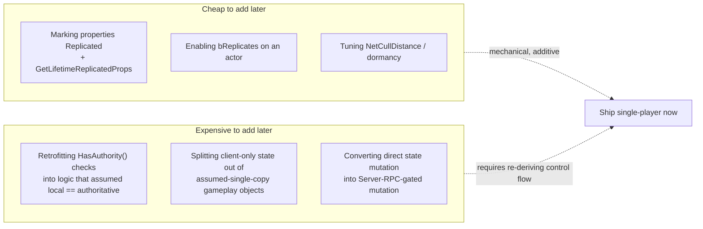

# Designing for later multiplayer

Most projects start single-player, or single-player-first with multiplayer as a maybe-someday. That's a
reasonable default — but Unreal's networking model punishes a specific kind of shortcut much harder than
most engines do: because a standalone game and a listen-server-with-one-client look identical from
inside the engine (every actor is `ROLE_Authority`, every RPC executes locally, `HasAuthority()` is
always true), code written without authority discipline works perfectly for months and then requires
real surgery — not a config flag — the day a second real client shows up. This doc is about which habits
cost nothing to keep now and which shortcuts you'll regret later.

## Why this matters

Everything else in this folder explains *how* Unreal's networking works. This doc is about a different
question: if you're not building multiplayer today, what should you still do, so that adding it later is
a feature addition instead of a rewrite? The answer isn't "build full networking support you don't need
yet" — that's wasted effort and premature complexity. It's a short list of structural habits that cost
nothing in a single-player build and save enormous pain if multiplayer ever gets added, plus an honest
accounting of what's cheap to retrofit and what genuinely isn't.

## Mental model



The cheap column is mechanical: it's turning on switches and filling in boilerplate on state that was
already structured correctly. The expensive column is a design problem: it requires figuring out, after
the fact, which of your existing single-player assumptions were actually "the local machine is
authoritative" assumptions in disguise — and that reasoning has to happen for every system that touches
gameplay state, not just the obviously networked ones.

## The mechanics

### Keep authority checks in place from day one

Even in a single-player build, gate state-changing logic behind `HasAuthority()` (see
[Network model and authority](./network-model-and-authority.md)). In a standalone game this check is
always true and costs nothing at runtime — but it forces you to keep asking "who is allowed to change
this?" as a live design question instead of an implicit assumption baked into call order. If multiplayer
gets added later, the actual behavior doesn't change; only the answer to "is this always true" does.

```cpp title="Costs nothing single-player, saves a rewrite later"
void AMyInventoryComponent::AddItem(const FItemHandle& Item)
{
    if (!GetOwner()->HasAuthority())
    {
        return; // always true in single-player; becomes load-bearing the day a client exists
    }

    Items.Add(Item);
    OnInventoryChanged.Broadcast();
}
```

The alternative — skipping the check because "there's no server yet" — means every state-changing
function in the codebase needs to be individually audited and retrofitted the day networking is added,
with no compiler help distinguishing which ones you already covered.

### Never assume the local client owns the state it's touching

A subtler version of the same discipline: don't write code that reads or writes a variable assuming "the
local machine's copy is the only copy that matters." In single-player this is invisible because there's
only one machine. The moment you add even a listen server, "the local machine" stops being a safe stand-
in for "the authoritative machine" for any client that isn't the host.

Concretely: prefer accessor functions and setter functions over direct member mutation on gameplay
objects, even in single-player code, so that adding an authority check or a Server RPC call later is a
one-function edit instead of a search-and-replace across every call site.

```cpp title="A setter seam, not direct field mutation"
// Cheap now, and the seam where a Server RPC gets inserted later:
void AMyCharacter::SetHealth(float NewHealth)
{
    Health = NewHealth;
    OnHealthChanged.Broadcast(Health);
}

// vs. code scattered across the project doing `Character->Health = X;` directly,
// which has no single point to add authority/replication logic later.
```

### Keep gameplay state in replicable containers

Store persistent gameplay state — health, inventory, currency, match progress — in `UPROPERTY`-visible
fields on `AActor` / `UActorComponent` / `AGameStateBase` / `APlayerState` classes, using types
replication already knows how to handle (primitives, `FString`/`FName`/`FText`, `UObject*` references to
other replicated actors, `TArray`/`TMap` of replicable types, or structs with a `NetSerialize`
implementation). Avoid parking gameplay state in places replication has no path to at all: static/global
variables, singletons outside the actor/subsystem hierarchy, or plain C++ containers owned by a
non-`UObject` class.

This isn't "add `Replicated` to everything now" — an unreplicated `UPROPERTY` costs nothing extra and
becomes replicable with one line and a `GetLifetimeReplicatedProps` entry later (see
[Actor and property replication](./actor-and-property-replication.md)). The point is narrower: make sure
the state lives somewhere that *can* replicate when the time comes, so the fix is "add `Replicated` and
register the property," not "find a home for this data inside the actor hierarchy for the first time."

### What's recoverable later, and what isn't

| Shortcut | Recoverable later? | Why |
|---|---|---|
| Not marking properties `Replicated` yet | Yes — cheap | Additive: mark the property, add it to `GetLifetimeReplicatedProps`. No control-flow change. |
| Not enabling `bReplicates` on an actor | Yes — cheap | One flag; relevancy/dormancy tuning is additive on top. |
| Skipping `HasAuthority()` checks entirely | No — expensive | Requires auditing every state-changing function in the codebase individually; no compiler signal for what you missed. |
| Storing gameplay state in a non-`UObject` singleton or global | No — expensive | Has to be moved into the actor/subsystem hierarchy before it can replicate at all — a structural relocation, not a flag. |
| Direct member mutation instead of setter functions | Partially — moderate | Every call site needs to be found and routed through a new seam; mechanical but large-surface-area work. |
| Not building an Online Subsystem / session layer | Yes — moderate | Direct-IP connect still works with zero session layer; adding sessions later is additive, not a rewrite of gameplay code. |
| Assuming a single instance of "the player" (no `PlayerState` array, no per-connection anything) | No — expensive | Multiplayer needs a `PlayerState` per connection and code that iterates players instead of assuming exactly one; this is a genuine architectural change, not a toggle. |

### A concrete single-player-first checklist

- Gate every function that changes persistent gameplay state behind `HasAuthority()`, even though it's
  always true today.
- Put gameplay state on `UPROPERTY` fields of actors/components/GameState/PlayerState, not in
  non-replicable containers.
- Prefer setter functions over direct field mutation for anything another system depends on.
- Don't assume exactly one player exists — even in single-player, structure player-facing state as "the
  state for player N" rather than baking in a single global player reference, if there's any realistic
  chance of co-op later.
- Leave `NetCullDistanceSquared` and dormancy at sane defaults rather than never thinking about them —
  they cost nothing to set correctly now and are annoying to retrofit across a large actor population
  later.

### What not to build prematurely

This discipline is not a license to build RPCs, replicated properties, or a Replication Graph subclass
into a project with no multiplayer on its roadmap. Speculative networking code is exactly the kind of
premature complexity that makes a single-player codebase harder to read for no current benefit. The
guidance in this doc is specifically about *structural* habits (authority checks, setter seams, where
state lives) that cost nothing today — not about implementing replication machinery you don't need yet.

## Gotchas

:::warning "It works in PIE" tells you almost nothing about multiplayer-readiness
A standalone or single-client PIE session makes `HasAuthority()` always true and every RPC a same-machine
call — code with no authority discipline at all will pass every test you're currently running. This is
precisely why the discipline has to be a habit, not something you verify by testing, until you actually
stand up a second client.
:::

:::caution Retrofitting authority checks later means re-deriving your own control flow
The expensive column above isn't expensive because the code is hard to write — it's expensive because
you have to re-establish, for every system, what "who's allowed to change this" should have meant all
along, often without the original context of why the code was written that way. Keeping the check in
from the start means that reasoning happens once, while you still remember it.
:::

:::warning A late "add multiplayer" pass tends to also uncover a UI/assumption backlog
Beyond the C++ gameplay logic, retrofitting multiplayer onto a single-player-first project usually also
surfaces UI code that assumed one local player, save systems that assumed one save slot maps to one
player, and input code that assumed one local controller. None of that is covered by this networking
folder, but it's worth flagging as part of the same "what did single-player-first quietly assume" audit.
:::

## See also

- [Network model and authority](./network-model-and-authority.md) — the specific check
  (`HasAuthority()`) this doc asks you to keep using from day one.
- [Actor and property replication](./actor-and-property-replication.md) — why "state lives in a
  replicable container" is a mechanical fix later, provided it's true now.
- [Dedicated servers and Online Subsystem](./dedicated-servers-and-online-subsystem.md) — the session
  layer that's genuinely fine to defer entirely.
- [Epic — Networking overview](https://dev.epicgames.com/documentation/unreal-engine/networking-overview-for-unreal-engine)
