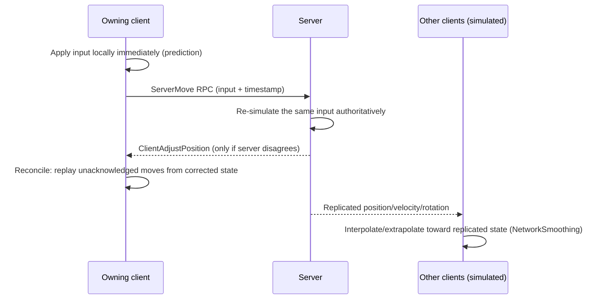

# Movement replication and prediction

If a networked character waited for a server round-trip before every step responded on screen, the game
would feel like it's running on satellite internet even on a good connection. `UCharacterMovementComponent`
exists to hide that latency: the owning client predicts its own movement immediately, the server
computes the authoritative result independently, and the two are reconciled — usually invisibly. This
is the most involved topic in this folder because it's solving a hard problem (make guessed and
authoritative state agree without visible snapping) rather than just moving bytes around.

## Why this matters

Movement is the highest-frequency, most latency-sensitive replicated state in almost any game — it's
also one of the few systems where Epic has already built the prediction/correction machinery for you.
Fighting `UCharacterMovementComponent`'s networking model (by manually setting locations, disabling
prediction without understanding what you're losing, or not knowing why a "smooth" correction sometimes
snaps) is one of the more common sources of janky networked movement. Understanding the three roles
involved — server authority, owning-client prediction, other-clients' simulation — explains why the same
component behaves differently depending on which machine is running it.

## Mental model



The owning client never waits for permission to move — it predicts immediately so input feels
instantaneous, then quietly corrects itself if the server's authoritative simulation disagrees. Other
clients never predict this character's movement at all; they just play back replicated state smoothly,
because a character they don't control has no local input to predict from.

## The mechanics

### Three roles, three behaviors

`UCharacterMovementComponent` behaves differently depending on the actor's net role (see
[Network model and authority](./network-model-and-authority.md)):

- **Server (`ROLE_Authority`)** — runs the real, final simulation. This is the version of events every
  client is ultimately reconciled against.
- **Owning client (`ROLE_AutonomousProxy`)** — runs **client-side prediction**: applies input locally and
  immediately, without waiting for the server, using the same movement code the server uses so the
  outcome should usually match.
  Records recent moves so it can replay them after a correction.
- **Other clients (`ROLE_SimulatedProxy`)** — run neither authoritative simulation nor prediction; they
  just interpolate/extrapolate the replicated transform and velocity toward what the server last sent.

### Client prediction data

The owning client's prediction state lives in `FNetworkPredictionData_Client_Character` (a
`FNetworkPredictionData_Client` subclass, constructed from the owning `UCharacterMovementComponent`). It
tracks, among other things, the timestamp of the current move being built (`CurrentTimeStamp`), the last
move the server acknowledged (`LastAckedMove`), and correction bookkeeping (`LastCorrectionTime`,
`LastCorrectionDelta`). The server side has a mirrored structure,
`FNetworkPredictionData_Server_Character`, which computes the effective delta time to use for each
incoming `ServerMove` (`GetServerMoveDeltaTime` / `GetBaseServerMoveDeltaTime`) — this is part of how the
server guards against a client claiming an implausibly large timestep to move farther than it should.

### The ServerMove / correction loop

Each frame, the owning client's movement component packages its input into a move, applies it locally
immediately (prediction), and sends it to the server via an internal `ServerMove`-family RPC (a `Server`,
`Unreliable` RPC under the hood — you don't normally write this call yourself, `CharacterMovementComponent`
owns it). The server re-runs the same movement logic authoritatively using the received input and its
own physics state. If the server's resulting position matches what the client predicted (within
tolerance), nothing more happens — the client was right, no correction needed, no extra traffic. If it
disagrees, the server sends a correction back to the client with the authoritative position/velocity;
the client snaps its simulation state to that correction and **replays** any of its own moves the server
hadn't yet acknowledged, so the corrected result still reflects the player's most recent input rather
than discarding it.

### Network smoothing for simulated proxies

Other clients don't predict this character at all — they receive replicated transform/velocity updates
at the network update rate and need to fill the gaps between updates so movement doesn't look like
discrete teleports. `ENetworkSmoothingMode` controls how: interpolating between the last two received
states, or extrapolating forward from the most recent one, trading off latency against overshoot risk
when the real trajectory changes direction between updates. This smoothing only applies to simulated
proxies — the owning client's own view of its pawn comes from its own prediction, not from smoothing
replicated data back to itself.

```cpp title="Tuning a Character's movement replication behavior"
AMyCharacter::AMyCharacter()
{
    UCharacterMovementComponent* Movement = GetCharacterMovement();

    Movement->NetworkSmoothingMode = ENetworkSmoothingMode::Exponential; // smooth simulated proxies
    Movement->SetNetworkMoveDataContainer(MoveDataContainer);           // only if extending move data, see below
    Movement->bUseClientSideCausesJumping = false;                      // just an example toggle, not universal advice
}
```

### Extending movement data for custom movement

If your movement logic needs to send additional data with each move beyond what
`UCharacterMovementComponent` already ships (a custom "is aiming" flag, an ability-driven speed
modifier), the supported extension points are `FCharacterNetworkMoveData` / `FCharacterMoveResponseData`
subclasses registered through a custom `FCharacterNetworkMoveDataContainer` — this lets you add fields to
the client-to-server move packet and the server-to-client correction packet without reimplementing the
whole prediction pipeline. This is the same mechanism the Gameplay Ability System's movement-affecting
abilities build on; see
[GAS replication and prediction](../10-gameplay-ability-system/gas-replication-and-prediction.md) if
you're layering ability-driven movement changes on top of `UCharacterMovementComponent`.

:::note
The precise 5.7 API shape of `FCharacterNetworkMoveDataContainer` (member names, override points) is not
fully confirmed against the sources consulted in this pass — treat the mention above as pointing you to
the right extension mechanism, and verify exact signatures against
`GameFramework/CharacterMovementComponent.h` in your installed engine before implementing custom move
data.
:::

### Root motion and networked movement

Root-motion-driven movement (from animation montages) has its own replication path layered on top of the
normal movement replication — the server needs to know a root motion montage is playing so its
authoritative simulation applies the same displacement the client's animation is producing, rather than
fighting it. This is a large enough topic on its own; see
[Montages and notifies](../07-animation/montages-and-notifies.md) for how root motion montages are
triggered, and treat root-motion networking as an area to test explicitly rather than assume works like
ordinary input-driven movement.

## Gotchas

:::warning[Don't set Actor location directly on a networked Character]
Calling `SetActorLocation` (or teleporting via `SetActorTransform`) on a `Character` bypasses the
movement component's prediction bookkeeping — the server and owning client's prediction states
desynchronize, producing a visible snap-back on the next correction. Use
`UCharacterMovementComponent`'s own teleport-aware entry points, or explicitly resynchronize prediction
state, instead of writing the transform directly.
:::

:::caution[A "smooth" correction can still look like a snap under bad conditions]
Network smoothing and prediction reconciliation reduce visible corrections under normal latency and
packet loss — they don't eliminate visible corrections entirely. High latency, high jitter, or a client
that mispredicts often (server and client movement logic diverging, e.g., from a custom movement mode
that isn't replicated consistently) will still show snapping. Don't treat occasional visible corrections
as evidence the whole system is broken; treat *frequent* ones as evidence client and server movement
logic have drifted apart.
:::

:::warning[Custom movement modes must run identically on client and server]
See [Custom movement modes](../05-input-and-movement/custom-movement-modes.md) — if your custom mode's
logic isn't deterministic given the same input and starting state on both client and server (for
example, it reads a value that isn't replicated, or depends on frame-rate-sensitive floating point in a
way the server's tick rate doesn't match), prediction will disagree constantly, producing frequent
visible corrections even under good network conditions.
:::

:::caution[Simulated proxies never run gameplay logic tied to movement]
Code that assumes `Tick`-time movement-component callbacks (like landing/falling events) fire
identically on a simulated proxy as they do on the owning client or server is a common source of "this
works for me, not for other players" — a simulated proxy is only replaying interpolated transforms, not
running the actual movement simulation that produces those events authoritatively.
:::

## See also

- [Network model and authority](./network-model-and-authority.md) — the role model
  (`ROLE_AutonomousProxy` vs `ROLE_SimulatedProxy`) this entire prediction scheme is built on.
- [Actor and property replication](./actor-and-property-replication.md) — the lower-level mechanism
  movement replication is layered on top of for non-Character actors.
- [Custom movement modes](../05-input-and-movement/custom-movement-modes.md) — where custom movement
  logic has to satisfy the same client/server determinism this doc describes.
- [Epic — Character movement component](https://dev.epicgames.com/documentation/unreal-engine/API/Runtime/Engine/GameFramework/UCharacterMovementComponent)
