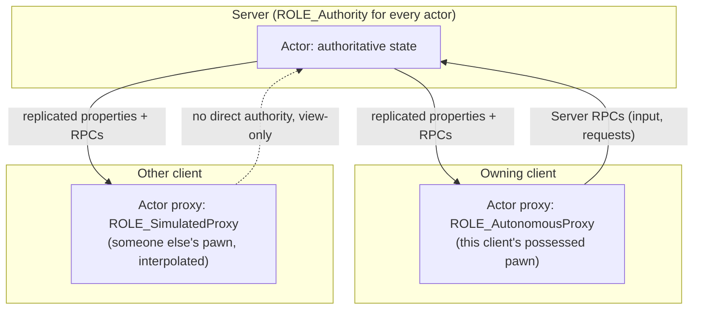

# Network model and authority

Every networking bug in Unreal traces back to one question: which machine actually owns this piece of
state? If you don't have a firm answer before you write the code that changes it, you'll ship logic
that works perfectly in Play-In-Editor with one client and falls apart the moment a real client and
server disagree about the game state. Authority isn't a performance detail you bolt on later — it's the
axis every other topic in this folder (replication, RPCs, prediction) is built on top of.

## Why this matters

Unreal's networking model is **server-authoritative**: the server's copy of the world is the only copy
that counts. Clients hold approximations of it — proxies, predictions, interpolations — but never the
truth. Code that reads or writes gameplay state without checking who has authority tends to work by
accident in single-player and PIE testing (where the local machine happens to *be* the server) and then
silently desyncs, gets overwritten, or opens a cheating vector the moment you add a second real client.
Understanding `ENetRole` and `HasAuthority()` up front is cheaper than debugging "why did the enemy
teleport back" three months into a project.

## Mental model

Unreal's client-server topology has exactly one server and any number of clients (a listen server is
just a client and a server occupying the same process). The server owns every actor's authoritative
state; each client receives a *replica* of the actors relevant to it, and one of those replicas — the
pawn the client currently controls — gets extra privileges to predict its own movement ahead of the
server.



The server never trusts a client's copy of anything. A client can *request* a change (via a Server RPC)
and can *predict* the outcome locally for responsiveness, but the server always recomputes and
broadcasts the real result. If client and server prediction disagree, the client is corrected — never
the other way around.

## The mechanics

### ENetRole and what each value means

Every `AActor` carries two role fields, because "my role" and "the role of the actor across the
connection" are different questions once you're not the server:

- `GetLocalRole()` — this machine's relationship to the actor.
- `GetRemoteRole()` — the role the *other* side of the connection has for the same actor.

`ENetRole` has three meaningful values:

| Role | Meaning |
|---|---|
| `ROLE_Authority` | This machine is the server, or this actor was spawned locally with no owning connection (offline/listen-server-local actors). This copy is the source of truth. |
| `ROLE_AutonomousProxy` | This is a client's copy of an actor *that client possesses/controls*. It's allowed to run client-side prediction (movement input, ability activation) ahead of the server. |
| `ROLE_SimulatedProxy` | This is a client's copy of an actor it does **not** control. It only receives replicated state and interpolates/extrapolates it — it never runs authoritative gameplay logic. |

A dedicated server sees every actor as `ROLE_Authority` locally, and `ROLE_AutonomousProxy` or
`ROLE_SimulatedProxy` as the *remote* role depending on whether that actor is possessed by the
connection it's replicating to. A client sees at most one actor (its possessed pawn) as
`ROLE_AutonomousProxy` locally, and every other replicated actor as `ROLE_SimulatedProxy`.

### HasAuthority() — the check you actually use

`AActor::HasAuthority()` is a convenience wrapper that answers "is this the server's copy of this
actor?" — it's `GetLocalRole() == ROLE_Authority`, with a nuance: it also accounts for actors that exist
without a network connection at all (single-player, or actors not set to replicate), so it's the correct
check in effectively every case where you'd be tempted to compare `GetLocalRole()` by hand.

```cpp title="Gate a state-changing function behind authority"
void AMyWeapon::ApplyDamageToTarget(AActor* Target, float Amount)
{
    if (!HasAuthority())
    {
        // Never mutate gameplay state on a client's copy — the server will
        // replicate the real result back down.
        return;
    }

    UGameplayStatics::ApplyDamage(Target, Amount, GetInstigatorController(), this, nullptr);
}
```

The rule of thumb: **anything that changes gameplay state — health, inventory, score, world objects —
runs behind `HasAuthority()`.** Anything that's purely cosmetic (a muzzle flash, a sound cue, a camera
shake) can run on whichever machine is asking for it, because getting it wrong costs you nothing but a
visual glitch.

### "The server is truth" in practice

This shows up as a few concrete rules:

- A client can request an action (fire a weapon, open a door) via a Server RPC, but the server decides
  whether it actually happens — validating cooldowns, ammo, range, and permissions again on its own
  authoritative state. Never trust a client-supplied outcome, only a client-supplied *intent*.
- A client's local prediction (see
  [Movement replication and prediction](./movement-replication-and-prediction.md)) is a guess that gets
  silently corrected if the server disagrees. The player should rarely notice the correction, but the
  server's answer always wins.
- Simulated proxies (other players' pawns, AI-controlled actors on a client) never run authoritative
  gameplay logic locally at all — they just play back what the server tells them.

### Listen servers and standalone games

A listen server is a server that also renders and controls a local player — that local player's pawn is
`ROLE_Authority` *and* effectively also treated as the locally-controlled pawn, without the round trip a
remote client needs. A standalone (non-networked) game has no remote connections at all; every actor is
`ROLE_Authority` and `HasAuthority()` is always true, which is exactly why authority bugs hide so well
until you test with a real dedicated server and a second client.

```cpp title="Checking role directly when you need to distinguish autonomous from simulated"
void AMyCharacter::Tick(float DeltaSeconds)
{
    Super::Tick(DeltaSeconds);

    switch (GetLocalRole())
    {
    case ROLE_Authority:
        // Server's authoritative copy (or a standalone game).
        break;
    case ROLE_AutonomousProxy:
        // This client's own possessed pawn — safe to predict input here.
        break;
    case ROLE_SimulatedProxy:
        // Someone else's pawn on this client — display only, never predict.
        break;
    default:
        break;
    }
}
```

## Gotchas

:::warning[PIE with one client hides authority bugs]
Play-In-Editor with a single client (or "Play as Listen Server" with one player) often makes
`HasAuthority()` true everywhere you test, because the local machine is both client and server. Test
with **at least two clients and a dedicated server** (`-server` / a separate PIE client count) before
trusting that authority-gated code actually works.
:::

:::caution[Don't confuse "owns the connection" with "has authority"]
`GetLocalRole() == ROLE_AutonomousProxy` means "I am this client's possessed pawn," not "I am allowed to
change gameplay state." Only the server (`ROLE_Authority`) is allowed to mutate authoritative state.
Client-owned prediction only ever *previews* what the server will decide.
:::

:::warning[HasAuthority() on a component doesn't ask the component]
`UActorComponent` has no independent role — its `GetOwnerRole()` / authority checks defer to the owning
actor's role. Don't expect a component to have a different authority state than the actor that owns it.
:::

:::note
Whether `HasAuthority()` and `GetLocalRole()` differ in behavior on a Net Mode of `NM_ListenServer` vs
`NM_DedicatedServer` in edge cases (e.g., very early in an actor's replication lifecycle) was not
confirmed in the sources consulted — verify against your engine version if you gate logic on `GetNetMode()`
directly rather than `HasAuthority()`.
:::

## See also

- [Actor and property replication](./actor-and-property-replication.md) — how state actually crosses
  the wire once you know who's allowed to change it.
- [Remote procedure calls](./remote-procedure-calls.md) — how a client asks the server to act, and how
  the server tells clients what happened.
- [Designing for later multiplayer](./designing-for-later-multiplayer.md) — keeping authority checks in
  place even in a single-player-first project.
- [Epic — Networking overview](https://dev.epicgames.com/documentation/unreal-engine/networking-overview-for-unreal-engine)

