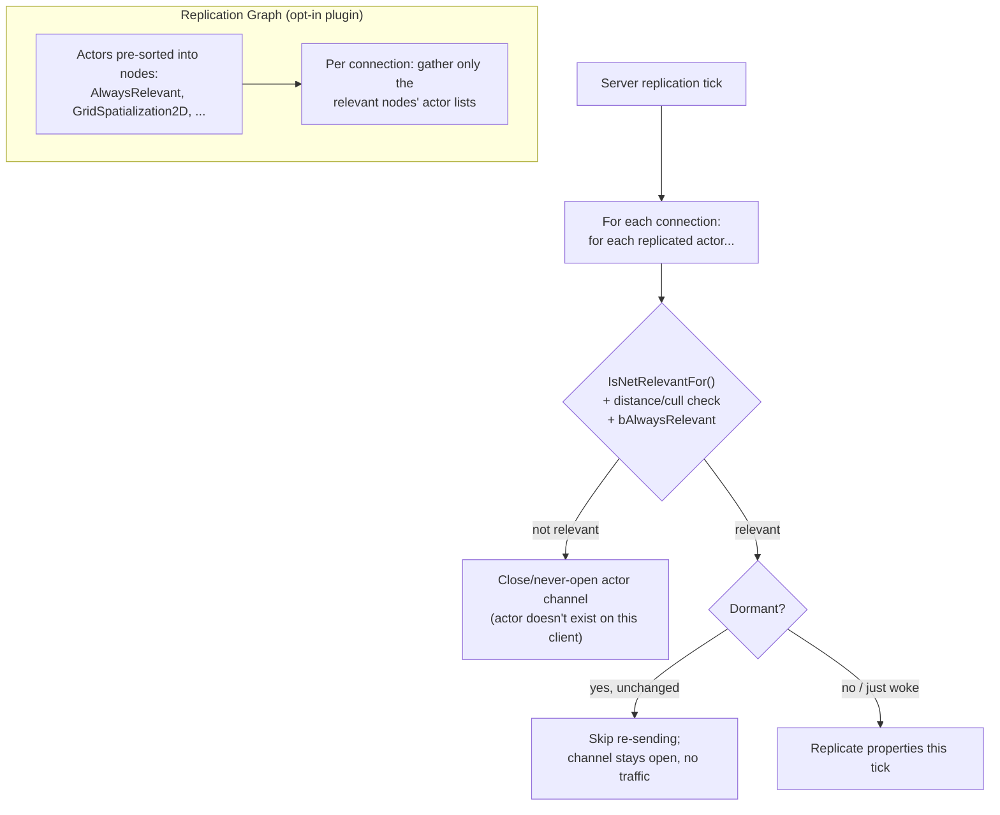

# Relevancy and Replication Graph

The default replication path re-evaluates, for every connection, whether every replicated actor is still
relevant — every tick. That's fine for a handful of players and a modest actor count; it's a scaling
wall for anything with hundreds of players or thousands of replicated actors, which is exactly why Epic
built the Replication Graph as a drop-in replacement for the relevancy pass on large-scale projects
(most famously Fortnite). You don't need it for a small co-op game, but you do need to understand
relevancy and dormancy either way, because they decide whether an actor exists on a client at all.

## Why this matters

An actor being `bReplicates = true` says nothing about whether any given client actually receives it —
relevancy is the gate that decides that, per connection, continuously. Misunderstanding relevancy
produces two opposite failure modes: actors that should be visible to a client never show up (you didn't
mark something always-relevant that needed to be), or a project's network traffic scales terribly
because far more actors than necessary are being evaluated and sent to every connection (you didn't cull
anything). The Replication Graph exists because the default per-actor, per-connection relevancy check is
itself an O(actors × connections) cost that becomes the bottleneck before your gameplay does.

## Mental model



Default relevancy is a per-connection *query* run against every actor, every tick. The Replication Graph
inverts this: actors are placed into nodes once (a spatial grid cell, an always-relevant list, a
per-connection-owner list), and building a connection's replication set becomes "gather the actors
already sitting in the nodes relevant to this connection's position" instead of "ask every actor if it's
relevant to this connection."

## The mechanics

### Default relevancy

Relevancy without the Replication Graph is governed by a few knobs on `AActor`:

- `bAlwaysRelevant` — the actor is relevant to every connection regardless of distance (game state, most
  HUD-driving actors).
- `bOnlyRelevantToOwner` — the actor is relevant only to the connection that owns it (a player's private
  inventory actor, for instance).
- `NetCullDistanceSquared` — beyond this squared distance from the connection's viewpoint, the actor is
  considered not relevant. Set via the `NetCullDistance` config/editor property (stored squared
  internally).
- `IsNetRelevantFor(const AActor* RealViewer, const AActor* ViewTarget, const FVector& SrcLocation)` —
  override this for custom relevancy logic (line-of-sight checks, gameplay-specific visibility rules)
  beyond simple distance culling.

```cpp title="Overriding relevancy for a custom rule"
bool AMyStealthPickup::IsNetRelevantFor(const AActor* RealViewer, const AActor* ViewTarget,
                                          const FVector& SrcLocation) const
{
    if (!Super::IsNetRelevantFor(RealViewer, ViewTarget, SrcLocation))
    {
        return false;
    }

    return !bHiddenFromEnemyTeam || IsOnSameTeam(RealViewer);
}
```

An actor channel is opened for a connection the first tick it becomes relevant, and closed when it stops
being relevant (or the actor is destroyed) — relevancy is re-evaluated continuously by default, not just
once at spawn.

### Net Cull Distance

`NetCullDistanceSquared` is the primary lever for keeping distant actors off the wire in an open-world
or large-map game. It's a blunt distance check against the viewer's location, cheap to evaluate, and the
first thing to tune before reaching for anything heavier — most projects get most of their savings from
setting sane cull distances on background/decorative replicated actors before ever touching the
Replication Graph.

### Dormancy — stop re-sending state that isn't changing

Dormancy (`NetDormancy` on `AActor`, values like `DORM_Awake`, `DORM_DormantAll`) lets an actor's channel
stay open on a connection **without** the server re-checking and re-sending its properties every tick,
for actors whose state is currently static. A dormant actor still exists on the client (unlike an
irrelevant one, which doesn't exist there at all) — dormancy just suppresses the ongoing replication
work until something wakes it.

```cpp title="Marking an actor dormant until it changes"
AMyStaticTurret::AMyStaticTurret()
{
    NetDormancy = DORM_DormantAll; // don't re-evaluate/re-send while idle
}

void AMyStaticTurret::OnTargetAcquired()
{
    // Something changed — wake it so the change actually replicates.
    FlushNetDormancy();
}
```

Forgetting to call `FlushNetDormancy()` (or `SetNetDormancy(DORM_Awake)`) after changing a dormant
actor's state is a common cause of "I changed the property but the client never got it" — dormancy
suppresses replication at the actor level, above and independent of whether the specific property is
correctly registered in `GetLifetimeReplicatedProps`.

### The Replication Graph plugin

`ReplicationGraph` is an Epic-provided plugin (not enabled by default) that replaces the per-actor,
per-connection relevancy query with a node-based model:

- `UReplicationGraph` — the overall manager; a project subclasses it to define how actors are routed
  into nodes.
- `UReplicationGraphNode_AlwaysRelevant` — a node holding actors that are relevant to every connection
  (mirrors `bAlwaysRelevant`, but evaluated once per node rather than per actor).
- Spatialization nodes (grid-based nodes that bucket actors by world position) — a connection only needs
  to gather nodes near its viewer's grid cell instead of testing every actor in the level.
- `UNetReplicationGraphConnection` — the per-connection state the graph uses to track what that
  connection has already been given.

Actors are assigned to nodes once (typically on spawn, via the project's `UReplicationGraph` subclass
routing logic based on actor class), and building a connection's replication list becomes a matter of
walking the small set of nodes relevant to that connection rather than testing the entire actor
population. This is what makes it scale to player counts and actor counts where the default relevancy
loop becomes the bottleneck.

```cpp title="Skeleton of a project ReplicationGraph subclass"
UCLASS()
class MYGAME_API UMyReplicationGraph : public UReplicationGraph
{
    GENERATED_BODY()

public:
    virtual void InitGlobalActorClassSettings() override;
    virtual void InitGlobalGraphNodes() override;
    virtual void RouteAddNetworkActorToNodes(const FNewReplicatedActorInfo& ActorInfo,
                                              FGlobalActorReplicationInfo& GlobalInfo) override;
};
```

:::note
The exact virtual functions and class routing API surface for a `UReplicationGraph` subclass are project-
and version-specific and go well beyond what a general orientation doc can responsibly template — the
skeleton above shows the shape of the extension points confirmed via the plugin's class list, not a
complete working implementation. Treat Epic's `ReplicationGraph` plugin source and the
`ShooterGame`/`Fortnite`-style sample implementations as the real reference before writing a production
subclass.
:::

### When to reach for it

The Replication Graph is a meaningful engineering investment — it changes how actors are registered and
requires a project-specific subclass. Reach for it when profiling (see server-side network profiling
tools, not covered in this doc) shows relevancy evaluation itself, not gameplay logic, dominating server
frame time — typically at player/actor counts well beyond a small co-op or small-arena shooter. For most
projects, tuning `NetCullDistanceSquared`, `bAlwaysRelevant`, and dormancy correctly on the default
relevancy path covers the problem.

## Gotchas

:::warning An irrelevant actor doesn't exist on the client — not "exists but empty"
Code on a client that assumes a replicated actor reference is always valid because "it's replicated"
will null-deref or silently no-op the moment that actor stops being relevant and its channel closes.
Guard client-side access to replicated actor references the same way you'd guard any pointer that can
legitimately be null.
:::

:::caution Dormancy silently swallows changes if you forget to wake the actor
`NetDormancy = DORM_DormantAll` with no corresponding `FlushNetDormancy()` call at the point of change is
a very easy way to write an actor that updates correctly on the server and never reaches any client.
:::

:::warning The Replication Graph is an architecture change, not a config toggle
Enabling the plugin without writing a project-specific `UReplicationGraph` subclass that actually routes
your actor classes into nodes will not replicate your actors correctly by default — it replaces the
relevancy system's plumbing, and a project must tell it how your actors should be bucketed.
:::

## See also

- [Actor and property replication](./actor-and-property-replication.md) — what relevancy gates access
  to: actor channels and the properties that flow through them.
- [Dedicated servers and Online Subsystem](./dedicated-servers-and-online-subsystem.md) — the server
  configuration context relevancy and Replication Graph tuning both live in.
- [Designing for later multiplayer](./designing-for-later-multiplayer.md) — why cull distances and
  dormancy are cheap to set correctly from day one, unlike a Replication Graph migration.
- [Epic — Relevancy for networking](https://dev.epicgames.com/documentation/unreal-engine/relevancy-for-networking-in-unreal-engine)
