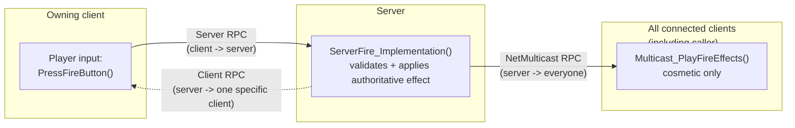

# Remote procedure calls

Replicated properties are good at "this value changed and stays changed." They're the wrong tool for
"this happened once" — a gunshot, a hit reaction, a chat message. Remote procedure calls (RPCs) are
Unreal's mechanism for that: a function call whose *invocation* crosses the network instead of a
property's *state*. Picking the wrong RPC type (or forgetting who's allowed to call it) is one of the
most common sources of "it works for me but not for other players" bugs.

## Why this matters

RPCs are the only way a client can ask the server to do something, and the only way the server can push
a one-off event down to specific clients without wrapping it in a replicated property and a RepNotify.
Get the direction wrong — call a `Server` function from a client that doesn't own the actor, or call a
`Client` function meant for one player as if it broadcasts to everyone — and the call either silently
fails or does something you didn't intend, because Unreal enforces caller/executor rules per RPC type
rather than treating every UFUNCTION the same.

## Mental model



A `Server` RPC only ever travels client-to-server. A `Client` RPC only ever travels server-to-one-client
(specifically, the client that owns the actor the function is called on). A `NetMulticast` RPC travels
server-to-all-clients-plus-locally. There's no RPC type that goes client-to-client — a client that wants
to affect another client's game always routes through the server first.

## The mechanics

### The three RPC directions

Every RPC is declared with a `UFUNCTION` specifier that fixes both who may call it and where it runs:

| Specifier | Caller | Executes on |
|---|---|---|
| `Server` | The client that owns the actor (or the server itself, which just calls it locally) | The server |
| `Client` | The server | The specific client that owns the actor |
| `NetMulticast` | The server (by convention — client calls are technically possible but almost never what you want) | The server itself, and every client currently relevant to the actor |

```cpp title="MyWeapon.h — declaring all three directions"
UCLASS()
class MYGAME_API AMyWeapon : public AActor
{
    GENERATED_BODY()

public:
    void RequestFire(); // plain C++ entry point called from input handling

protected:
    UFUNCTION(Server, Reliable, WithValidation)
    void ServerFire();

    UFUNCTION(Client, Reliable)
    void ClientNotifyOutOfAmmo();

    UFUNCTION(NetMulticast, Unreliable)
    void MulticastPlayFireEffects();

    UPROPERTY(Replicated)
    int32 AmmoCount = 30;
};
```

```cpp title="MyWeapon.cpp"
void AMyWeapon::RequestFire()
{
    // Called on whichever client owns this weapon; routes to the server.
    ServerFire();
}

bool AMyWeapon::ServerFire_Validate()
{
    return true; // see "WithValidation" below — cheap sanity check only
}

void AMyWeapon::ServerFire_Implementation()
{
    if (AmmoCount <= 0)
    {
        ClientNotifyOutOfAmmo();
        return;
    }

    --AmmoCount; // replicates to everyone via the normal property path
    MulticastPlayFireEffects();
}

void AMyWeapon::ClientNotifyOutOfAmmo_Implementation()
{
    // Runs only on the owning client — safe to touch that player's HUD here.
}

void AMyWeapon::MulticastPlayFireEffects_Implementation()
{
    // Runs on the server and every relevant client — cosmetic only, never
    // gameplay-affecting, since a NetMulticast body executes unconditionally.
    // Spawn muzzle flash particle system, play fire sound, etc.
}
```

### _Implementation and _Validate — why the compiler wants two functions

The Unreal Header Tool generates the actual dispatch machinery for an RPC and expects your logic split
into suffixed functions: declare `ServerFire()` in the header, but define `ServerFire_Implementation()`
(the real body) and, if `WithValidation` is present, `ServerFire_Validate()` (the sanity check) in the
`.cpp`. Calling `ServerFire()` from code still works — UHT generates that entry point to route the call
across the network and then invoke `_Implementation` on the receiving side.

### WithValidation — rejecting a malicious or malformed call

`WithValidation` adds a `_Validate` function that returns `bool` and runs **before** `_Implementation`,
on the receiving side, before any gameplay effect happens. If it returns `false`, Unreal disconnects the
calling client — treat it as a first line of defense against a modified client sending calls it
shouldn't be able to send (out-of-range parameters, a value outside a plausible bound), not as your only
validation. `_Validate` is required whenever a `Server` RPC accepts parameters you cannot otherwise
trust; it's optional for parameterless calls but still commonly added for consistency.

```cpp title="A validated Server RPC that rejects an implausible parameter"
UFUNCTION(Server, Reliable, WithValidation)
void ServerSetAimPitch(float NewPitch);

bool AMyWeapon::ServerSetAimPitch_Validate(float NewPitch)
{
    return FMath::IsWithin(NewPitch, -90.f, 90.f);
}

void AMyWeapon::ServerSetAimPitch_Implementation(float NewPitch)
{
    AimPitch = NewPitch;
}
```

Returning `false` from `_Validate` is a strong signal — it's treated as evidence of a hacked or broken
client and can close the connection, so reserve it for "this parameter is impossible," not "this action
isn't allowed right now" (use an ordinary early-return in `_Implementation` for the latter, since a
legitimate client can hit that path through normal lag or race conditions).

### Reliable vs Unreliable

Every RPC must specify one:

- `Reliable` — guaranteed delivery, retransmitted until acknowledged, and delivered in order relative to
  other reliable calls on the same actor. Use for anything that must happen exactly once: firing logic,
  state transitions, anything gameplay-affecting.
- `Unreliable` — best effort, may be dropped under packet loss or congestion, no retransmission. Use for
  high-frequency cosmetic calls where losing one occurrence doesn't matter (a per-shot muzzle flash that
  fires several times a second is fine to lose occasionally).

:::warning[Reliable RPCs are not free]
Overusing `Reliable` for high-frequency calls (anything called every tick, or many times a second) can
saturate the reliable channel, which then **stalls other reliable traffic on the same connection**
behind it. Reserve `Reliable` for infrequent, must-happen events, and use `Unreliable` (or a replicated
property instead of an RPC entirely) for anything high-frequency.
:::

### Who is allowed to call what

- A `Server` RPC can only be called from the client that owns the actor it's declared on (or from the
  server itself). Calling it from a client that doesn't own the actor is discarded — it never reaches
  the server.
- A `Client` RPC can only be usefully called by the server, and only reaches the one client that owns
  the actor; it's a no-op if the actor currently has no owning connection.
- `NetMulticast` calls the function on the server and on every client the actor is currently relevant
  to — a client that isn't relevant yet (see
  [Relevancy and Replication Graph](./relevancy-and-replication-graph.md)) simply never gets that
  occurrence, which is expected, not a bug.

### RPCs on components vs actors

RPCs can be declared on `UActorComponent` subclasses the same way as on actors — the routing still
follows the *owning actor's* connection and ownership, not the component's. A `Server` RPC on a
component only works if the component's owning actor has an owning connection set up correctly (see
[Actor and property replication](./actor-and-property-replication.md#actor-owner-and-netconnection)).

## Gotchas

:::warning[A Server RPC from a client that doesn't own the actor silently does nothing]
There's no error, no log by default — the call just never reaches the server. If a "server call isn't
working," check `GetOwner()` / the actor's owning connection before suspecting the RPC plumbing itself.
:::

:::caution[NetMulticast run on everyone, including whoever triggered it]
A `NetMulticast` RPC executes on the server too, and on the calling client if that client is also
relevant to the actor — don't double-apply a cosmetic effect by also playing it locally before calling
the multicast.
:::

:::warning[_Validate failing disconnects the client]
Treat a `_Validate` failure as "this client is misbehaving," not "this input was invalid right now." Use
plain conditionals inside `_Implementation` for ordinary rejected actions (on cooldown, out of range at
the moment the server checks) so a legitimate but laggy client isn't kicked for a race condition.
:::

:::caution[RPC parameters are serialized like replicated properties]
Large payloads (big arrays, full `FString` blobs) sent as RPC parameters cost bandwidth per call, same
as a replicated property. Keep RPC parameter lists small — pass IDs/indices and look up the rest locally
rather than shipping large structures over an RPC.
:::

## See also

- [Network model and authority](./network-model-and-authority.md) — why a `Server` RPC exists at all
  instead of the client just changing state directly.
- [Actor and property replication](./actor-and-property-replication.md) — the property-based alternative
  for anything that's a persistent state change rather than a one-off event.
- [Movement replication and prediction](./movement-replication-and-prediction.md) — `UCharacterMovementComponent`'s
  own specialized use of Server RPCs for move requests.
- [Epic — RPCs in Unreal Engine](https://dev.epicgames.com/documentation/unreal-engine/rpcs-in-unreal-engine)

