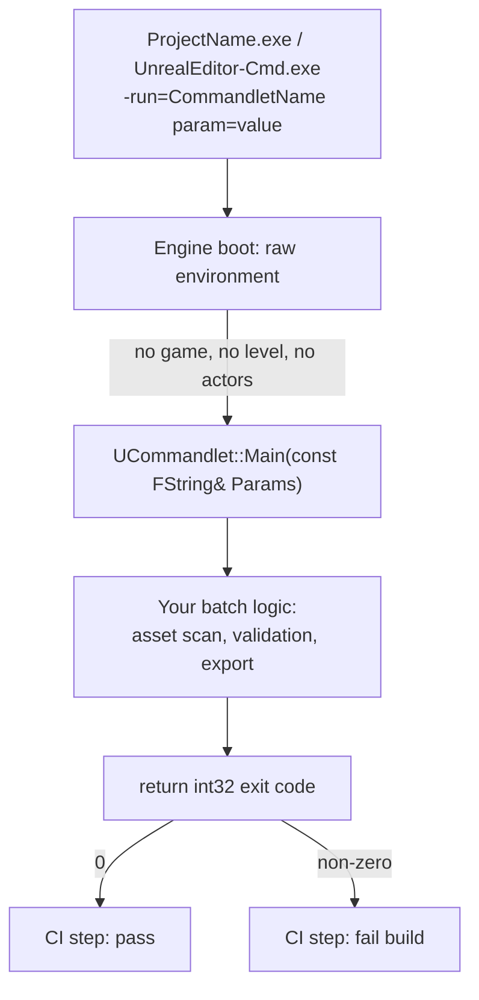

# Commandlets and automation

Everything covered so far in this folder — Details customizations, factories, Editor Utility Widgets —
assumes a human is sitting at the editor, clicking things. A `UCommandlet` is the opposite shape: a
batch operation you invoke from the command line, with no viewport, no actors, no game running, meant
to be called by a script, a build step, or a CI pipeline rather than a person. It's how "validate every
asset in the project" or "cook this content and fail the build if it errors" becomes a repeatable,
scriptable step instead of a manual editor task someone has to remember to run before every release.

## Why this matters

CI pipelines and release processes need operations that run unattended, exit with a meaningful code, and
don't require a graphical session. Commandlets are Epic's own answer for this inside the engine itself
— the cook process (`UCookCommandlet`), localization gathering (`UGatherTextFromAssetsCommandlet`), and
shader library packaging all ship as commandlets, invoked the same way your own custom ones are. Writing
project-specific commandlets — "validate that every `UMyWeaponDefinition` asset has a non-zero damage
value," "regenerate a data table from a CSV, gate the build if it fails" — gets you the same properties:
scriptable, exits with a pass/fail code, runs headless on a build agent that has no display attached.

## Mental model



Epic's own `UCommandlet` reference is explicit about the execution environment: commandlets run in "a
raw environment without the game, client code, or levels loaded, and no actors present." That's the
key mental adjustment coming from normal gameplay code — you don't have a `UWorld` with actors ticking,
you have the engine's core systems (asset registry, `UObject` reflection, config system) and whatever you
explicitly load yourself.

## The mechanics

### UCommandlet and Main

Every commandlet overrides `Main`, documented consistently across Epic's built-in commandlets
(`UCookCommandlet`, `UGatherTextFromAssetsCommandlet`, `UShaderCodeLibraryToolsCommandlet`) with the same
signature: `virtual int32 Main(const FString& Params)`. `Params` is the raw command-line string after
the commandlet name; you parse it yourself, typically with `UCommandlet::ParseCommandLine` or
`FParse::Value`.

```cpp title="ValidateWeaponDefinitionsCommandlet.h"
UCLASS()
class MYTOOLEDITOR_API UValidateWeaponDefinitionsCommandlet : public UCommandlet
{
    GENERATED_BODY()

public:
    virtual int32 Main(const FString& Params) override;
};
```

```cpp title="ValidateWeaponDefinitionsCommandlet.cpp"
int32 UValidateWeaponDefinitionsCommandlet::Main(const FString& Params)
{
    TArray<FString> Tokens;
    TArray<FString> Switches;
    TMap<FString, FString> ParamsMap;
    ParseCommandLine(*Params, Tokens, Switches, ParamsMap);

    const bool bFailOnWarning = Switches.Contains(TEXT("FailOnWarning"));

    IAssetRegistry& AssetRegistry =
        FModuleManager::LoadModuleChecked<FAssetRegistryModule>("AssetRegistry").Get();

    TArray<FAssetData> WeaponAssets;
    AssetRegistry.GetAssetsByClass(UMyWeaponDefinition::StaticClass()->GetClassPathName(), WeaponAssets);

    int32 NumErrors = 0;
    for (const FAssetData& AssetData : WeaponAssets)
    {
        UMyWeaponDefinition* Weapon = Cast<UMyWeaponDefinition>(AssetData.GetAsset());
        if (!Weapon)
        {
            continue;
        }
        if (Weapon->BaseDamage <= 0.f)
        {
            UE_LOG(LogTemp, Error, TEXT("Weapon %s has non-positive BaseDamage"), *Weapon->GetName());
            ++NumErrors;
        }
    }

    UE_LOG(LogTemp, Display, TEXT("Validated %d weapon definitions, %d errors"),
        WeaponAssets.Num(), NumErrors);

    return NumErrors > 0 ? 1 : 0; // non-zero exit code fails the CI step
}
```

### Naming and discovery

`ucc.exe`-style invocation (or the modern `-run=` flag) matches by name, and — per Epic's own
documentation — automatically appends `Commandlet` to the name if there's no exact match, so
`-run=ValidateWeaponDefinitions` resolves to `UValidateWeaponDefinitionsCommandlet` without typing the
suffix. The class must live in a module loaded at the point the commandlet is invoked — commonly an
`Editor`-typed module, since most commandlets need editor-only systems (asset registry queries over
unbuilt content, cooking, asset validation).

### Invoking from the command line

```bash
# Editor-hosted commandlet, project-relative invocation
UnrealEditor-Cmd.exe "D:/Projects/MyGame/MyGame.uproject" -run=ValidateWeaponDefinitions -FailOnWarning

# Built-in cook commandlet, for comparison — same -run= mechanism
UnrealEditor-Cmd.exe "D:/Projects/MyGame/MyGame.uproject" -run=Cook -TargetPlatform=WindowsNoEditor
```

```bash
# CI step: fail the pipeline on non-zero exit code
UnrealEditor-Cmd.exe "$PROJECT_PATH" -run=ValidateWeaponDefinitions -FailOnWarning -unattended -nopause
if [ $? -ne 0 ]; then
    echo "Weapon definition validation failed"
    exit 1
fi
```

`-unattended` suppresses dialogs that would otherwise block waiting for input from a display that
doesn't exist on a build agent; `-nopause` skips the "press any key" prompt some commandlet paths leave
on exit.

### Build.cs and module placement

```csharp title="MyToolEditor.Build.cs (excerpt)"
PrivateDependencyModuleNames.AddRange(new string[]
{
    "UnrealEd",       // UCommandlet base class
    "AssetRegistry",
    "AssetTools",
});
```

`UCommandlet` itself is declared in the `Engine` module (per Epic's API reference, under
`Runtime/Engine`), but most *useful* commandlet base classes and the systems they need
(`UEditorEngine`, asset registry population from unbuilt content, cook infrastructure) are editor-only
in practice — so project commandlets almost always end up living in an `Editor`-typed module regardless
of where the base `UCommandlet` class itself is declared.

### Parsing switches vs. key-value parameters

`ParseCommandLine` splits the raw `Params` string into three buckets, and it's worth being deliberate
about which one you use for what: `Tokens` are bare positional arguments, `Switches` are flags with no
value (`-FailOnWarning`, `-unattended`) — note that a `key=value` pair also lands in `Switches` as the
raw `"key=value"` string as well as in `ParamsMap`, so checking `Switches.Contains` on something that's
actually a key-value pair is a common off-by-one bug — and `ParamsMap` is the parsed `key=value` map.
Prefer `FParse::Value(*Params, TEXT("TargetPlatform="), OutValue)` for individual key lookups when you
don't need the full tokenized breakdown.

```cpp title="Reading a key=value parameter defensively"
FString TargetPlatform;
if (!FParse::Value(*Params, TEXT("TargetPlatform="), TargetPlatform))
{
    UE_LOG(LogTemp, Error, TEXT("Missing required -TargetPlatform= argument"));
    return 1;
}
```

## Gotchas

:::warning There is no UWorld, no actors, no viewport — don't assume gameplay systems are up
Code paths that assume `GetWorld()` returns something meaningful, or that a `GameInstance` exists, will
either return null or crash inside a commandlet. Stick to asset-registry, `UObject`-reflection, and
config-level operations unless you've explicitly loaded a world yourself.
:::

:::warning Exit code is your CI contract — don't let an exception mid-Main lose it
If `Main` needs to signal failure, return a non-zero `int32` deliberately; don't rely on a crash or
`check()` failure to communicate a validation failure, because a hard crash can leave the process exit
code ambiguous to the calling script depending on platform and crash-reporter configuration. Catch what
you can, log, and return an explicit non-zero value on the failure path shown above.
:::

:::caution Commandlets are excluded from some module Types
Recall from [Editor-only modules](./editor-modules.md) that `RuntimeNoCommandlet` and
`EditorNoCommandlet` are real `Type` values specifically meant to exclude a module from commandlet
execution. If a commandlet you write depends on a module typed that way, it won't load in the commandlet
context — check the `Type` of every dependency, not just your own commandlet's module, when a
commandlet run fails to find a class or subsystem that works fine in the normal editor.
:::

:::caution Long-running commandlets still need to tick the engine loop themselves
A commandlet's `Main` runs to completion and then the process exits — there's no implicit per-frame tick
the way there is in a running editor or game. If your commandlet does something that depends on deferred
work (asynchronous asset loading, streaming), you're responsible for pumping whatever wait/poll loop is
needed before reading the result, rather than assuming it "just happens" between statements.
:::

## See also

- [Editor-only modules](./editor-modules.md) — `RuntimeNoCommandlet`/`EditorNoCommandlet` module types
  and why most custom commandlets live in an `Editor` module.
- [Custom asset types](./custom-asset-types.md) — asset registry queries used here to enumerate assets
  by class are the same API custom asset tooling relies on.
- [Editor Utility Widgets](./editor-utility-widgets.md) — the interactive, human-in-the-loop counterpart
  to a headless commandlet for the same kind of batch operation.
- [Epic — UCommandlet API reference](https://dev.epicgames.com/documentation/unreal-engine/API/Runtime/Engine/UCommandlet)
