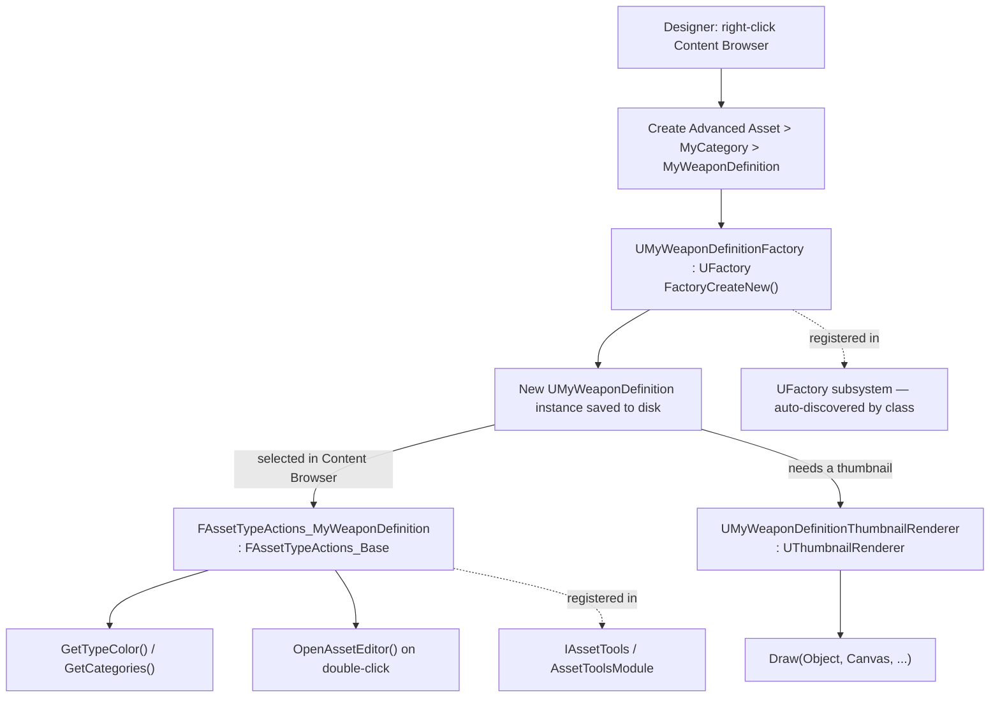

# Custom asset types

A `UDataAsset` subclass is usable the moment you compile it — but "usable" and "designer-friendly" are
different bars. Without a factory, there's no right-click "Create > MyDataAsset" in the Content Browser,
just json-editing-adjacent workarounds. Without asset type actions, your new asset type shows up in
search results looking exactly like every other misc asset — no color coding, no category, no
double-click behavior beyond the generic editor. Without a thumbnail renderer, it's a gray placeholder
icon next to actual content thumbnails. All three are editor-only, all three are small, and together
they're the difference between "a class that happens to be an asset" and something a designer would
mistake for built-in engine content.

## Why this matters

Content-heavy projects live and die by how fast a non-programmer can create, find, and understand
assets in the Content Browser. A custom `UDataAsset` for, say, "weapon definitions" that has no factory
forces every new weapon to be created by duplicating an existing asset (fragile — nobody remembers to
clear the old asset's stale values) or, worse, by asking a programmer to spawn it from a temporary
console command. A factory turns that into a real "Add New" menu entry. Asset type actions and a
thumbnail renderer aren't strictly required for the asset to function, but skipping them means every
one of these assets is visually indistinguishable from a stray `UObject` someone saved by accident —
which matters a lot once a project has hundreds of them.

## Mental model



Three separate, independently optional pieces, all editor-only, all typically living in the same
`Editor` module as your Details customizations:

| Piece | Base class | What it controls |
|---|---|---|
| Factory | `UFactory` | How a new instance is created from the Content Browser's "Add" menu |
| Asset type actions | `FAssetTypeActions_Base` (implements `IAssetTypeActions`) | Color, category, filtering, double-click behavior in the Content Browser |
| Thumbnail renderer | `UThumbnailRenderer` | What's drawn in the Content Browser tile/list view |

## The mechanics

### UFactory: creating the asset

A factory declares which class it creates (`SupportedClass`), whether it's a "create new" or
"import from file" factory, and overrides `FactoryCreateNew` to actually build and return the object.
`UFactory::FactoryCreateNew` is the documented core entry point — Epic's own built-in factories (data
layer assets, audio submixes, contextual animation assets) all follow the same shape: override
`FactoryCreateNew(UClass* Class, UObject* InParent, FName Name, EObjectFlags Flags, UObject* Context,
FFeedbackContext* Warn)` and return a `NewObject<T>` constructed with those parameters.

```cpp title="MyWeaponDefinitionFactory.h"
UCLASS()
class MYTOOLEDITOR_API UMyWeaponDefinitionFactory : public UFactory
{
    GENERATED_BODY()

public:
    UMyWeaponDefinitionFactory();

    virtual UObject* FactoryCreateNew(
        UClass* Class,
        UObject* InParent,
        FName Name,
        EObjectFlags Flags,
        UObject* Context,
        FFeedbackContext* Warn) override;

    virtual bool CanCreateNew() const override { return true; }
};
```

```cpp title="MyWeaponDefinitionFactory.cpp"
UMyWeaponDefinitionFactory::UMyWeaponDefinitionFactory()
{
    bCreateNew = true;
    bEditAfterNew = true;               // open the asset editor immediately after creation
    SupportedClass = UMyWeaponDefinition::StaticClass();
}

UObject* UMyWeaponDefinitionFactory::FactoryCreateNew(
    UClass* Class,
    UObject* InParent,
    FName Name,
    EObjectFlags Flags,
    UObject* Context,
    FFeedbackContext* Warn)
{
    return NewObject<UMyWeaponDefinition>(InParent, Class, Name, Flags);
}
```

The Content Browser discovers factories by scanning loaded `UFactory` subclasses — there's no separate
registration call the way there is for asset type actions and Details customizations; declaring the
`UCLASS()` with `bCreateNew = true` and a `SupportedClass` is what makes it appear under "Create Advanced
Asset."

### FAssetTypeActions_Base: how it behaves in the Content Browser

`IAssetTypeActions` (most commonly implemented via the `FAssetTypeActions_Base` convenience base) tells
the Content Browser what color to tint the asset, which category to file it under, and what to do on
double-click. Epic's own `FAssetTypeActions_SoundBase` is a representative example of the overridable
surface: `GetName`, `GetSupportedClass`, `GetTypeColor`, `GetCategories`, `CanFilter`, plus asset-specific
hooks like `AssetsActivatedOverride` and `GetThumbnailOverlay`.

```cpp title="MyWeaponDefinitionActions.h"
class FAssetTypeActions_MyWeaponDefinition : public FAssetTypeActions_Base
{
public:
    virtual FText GetName() const override
    {
        return NSLOCTEXT("AssetTypeActions", "MyWeaponDefinition", "Weapon Definition");
    }

    virtual FColor GetTypeColor() const override { return FColor(200, 80, 40); }

    virtual UClass* GetSupportedClass() const override
    {
        return UMyWeaponDefinition::StaticClass();
    }

    virtual uint32 GetCategories() override { return EAssetTypeCategories::Gameplay; }
};
```

```cpp title="MyToolEditorModule.cpp — registration in StartupModule"
void FMyToolEditorModule::StartupModule()
{
    IAssetTools& AssetTools = FModuleManager::LoadModuleChecked<FAssetToolsModule>("AssetTools").Get();

    WeaponDefinitionActions = MakeShared<FAssetTypeActions_MyWeaponDefinition>();
    AssetTools.RegisterAssetTypeActions(WeaponDefinitionActions.ToSharedRef());
}

void FMyToolEditorModule::ShutdownModule()
{
    if (FModuleManager::Get().IsModuleLoaded("AssetTools"))
    {
        IAssetTools& AssetTools = FModuleManager::GetModuleChecked<FAssetToolsModule>("AssetTools").Get();
        AssetTools.UnregisterAssetTypeActions(WeaponDefinitionActions.ToSharedRef());
    }
}
```

`WeaponDefinitionActions` needs to be a member (`TSharedPtr<FAssetTypeActions_MyWeaponDefinition>`) of
your module class so `ShutdownModule` can unregister the same instance.

:::note
UE 5.3+ introduced a newer, UObject-based asset-definition system (`UAssetDefinitionDefault` and
related classes) intended to eventually replace `FAssetTypeActions_Base`/`IAssetTypeActions`. This
document was not able to verify the newer API's exact class names and registration flow against 5.7 in
the sources consulted — `FAssetTypeActions_Base` is confirmed current and working (Epic's own built-in
asset actions, e.g. `FAssetTypeActions_SoundBase`, still use it), but check whether your engine version
is steering new code toward the asset-definition system before committing to one or the other.
:::

### UThumbnailRenderer: the Content Browser tile

`UThumbnailRenderer` is documented as the abstract base for anything that draws a Content Browser
thumbnail; you override `CanVisualizeAsset` to claim the asset types you render, and `Draw` to actually
paint onto the provided canvas. Epic's built-in renderers (e.g. `UPhysicsAssetThumbnailRenderer`) derive
from `UDefaultSizedThumbnailRenderer` rather than `UThumbnailRenderer` directly when they just need a
standard tile size.

```cpp title="MyWeaponDefinitionThumbnailRenderer.h"
UCLASS()
class MYTOOLEDITOR_API UMyWeaponDefinitionThumbnailRenderer : public UDefaultSizedThumbnailRenderer
{
    GENERATED_BODY()

public:
    virtual bool CanVisualizeAsset(UObject* Object) override;

    virtual void Draw(
        UObject* Object,
        int32 X, int32 Y, uint32 Width, uint32 Height,
        FRenderTarget* Viewport,
        FCanvas* Canvas,
        bool bAdditionalViewFamily) override;
};
```

```cpp title="MyWeaponDefinitionThumbnailRenderer.cpp"
bool UMyWeaponDefinitionThumbnailRenderer::CanVisualizeAsset(UObject* Object)
{
    return Object && Object->IsA<UMyWeaponDefinition>();
}

void UMyWeaponDefinitionThumbnailRenderer::Draw(
    UObject* Object,
    int32 X, int32 Y, uint32 Width, uint32 Height,
    FRenderTarget* Viewport,
    FCanvas* Canvas,
    bool bAdditionalViewFamily)
{
    UMyWeaponDefinition* Weapon = Cast<UMyWeaponDefinition>(Object);
    if (!Weapon)
    {
        return;
    }
    // Draw an icon texture, a preview mesh, or generated text into the tile —
    // simplest option is compositing a static UTexture2D via Canvas->DrawTile.
}
```

Thumbnail renderers register themselves implicitly the same way factories do — by existing as a loaded
`UClass` — but some projects also set a per-class default via config; check
`[/Script/Engine.Engine] ThumbnailRenderers=(...)` style ini entries if you need the mapping explicit
rather than automatic.

### Build.cs and .uplugin shape

```csharp title="MyToolEditor.Build.cs (excerpt)"
PrivateDependencyModuleNames.AddRange(new string[]
{
    "UnrealEd",
    "AssetTools",
    "AssetDefinition",
    "Slate",
    "SlateCore",
});
```

```ini title="DefaultEditor.ini — optional explicit thumbnail renderer mapping"
[/Script/UnrealEd.UnrealEdEngine]
+ThumbnailRenderers=(FactoryClass=/Script/MyToolEditor.MyWeaponDefinitionFactory,RendererClass=/Script/MyToolEditor.UMyWeaponDefinitionThumbnailRenderer)
```

## Gotchas

:::warning[A factory with no SupportedClass or bCreateNew=false silently doesn't appear]
If your new asset type doesn't show up under "Create Advanced Asset" at all, check the factory's
constructor first — a missing `SupportedClass` assignment or `bCreateNew` left at its default is the
usual cause, and there's no error logged for it; it just isn't there.
:::

:::warning[RegisterAssetTypeActions/UnregisterAssetTypeActions must be symmetric]
Same failure mode as Details customizations: unregister in `ShutdownModule` using the exact
`TSharedRef` you registered, not a newly constructed instance — `AssetTools` compares by reference, and
mismatched registration/unregistration leaks the actions object and can leave stale entries in the
Content Browser's type filter menu after a plugin reload.
:::

:::caution[All three pieces are editor-only — keep them out of your runtime module]
`UFactory`, `FAssetTypeActions_Base`, and `UThumbnailRenderer` all depend on `UnrealEd`/`AssetTools` and
have no reason to exist in a `Runtime`-typed module. See
[Editor-only modules](./editor-modules.md) for why that dependency can't ship.
:::

:::note
Not confirmed against 5.7 in the sources consulted: the exact config section and property name for
explicit thumbnail renderer registration via ini (shown above as illustrative shape). Some engine
versions resolve the factory-to-renderer mapping purely through `CanVisualizeAsset` without needing an
ini entry at all — verify which applies to your project before relying on the ini form.
:::

## See also

- [Editor-only modules](./editor-modules.md) — why factories, asset type actions, and thumbnail
  renderers all belong in an `Editor`-typed module.
- [Details panel customization](./details-panel-customization.md) — pairs naturally with a custom asset
  type to control how its properties are edited.
- [Editor Utility Widgets](./editor-utility-widgets.md) — a designer-facing alternative for
  batch-creating or editing these assets beyond the single-asset factory flow.
- [Epic — Asset Tools API reference](https://dev.epicgames.com/documentation/unreal-engine/API/Developer/AssetTools)

