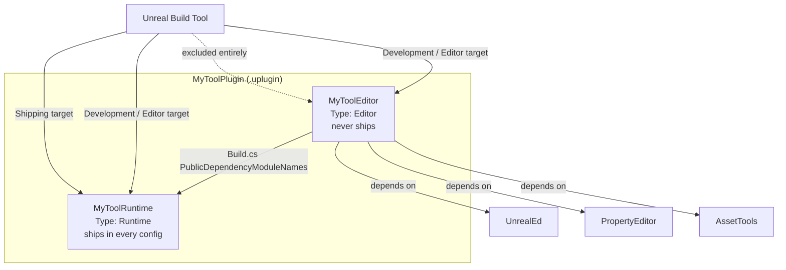

# Editor-only modules

Every custom editor tool you write — a Details panel customization, a custom asset factory, an Editor
Utility Widget backend, a commandlet — has to live somewhere, and where you put it decides whether it
ships in your `Shipping` build by accident. Get the module `Type` wrong, or skip a `WITH_EDITOR` guard
around code that leaked into a `Runtime` module, and you either bloat a shipped binary with editor-only
Slate/UMG dependencies or, worse, get a linker error the day someone finally builds `Shipping` for the
first time in months, because a symbol only exists in editor-only libraries.

## Why this matters

Editor tooling code depends on modules — `UnrealEd`, `PropertyEditor`, `AssetTools`, `Blutility` — that
either don't exist in a cooked/shipping context or exist in a stripped-down form. If that dependency
leaks into a module that ships with the game, you get one of two failures: a build that fails to link
because a `Shipping` target configuration doesn't include those editor libraries at all, or a build
that *does* link but silently balloons the packaged game with UI code no player will ever run. Neither
failure shows up until someone actually produces a `Shipping` package, which in a lot of projects is
alarmingly late in the schedule. The fix is structural, not a set of `#ifdef`s sprinkled after the fact:
put editor-only C++ in modules whose `Type` says `Editor`, and reserve `WITH_EDITOR` for the rarer case
where editor and runtime code must share a single translation unit.

This builds directly on [Modules and plugins](../01-toolchain-and-build/modules-and-plugins.md), which
covers the full `EHostType` table and `LoadingPhase`. This document goes one level deeper: what
specifically goes in an `Editor` module, how `WITH_EDITOR` differs from module separation, and the
concrete `Build.cs` and `.uplugin` shape that keeps editor code from ever reaching a Shipping binary.

## Mental model



The dependency arrow only ever points from editor code to runtime code, never the other way. Your
gameplay types (`AActor` subclasses, `UDataAsset`, gameplay tags) live in the `Runtime` module and know
nothing about the editor. Your `Editor` module depends on the `Runtime` module to know what it's
customizing, plus whatever editor subsystems it needs (`PropertyEditor` for Details panel work,
`AssetTools` for factories, `Blutility` for Editor Utility Widgets). Unreal Build Tool then uses each
module's `Type` to decide whether it's even a candidate for inclusion in a given target — a `Shipping`
target never instantiates the `Editor` module at all, so there's no `WITH_EDITOR` check to get wrong at
runtime; the code simply isn't compiled in.

## The mechanics

### Module Type controls where code can load

As covered in [Modules and plugins](../01-toolchain-and-build/modules-and-plugins.md), `Type` in a
`.uplugin` module entry (or a `.uproject` module entry, for game modules) is one of the `EHostType`
values — `Runtime`, `Developer`, `Editor`, `EditorNoCommandlet`, `Program`, and the rest of the table
there. For a pure editor-tooling module, `Editor` is almost always the right choice: it loads in the
editor and in editor-adjacent Program targets, and Unreal Build Tool excludes it from Development,
Shipping, and Test targets that don't run the editor. `Developer` modules occupy a different niche —
Epic's own module reference describes the `Developer` category as code compiled for **every** build
target but only in **non-shipping configurations** (development and debug tooling that still needs to
exist outside the editor, e.g. in a non-shipping standalone game build). If your module is Slate/UMG
editor UI, factories, or Details customizations, it belongs in `Editor`, not `Developer`.

### LoadingPhase for editor modules

Most editor modules use `LoadingPhase: "Default"` — same as runtime modules — because they don't need
anything earlier than the standard module set. Reach for a non-default phase only when your module's
`StartupModule()` needs something that isn't ready yet at `Default` (config values not yet loaded,
in particular). The full ordered enum wasn't exhaustively confirmed in this pass; treat any phase other
than `Default` as something to verify against `ELoadingPhase` in your engine version before relying on
ordering.

### WITH_EDITOR: sharing one file between editor and runtime

Splitting modules handles the common case — an entire file or class that only exists for the editor.
`WITH_EDITOR` (and the narrower `WITH_EDITORONLY_DATA` for editor-only *properties* on an otherwise
runtime `UCLASS`/`USTRUCT`) is for the opposite situation: a single class that's fundamentally runtime,
but needs a handful of editor-only members or overrides — a `PostEditChangeProperty` override, a
debug-visualization property, a "regenerate from source" button exposed to the Details panel.

```cpp title="MyGameplayAsset.h — one Runtime class with editor-only additions"
UCLASS()
class MYGAME_API UMyGameplayAsset : public UDataAsset
{
    GENERATED_BODY()

public:
    UPROPERTY(EditAnywhere, Category = "Gameplay")
    float BaseDamage = 10.f;

#if WITH_EDITORONLY_DATA
    // Only exists in editor builds; stripped from cooked/Shipping data entirely.
    UPROPERTY(EditAnywhere, Category = "Authoring")
    TObjectPtr<UTexture2D> SourceReferenceImage;
#endif

#if WITH_EDITOR
    virtual void PostEditChangeProperty(FPropertyChangedEvent& PropertyChangedEvent) override;
#endif
};
```

```cpp title="MyGameplayAsset.cpp"
#if WITH_EDITOR
void UMyGameplayAsset::PostEditChangeProperty(FPropertyChangedEvent& PropertyChangedEvent)
{
    Super::PostEditChangeProperty(PropertyChangedEvent);
    // Re-derive some cached runtime value whenever an authoring property changes.
}
#endif
```

`WITH_EDITORONLY_DATA` strips the property from cooked data (it never reaches disk in a packaged
build); `WITH_EDITOR` strips code, not data, and both compile to nothing outside editor targets. Neither
macro is a substitute for module separation when the amount of editor-only code is large — a whole
Details customization class, a whole factory, a whole Editor Utility Widget C++ backend — because at
that point you're better off with a real `Editor` module than a file full of `#if` blocks.

### Build.cs shape for an editor module

```csharp title="MyToolEditor.Build.cs"
using UnrealBuildTool;

public class MyToolEditor : ModuleRules
{
    public MyToolEditor(ReadOnlyTargetRules Target) : base(Target)
    {
        PCHUsage = PCHUsageMode.UseExplicitOrSharedPCHs;

        PublicDependencyModuleNames.AddRange(new string[]
        {
            "Core",
            "CoreUObject",
            "Engine",
            "MyToolRuntime", // the runtime module this editor module extends
        });

        PrivateDependencyModuleNames.AddRange(new string[]
        {
            "Slate",
            "SlateCore",
            "UnrealEd",       // editor application framework
            "PropertyEditor", // Details/property customization
            "AssetTools",     // asset type actions / factories
            "EditorStyle",
            "ToolMenus",
        });
    }
}
```

```csharp title="MyToolRuntime.Build.cs — the module MyToolEditor depends on"
using UnrealBuildTool;

public class MyToolRuntime : ModuleRules
{
    public MyToolRuntime(ReadOnlyTargetRules Target) : base(Target)
    {
        PCHUsage = PCHUsageMode.UseExplicitOrSharedPCHs;

        PublicDependencyModuleNames.AddRange(new string[]
        {
            "Core",
            "CoreUObject",
            "Engine",
        });
        // No UnrealEd, no Slate, no PropertyEditor here — this module must
        // link into Shipping.
    }
}
```

Note the asymmetry: `MyToolEditor` depends on `MyToolRuntime`, never the reverse. If you find yourself
wanting to call editor-only code from the runtime module, that's the signal the code belongs behind
`WITH_EDITOR` in the runtime module instead of in the editor module — the editor module can't be
depended upon by something that ships.

### .uplugin descriptor

```json title="MyTool.uplugin (module descriptor excerpt)"
{
	"Modules": [
		{
			"Name": "MyToolRuntime",
			"Type": "Runtime",
			"LoadingPhase": "Default"
		},
		{
			"Name": "MyToolEditor",
			"Type": "Editor",
			"LoadingPhase": "Default"
		}
	]
}
```

For a game module declared directly in the `.uproject` rather than a plugin, the same `Type` field
applies to each entry in `Modules`.

```json title="MyGame.uproject (module descriptor excerpt)"
{
	"Modules": [
		{
			"Name": "MyGame",
			"Type": "Runtime",
			"LoadingPhase": "Default"
		},
		{
			"Name": "MyGameEditor",
			"Type": "Editor",
			"LoadingPhase": "Default"
		}
	]
}
```

## Gotchas

:::warning An Editor module is simply absent from Shipping, not stubbed out
Don't write defensive `WITH_EDITOR` checks inside an `Editor`-typed module expecting them to matter in
Shipping — they don't get the chance to run, because Unreal Build Tool never compiles that module into
a Shipping target at all. The `Type` field is doing the exclusion at the module level; `WITH_EDITOR`
inside that same module is redundant. Reserve `WITH_EDITOR` for runtime modules that need to shed code
conditionally within a single compiled unit.
:::

:::warning Don't let a Runtime module's header include an Editor-only header
If `MyToolRuntime`'s public header `#include`s something from `UnrealEd` or `PropertyEditor` — even
inside a `WITH_EDITOR` block, if the include itself isn't guarded — you've created a dependency that
breaks the moment someone builds a Shipping target, because those editor libraries genuinely are not
present to link against outside editor-hosting targets. Guard the `#include` itself with `#if
WITH_EDITOR`, not just the code that uses it.
:::

:::caution Plugin-level "editor only" is not the same as module Type
Marking an entire plugin `"EditorOnly": true` in the `.uplugin` descriptor controls whether the plugin
is even considered for non-editor targets, but it's a coarser lever than per-module `Type`. A plugin
that bundles both a `Runtime` and an `Editor` module still needs the `Runtime` module correctly typed if
you want gameplay code from that plugin to ship — don't reach for the plugin-level flag as a substitute
for typing modules correctly.
:::

:::note
The full ordered set of `LoadingPhase` values beyond `Default` and `PostConfigInit` was not exhaustively
confirmed against 5.7 in the sources consulted for this document — verify the complete `ELoadingPhase`
enum against your engine version before depending on load ordering between an editor module and the
systems it customizes.
:::

## See also

- [Modules and plugins](../01-toolchain-and-build/modules-and-plugins.md) — the full `EHostType` table
  and when a plugin beats a second module.
- [Unreal Build Tool](../01-toolchain-and-build/unreal-build-tool.md) — how `Build.cs` dependency lists
  are resolved into actual link steps.
- [Details panel customization](./details-panel-customization.md) — the most common thing an `Editor`
  module exists to hold.
- [Epic — Modules in Unreal Engine](https://dev.epicgames.com/documentation/unreal-engine/unreal-engine-modules)

