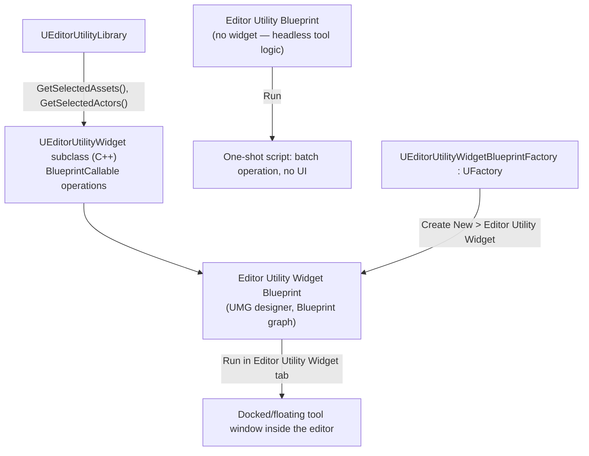

# Editor Utility Widgets and Blueprints

`IDetailCustomization` and a hand-rolled Slate widget are the right tool when you're extending an
existing editor surface — the Details panel, the Content Browser. They're the wrong tool when what you
actually want is a standalone tool window: "select 40 static meshes, run a batch rename," "a panel that
lists every quest in the level and lets a designer jump to one." For that, Editor Utility Widgets let you
build the tool in UMG — the same widget system used for in-game UI — and run it inside the editor
instead of at runtime, with a C++ base class underneath for anything a Blueprint graph can't do cleanly.

## Why this matters

Editor Utility Widgets exist specifically so that designers and non-programmers can build and iterate on
editor tools without opening C++ or Slate. A programmer exposes `UFUNCTION(BlueprintCallable)` operations
— "get selected actors," "run this validation," "batch-set this property" — on a C++ base class, and a
designer wires those into buttons, lists, and layout entirely in the UMG designer, the same visual
editor they already use for in-game HUDs. Skipping this and asking every internal tool request to go
through a programmer writing raw Slate is how small, one-off tooling asks turn into a permanent backlog
item — Editor Utility Widgets are explicitly the escape hatch for that.

## Mental model



There are two related but distinct assets: an **Editor Utility Widget** (has a UMG-designed window,
runs inside a dockable tab) and an **Editor Utility Blueprint** (headless — just a Blueprint graph you
run, no window). Both are Blueprint assets that run *in the editor process*, not the game — they can
call editor-only APIs (asset registry queries, `GEditor`, actor selection) that would be meaningless or
unavailable in a packaged game.

## The mechanics

### UEditorUtilityWidget: the C++ base

`UEditorUtilityWidget`, per Epic's Blutility module reference, is the base class for Editor Utility
Widgets designed to be shown in modal or non-modal dialog windows. You subclass it in C++ when you want
to expose operations to Blueprint that need engine-internal access a Blueprint graph can't reach
directly — asset registry scans, direct property reflection, file I/O.

```cpp title="MyToolWidgetBase.h"
UCLASS()
class MYTOOLEDITOR_API UMyToolWidgetBase : public UEditorUtilityWidget
{
    GENERATED_BODY()

public:
    UFUNCTION(BlueprintCallable, Category = "MyTool")
    TArray<UObject*> GetSelectedAssetsOfClass(UClass* DesiredClass) const;

    UFUNCTION(BlueprintCallable, Category = "MyTool")
    void ApplyNamingConvention(const TArray<UObject*>& Assets, const FString& Prefix);

    UFUNCTION(BlueprintImplementableEvent, Category = "MyTool")
    void OnBatchOperationComplete(int32 NumAffected);
};
```

```cpp title="MyToolWidgetBase.cpp"
TArray<UObject*> UMyToolWidgetBase::GetSelectedAssetsOfClass(UClass* DesiredClass) const
{
    TArray<UObject*> Result;
    for (UObject* Asset : UEditorUtilityLibrary::GetSelectedAssets())
    {
        if (Asset && Asset->IsA(DesiredClass))
        {
            Result.Add(Asset);
        }
    }
    return Result;
}

void UMyToolWidgetBase::ApplyNamingConvention(const TArray<UObject*>& Assets, const FString& Prefix)
{
    int32 NumRenamed = 0;
    for (UObject* Asset : Assets)
    {
        if (!Asset)
        {
            continue;
        }
        // Rename via IAssetTools::RenameAssets, or FAssetRenameManager — omitted for brevity.
        ++NumRenamed;
    }
    OnBatchOperationComplete(NumRenamed);
}
```

The Blueprint-facing designer then subclasses `UMyToolWidgetBase` (via **Create > Editor Utility
Widget**, choosing the C++ class as parent), lays out buttons and a list view in UMG, and wires those
buttons to call `GetSelectedAssetsOfClass` / `ApplyNamingConvention` and implement
`OnBatchOperationComplete` to refresh the UI.

### UEditorUtilityWidgetBlueprintFactory: how the asset gets created

The Content Browser "Create > Editor Utility Widget" entry is backed by
`UEditorUtilityWidgetBlueprintFactory`, itself a `UFactory` subclass, per Epic's Blutility API
reference — the same factory mechanism covered in
[Custom asset types](./custom-asset-types.md), just one Epic already ships. You don't normally need to
write your own factory for Editor Utility Widgets; you write the C++ base class they derive from.

### Running the tool

A finished Editor Utility Widget is run from the Content Browser (right-click → **Run Editor Utility
Widget**), which docks it as a tab inside the editor. Epic's `UEditorUtilityLibrary` also exposes
`ConvertToEditorUtilityWidget`, which can convert a plain `UWidgetBlueprint` into an Editor Utility
Widget in place — useful if a tool started life as an ordinary UMG widget before you decided it needed
to run inside the editor.

```text
Content Browser → right-click MyTool_EUW → Run Editor Utility Widget
```

Editor Utility *Blueprints* (the headless variant, no UMG widget) are run the same way but simply
execute their graph once and close — appropriate for "run this one-shot batch fix" tools that don't need
persistent UI state.

### Sibling Blutility base classes

`UEditorUtilityWidget` isn't the only entry point into this system — two other Blutility base classes
cover cases where a full docked window is more than you need:

- **`UAssetActionUtility`** — the base class for asset-action utilities. Per Epic's Blutility reference,
  any function or event on a derived class with the right signature (taking the selected assets)
  automatically shows up as a right-click menu option when you select a group of assets in the Content
  Browser. No widget, no window — it's the lightest option for "run this operation on whatever assets
  I've selected."
- **`AEditorUtilityActor`** — an abstract, Blueprintable `AActor` subclass (`Meta=(ShowWorldContextPin)`)
  for tools that need to operate on the currently open level rather than the Content Browser — placing
  helper actors, running per-actor batch operations against the level outliner.

```cpp title="MyAssetValidationUtility.h — right-click menu action on selected assets"
UCLASS()
class MYTOOLEDITOR_API UMyAssetValidationUtility : public UAssetActionUtility
{
    GENERATED_BODY()

public:
    UFUNCTION(CallInEditor, Category = "MyTool")
    void ValidateSelectedWeapons();
};
```

Which of the three to reach for is mostly about surface: `UEditorUtilityWidget` for a persistent tool
panel with real layout and state, `UAssetActionUtility` for a quick "act on my Content Browser selection"
menu entry, `AEditorUtilityActor` for a tool that needs to interact with actors in the currently open
level.

### Build.cs dependencies

```csharp title="MyToolEditor.Build.cs (excerpt)"
PublicDependencyModuleNames.AddRange(new string[]
{
    "UMG",
    "Blutility",       // UEditorUtilityWidget and related base classes
    "EditorScriptingUtilities", // UEditorUtilityLibrary and friends
});

PrivateDependencyModuleNames.AddRange(new string[]
{
    "UnrealEd",
    "Slate",
    "SlateCore",
});
```

## Gotchas

:::warning[Editor Utility Widgets run in the editor process — they can crash the editor, not just the tool]
Because the widget executes with full editor access (asset registry, `GEditor`, live actors), an
unhandled null dereference or an infinite loop in the Blueprint graph takes down the whole editor
session, not a sandboxed tool process. Treat `BlueprintCallable` C++ entry points the same as any other
editor-facing API: validate inputs defensively, because a designer's Blueprint graph will eventually
call them with an empty array or a null object.
:::

:::warning[Don't confuse Editor Utility Widget with a normal UMG widget shown at runtime]
`UEditorUtilityWidget` and its Blueprint assets only make sense inside the editor — they are not a way
to build in-game UI, and referencing `UEditorUtilityLibrary` selection queries from a runtime widget
either does nothing meaningful or won't compile into a Shipping build in the first place, since
`Blutility` is an editor-only module.
:::

:::caution[BlueprintImplementableEvent vs BlueprintCallable — pick the right direction]
`GetSelectedAssetsOfClass` and `ApplyNamingConvention` are things the Blueprint asks C++ to *do*
(`BlueprintCallable`); `OnBatchOperationComplete` is something C++ tells the Blueprint *happened*
(`BlueprintImplementableEvent`, or `BlueprintNativeEvent` if C++ needs a default implementation too).
Mixing these up is a common first mistake — a `BlueprintCallable` function can't be overridden with
Blueprint logic the way an event can.
:::

:::note
Not confirmed against 5.7 in the sources consulted: whether `EditorScriptingUtilities` is still the
correct module name for `UEditorUtilityLibrary` in the current engine version, versus it having moved
under `Blutility` directly. Verify the exact module split in your engine's `.Build.cs` dependency graph
before copying the list above verbatim.
:::

## See also

- [Custom asset types](./custom-asset-types.md) — the `UFactory` mechanism that creates Editor Utility
  Widget assets under the hood.
- [Details panel customization](./details-panel-customization.md) — the C++/Slate alternative when the
  tool needs to live inside an existing panel rather than its own window.
- [Editor-only modules](./editor-modules.md) — `Blutility` and `EditorScriptingUtilities` are both
  editor-only dependencies that must stay out of runtime modules.
- [Epic — Editor Utility Widgets](https://dev.epicgames.com/documentation/unreal-engine/BlueprintAPI/EditorUtilityWidget)

