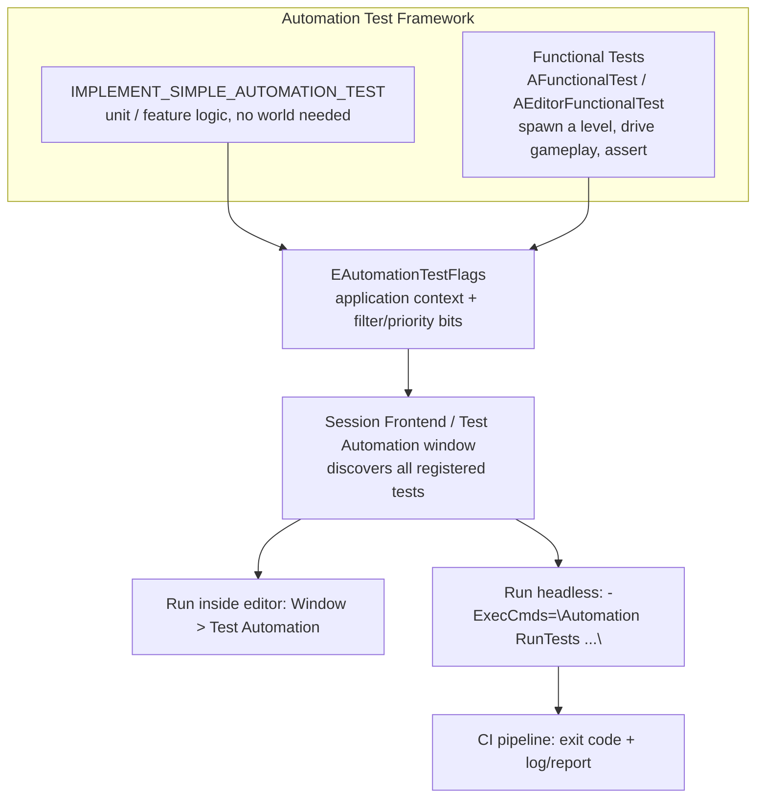

# Automation and functional tests

Unreal ships an automated testing framework that runs inside the engine itself — no external test
runner, no mocking the engine out of existence. That means tests can exercise real `UWorld`s, real
Blueprint interaction, and real asset loading, but it also means "just write a unit test" isn't always
the reflex it is in other C++ codebases: you choose between a fast, isolated `IMPLEMENT_SIMPLE_AUTOMATION_TEST`
and a slower, world-spawning functional test depending on what you're actually verifying.

## Why this matters

Gameplay bugs that only show up after a level loads, an AI perceives a player, or a save round-trips are
exactly the bugs manual playtesting catches late and expensively. The Automation framework is how you
turn "someone will notice this eventually" into "CI caught this before it merged" — but only if tests are
written with the right test type and actually wired into a headless run, which is the part most projects
skip.

## Mental model



The Automation System sits on top of the Functional Testing Framework: simple tests are code-only checks
registered by macro; functional tests are level-driven scenarios built from `AFunctionalTest` actors
placed (or spawned) in a map, useful when the thing you're verifying only makes sense in the context of a
running world — navigation, physics settling, a full ability activation, a UI flow.

## The mechanics

### Simple automation tests

`IMPLEMENT_SIMPLE_AUTOMATION_TEST` (and its sibling `IMPLEMENT_COMPLEX_AUTOMATION_TEST` for
parameterized/data-driven cases) declares a test class and registers it with the automation system in one
macro. The body goes in an overridden `RunTest`, and assertions come from the `TestTrue`/`TestEqual`/
`TestNull`/etc. family on `FAutomationTestBase`.

```cpp title="DamageCalculationTests.cpp"
#include "Misc/AutomationTest.h"
#include "MyGame/DamageLibrary.h"

IMPLEMENT_SIMPLE_AUTOMATION_TEST(
    FDamageCalculation_ReducesHealthByDamage,
    "MyGame.Combat.DamageCalculation.ReducesHealthByDamage",
    EAutomationTestFlags::EditorContext | EAutomationTestFlags::ProductFilter)

bool FDamageCalculation_ReducesHealthByDamage::RunTest(const FString& Parameters)
{
    const float StartingHealth = 100.f;
    const float Damage = 25.f;

    const float ResultHealth = UDamageLibrary::ApplyDamage(StartingHealth, Damage);

    TestEqual(TEXT("Health after damage"), ResultHealth, 75.f);
    return true;
}
```

The test's name string (`"MyGame.Combat.DamageCalculation.ReducesHealthByDamage"`) is a dot-separated
path — it's what determines where the test appears in the Test Automation window's tree and what you
filter on from the command line, not just a label.

### Test flags

The third macro argument is a bitmask combining two independent concerns:

- **Application context** — which kind of process the test is valid to run in: an editor context, a
  client, a server, or a commandlet. A test that touches editor-only APIs needs the editor context bit;
  a pure-logic test typically only needs to declare where it's *allowed* to run.
- **Filter / priority** — which category of test this is for selective runs: broad groupings such as a
  smoke-test filter (fast, always-run sanity checks) versus a heavier product/feature filter, plus a
  priority tier used to decide what runs on every commit versus what runs nightly.

:::note
The exact set of `EAutomationTestFlags` bit names and values (e.g. the specific application-context and
filter/priority enumerators) was not confirmed in full against 5.7 in the sources consulted here. The
shape above — an application-context mask ORed with a filter/priority mask — is stable across recent UE
versions, but verify the exact enumerator names against `Misc/AutomationTest.h` in your engine version
before copying flag combinations verbatim.
:::

A test is only visible in the Test Automation window / command-line runner if its application-context
flag matches the process it's queried from — a test flagged only for a server context won't show up when
you list tests inside the editor.

### Functional tests

Functional tests exist for scenarios that need an actual running level: physics settling into a resting
state, an AI perceiving a player and reacting, navigation actually pathing around geometry, a UI flow
that depends on real widget state. Rather than writing code that manually spins up a `UWorld`, you build
a `AFunctionalTest` (or `AEditorFunctionalTest` for editor-only Blueprint-driven scenarios) actor into a
dedicated test map, drive gameplay from its Blueprint or C++ logic, and call its pass/fail API when the
scenario resolves.

`AEditorFunctionalTest` specifically exists for tests that need to call editor-only Blueprint
functionality — it's the editor-only counterpart to the runtime `AFunctionalTest` base.

```cpp title="BTFunctionalTest.h — a C++ functional test driving an AI scenario"
UCLASS()
class MYGAME_API ABTFunctionalTest : public AFunctionalTest
{
    GENERATED_BODY()

public:
    virtual void StartTest() override;
    virtual bool IsReady_Implementation() override;

protected:
    UPROPERTY(EditAnywhere, Category = "Test")
    TObjectPtr<class AAIController> ObservedController;
};
```

```cpp title="BTFunctionalTest.cpp"
void ABTFunctionalTest::StartTest()
{
    Super::StartTest();
    // Kick off the scenario; a later tick or delegate calls FinishTest(...) with a result.
}

bool ABTFunctionalTest::IsReady_Implementation()
{
    return ObservedController != nullptr;
}
```

You can also check `UAutomationBlueprintFunctionLibrary::AreAutomatedTestsRunning()` from gameplay code
that needs to behave differently while under test — for example, skipping a splash screen or a
non-deterministic random seed.

### Running tests in the editor

**Window > Test Automation** opens the Session Frontend's automation tab. Enable the Editor, Client,
Server, and/or Product/Engine/Smoke categories you want visible, select tests from the discovered tree,
and click **Start Tests**. Results (pass/fail, duration, log output per test) show inline, which is the
fastest way to iterate on a test you're actively writing.

### Running tests headless from the command line

For CI, you run the engine (or a `-nullrhi` headless instance, when rendering isn't needed) with an
automation command passed via `-ExecCmds`, then exit once the run completes:

```bash title="Headless automation run"
UnrealEditor-Cmd.exe "MyGame.uproject" \
  -ExecCmds="Automation RunTests MyGame.Combat.DamageCalculation.ReducesHealthByDamage; Quit" \
  -unattended -nopause -nullrhi -log
```

```bash title="Running a whole filtered group"
UnrealEditor-Cmd.exe "MyGame.uproject" \
  -ExecCmds="Automation RunTests MyGame.Combat" \
  -unattended -nopause -log
```

`-unattended` suppresses interactive dialogs (crash reporter prompts, modal message boxes) so a CI job
doesn't hang waiting for a click; `UKismetSystemLibrary::IsUnattended()` is how gameplay code can check
for the same flag at runtime. `-nullrhi` skips real rendering for tests that don't need a GPU-backed
render target, which is significantly faster in a CI runner with no GPU.

:::note
The precise `Automation RunTests` command syntax (test name matching rules, additional flags like
report-export paths) is best confirmed against your engine version's `RunTests`/`RunAll`/`RunFilter`
console command help — the pattern above (`-ExecCmds="Automation RunTests <name or prefix>"` plus
`-unattended -nullrhi -log`) is the stable shape, but exact export-report flags were not verified in the
sources consulted here.
:::

## Code

```cpp title="Parameterized test with IMPLEMENT_COMPLEX_AUTOMATION_TEST"
IMPLEMENT_COMPLEX_AUTOMATION_TEST(
    FDamageCalculation_ClampsAtZero,
    "MyGame.Combat.DamageCalculation.ClampsAtZero",
    EAutomationTestFlags::EditorContext | EAutomationTestFlags::ProductFilter)

void FDamageCalculation_ClampsAtZero::GetTests(TArray<FString>& OutBeautifiedNames, TArray<FString>& OutTestCommands) const
{
    OutBeautifiedNames.Add(TEXT("Overkill damage"));
    OutTestCommands.Add(TEXT("500"));

    OutBeautifiedNames.Add(TEXT("Exact lethal damage"));
    OutTestCommands.Add(TEXT("100"));
}

bool FDamageCalculation_ClampsAtZero::RunTest(const FString& Parameters)
{
    const float Damage = FCString::Atof(*Parameters);
    const float ResultHealth = UDamageLibrary::ApplyDamage(100.f, Damage);

    TestTrue(TEXT("Health never goes negative"), ResultHealth >= 0.f);
    return true;
}
```

## Gotchas

:::warning[A test that doesn't clean up its world leaks into the next test]
Functional tests that spawn actors, timers, or subsystems and don't tear them down on `FinishTest` can
leave state that contaminates the next test run in the same process — especially in a batch headless run
that doesn't restart the engine between tests. Always pair `StartTest` setup with cleanup on completion.
:::

:::warning[Editor-context tests silently don't run in a packaged game]
A test flagged only with an editor application-context bit is invisible (not failing — invisible) when
queried from a non-editor process. If a CI job reports "0 tests found" for a suite you know exists,
check that the process you're running from (editor-cmd vs. a packaged `-game` build) matches the
application-context flags the tests were registered with.
:::

:::caution[Don't conflate "runs in the editor" with "safe in Shipping"]
Automation tests are development/testing infrastructure and are not expected to compile into `Shipping`
builds the same way editor-only code is stripped — see
[Build configurations and targets](../01-toolchain-and-build/build-configurations-and-targets.md) for what
`Shipping` strips. Don't gate real gameplay logic behind test-only code paths that vanish there.
:::

## See also

- [Commandlets and automation](../17-editor-extension/commandlets-and-automation.md) — the commandlet path to driving editor logic from the command line, a sibling tool to headless automation runs.
- [Logging and assertions](../02-cpp-in-unreal/logging-and-assertions.md) — `ensure`/`check` as the complement to explicit test assertions.
- [Debugging in Visual Studio](./debugging-in-visual-studio.md) — attaching a debugger to a failing test run.
- [Epic — Automation Test Framework in Unreal Engine](https://dev.epicgames.com/documentation/unreal-engine/automation-test-framework-in-unreal-engine)

