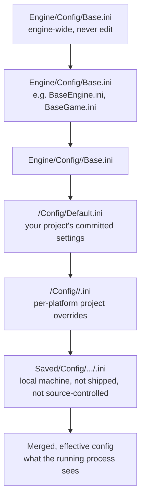

# Config system and .ini files

Unreal doesn't have one settings file — it has a layered stack of `.ini` files that get merged at engine
startup into one effective value per key, per platform. A value you set in `DefaultGame.ini` can be
silently overridden by a platform-specific file you forgot exists, or quietly appended to instead of
replaced because of a prefix character you didn't notice. Misreading this hierarchy is one of the most
common "why isn't my setting taking effect" experiences in Unreal, and it's entirely mechanical once you
know the merge order.

## Why this matters

Config drives things you'd expect (input bindings, engine defaults, per-platform quality tiers) and
things you might not (which `GameMode` loads, feature toggles gated by `UPROPERTY(Config)`, per-platform
scalability settings). Get the hierarchy wrong and you get bugs that only reproduce on one platform, or a
designer-facing `.ini` edit that "does nothing" because a `Default*.ini` further up the stack already won
the merge.

## Mental model

Every config *category* (`Engine`, `Game`, `Input`, `EditorPerProjectUserSettings`, and so on) is
assembled from multiple physical files, read in a fixed order, with later files able to override or
append to earlier ones. The final, merged result is what a running instance actually sees — no single
file on disk is "the" config; each is one layer.



Each arrow is "read after, and allowed to override or append to." The engine-level `Base*.ini` files
define the shipped defaults and are not meant to be hand-edited; your project's `Default*.ini` files are
the ones you commit and edit; platform folders layer platform-specific overrides on top of the
project-wide defaults; and `Saved/Config` holds the final, locally-materialized, per-machine file that
you should never assume is checked into source control.

## The mechanics

### The category × layer matrix

"Config category" (`Engine`, `Game`, `Input`, `EditorSettings`, and dozens more) and "layer" (base engine,
base platform, project default, project platform, user) are independent axes — a given category is
assembled from as many of these layers as exist on disk for it. The three you touch constantly:

| Category | Typical file | What lives there |
|---|---|---|
| `Engine` | `DefaultEngine.ini` | Renderer, physics, subsystem-level engine config, `[/Script/Engine.*]` sections |
| `Game` | `DefaultGame.ini` | Game-specific settings, `GameModeClassAliases`, project-level `[/Script/YourGame.*]` sections |
| `Input` | `DefaultInput.ini` | Legacy input axis/action bindings (Enhanced Input largely moved this to data assets — see [Enhanced Input](../05-input-and-movement/enhanced-input.md)) |

`Default<Category>.ini` in your project's `Config/` folder is the file you actually edit day to day for
project-wide settings. Platform-specific overrides live in a platform subfolder
(`Config/Windows/WindowsEngine.ini`, `Config/Android/AndroidEngine.ini`, etc.) and are merged *after* the
project-wide default for that category, so they win ties.

### `+`, `-`, and `.` prefixes on array properties

Config values that are arrays (a `TArray` `UPROPERTY(Config)`, or a config section with repeated keys)
don't simply get overwritten layer to layer by default — Unreal's config merge distinguishes *replace*
from *append* from *remove* using a line prefix:

- **No prefix** (bare `Key=Value`) — for a scalar property, this sets/overwrites the value at this layer.
  For an array property with no prefix, behavior depends on whether this is the first layer to touch the
  array; in practice, always use an explicit prefix for arrays to avoid ambiguity.
- **`+Key=Value`** — **append** this value to the array, keeping whatever earlier layers already
  contributed.
- **`-Key=Value`** — **remove** a matching entry from the array as assembled by earlier layers.
- **`.Key=Value`** — **removes and re-adds** — used to force a specific existing array entry to a new
  value/position without duplicating it (an "override" edit for a specific array element rather than a
  blanket append).
- **`!Key`** (with no value) — clears the entire array accumulated so far for that key, before any further
  appends in the same or later layers apply.

```ini title="BaseEngine.ini (engine-shipped — illustrative, not for hand-editing)"
[/Script/Engine.Engine]
+ActiveGameNameRedirects=(OldGameName="TP_Sample",NewGameName="/Script/MyGame")
```

```ini title="DefaultGame.ini (your project — appends on top of the engine base)"
[/Script/MyGame.MyGameInstance]
+SupportedFeatureTags=Multiplayer
+SupportedFeatureTags=Coop

[/Script/EngineSettings.GeneralProjectSettings]
ProjectID=(A=123456789,B=987654321,C=111111111,D=222222222)
```

```ini title="Config/Android/AndroidEngine.ini (platform override — merges after DefaultEngine.ini)"
[/Script/Engine.RendererSettings]
r.MobileHDR=False
-r.Shadow.CSM.MaxCascades=10
+r.Shadow.CSM.MaxCascades=2
```

Here the Android layer removes the desktop cascade count value that a project-wide `DefaultEngine.ini`
contributed and appends its own — without the `+`/`-` pair, the Android file would simply add a second,
duplicate-looking cascade entry instead of replacing the desktop one.

### `UPROPERTY(Config)` and `UCLASS(config = ...)`

A `UCLASS` declares which config category (i.e., which `.ini` *file family*) its config properties load
from and save to:

```cpp title="MyGameInstance.h"
UCLASS(config = Game)
class MYGAME_API UMyGameInstance : public UGameInstance
{
    GENERATED_BODY()

public:
    // Read from [/Script/MyGame.MyGameInstance] in the Game category (DefaultGame.ini and its layers).
    UPROPERTY(Config, EditAnywhere, Category = "Rules")
    int32 MaxPartySize = 4;

    // GlobalConfig properties read/write using the *class's* config file even when
    // accessed through a derived (Blueprint) subclass's own section — useful for
    // values that should stay shared across all subclasses rather than per-subclass.
    UPROPERTY(GlobalConfig, EditAnywhere, Category = "Rules")
    bool bAllowLateJoin = true;
};
```

`config = Game` means this class's `Config`-marked properties are read from (and, via
`SaveConfig()`/`TryUpdateDefaultConfigFile()`, written back to) the `Game` category's `.ini` files, under
a section named after the class (`[/Script/MyGame.MyGameInstance]` by default, or `[/Script/MyGame.MyGameInstance]`
for the C++ class specifically — Blueprint subclasses get their own section keyed by their generated class
path unless the property is `GlobalConfig`).

Loading happens automatically at `UObject` construction — a config-marked property is populated by the
time your constructor body runs, before you'd normally set a default inline. Saving is *not* automatic;
call `SaveConfig()` (writes the whole section) or `UpdateSinglePropertyInConfigFile()`/
`TryUpdateDefaultConfigFile()` (writes only a specific property, useful for tools that shouldn't stomp
unrelated settings a designer hand-edited) when you want a runtime change persisted back to disk.

```cpp title="Persisting a single changed setting without touching the rest of the section"
void UMyGameInstance::SetMaxPartySize(int32 NewMax)
{
    MaxPartySize = NewMax;
    UpdateSinglePropertyInConfigFile(
        FindFProperty<FProperty>(StaticClass(), GET_MEMBER_NAME_CHECKED(UMyGameInstance, MaxPartySize)),
        GetDefaultConfigFilename());
}
```

Related specifiers worth knowing: `defaultconfig` makes a class save only to the `Default*.ini` (never to
a per-user `Saved/Config` override), and `configdonotcheckdefaults` changes whether the base/defaults
`.ini`s are consulted during serialization — both are narrow-purpose and worth checking against the
engine source comments before relying on the exact behavior for your use case.

### Where the merged result actually lives

At startup, the engine reads every layer for a category in order and writes the merged, effective result
into `Saved/Config/<Platform>/<Category>.ini` (for a packaged/running instance) — this generated file is
what the running process actually consults and is regenerated on each run; it is not meant to be
committed to source control, and editing it directly is a dead end since it gets overwritten.

## Gotchas

:::warning[A platform override you forgot about silently wins]
`Config/<Platform>/<Platform><Category>.ini` merges *after* your project-wide `Default<Category>.ini`.
A setting that "isn't taking effect" on one platform is very often a platform override file nobody
remembers exists, quietly overwriting the value you just changed in the project-wide default.
:::

:::warning[Missing a `+`/`-` prefix on an array duplicates or fails to remove entries]
Editing an array-typed config property (`+GameplayTagList=(...)`, `+ActiveGameNameRedirects=(...)`)
without the prefix, or copy-pasting a bare key from one layer into another, is the single most common
cause of "why do I have two of these" or "why won't this entry go away" config bugs. Always use `+`, `-`,
or `.` explicitly for array properties.
:::

:::caution[`GlobalConfig` vs `Config` changes which section a Blueprint subclass reads]
A plain `Config` property on a class with Blueprint-subclassable behavior reads/writes a section keyed to
the *most-derived* class by default, which means each Blueprint subclass can end up with its own,
independent copy of a value that C++ code assumed was shared. Mark it `GlobalConfig` if you need one
shared value across every subclass regardless of which one is active.
:::

:::note
Not confirmed against 5.7 in the sources consulted: the precise default section-naming rule for
Blueprint-generated subclasses under plain `Config` (versus `GlobalConfig`) — verify against your engine
version if a Blueprint subclass's config values aren't landing where you expect.
:::

:::warning[`Saved/Config` is not source of truth and is not shipped]
It's tempting to hand-edit the generated file under `Saved/Config` to "fix" a value quickly — it gets
regenerated from the real layers on the next run (and isn't part of a packaged build), so any edit there
is invisible to every other machine and disappears on your own next launch.
:::

## See also

- [Project anatomy](../01-toolchain-and-build/project-anatomy.md) — where `Config/` sits in a project's on-disk layout.
- [Save game and serialization](./save-game-and-serialization.md) — config persists settings; save games persist player state — different systems, easy to conflate.
- [Packaging and build targets](./packaging-and-build-targets.md) — which config layers actually ship inside a packaged build's pak files.
- [Epic — Configuration Files in Unreal Engine](https://dev.epicgames.com/documentation/unreal-engine/configuration-files-in-unreal-engine)

