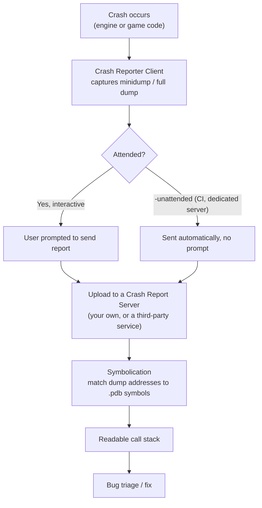

# Crash reporting

A crash on a player's machine, with no debugger attached and no way to reproduce it locally, is only
actionable if the engine captured enough information at the moment of the crash and you have a way to
turn that capture back into a readable call stack. Unreal's Crash Reporter Client is the piece that
captures the dump; a symbol server is the piece that makes the dump mean anything once it reaches you.
Without both wired up, "we got a crash report" and "we know why it crashed" stay two very different
statements.

## Why this matters

Post-launch, most crash information you'll ever get comes from players who can't repro the bug, can't run
a debugger, and won't file a detailed report. The Crash Reporter pipeline is what turns that silence into
a stack trace automatically — but only if the client is enabled for the build, dumps reach somewhere you
control, and your symbols are available when you go to read them. Skipping the setup doesn't mean crashes
stop happening; it means you find out about them from reviews instead of from data.

## Mental model



Two components exist independently: the **Crash Reporter Client**, a small standalone app that ships
alongside the editor and (optionally) runtime builds and handles the local capture-and-send step; and a
**Crash Report Server**, which receives, stores, and helps symbolicate incoming reports. Unreal ships the
client; it does not ship a ready-to-run server — you build one from the provided Crash Report Client
source, or route to a third-party crash-reporting service instead.

## The mechanics

### The Crash Reporter Client

The Crash Reporter Client is a standalone application, separate from your game's process, that the engine
launches when a crash is detected. In an interactive session, it shows the user a dialog (optionally with
a comment field) before sending; in `-unattended` mode (headless CI runs, automation, dedicated servers)
it sends without prompting, which is exactly the same flag covered in
[Automation and functional tests](./automation-and-functional-tests.md) for headless test runs — crash
reporting and automation both need "don't block on a modal dialog" for unattended execution.

Whether the client is included at all, and whether it's active for runtime (not just editor) builds, is a
packaging/project setting — a `Shipping` game build intended for players generally wants crash reporting
enabled so field crashes are actually captured, while a dedicated server build may route crashes to
different infrastructure entirely.

### What gets captured

On crash, the engine writes a dump file — by default a minidump (stack, register state, and enough module
metadata to symbolicate, without a full memory snapshot) — alongside engine logs from that session.
Full memory dumps (much larger, containing the process's entire memory at crash time) can be configured
for specific cases via engine crash-reporting configuration, matched by criteria such as branch name, and
routed to a specific network location rather than the default report path — useful for a small number of
particularly hard-to-diagnose crash signatures where a minidump's limited context isn't enough, without
paying the storage/transfer cost of full dumps for every crash.

:::note
The exact `.ini` section and key names for configuring full-dump rules (matched by branch name, with a
configurable output location) were referenced in the sources consulted here at the level of "this
capability exists and is config-driven," but the precise section/key names were not fully confirmed
against 5.7 — verify against `CrashReportCoreConfig`/your engine's crash-reporting config documentation
before relying on exact key names.
:::

### Symbol servers

A dump file is only as useful as the symbols available to read it. For your own locally-built binaries,
matching `.pdb` files just need to be reachable (locally, or via a shared network/symbol-server path) —
see [Debugging in Visual Studio](./debugging-in-visual-studio.md) for how Visual Studio resolves symbols
against a configured symbol server path. For a real release pipeline, the practice that scales is: your
CI build step that produces a Shipping package also uploads the matching `.pdb`s (keyed by the same
build/GUID the binaries carry) to a symbol store, so that any crash dump from that exact build — whenever
it arrives — can be symbolicated later without needing the original build machine's disk still intact.

On platforms where Unreal doesn't produce Windows-style `.pdb`s (iOS/tvOS use `.dSYM` bundles), the
equivalent step is a platform-specific symbolication tool run against the unsymbolicated crash and the
matching debug-symbol bundle:

```bash title="Symbolicating an iOS/tvOS crash with Xcode's symbolicatecrash"
export DEVELOPER_DIR="/Applications/Xcode.app/Contents/Developer"
cp -i "/Applications/Xcode.app/Contents/SharedFrameworks/DVTFoundation.framework/Versions/A/Resources/symbolicatecrash" .
./symbolicatecrash unsymbolicated.crash symbols.dSYM > symbolicated.crash
```

### From dump to fix

Once you have a dump and matching symbols, [Debugging in Visual Studio](./debugging-in-visual-studio.md)
covers opening a `.dmp` directly in Visual Studio to get an inspectable call stack and local variable
state at the moment of the crash — the crash-reporting pipeline's job ends at "you have a dump that
correlates to a specific build"; turning that dump into a fix is the same debugging skillset as any other
crash investigation.

### Building your own Crash Report Server

Because Epic doesn't ship a turnkey server, teams either stand up their own (using the provided Crash
Report Client source as a starting point for the receiving/storage side) or integrate one of several
third-party crash-reporting services the UE community commonly uses, each with its own integration docs
for hooking into Unreal's crash reporter output. The choice mostly comes down to whether you already have
infrastructure and want ownership of the data, versus wanting a working pipeline without building one.

### `ensure`/`check` versus an actual crash

Not every reportable problem is a hard crash. `ensure(Condition)` logs a callstack and continues execution
when `Condition` is false — useful for "this should never happen, but let's not take the whole process
down over it" — while `check(Condition)` (and its `checkf` variant with a formatted message) intentionally
crashes immediately when `Condition` is false, on the theory that continuing past a violated invariant is
more dangerous than stopping. Both route through the same reporting path as an unhandled crash when they
fire, so an `ensure` that fires constantly in the field shows up in your crash-reporting pipeline exactly
like a real crash would, just without terminating the session — see
[Logging and assertions](../02-cpp-in-unreal/logging-and-assertions.md) for the full breakdown of when to
reach for each. In `Shipping` builds, `check`/`ensure` behavior is reduced to fatal-only checks by default
— see the Shipping-strips-more-than-performance warning in
[Build configurations and targets](../01-toolchain-and-build/build-configurations-and-targets.md).

```cpp title="Deliberately triggering a test crash to verify the reporting pipeline end-to-end"
// Bind to a console command or a debug-only key so QA can confirm reports actually arrive
// before a real release goes out — see the release checklist's crash-reporting item.
static void TestCrashCommand()
{
    UE_LOG(LogTemp, Error, TEXT("Deliberate test crash triggered for crash-reporting verification"));
    check(false);
}
```

### Dedicated servers and headless processes

A dedicated server has no interactive user to show a crash dialog to, so it should always run with
`-unattended` (or an equivalent server-specific flag) so a crash reports and exits cleanly rather than
hanging on a modal prompt nobody will ever see — the same consideration that applies to headless
automation runs in [Automation and functional tests](./automation-and-functional-tests.md). Server crash
volume is also worth tracking separately from client crash volume: a server crash takes every connected
player down with it, which makes server crash-reporting latency (how fast you find out) matter more than
client crash-reporting latency in practice.

## Gotchas

:::warning No symbols means no stack, and a slightly-wrong .pdb is worse than none
A dump opened without matching symbols shows raw addresses and `<unknown>` frames — obviously useless. A
dump opened with a *mismatched* `.pdb` (right module, wrong build) can resolve to plausible-looking but
wrong function names and lines, which is worse because it looks trustworthy. Always confirm the module
version/GUID matches before trusting a symbolicated stack from an unfamiliar build.
:::

:::warning Crash reporting has to be enabled and reachable before you need it
There's no way to retroactively capture a crash that happened before the reporter was configured to run,
or before your report-receiving endpoint existed. Verify the crash reporting pipeline end-to-end (a
deliberate test crash, confirmed to arrive somewhere you can read it) before a build goes anywhere near
real players — this belongs on your [release checklist](./release-checklist.md), not discovered after
launch.
:::

:::caution Full crash dumps are expensive — don't default every crash signature to one
A full memory dump is dramatically larger than a minidump and costs real bandwidth/storage per
occurrence. Reserve full-dump configuration for specific, hard-to-diagnose crash signatures rather than
enabling it broadly, or a spike in one crash type can flood your intake pipeline.
:::

:::note
Third-party crash-reporting service names and their specific UE integration steps were intentionally not
enumerated here — evaluate current options against your platform requirements (which certification and
telemetry needs differ per storefront) rather than assuming any specific service from older community
references still applies.
:::

## See also

- [Debugging in Visual Studio](./debugging-in-visual-studio.md) — opening and reading a crash dump once you have one.
- [Automation and functional tests](./automation-and-functional-tests.md) — `-unattended` mode shared between headless test runs and unattended crash report submission.
- [Release checklist](./release-checklist.md) — verifying the crash-reporting pipeline before shipping.
- [Epic — Crash Reporting in Unreal Engine](https://dev.epicgames.com/documentation/unreal-engine/crash-reporting-in-unreal-engine)

