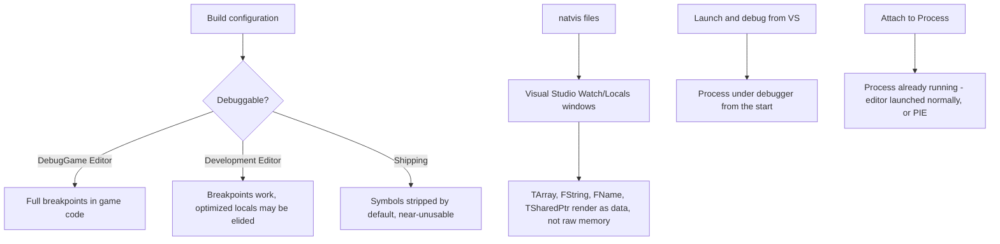

# Debugging in Visual Studio

Unreal's containers, reflection system, and string types don't display usefully in a stock debugger —
`TArray` shows raw pointer internals, `FName` shows an index into a table you can't see, and stepping
into `TSharedPtr` dereferences a control block instead of your object. Without natvis visualizers and a
build configured for real debugging, every session degenerates into `UE_LOG` statements and guesswork.
Knowing how to attach to a live editor, read a crash dump, and trust your call stack is what turns "it
crashes sometimes" into a fixed bug.

## Why this matters

Most UE crashes and logic bugs are not exotic — they're a null `UPROPERTY`, a use-after-`Destroy`, or a
Blueprint calling into C++ with unexpected state. All three are trivial to find with a working debugger
and painful to find without one. The gap between "I can see `TArray` contents and Unreal call stacks
cleanly" and "I'm reading raw memory" is almost entirely tooling setup, done once per machine.

## Mental model

Debugging an Unreal project is not fundamentally different from debugging any native C++ project —
Visual Studio's debugger, breakpoints, watch windows, and call stacks all work unmodified. What changes
is three things layered on top: which *build configuration* you attach to, whether the debugger *knows
how to display* Unreal's custom types, and whether you're debugging a process you launched or one you're
*attaching to* after the fact.



See [Build configurations and targets](../01-toolchain-and-build/build-configurations-and-targets.md)
for the full configuration-vs-target breakdown; this doc assumes you already know the difference between
`DebugGame Editor` and `Development Editor` and focuses on what makes the *debugger* itself useful.

## The mechanics

### Picking a configuration to debug

`DebugGame Editor` is the default choice for day-to-day C++ debugging: your game module compiles
unoptimized with full symbols, while the engine itself stays in the faster `Development` configuration.
Breakpoints in your code hit reliably, local variables are fully inspectable, and stepping behaves the
way you'd expect. `Development Editor` also works and is what most people are already running, but the
optimizer can reorder code, inline functions, and elide locals — a breakpoint may land a line or two off,
and a watched variable may show `<optimized out>`.

`Shipping` builds strip debug info and most diagnostic code by design (see the Shipping gotchas in
[Build configurations and targets](../01-toolchain-and-build/build-configurations-and-targets.md)) —
debugging one directly is a last resort, covered in the crash dump section below.

### natvis visualizers for Unreal types

Visual Studio's Watch, Locals, and Autos windows render types according to `.natvis` XML rules. Without
one for a type, the debugger falls back to showing raw member layout — for `TArray` that's a pointer,
count, and capacity int with no element preview; for `FName` it's an opaque comparison index; for
`TSharedPtr` it's the raw control-block pointer.

Unreal ships natvis files with the engine install that teach Visual Studio how to render its core
containers, string types, and smart pointers as their logical contents instead of their raw layout.

:::note
The exact shipped file name and directory (commonly referenced as living under `Engine/Extras/...`) is
not confirmed against 5.7 in the sources consulted here — locate it under your engine install's `Extras`
folder and verify it is loaded (Visual Studio auto-loads `.natvis` files referenced by the generated
`.vcxproj`, or you can add one manually under **Tools > Options > Debugging > Just My Code** related
natvis settings). If it isn't loading automatically, adding the file path under a project's
`.vcxproj.user` or copying it into `%USERPROFILE%\Documents\Visual Studio 2022\Visualizers\` are both
standard fallbacks for custom natvis files in Visual Studio generally.
:::

Once loaded, a `TArray<AActor*>` in the Watch window expands to show each element by index instead of a
`Ptr`/`ArrayNum`/`ArrayMax` triplet, and `FString`/`FName` show their text directly. This alone eliminates
most of the friction people associate with "debugging Unreal is harder than debugging normal C++."

### Symbol setup

Symbols (`.pdb` files) are what map a memory address back to a function name, file, and line. For code
you build yourself, Visual Studio generates and finds these automatically as long as you're debugging the
configuration you built. Problems show up in two situations:

- **Debugging a build you didn't compile locally** (a QA build, a build from CI, a teammate's packaged
  build) — the `.pdb` either needs to ship alongside the executable or be reachable from a symbol server.
- **Debugging into engine code** for a configuration where you only have binaries, not source-built
  symbols — Epic's Launcher-installed engine builds include matching symbols for the shipped engine
  binaries, which is one of the practical advantages of a Launcher install over building from source when
  you don't need engine-side changes.

A symbol server is just a well-known network or UNC path Visual Studio checks for matching `.pdb` files
by GUID/age, configured under **Tools > Options > Debugging > Symbols**. For a team, pointing everyone at
a shared symbol store (populated by your CI's packaging step) turns "here's a crash dump from QA" into an
immediately-readable call stack instead of a hex dump.

### Attaching to a running editor

Attaching lets you debug a process you didn't launch from Visual Studio — useful when a bug only
reproduces after minutes of play, when you want to inspect a running PIE session without restarting it,
or when the crash is in a build someone else is already running.

1. **Debug > Attach to Process...** (or `Ctrl+Alt+P`).
2. Filter for `UnrealEditor.exe` (or your project's editor-target executable name) and select the running
   instance.
3. Set breakpoints as normal — they bind once the debugger has attached and matched symbols.

Play-in-Editor (PIE) runs inside the same editor process, so attaching to the editor process also lets
you break inside PIE gameplay code. A separate standalone game process launched from the editor
(**Standalone Game** play mode, or a packaged build run alongside) is its own process and needs its own
attach.

:::caution Attaching after the crash is too late
If the process has already crashed, there's nothing left to attach to — Visual Studio can only attach to
a live process. For a crash that already happened, you debug the crash dump instead (below), not the
live process.
:::

### Reading a crash dump

When the engine crashes outside a debugger, the Crash Reporter Client captures a minidump (and, if
configured, a full memory dump) — see [Crash reporting](./crash-reporting.md) for how that capture and
upload pipeline works. To debug the crash itself:

1. Open the `.dmp` file directly in Visual Studio (**File > Open > File...**, or double-click it if
   `.dmp` is associated).
2. Visual Studio shows a summary page with **Debug with Native Only** — use this for a C++-only Unreal
   crash.
3. With matching symbols available (local `.pdb`s for your own build, or a symbol server for anything
   else — see above), the call stack resolves to real function names and lines, and you can inspect the
   state of locals at the moment of the crash exactly as if you'd hit a breakpoint there, though you
   cannot step forward or continue execution — a dump is a frozen snapshot, not a live process.

The most common failure mode reading a dump is a call stack full of `<unknown>` frames — that's always a
symbol mismatch (wrong `.pdb` version, or no symbols available for that binary at all), not a debugger
problem.

## Code

Breakpoints, conditional breakpoints, and tracepoints all work the same as in any C++ project — but two
patterns are specific to how Unreal structures debug-only code:

```cpp title="Conditional break tied to Unreal state"
void AMyCharacter::TakeDamageInternal(float Damage)
{
    // Right-click the breakpoint on the next line in VS and set a condition,
    // e.g. `Damage > 1000.f` or `GetName() == TEXT("BP_Boss_C_0")`
    Health -= Damage;

    ensureMsgf(Health >= -1000.f, TEXT("Health went implausibly negative: %f"), Health);
}
```

```cpp title="Debug-only code gated for non-Shipping builds"
#if !UE_BUILD_SHIPPING
void AMyCharacter::DumpDebugState() const
{
    UE_LOG(LogTemp, Log, TEXT("%s: Health=%.1f Location=%s"), *GetName(), Health, *GetActorLocation().ToString());
}
#endif
```

`#if !UE_BUILD_SHIPPING` guards mean this function simply doesn't exist in a `Shipping` binary — don't
expect to set a breakpoint on it there; see
[Build configurations and targets](../01-toolchain-and-build/build-configurations-and-targets.md) for
what else gets compiled out under `Shipping`.

## Gotchas

:::warning Optimized builds lie about locals
In `Development` configurations, the optimizer can eliminate or reuse a local variable's storage, so a
watch expression may show a stale or `<optimized out>` value even though the breakpoint hit the "right"
line. If a value looks wrong, switch to `DebugGame Editor` before trusting it.
:::

:::warning A missing natvis file makes containers look broken, not just ugly
If `TArray`/`FString`/`TSharedPtr` show raw pointers and counts instead of contents, that's a tooling gap,
not a sign your data is corrupted — check that Unreal's natvis files are actually loaded before spending
time chasing a "bug" that's really just an unformatted Watch window.
:::

:::warning Symbol mismatch produces a call stack that looks plausible but is wrong
Visual Studio will happily resolve addresses against a `.pdb` that's close-but-not-exact (a slightly
different build), producing function names that are subtly incorrect rather than an obvious failure.
Confirm the module's timestamp/GUID matches the `.pdb` before trusting a suspicious stack.
:::

:::note
Exact Visual Studio menu wording and natvis loading paths vary slightly across VS2022 updates; verify
against the VS version and engine version you're actually running if something in this section doesn't
match what you see.
:::

## See also

- [Build configurations and targets](../01-toolchain-and-build/build-configurations-and-targets.md) — which configuration to debug in.
- [Logging and assertions](../02-cpp-in-unreal/logging-and-assertions.md) — `UE_LOG`, `check`, and `ensure` as the complement to interactive debugging.
- [Crash reporting](./crash-reporting.md) — how a crash becomes a dump you can open in Visual Studio.
- [Epic — Debugging Unreal Engine projects in Visual Studio](https://dev.epicgames.com/documentation/unreal-engine/debugging-unreal-engine-with-visual-studio)
