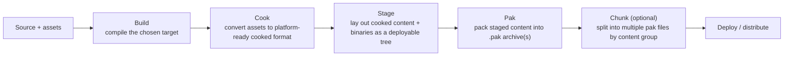

# Packaging and build targets

Building your project in Visual Studio and *packaging* it are different pipelines that happen to share a
lot of vocabulary. [Build configurations and targets](../01-toolchain-and-build/build-configurations-and-targets.md)
covers what `DebugGame Editor` vs. `Shipping`, and `Game` vs. `Editor`, actually mean at the compiler
level — this doc picks up from there and covers what happens *after* compilation: cooking content into a
platform-ready form, staging it into a deployable layout, and packing it into `.pak` files, optionally
split into chunks for streaming installs or DLC.

## Why this matters

A build that runs perfectly from the editor can fail to launch once packaged — missing content because it
was never referenced by anything the cooker could discover, a config value that only exists in an
editor-only `.ini` layer, or a `Shipping`-stripped code path nobody tested. Packaging is also where
`.pak` chunking decisions get made, which matters for anything with day-one patch size limits, staged
content unlocks, or platform storefront package-size rules.

## Mental model



`RunUAT.bat`/`RunUAT.sh`'s `BuildCookRun` command drives all of Build → Cook → Stage → Pak in one
invocation, which is also exactly what the editor's **Platforms > Package Project** menu triggers under
the hood — the editor menu and the command line ultimately run the same Automation Tool pipeline.

## The mechanics

### Build: which target actually gets packaged

A packaged project always builds the `Game` (or `Client`/`Server`) target, never `Editor` — see
[Build configurations and targets](../01-toolchain-and-build/build-configurations-and-targets.md) for
what distinguishes target types. The configuration is almost always `Shipping` for a real release, though
`Development` packages are common for QA builds that still need console commands, logging, and profiling
tools available.

### Cook: turning assets into platform-ready data

Cooking converts editor-format assets (uncompressed textures, editor-only metadata, source shaders) into
the platform-specific runtime format the target platform actually consumes — compressed textures in the
platform's native format, compiled shaders for that platform's RHI, stripped editor-only data. Cooking is
driven by the `-cook` flag to `BuildCookRun` and only includes assets the cooker can actually discover a
reference path to — which is why "an asset works in PIE but is missing when packaged" is almost always a
cooking/reference problem, not a packaging one; see
[Asset manager and soft references](../14-content-pipeline/asset-manager-and-soft-references.md) and
[Cooking and derived data cache](../14-content-pipeline/cooking-and-derived-data-cache.md) for how
asset references and the DDC interact with what actually gets cooked.

### Stage and Pak: from cooked files to a deployable archive

Staging arranges cooked content and platform binaries into the directory layout the target platform
expects at runtime. Pak archiving (`-pak`) then packs staged content into one or more `.pak` files — a
custom archive format Unreal uses to bundle cooked assets instead of shipping thousands of loose files,
which matters both for I/O performance and for making content harder to trivially browse/extract.

### Chunking

A `.pak` file can be split into multiple chunks, each assigned a subset of content — used for separating
day-one content from DLC, for platforms with streaming-install size tiers, or for prioritizing
"content needed to reach the main menu" ahead of everything else. Chunk assignment is driven by the
`UAssetManager` and **Primary Asset Labels** — you tag assets (directly or via a primary asset label
asset) with a chunk ID, enable **Generate Chunks** in **Project Settings > Packaging**, and the packaging
pipeline emits one `.pak` per chunk instead of a single monolithic archive.

```ini title="DefaultGame.ini — enabling chunked packaging"
[/Script/UnrealEd.ProjectPackagingSettings]
bGenerateChunks=True
bBuildHttpChunkInstallData=False
```

Chunked `.pak` output typically lands under `Saved/StagedBuilds/<Platform>/.../paks/`, one file per
chunk, alongside the base chunk-0 content every install needs regardless of which optional chunks are
present.

### Driving it all from RunUAT

```bash title="A full Build+Cook+Stage+Pak run for Windows Shipping"
Engine/Build/BatchFiles/RunUAT.bat BuildCookRun \
  -project="D:/MyGame/MyGame.uproject" \
  -platform=Win64 \
  -clientconfig=Shipping \
  -build -cook -stage -pak -archive \
  -archivedirectory="D:/Builds"
```

```bash title="Cook-only pass (useful for CI content validation without a full package)"
Engine/Build/BatchFiles/RunUAT.bat BuildCookRun \
  -project="D:/MyGame/MyGame.uproject" \
  -platform=Win64 \
  -run=cook \
  -cook -skipstage
```

```bash title="Windows ARM64+x64 combined build (UE 5.8+)"
Engine/Build/BatchFiles/RunUAT.bat BuildCookRun \
  -project=MyGame/MyGame.uproject \
  -platform=Win64 \
  -clientarchitecture=arm64+x64 \
  -build -cook -stage -pak
```

Each stage flag (`-build`, `-cook`, `-stage`, `-pak`, `-archive`) is independently toggleable — CI setups
commonly run a cheap cook-validation pass on every commit and reserve the full pak/archive pass for
nightly or release builds, since cooking and packing the full content set is the slowest part of the
pipeline.

### Packaging settings that affect the output

```ini title="DefaultGame.ini — packaging-relevant project settings"
[/Script/UnrealEd.ProjectPackagingSettings]
BuildConfiguration=PPBC_Shipping
bCompressed=True
bSkipEditorContent=True
UsePakFile=True
```

`bCompressed` trades package size for load-time decompression cost — uncompressed pak files load faster
at the cost of a larger install; `bSkipEditorContent` excludes editor-only content from the cook, which
should always be enabled for a real release package.

### The Project Launcher vs. raw RunUAT

The editor's **Project Launcher** (Window > Project Launcher) is a UI over the same `BuildCookRun`
pipeline, organized around reusable **launch profiles** — a named combination of platform, configuration,
cook mode, and deployment target you can save and re-run instead of retyping a `RunUAT` command line each
time. It's the friendlier entry point for a human running a one-off package; a raw `RunUAT` invocation
(or a script wrapping one) is the one that belongs in CI, since it's scriptable, has an exit code CI can
check, and doesn't depend on an interactive editor session being open.

### Incremental cooking and iteration speed

A full cook (especially the first one, or one following a large content change) can take a long time on
a big project — the cooker supports incremental cooking, only re-cooking assets that changed since the
last cook, which is the default behavior rather than something you opt into. This matters for CI
turnaround: a CI runner with a persisted, warm cook cache between runs is dramatically faster than one
that re-cooks from scratch every time, at the cost of needing to trust that cache is actually being
invalidated correctly when it should be — a stale incremental cook that silently keeps old cooked data
around after a source asset changed is a real (if uncommon) failure mode worth being aware of if a
packaged build behaves like it's running old content.

### DLC and patch builds

Beyond initial-release chunking, Unreal supports packaging separate DLC as its own pak-based content
package that references — but doesn't duplicate — the base game's cooked assets, and packaging patches
that only include what changed since a prior release rather than a full new build. Both are `BuildCookRun`
variations (additional flags identifying the base release to diff or patch against) layered on the same
Build → Cook → Stage → Pak pipeline described above, rather than a separate pipeline — worth knowing the
category exists even if your project doesn't need it yet, since retrofitting patch-based packaging onto a
project that's only ever shipped full rebuilds is more work than planning for it early.

## Gotchas

:::warning A Development-config package still exposes debug tooling
A package built with `-clientconfig=Development` keeps console commands, most logging, and
`ensure`-level diagnostics available — fine for internal QA builds, wrong for anything given to players
or reviewers. Confirm the configuration in your `BuildCookRun` invocation matches your intended audience;
see the Shipping-strips-more-than-performance warning in
[Build configurations and targets](../01-toolchain-and-build/build-configurations-and-targets.md).
:::

:::warning Content invisible to the cooker doesn't ship, even if it works in PIE
The cooker only includes assets it can trace a reference path to (a level reference, an asset manager
rule, a direct load path) — content that's only ever loaded via a dynamically-constructed soft path
string, or an asset with no discoverable reference, can be silently missing from a packaged build while
working fine in the editor where everything is already loaded. Always smoke-test a packaged build, not
just PIE.
:::

:::caution Chunk 0 is not optional
Even with chunking enabled, there's always a base chunk (chunk 0) containing whatever wasn't explicitly
assigned elsewhere plus anything needed to reach the point where other chunks can be requested. Don't
assume you can chunk away *everything* from the initial install — some minimum content set is unavoidable.
:::

:::warning `-skipstage` and cook-only CI passes don't validate the full pipeline
A cook-only CI job (fast, good for catching missing/broken content early) does not exercise staging,
pak archiving, or platform-specific packaging steps — a green cook-only CI run is not proof that a full
package will succeed. Run at least one full `BuildCookRun` with `-pak` before a release candidate.
:::

## See also

- [Build configurations and targets](../01-toolchain-and-build/build-configurations-and-targets.md) — target type and configuration, the axes this doc builds on top of.
- [Cooking and derived data cache](../14-content-pipeline/cooking-and-derived-data-cache.md) — what happens to assets during the cook step in more depth.
- [Asset manager and soft references](../14-content-pipeline/asset-manager-and-soft-references.md) — primary asset labels and chunk assignment.
- [Release checklist](./release-checklist.md) — packaging validation as part of a shipping pass.
- [Epic — Packaging Unreal Engine Projects](https://dev.epicgames.com/documentation/unreal-engine/packaging-unreal-engine-projects)

