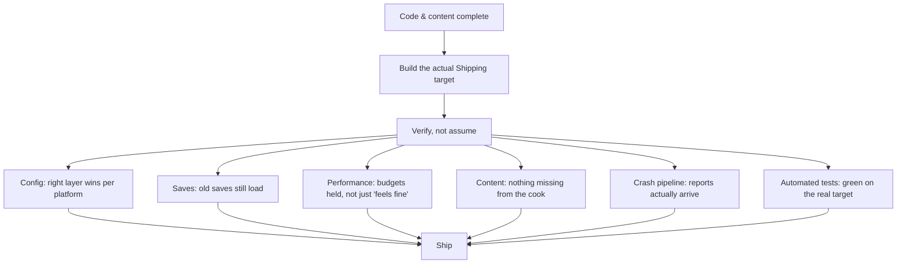

# Release checklist

Every topic in this folder — debugging setup, automated tests, config layering, save versioning, packaging,
crash reporting — exists to prevent a specific category of "found out after ship" problem. A release
checklist's job is to force you to actually check each of those categories deliberately, once, right
before a build goes out, instead of trusting that "it worked in the editor" generalizes to "it works for
players." This doc is a working list, not a policy document — treat it as a starting checklist to adapt,
not a substitute for platform certification requirements.

## Why this matters

Individually, every item below is something you already know how to verify. Collectively, under release
pressure, they're exactly the things that get skipped because "we tested that weeks ago" — and weeks ago
was before the last ten commits. A checklist's value isn't teaching you anything new; it's making the
skip visible and deliberate instead of silent.

## Mental model



Each branch below corresponds to a folder elsewhere in this knowledge base — the checklist's job is to
route you back to the doc that covers *how* to verify each item, not to re-explain the mechanics here.

## The mechanics

### Build and packaging

- [ ] Package with the actual `Shipping` configuration and `Game`/`Client`/`Server` target you intend to
  ship — not `Development`, not `DebugGame Editor`. See
  [Build configurations and targets](../01-toolchain-and-build/build-configurations-and-targets.md) for
  what `Shipping` strips (console commands, most logging, non-fatal `check`/`ensure` diagnostics) —
  behavior gated behind those macros needs testing in a build that actually has them stripped, not
  assumed safe because it worked in the editor.
- [ ] Run a full `RunUAT BuildCookRun` with `-pak` (and `-archive` if you use it), not just a cook-only CI
  pass — see [Packaging and build targets](./packaging-and-build-targets.md) for why a green cook-only job
  doesn't prove staging/packing succeed.
- [ ] If you use chunking, verify chunk 0 alone is enough to reach a playable state, and that
  DLC/optional chunks are actually reachable post-install — see
  [Packaging and build targets](./packaging-and-build-targets.md#chunking).
- [ ] Confirm `bSkipEditorContent=True` and your intended `bCompressed` setting are what you expect in the
  packaging settings that actually apply to the build — not left over from an earlier debugging session.

### Config

- [ ] Check platform-specific `.ini` overrides for every platform you ship on — a value fixed in your
  project-wide `Default*.ini` can still be silently overridden by a forgotten
  `Config/<Platform>/<Platform><Category>.ini` layer. See
  [Config system and .ini files](./config-system-and-ini.md).
- [ ] Grep for stray `+`/`-` prefix mistakes on array config properties that were touched recently —
  these are the most common silent config regression and won't show up as a build error.
- [ ] Confirm no debug/cheat-enabling config values (`DefaultEngine.ini` tweaks made for internal testing)
  are still set to their debug values in the config layer that actually ships.

### Saves

- [ ] Load a save file written by the *previous* shipped build (not one written by today's build) into
  today's build, and confirm it loads correctly, not just "doesn't crash." See
  [Save game and serialization](./save-game-and-serialization.md).
- [ ] Confirm every `Serialize` override with a custom version bump was actually exercised against an
  old-version save during this pass — a version check that's never hit an old file is unverified, not
  verified.
- [ ] If this release changes save-relevant struct/array layouts, confirm the custom version was bumped
  in the same change, not left at its previous value.

### Performance

- [ ] Profile the actual `Shipping` (or at minimum `Development`) packaged build, not a `DebugGame Editor`
  session — editor overhead and unoptimized game code both distort numbers relative to what ships. See
  [Unreal Insights](../15-performance-and-threading/unreal-insights.md) and
  [Stat commands and console](../15-performance-and-threading/stat-commands-and-console.md) for capturing
  real numbers.
- [ ] Re-check memory budgets against the packaged build's actual footprint, not an editor estimate — see
  [Memory budgets and profiling](../15-performance-and-threading/memory-budgets-and-profiling.md).
- [ ] Confirm known optimization patterns applied earlier in development haven't regressed under recent
  content additions — see [Optimization patterns](../15-performance-and-threading/optimization-patterns.md).

### Content

- [ ] Smoke-test the packaged build for content that works in PIE but is missing once cooked — a common
  symptom of an asset the cooker couldn't discover a reference path to. See
  [Asset manager and soft references](../14-content-pipeline/asset-manager-and-soft-references.md) and
  [Packaging and build targets](./packaging-and-build-targets.md).
- [ ] Confirm the Derived Data Cache used for the release build is either freshly generated or from a
  trusted shared cache — a stale/corrupt DDC entry can ship subtly wrong cooked data. See
  [Cooking and derived data cache](../14-content-pipeline/cooking-and-derived-data-cache.md).

### Crash reporting

- [ ] Deliberately trigger a test crash in the exact build you intend to ship, and confirm a report
  actually arrives somewhere you can read it — verifying "the pipeline is wired up" is not optional. See
  [Crash reporting](./crash-reporting.md).
- [ ] Confirm `.pdb`/`.dSYM` symbols for this exact build are archived somewhere reachable (a symbol
  server or equivalent) before the build goes out — symbolicating a crash from a build whose symbols were
  never kept is not possible after the fact. See
  [Debugging in Visual Studio](./debugging-in-visual-studio.md).

### Automated tests

- [ ] Run the full automated test suite against the actual target you're shipping (or as close to it as
  your CI supports), not only inside the editor — a test flagged for an editor application context is
  invisible, not failing, when queried from a packaged process; make sure this isn't hiding a suite that
  never actually ran for this release. See
  [Automation and functional tests](./automation-and-functional-tests.md).
- [ ] Confirm CI's headless automation run actually exited non-zero on a deliberately-introduced failing
  test, if you haven't verified that recently — a CI job that always reports green regardless of test
  outcome is worse than no CI job, because it looks like coverage.

## Code

```bash title="A representative release-verification sequence"
# 1. Full package build for the real target/configuration
Engine/Build/BatchFiles/RunUAT.bat BuildCookRun \
  -project="D:/MyGame/MyGame.uproject" -platform=Win64 -clientconfig=Shipping \
  -build -cook -stage -pak -archive -archivedirectory="D:/Builds/Release-1.2.0"

# 2. Headless automation pass against the packaged/editor-cmd target
UnrealEditor-Cmd.exe "D:/MyGame/MyGame.uproject" \
  -ExecCmds="Automation RunTests MyGame" -unattended -nopause -nullrhi -log

# 3. Load-test a previous-build save against today's binary (manual step, run the packaged .exe)
```

```ini title="Sanity check: confirm debug-only overrides are not present in the shipping config layer"
; Search your project's Default*.ini and platform override files for leftovers like:
; [/Script/Engine.PlayerController]
; bShowMouseCursor=True     ; left on from UI debugging — should not ship this way
```

## Gotchas

:::warning "It worked last time we checked" is not a release gate
Every item above needs to be re-verified against the specific build being released, not assumed to still
hold from an earlier pass — a config change, a save-format edit, or a new content reference made in the
final days before release is exactly the kind of change most likely to be unverified against this list.
:::

:::caution This list is a starting point, not a certification substitute
Console/storefront platforms typically have their own mandatory certification checklists (TRC/XR/Lotcheck
equivalents) with requirements well beyond what's listed here — this checklist covers Unreal-specific
technical risk, not platform business/certification requirements.
:::

:::warning A checklist run by one person under deadline pressure tends to get shortened
The value of a written checklist degrades fast if it's silently trimmed under time pressure by whoever
happens to be running it. Treat skipped items as an explicit, logged decision ("skipped save-compat check
for this hotfix, no save format changes since last release"), not a silent omission.
:::

## See also

- [Packaging and build targets](./packaging-and-build-targets.md) — the build pipeline this checklist assumes.
- [Save game and serialization](./save-game-and-serialization.md) — the versioning discipline behind the saves section above.
- [Config system and .ini files](./config-system-and-ini.md) — the layering discipline behind the config section above.
- [Crash reporting](./crash-reporting.md) — verifying the pipeline this checklist asks you to test.
- [Memory budgets and profiling](../15-performance-and-threading/memory-budgets-and-profiling.md) — the performance-budget verification this checklist points at.
- [Epic — Testing and Optimizing Your Content](https://dev.epicgames.com/documentation/unreal-engine/testing-and-optimizing-your-content)
