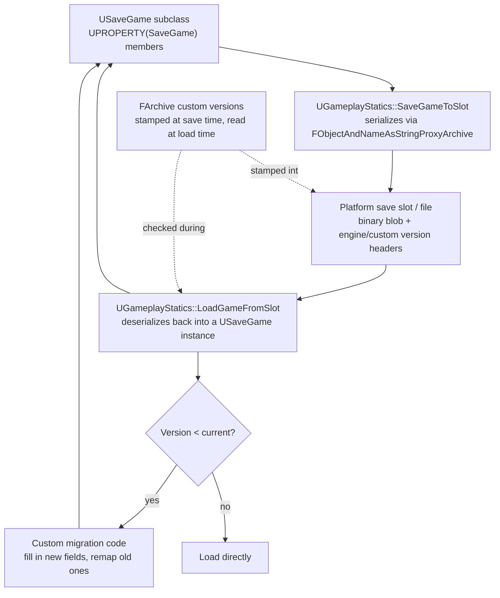

# Save game and serialization

A save file written today has to keep loading correctly after every future patch, DLC, and refactor for
as long as the game is playable — which for a live game can be years past when the code that wrote it
last existed. `USaveGame` makes writing a save trivially easy; it does nothing to protect you from
breaking every existing save the moment you add, remove, reorder, or retype a member variable. Save
versioning is the part of Unreal serialization most likely to turn a routine content patch into "please
delete your save and start over" for every player who already has hours in the game.

## Why this matters

`UGameplayStatics::SaveGameToSlot`/`LoadGameFromSlot` serialize a `USaveGame` object's `UPROPERTY`s
automatically, which makes the happy path deceptively simple: add a property, save, load, done. The
danger is entirely in what happens *after* that point in time — when you add a new property to the same
class six months later and an old save file, written before that property existed, tries to load into it.
Unreal's serialization is forgiving about this in ways that hide bugs (a missing field silently defaults)
and unforgiving in others (a changed type or removed `enum` value can silently corrupt data) unless you
explicitly version your save format.

## Mental model



The critical piece most projects skip is the `Version` branch: `FArchive` tracks not just the engine's
own version but a container of *your* custom versions, registered once and bumped every time your save
format changes in a way that needs migration logic — without this, "did this save predate feature X" is
a question your loading code has no way to answer.

## The mechanics

### USaveGame and the GameplayStatics API

`USaveGame` is a plain `UObject` subclass meant to hold nothing but data — no gameplay logic, no world
references, since it needs to serialize independent of any running level or actor.

```cpp title="MySaveGame.h"
UCLASS()
class MYGAME_API UMySaveGame : public USaveGame
{
    GENERATED_BODY()

public:
    UPROPERTY(SaveGame)
    FString PlayerName;

    UPROPERTY(SaveGame)
    int32 PlayerLevel = 1;

    UPROPERTY(SaveGame)
    TArray<FInventoryEntry> Inventory;
};
```

Note the specifier is `SaveGame`, not `Config` — `SaveGame`-marked properties are what
`UGameplayStatics::SaveGameToSlot` serializes; it's an orthogonal system to the `.ini` config layer
covered in [Config system and .ini files](./config-system-and-ini.md), even though both use a
`UPROPERTY` specifier and a `UGameplayStatics`-style save/load pair conceptually.

```cpp title="Saving"
void AMyPlayerController::SaveProgress()
{
    if (UMySaveGame* SaveGameInstance = Cast<UMySaveGame>(
            UGameplayStatics::CreateSaveGameObject(UMySaveGame::StaticClass())))
    {
        SaveGameInstance->PlayerName = PlayerNameCached;
        SaveGameInstance->PlayerLevel = CurrentLevel;
        SaveGameInstance->Inventory = InventoryComponent->GetEntries();

        if (UGameplayStatics::SaveGameToSlot(SaveGameInstance, TEXT("PlayerSave"), /*UserIndex=*/0))
        {
            UE_LOG(LogTemp, Log, TEXT("Save succeeded."));
        }
    }
}
```

```cpp title="Loading"
void AMyPlayerController::LoadProgress()
{
    if (UMySaveGame* Loaded = Cast<UMySaveGame>(
            UGameplayStatics::LoadGameFromSlot(TEXT("PlayerSave"), /*UserIndex=*/0)))
    {
        PlayerNameCached = Loaded->PlayerName;
        CurrentLevel = Loaded->PlayerLevel;
        InventoryComponent->SetEntries(Loaded->Inventory);
    }
}
```

`SaveGameToSlot`/`LoadGameFromSlot` are synchronous and block on disk I/O — fine for a pause-menu save,
but worth moving off the game thread (or scheduling around a loading screen) for a save large enough to
cause a hitch; Unreal also exposes async slot save/load variants for exactly that case.

### Custom serialization beyond automatic UPROPERTY reflection

Automatic `UPROPERTY(SaveGame)` serialization covers most needs, but it walks the reflection system and
writes each property using its default archiver behavior — it's not the right tool when you need custom
binary layout, compression, or encryption, or when a member isn't a `UPROPERTY` at all (a raw non-UObject
struct with hand-rolled data, for instance). For that, override `Serialize(FArchive&)` and read/write
explicitly:

```cpp title="Custom Serialize override for a save object with hand-managed fields"
void UMySaveGame::Serialize(FArchive& Ar)
{
    Super::Serialize(Ar); // still serializes the UPROPERTY(SaveGame) members via reflection

    Ar.UsingCustomVersion(FMyGameSaveVersion::GUID);
    const int32 SavedVersion = Ar.CustomVer(FMyGameSaveVersion::GUID);

    if (SavedVersion >= FMyGameSaveVersion::AddedDifficultyModifier)
    {
        Ar << DifficultyModifier;
    }
    else if (Ar.IsLoading())
    {
        DifficultyModifier = 1.0f; // sensible default for saves written before this field existed
    }
}
```

`FArchive::operator<<` is the workhorse — the same operator serializes on save (`Ar.IsSaving()`) and
deserializes on load (`Ar.IsLoading()`); the direction is implicit in which mode the archive was opened
in, not something your code branches on for basic reads/writes.

### Versioning saves against future code changes

This is the part that protects you from breaking existing players' saves. Register a custom version GUID
once per save-format "concern," and bump an enum value in it every time you make a serialization-breaking
change:

```cpp title="MyGameSaveVersion.h"
struct FMyGameSaveVersion
{
    enum Type
    {
        BeforeCustomVersionWasAdded = 0,
        AddedDifficultyModifier = 1,
        AddedInventoryStackCounts = 2,

        // -----<new versions can be added above this line>-----
        VersionPlusOne,
        LatestVersion = VersionPlusOne - 1
    };

    // A GUID unique to this project — generate your own, never reuse this one.
    inline static const FGuid GUID(0x11111111, 0x22222222, 0x33333333, 0x44444444);

private:
    FMyGameSaveVersion() {}
};
```

```cpp title="Registering the version so it gets stamped into every save"
FCustomVersionRegistration GRegisterMyGameSaveVersion(
    FMyGameSaveVersion::GUID,
    FMyGameSaveVersion::LatestVersion,
    TEXT("MyGameSaveVer"));
```

Every save written after registration stamps the *current* `LatestVersion` value into the archive's
custom version container alongside the engine's own version (`ArEngineVer`/`ArLicenseeUEVer`, tracked
automatically by `FArchive`). When an old save loads, `Ar.CustomVer(FMyGameSaveVersion::GUID)` returns
whatever version *that save* was written with — not the current one — which is what lets your `Serialize`
override branch on "was this field present when this save was written."

The pattern generalizes to any structural change:

- **New field added** — guard the read with `if (SavedVersion >= YourNewVersionEnum)`, and supply an
  explicit default in the `else` branch for old saves.
- **Field removed** — stop writing it going forward, but on load for old saves you may still need to
  *read past* the old bytes if the field was written unconditionally before, or (cleaner) explicitly gate
  the old read behind `if (SavedVersion < RemovalVersion)` so the archive cursor stays aligned even though
  you throw the value away.
- **Field retyped or reinterpreted** — never silently reuse a property name for a different meaning across
  a version boundary; branch and convert explicitly, or introduce a new field and deprecate the old one.
- **Field renamed at the reflection level** — `UPROPERTY(SaveGame)` automatic serialization matches by
  the property's serialized tag, so a pure C++ rename of the variable (keeping the same underlying data)
  is usually safe, but changing the *type* is not.

### FArchive versioning underneath USaveGame

Under the hood, `UGameplayStatics::SaveGameToSlot`/`LoadGameFromSlot` build the archive around
`FObjectAndNameAsStringProxyArchive`, which itself wraps a memory or file archive — but everything above
(custom versions, `Serialize` overrides, `Ar.IsLoading()`/`Ar.IsSaving()`) works identically regardless of
that wrapper, because it's all `FArchive` API. This is the same mechanism engine systems use for their own
forward/backward compatibility (asset serialization, network replication payloads) — save games are just
one more `FArchive` consumer, which is exactly why the same custom-version machinery applies.

## Gotchas

:::warning Forgetting to bump the custom version is worse than not versioning at all
A custom version that exists but never gets incremented when the format changes gives false confidence —
your `Serialize` override branches on a version number that never reflects the actual change you made,
so old and new saves both take the "current" code path and the old ones load garbage into the new field.
Bump the enum in the same commit that changes the serialized layout, not later.
:::

:::warning TArray/TMap element changes need the same version discipline as top-level fields
Adding a member to a struct that's serialized inside a `TArray<FMyStruct>` SaveGame property is a format
change like any other — the struct's own `Serialize` (if it has one) or its reflected properties need the
same guarded-read treatment, or every array element in an old save silently gets whatever the new field's
in-memory default happens to be.
:::

:::caution Never reuse a custom version GUID across unrelated projects or systems
The GUID is how the archive looks up "which version number belongs to which concern" in its version
container — copying a GUID from an example (including this one) into a real project risks colliding with
another system's version tracking. Generate a fresh GUID per project/subsystem.
:::

:::warning Slot names and user index are platform-meaningful, not just a filename
`SaveGameToSlot`/`LoadGameFromSlot`'s `SlotName`/`UserIndex` pair maps to different physical storage per
platform (a simple file on Windows, a platform save-system entry on console). Don't assume slot names are
freely renameable after shipping — a rename is effectively "this save no longer exists" for existing
players on platforms where the slot name is part of the storage key.
:::

:::note
Not confirmed against 5.7 in the sources consulted: the exact async save/load API names
(`AsyncSaveGameToSlot`/equivalent) and their callback signatures — verify against
`UGameplayStatics` in your engine version before relying on the async path for a large save that would
otherwise hitch on the game thread.
:::

## See also

- [Config system and .ini files](./config-system-and-ini.md) — the sibling persistence system for settings rather than player state; different specifier (`Config` vs `SaveGame`), different lifecycle.
- [UObject and reflection](../02-cpp-in-unreal/uobject-and-reflection.md) — how `UPROPERTY` reflection is what automatic serialization walks.
- [Release checklist](./release-checklist.md) — save compatibility as a pre-ship verification item.
- [Epic — Saving and Loading Your Game](https://dev.epicgames.com/documentation/unreal-engine/saving-and-loading-your-game-in-unreal-engine)
