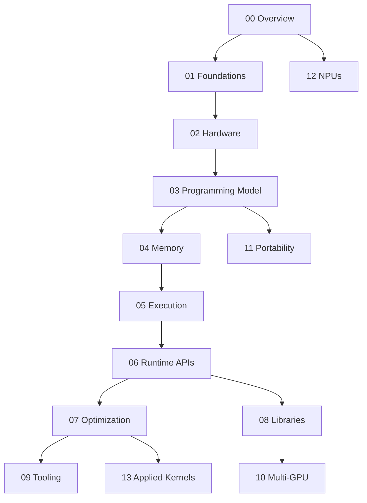

# How This Section Is Organised

Fourteen folders is a lot of surface area, and reading them front to back is not the intended use. The [section index](../readme.md) lists what each folder covers; this page answers the question that list doesn't — what each folder *assumes you already know*, and what it hands to the folder after it. That is the information you need to enter in the middle, which is what most people do.

The dependency structure is real but shallow. Folders 00 through 02 are a prerequisite chain that everything else rests on. Folders 03 through 07 are a second chain, the CUDA core, where each folder genuinely needs the one before. After that the graph fans out: libraries, tooling, multi-GPU, portability, NPUs, and applied kernels each hang off a specific earlier folder and are otherwise independent of one another.

## The folder map

**[00 Overview](./why-gpus-exist.md)** assumes nothing beyond ordinary programming experience. It establishes the transistor-budget argument for why GPUs look the way they do, positions them against CPUs and NPUs, surveys the vendor landscape, and — most usefully — sets out when *not* to reach for a GPU. It hands forward a vocabulary (warp, occupancy, coalescing, arithmetic intensity) collected in the [glossary](./glossary.md), and the habit of asking whether a workload is shaped right before writing any code.

**[01 Parallel Computing Foundations](../01-parallel-computing-foundations/flynn-taxonomy-simd-simt.md)** assumes you accept the throughput-machine premise. It supplies the analytical vocabulary that the rest of the section reasons in: Flynn's taxonomy and where SIMT sits within it, Amdahl and Gustafson, latency hiding through oversubscription, the memory-bound/compute-bound split, arithmetic intensity and the roofline, and the standard parallel patterns (map, reduce, scan, gather/scatter, stencil). It hands forward the ability to predict *before profiling* which limit a kernel will hit.

**[02 GPU Hardware Architecture](../02-gpu-hardware-architecture/anatomy-of-a-gpu.md)** assumes the foundations vocabulary. It is the physical layer: GPCs and SMs, warp schedulers, the register file, the L1/shared and L2 hierarchy, HBM and GDDR bandwidth, PCIe and NVLink, tensor cores, and how the NVIDIA generations from Volta through Blackwell differ. It hands forward compute capability as the versioning axis for every feature discussed later, and the mental model that makes profiler counters interpretable.

**[03 CUDA Programming Model](../03-cuda-programming-model/installing-the-cuda-toolkit.md)** assumes the hardware model, because threads, blocks, and grids only make sense as a software mapping onto SMs and warps. It covers toolkit installation, your first kernel, the thread hierarchy and indexing, launch configuration, function qualifiers, thread block clusters (compute capability 9.0+), and the compilation model — host/device split, PTX, SASS, and separate compilation. It hands forward everything needed to write and build a correct kernel.

**[04 CUDA Memory Model](../04-cuda-memory-model/memory-spaces-overview.md)** assumes you can write and launch a kernel. It is where correct code becomes fast code: the memory spaces, global-memory coalescing, shared memory and its bank conflicts, registers and register spilling, constant and texture memory, unified memory, pinned memory and transfers, asynchronous copies, distributed shared memory, and the consistency model. It hands forward the access-pattern discipline that dominates optimization work.

**[05 Execution and Synchronization](../05-execution-and-synchronization/warp-execution-and-divergence.md)** assumes both the thread hierarchy and the memory spaces, since synchronization is meaningless without knowing what memory it orders. It covers warp execution and divergence, independent thread scheduling (compute capability 7.0+), the `__shfl_sync`-family warp primitives, block barriers, cooperative groups, grid-wide synchronization, atomics, and reductions and scans as worked patterns. It hands forward correctness under concurrency.

**[06 CUDA Runtime and APIs](../06-cuda-runtime-and-apis/runtime-vs-driver-api.md)** assumes working kernels and shifts attention to the host side. Runtime versus driver API, device management, memory allocation APIs, error handling, streams and concurrency, events and timing, CUDA graphs, dynamic parallelism, and MPS/MIG for sharing a device. It hands forward the ability to overlap transfers with compute and to time things honestly — a prerequisite for optimization, which cannot proceed without a trustworthy measurement.

**[07 Kernel Optimization](../07-kernel-optimization/the-optimization-workflow.md)** assumes 04, 05, and 06 together. It is the measure-classify-fix workflow, plus the specific levers: memory access optimization, shared-memory tiling, occupancy tuning, divergence reduction, instruction-level work, kernel fusion and launch overhead, software pipelining, programming tensor cores directly, inline PTX, and a catalogue of antipatterns. It hands forward to both tooling and the applied kernels, which are its worked examples.

**[08 Libraries and Ecosystem](../08-libraries-and-ecosystem/choosing-a-library.md)** assumes the runtime layer (streams, allocation, error handling) but deliberately not the optimization material — the point of a library is that someone else did that. cuBLAS, cuDNN, the math libraries, Thrust, CUB, CUTLASS, NCCL, and the Python entry points (CuPy, Numba CUDA, Triton, PyTorch extensions). It hands forward the correct default: check whether a tuned library already solves your problem before writing a kernel.

**[09 Tooling, Profiling, and Debugging](../09-tooling-profiling-and-debugging/building-cuda-with-cmake.md)** assumes you have something worth measuring and an idea of what the counters mean, hence its dependency on optimization. CMake builds, Nsight Systems for timeline-level analysis, Nsight Compute for kernel-level counters, `cuda-gdb` and Compute Sanitizer, which metrics actually matter, benchmarking methodology, and roofline analysis applied to real output. It hands forward evidence, which is what turns optimization from guessing into engineering.

**[10 Multi-GPU and Scaling](../10-multi-gpu-and-scaling/multi-gpu-basics.md)** assumes streams and the library layer, since NCCL is where most multi-GPU work actually happens. Multi-GPU basics, peer-to-peer and NVLink, collective operations, data/tensor/pipeline parallelism strategies, GPUDirect and RDMA, and cluster schedulers. It hands forward the scaling axis once one device is no longer enough.

**[11 Portable and Vendor-Neutral](../11-portable-and-vendor-neutral/the-portability-problem.md)** assumes only the CUDA programming model, because every alternative is presented by comparison to it. The portability problem itself, HIP and ROCm, SYCL and oneAPI, OpenCL, OpenMP and OpenACC offload, Vulkan and DirectX compute, Metal on Apple silicon, WebGPU, and a decision procedure for choosing among them. It hands forward the ability to target hardware that is not NVIDIA's.

**[12 NPUs and Inference Accelerators](../12-npu-and-inference-accelerators/what-is-an-npu.md)** hangs directly off the overview rather than off CUDA — you do not need to know how to write a kernel to deploy a model to an NPU, and mostly you cannot. Systolic arrays and dataflow architectures, Google's TPU, edge NPUs, Jetson and the DLA, quantization for accelerators, TensorRT, ONNX Runtime, OpenVINO, compiler stacks, and deployment practice. It hands forward the inference-deployment path in full.

**[13 Applied Kernels and Patterns](../13-applied-kernels-and-patterns/vector-add-and-saxpy.md)** assumes the optimization material and exists to exercise it. Each page takes one problem — SAXPY, reduction, scan, transpose, matrix multiply with and without tensor cores, stencils, histograms, sorting, sparse matrix-vector, softmax and layernorm, FlashAttention — and walks it through progressive versions, naming the specific limit each version hits and the technique that removes it. It hands forward nothing; it is where the section lands.

## Three learning paths

The index lists the three sequences; what follows is when each is the right one and what it lets you skip.

**Write fast CUDA kernels** is the default path and the longest: 00–02 for grounding, then the 03→04→05→07 chain, then applied kernels as practice. Take it if you will be writing device code yourself. You can defer 06 to the point where you need overlapping transfers or honest timing, and defer 08 entirely — though you should read [Choosing a Library](../08-libraries-and-ecosystem/choosing-a-library.md) early enough to discover that cuBLAS already does what you were about to hand-write.

**Understand the hardware** is for people who need to reason about GPU performance without owning the kernels — capacity planning, architecture review, evaluating a vendor claim, or reading a profile someone else produced. It runs 01 → 02 → 09, and it skips the entire CUDA core. The [roofline](../09-tooling-profiling-and-debugging/roofline-in-practice.md) and [metrics that matter](../09-tooling-profiling-and-debugging/metrics-that-matter.md) pages are the payoff.

**Deploy models on accelerators** is the shortest and least CUDA-shaped: 00 for the comparison material, 08 to know what the frameworks are calling underneath, then 12 for quantization, TensorRT, ONNX Runtime, and edge targets. It skips 03–07 and 10–11 unless you hit a custom operator, at which point you rejoin the kernel path at 03.

## What is deliberately not here

**Graphics and rendering.** No rasterization, no shading models, no render pipeline, no ray-tracing cores as graphics features. This section treats the GPU purely as a compute device. The hardware overlap is real — tensor cores serve DLSS as readily as they serve GEMM — but the material and the audience are different. For rendering, see the Unreal Engine section's [GPU Profiling](../../game-development/unreal-engine/12-rendering/gpu-profiling.md) page and its neighbours.

**Machine learning theory.** Backpropagation, optimizers, architecture design, and training dynamics are out of scope. This section covers how a matrix multiply or an attention kernel is made fast, not why the model wants one. For the theory, start at [Machine Learning](../../machine-learning/intro.md).

**Pre-CUDA-12 material.** Everything here documents CUDA 12 and later semantics against current hardware. Removed APIs are not documented as deprecated — the non-`_sync` warp intrinsics (`__shfl`, `__any`, `__ballot`) are simply gone, and only the `__shfl_sync` family appears. Architectures before Pascal, `cudaThreadSynchronize`-era APIs, and the pre-Volta assumption of lockstep warp execution are all absent. If you are maintaining code written against CUDA 8, the correct move is to read the current material and then check the toolkit release notes for what changed under you.

## Conventions

The index states the section-wide conventions; the details worth knowing before you start reading are these.

Code fences are `cpp` for CUDA C++ — there is no CUDA grammar available to the syntax highlighter, and `cpp` is the closest correct choice, so device-specific tokens like `__global__` and `<<<grid, block>>>` will not be highlighted specially. PTX and SASS listings use `text` for the same reason. Python appears only in [Libraries and Ecosystem](../08-libraries-and-ecosystem/cuda-python-and-cupy.md) and on the toolkit-installation page; everywhere else, examples are CUDA C++ even where a Python equivalent would be shorter.

Admonitions carry consistent meanings. `:::info` frames the problem a feature exists to solve, and usually opens a page's substantive content. `:::note` carries version and compute-capability caveats — every feature with a hardware floor gets one, so if you are targeting older hardware, scanning the notes is the fastest way to find what you cannot use. `:::tip` is practical guidance, and `:::warning` marks correctness traps and performance cliffs, which on a GPU are frequently the same thing.

Every performance figure names the part it describes, because none of them transfer between generations. Every page ends with a **See also** list ordered siblings first, then cross-folder, then back to the index — which is the fastest way to move sideways through the section rather than downward through the sidebar.

## See also

- [Glossary](./glossary.md) — every term the section assumes, defined once and linked to the page that develops it.
- [Why GPUs Exist](./why-gpus-exist.md) — the argument the whole dependency graph is built on top of.
- [GPU & Accelerators](../readme.md) — the section index, with the folder table and the three paths in brief.
