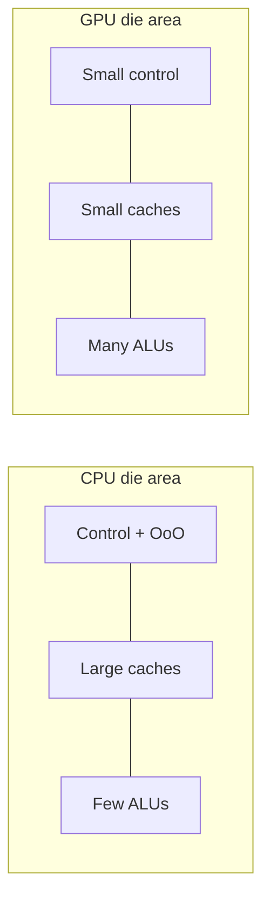

# Why GPUs Exist

The useful question is not "why is a GPU faster than a CPU" — it usually isn't. A single CPU core will finish one dependent chain of instructions sooner than any GPU will, and it will do it on branchy, pointer-chasing, irregular code that a GPU handles badly. The real question is how a fixed transistor budget gets spent. A CPU spends most of its area on machinery that makes *one* instruction stream go fast: out-of-order scheduling, register renaming, branch prediction, and a deep cache hierarchy that hides DRAM latency from a handful of threads. A GPU deletes almost all of that and spends the reclaimed area on arithmetic units, then keeps them busy by oversubscribing the machine with far more threads than can execute in any one cycle.

That trade only pays off under a specific precondition: you must have thousands of independent work items that want the same operation applied to different data. Meet it and the GPU wins by an order of magnitude or more. Miss it — one long dependency chain, a few hundred elements, data that has to cross a bus every iteration — and you get a slower machine with a harder programming model. Everything else in this section is downstream of that one bargain.

:::info[The problem it solves]
Throughput-oriented work: large, regular, data-parallel problems where total time-to-finish for a huge batch matters and the latency of any individual work item does not. Dense linear algebra, image and signal processing, neural-network training and inference, particle and grid simulations, Monte Carlo. If your workload is a loop over millions of elements whose iterations don't talk to each other, it is the shape a GPU was built for.
:::

## Two ways to spend a transistor budget

Both a CPU and a GPU start from the same raw resource — a die of a given area on a given process node — and both are ultimately limited by the same wall: DRAM is hundreds of cycles away, and arithmetic units stall waiting for it. They pick opposite strategies for that wall.

The CPU **avoids** the latency. It builds large caches so most loads never reach DRAM, and it builds out-of-order execution so that when a load does miss, the core can keep issuing later independent instructions from the same thread instead of stalling. Both are expensive in area and power, and neither adds a single FLOP of peak throughput. That is the point: they buy responsiveness for one instruction stream.

The GPU **hides** the latency. It keeps many warps resident on each streaming multiprocessor, and when the warp that was issuing stalls on a memory operation, the scheduler switches to another ready warp in the next cycle at zero cost — the register state of all resident warps stays live in a very large register file, so there is no context to save. Nothing predicts, nothing reorders, nothing speculates. The hardware simply always has other work available, which is why the model collapses the moment you *don't* supply enough of it.

## Latency machines and throughput machines

Putting concrete parts against each other makes the split legible. The table compares one core of a Zen 4 server CPU (AMD EPYC 9004 family) against one SM of an NVIDIA H100 SXM (Hopper, compute capability 9.0).

| | CPU core (Zen 4, EPYC 9004) | GPU SM (H100 SXM, CC 9.0) |
|---|---|---|
| Out-of-order execution | Yes — deep reorder window, register renaming, speculation | No — warps issue in order; parallelism comes from having many warps |
| Branch prediction | Yes — large multi-level predictors; a mispredict costs ~15–20 cycles | No predictor; divergent branches inside a warp are *serialized* instead |
| Cache per thread | ~32–48 KB L1D and ~1 MB private L2 shared by 1–2 SMT threads | 256 KB unified L1/shared memory split across up to 2048 resident threads — about 128 bytes per thread |
| Threads in flight | 1–2 per core (SMT) | 64 warps = 2048 threads resident per SM |
| Peak FP32 throughput | ~0.1 TFLOPS per core (2× 256-bit FMA at ~3.5 GHz); a 64-core part lands in the low single-digit TFLOPS | ~0.5 TFLOPS per SM; ~67 TFLOPS across the whole H100 SXM (132 SMs, 128 FP32 lanes each, ~1.98 GHz boost) |

Read the "cache per thread" row twice — it is the row that explains most GPU performance work. A CPU thread gets kilobytes of private cache and can be sloppy about access order. A GPU thread gets roughly a cache line's worth, so the only way the memory system keeps up is if the 32 threads of a warp request addresses that fall into the same few transactions. That constraint has a name, [coalescing](../04-cuda-memory-model/global-memory-and-coalescing.md), and violating it is the single most common reason a ported kernel runs at a fraction of the bandwidth the datasheet promised.

:::note[Numbers are per generation, always]
The H100 figures above are Hopper-specific. An A100 SXM (Ampere, CC 8.0) peaks near 19.5 TFLOPS FP32 with 108 SMs; a consumer RTX 4090 (Ada, CC 8.9) reaches roughly 83 TFLOPS FP32 but with far less memory bandwidth and drastically lower FP64. Blackwell (CC 10.0/12.0) shifts the picture again, mostly by widening the low-precision tensor path rather than the FP32 one. Never carry a number across generations — see [NVIDIA Architecture Generations](../02-gpu-hardware-architecture/nvidia-architecture-generations.md).
:::

## How graphics produced a general compute engine

None of this was designed for scientific computing. It fell out of rasterization. Shading a frame means running the same short program over every one of millions of pixels, each independent of the others, each reading a texture that is likely near the texture its neighbour read. That workload wants exactly one thing from hardware: as many multiply-accumulate units as possible, fed by a wide memory system, with no requirement that any individual pixel finish quickly. Fixed-function graphics pipelines gave way to programmable vertex and pixel shaders in the early 2000s, and the shader cores turned out to be small general-purpose processors that happened to be replicated hundreds of times.

People noticed and began smuggling linear algebra through the graphics API — encoding matrices as textures and results as rendered triangles. CUDA's contribution in 2007 was to stop pretending: expose the shader array directly as a C-like programming model with explicit threads, blocks, and an addressable scratchpad, and let you write to memory wherever you like rather than only to the pixel you were assigned. The hardware barely changed; the abstraction did. Everything since — unified memory, tensor cores, thread block clusters — has been layered onto that same throughput core, which is why the graphics ancestry still shows through in the terminology and in the memory system's preference for wide, regular, streaming access.

## What this buys you, and what it costs

What you gain is arithmetic and bandwidth at a scale a CPU cannot reach in the same power envelope: an H100 SXM pairs its ~67 TFLOPS FP32 with ~3.35 TB/s of HBM3, roughly an order of magnitude more memory bandwidth than a contemporary two-socket server. For anything that streams large arrays through simple math, that ratio is decisive.

What you pay comes in four instalments. **Data must get there** — a discrete GPU sits behind PCIe, and a transfer can easily cost more than the computation it enables ([When Not to Use a GPU](./when-not-to-use-a-gpu.md) works the arithmetic). **Control flow is expensive** — threads in a warp that take different branches execute both paths in sequence. **Occupancy is a resource you allocate** — registers and shared memory per thread are finite, and using too much of either reduces how many warps stay resident, which is the whole latency-hiding mechanism. **The performance model is not the one you're used to** — you are tuning for bandwidth and access pattern far more often than for instruction count.

:::warning[Peak FLOPS is almost never the number that matters]
Take the H100 SXM again: ~67 TFLOPS FP32 against ~3.35 TB/s. Divide, and the machine needs about 20 FLOPs of work per byte it loads before arithmetic becomes the limit. Most real kernels — vector add, transpose, elementwise activations, stencils, sparse operations — sit far below that, often under 1 FLOP/byte, and are bounded entirely by memory. On such a kernel the FP32 peak is irrelevant; you could double it and change nothing. Figure out which side of the ridge you are on before optimizing anything: [Memory-Bound vs Compute-Bound](../01-parallel-computing-foundations/memory-bound-vs-compute-bound.md).
:::

## See also

- [CPU vs GPU vs NPU](./cpu-vs-gpu-vs-npu.md) — the same tradeoff extended to a third design point built for inference.
- [When Not to Use a GPU](./when-not-to-use-a-gpu.md) — the cases where this bargain loses, with the arithmetic to prove it.
- [Latency, Throughput, and Hiding](../01-parallel-computing-foundations/latency-throughput-and-hiding.md) — how oversubscription actually converts stalls into useful work.
- [Anatomy of a GPU](../02-gpu-hardware-architecture/anatomy-of-a-gpu.md) — the physical structure that implements everything described here.
- [GPU & Accelerators](../readme.md) — the section index and its three learning paths.
