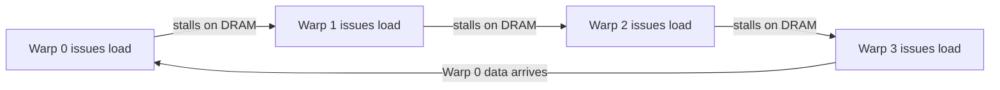

# Latency, Throughput, and Latency Hiding

Latency and throughput sound like the same idea measured two ways, but a GPU treats them as almost unrelated design targets. Latency is how long one memory request takes to come back; throughput is how many bytes per second the memory system can sustain in steady state. A single DRAM access on a modern GPU takes several hundred nanoseconds — not meaningfully faster than it was a decade ago — yet the same hardware sustains terabytes per second in aggregate. The only way to reconcile a slow individual request with a fast aggregate rate is to have an enormous number of requests outstanding at once, and that single fact is why the CUDA programming model insists you expose thousands of threads instead of a handful.

## Little's Law

Little's Law, borrowed from queueing theory, relates exactly those three quantities: the number of items concurrently "in the system" equals the arrival rate times the time each item spends in the system. Applied to a memory system, "items in the system" becomes bytes in flight, "arrival rate" becomes the achieved bandwidth, and "time in the system" becomes the memory latency:

```text
bytes in flight = bandwidth x latency
```

This is the arithmetic that turns "latency is fixed and slow" into "throughput is achievable anyway": if latency can't be reduced, the only lever left is to keep enough requests outstanding simultaneously that the pipeline never runs dry while any single one is in flight.

## Why a GPU runs thousands of threads

Little's Law is also a sizing formula — it tells you exactly how much concurrency a target bandwidth requires. Take an NVIDIA A100 SXM (Ampere, compute capability 8.0), whose HBM2e memory sustains roughly 2 TB/s, and assume a representative DRAM access latency on the order of 500 ns:

```text
bytes in flight = 2 TB/s x 500 ns
                = 2e12 bytes/s x 500e-9 s
                = 1e6 bytes
                = 1 MB
```

Sustaining that ~2 TB/s requires roughly **1 MB of memory requests outstanding at all times** — not queued and waiting, but actually in flight between the SMs and DRAM simultaneously. No single thread can generate anywhere near that on its own; a thread issuing one 4-byte load at a time contributes essentially nothing to the total until thousands of other threads are doing the same thing concurrently. That is the entire justification for the SIMT programming model's scale: the hardware doesn't need thousands of threads because the arithmetic is heavy, it needs them because that's what it takes to keep ~1 MB of requests in flight against a fixed per-request latency.

:::info[Latency hiding is why the model looks the way it does]
Every design choice that looks strange coming from CPU programming — thousands of threads for a problem that logically needs far fewer, a huge register file split across many resident warps, encouragement to over-subscribe rather than minimize thread count — exists to supply enough concurrent memory requests to satisfy Little's Law. Latency hiding isn't an optimization on top of the programming model; it's the reason the model exposes so many threads in the first place.
:::

## Occupancy as concurrency, not as a score

**Occupancy** — the ratio of resident warps on an SM to the maximum the hardware supports — is often treated as a score to maximize, but that framing misses what it actually measures. Occupancy is the mechanism that supplies the concurrency Little's Law demands: each resident warp can have a memory request outstanding, and the warp scheduler switches to whichever warp is ready to issue the moment the currently-issuing warp stalls. More resident warps means more requests can be outstanding simultaneously, which is what lets the memory system approach its sustained bandwidth instead of sitting idle between the issue of one request and the arrival of its data.

The scheduler itself does none of this predictively. There is no reordering, no speculation, no lookahead — when a warp issues a load and that load will take hundreds of cycles to return, the warp is marked not-ready and the scheduler simply picks a different warp that *is* ready, at zero switching cost, because every resident warp's register state already lives in the SM's register file. Nothing needs to be saved or restored. The diagram below shows the pattern with four warps: each issues a load, stalls waiting on DRAM, and cedes the pipeline to the next warp, cycling back around once the first warp's data has arrived.



The scheduler is never idle as long as *some* warp is eligible to issue — which is precisely why the machine needs many more resident warps than it can issue on any single cycle. Push occupancy too low (too few resident warps, usually because a kernel uses too many registers or too much shared memory per thread) and there aren't enough outstanding requests to hide the latency; the pipeline stalls waiting for data with no other warp ready to fill the gap. Push it to 100% and you may still be memory-bound for other reasons entirely — occupancy is necessary for latency hiding, not sufficient for good performance. [Occupancy Tuning](../07-kernel-optimization/occupancy-tuning.md) covers the levers for raising it and when raising it further stops helping.

## Worked example

Put both ideas together on the A100 numbers above. At full occupancy, an SM might have 64 resident warps (2048 threads); if even a modest fraction of those threads have an outstanding load at any given instant, the SM alone contributes thousands of bytes of in-flight requests, and 108 SMs acting the same way is what adds up to the ~1 MB, device-wide, that Little's Law says is required to sustain ~2 TB/s. Drop occupancy to a handful of resident warps per SM — say by requesting so many registers per thread that only a few warps fit — and the device-wide total of in-flight bytes can fall far short of that 1 MB, the memory system falls out of steady state, and achieved bandwidth drops well below the ~2 TB/s the datasheet promises, even though not a single instruction changed.

## See also

- [Arithmetic Intensity and the Roofline Model](./arithmetic-intensity-and-roofline.md) — once bandwidth is achievable, this is how you decide whether a kernel is bandwidth-limited or compute-limited.
- [Register File and Occupancy](../02-gpu-hardware-architecture/register-file-and-occupancy.md) — the hardware resource limits that set the occupancy ceiling for a given kernel.
- [Occupancy Tuning](../07-kernel-optimization/occupancy-tuning.md) — the practical knobs for raising resident warp count.
- [GPU & Accelerators](../readme.md) — the section index and its three learning paths.
