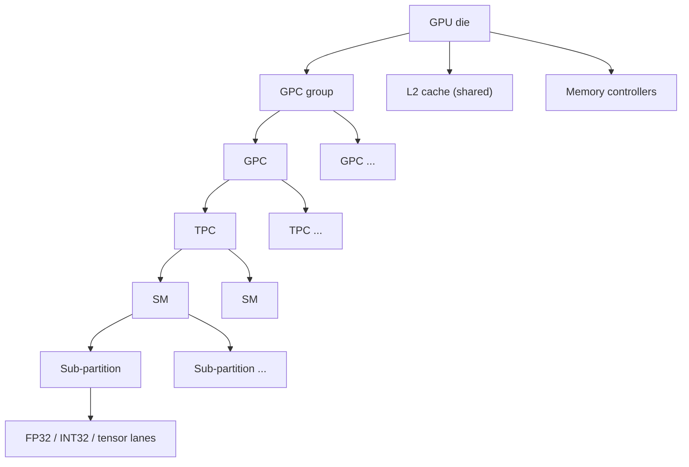

# Anatomy of a GPU

A spec sheet lists a GPU as a pile of numbers — core count, clock speed, memory bandwidth — but those numbers only make sense once you know what physical structure they're describing. A GPU is not a bag of independent processors; it's a small number of large, warp-scheduling processors (streaming multiprocessors), each built from smaller replicated pieces, all sharing a common path out to memory. Understanding that structure top to bottom is what turns a spec sheet from marketing copy into something you can reason about.

## Top-down

The hierarchy has a fixed shape from the whole chip down to a single arithmetic lane. A GPU is partitioned into graphics processing clusters (GPCs), each GPC contains several texture processing clusters (TPCs), each TPC contains one or two streaming multiprocessors (SMs), and each SM is itself split into sub-partitions (also called processing blocks) that each own a slice of the warp scheduling hardware and a set of lanes. Sitting alongside the GPC hierarchy, not underneath it, are the L2 cache and the memory controllers — every SM reaches memory through this shared path, which is why L2 behavior and memory-controller layout matter even though they aren't "inside" any GPC.

*Source: [NVIDIA CUDA C++ Programming Guide](https://docs.nvidia.com/cuda/cuda-c-programming-guide/)*

:::warning["CUDA cores" counts lanes, not processors]
Marketing material advertises a GPU by its total "CUDA core" count — an H100 SXM (Hopper, compute capability 9.0) is sold as having 16,896 FP32 CUDA cores. That number is 132 SMs times 128 FP32 lanes per SM; it is **not** 16,896 independent processors. A CUDA core has no program counter, no scheduler, and no ability to execute an instruction stream on its own — it's an ALU lane that does whatever the warp scheduler above it issues. The unit that actually behaves like a CPU core, with its own instruction issue and scheduling, is the SM: 132 of them on that same H100 SXM. When comparing GPU generations or vendors, SM count and per-SM lane count are the meaningful figures; the headline "core count" is their product and hides both.
:::

## What a "core" actually is

A "CUDA core" is a single scalar FP32/INT32 ALU lane inside an SM sub-partition. It executes one thread's arithmetic instruction per cycle, but only when the warp scheduler that owns its sub-partition issues that instruction — the lane itself makes no decisions about what to run or when. This is the root of why GPU core counts and CPU core counts are not comparable: a CPU core is a complete, independently-scheduled instruction stream; a CUDA core is one lane of a much wider, warp-scheduled SIMT pipeline. [Streaming Multiprocessor](./streaming-multiprocessor.md) goes into how those lanes are organized into sub-partitions and issued to.

Recent SMs also contain tensor cores — fixed-function matrix-multiply-accumulate units, distinct from the FP32/INT32 lanes — and it's common for a spec sheet to quote both a CUDA core count and a tensor core count for the same chip. They are separate hardware occupying the same SM, not two views of the same lanes. [Tensor Cores](./tensor-cores.md) covers them on their own.

## The memory side

Every SM's path to DRAM runs through the same shared L2 cache and the same set of memory controllers, which is why L2 sits beside the GPC hierarchy in the diagram above rather than inside any one GPC — it's a resource every SM contends for, not something replicated per cluster. The memory controllers connect to the actual DRAM technology (HBM on datacenter parts, GDDR on most consumer parts), and their aggregate width is what turns a memory clock into the bandwidth figure on a spec sheet. [Device Memory and Bandwidth](./device-memory-and-bandwidth.md) works through that calculation; [Cache Hierarchy](./cache-hierarchy.md) covers what L2 actually caches and how it interacts with each SM's local L1.

## Reading a spec sheet

A datacenter spec sheet is a shorthand for the structure above. Using an H100 SXM (Hopper, compute capability 9.0) as the worked example:

| Field | H100 SXM value | What it tells you |
|---|---|---|
| SM count | 132 | The number of independently-scheduled processors on the die — the figure to compare across GPUs, not "core count." |
| Cores per SM (FP32) | 128 | Lanes per SM; multiplied by SM count gives the marketing "CUDA core" figure (128 × 132 = 16,896). |
| Boost clock | ~1.98 GHz | Peak per-lane issue rate; combined with lane count and count of FLOPs/instruction gives peak FP32 TFLOPS (~67 TFLOPS on this part). |
| Memory type | HBM3 | Determines per-pin bandwidth and typical bus width; HBM trades capacity/cost for far more bandwidth than GDDR. |
| Bus width | 5120-bit (aggregate across stacks) | Wider bus at a given memory clock means more bandwidth — this is the "how" behind the bandwidth number below it. |
| Peak memory bandwidth | ~3.35 TB/s | The ceiling for any memory-bound kernel on this part; see [Arithmetic Intensity and the Roofline Model](../01-parallel-computing-foundations/arithmetic-intensity-and-roofline.md) for how it sets the roofline's memory-bound slope. |
| L2 cache size | 50 MB | Shared across all 132 SMs; large enough to hold working sets that would otherwise round-trip to HBM on every access. |

None of these numbers transfer to a different generation or SKU without re-checking — a consumer Ada Lovelace card, an A100, and an H100 disagree on every row of this table. Always name the part when you quote one.

## See also

- [The Streaming Multiprocessor](./streaming-multiprocessor.md) — what's inside a single SM, one level down from this page.
- [Device Memory and Bandwidth](./device-memory-and-bandwidth.md) — how bus width and memory clock become the bandwidth figure above.
- [Glossary](../00-overview/glossary.md) — SM, CUDA core, and HBM definitions in one place.
- [GPU & Accelerators](../readme.md) — the section index and its three learning paths.
