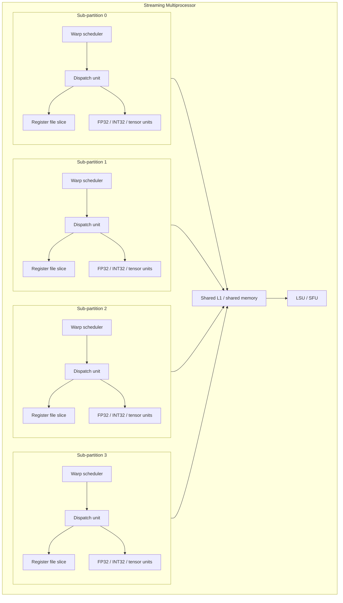

# The Streaming Multiprocessor

The SM is the unit everything about GPU performance is ultimately accounted against: occupancy, register pressure, shared-memory capacity, and warp scheduling are all per-SM quantities. Zooming into one SM explains why a block, once scheduled, stays resident on a single SM for its entire lifetime, and why the resources that limit how many blocks can run concurrently are the ones this page enumerates.

## Sub-partitions

An SM is not one monolithic scheduler feeding a flat pool of lanes; it is split into a small number of sub-partitions (four, on every architecture from Volta through Blackwell), each with its own warp scheduler, dispatch unit, and slice of the register file and lane count. A resident warp is assigned to exactly one sub-partition for its lifetime and is scheduled only by that sub-partition's scheduler — the four schedulers on an SM run independently and do not share warps.

## Functional units

Each sub-partition owns its own FP32 and INT32 lanes, and — from Volta onward — its own share of the SM's tensor cores; these execute the arithmetic the scheduler issues. Below the four sub-partitions, the SM has units shared across all of them: load/store units (LSUs) that generate and track memory requests, and special function units (SFUs) that compute transcendentals (`sin`, `exp`, reciprocal, and similar) at lower precision and higher throughput than a general sequence of FP32 instructions would. A warp's ordinary arithmetic stays inside its own sub-partition; its memory operations and transcendental calls reach out to these shared units.

## The register file

Each sub-partition has its own slice of the SM's register file, and it is the single scarcest resource on the chip — far larger in aggregate than any programmer intuition suggests, and still the thing that most often caps how many warps can be resident. On Hopper (compute capability 9.0), each sub-partition provides 64 KB of register storage — 16,384 32-bit registers — for a 65,536-register (256 KB) total across the SM's four sub-partitions. Registers are allocated to a thread for its entire residency, never spilled by the hardware to make room for another thread; a kernel that requests more registers per thread simply leaves fewer resident threads possible. [Register File and Occupancy](./register-file-and-occupancy.md) works this into a full occupancy calculation.

## Shared memory and L1

On every architecture since Volta, L1 cache and shared memory occupy the same physical on-chip SRAM, partitioned by a configurable split rather than existing as two separate pools. On Hopper (compute capability 9.0), that combined pool is 256 KB per SM, of which a kernel can request up to 227 KB as explicitly-addressed shared memory (the remainder is reserved so the hardware still has some L1 capacity for global/local traffic); the driver rounds a request up to one of a small set of supported carveout sizes rather than granting an arbitrary byte count. Ampere (compute capability 8.0) offers a smaller combined pool — 192 KB per SM on the A100, with up to 164 KB available to shared memory. Because the split is configurable per kernel via the runtime API, a kernel that needs little shared memory can leave more of the pool acting as L1, and vice versa.

Unlike the register file, this pool is not split evenly and statically across the four sub-partitions the way registers are — the combined L1/shared-memory block sits below all four sub-partitions and is reachable by any warp on the SM, which is exactly why shared memory can be used to communicate between warps in the same block, while registers cannot.

*Source: [NVIDIA CUDA C++ Programming Guide](https://docs.nvidia.com/cuda/cuda-c-programming-guide/)*

:::note[These numbers change every generation]
The register file size, the combined L1/shared-memory capacity, and the maximum shared-memory carveout have all grown from generation to generation and will keep changing — Volta, Turing, Ampere, Hopper, and Blackwell each ship different numbers here. The durable content of this page is the *structure* — four sub-partitions, a per-sub-partition register slice, a shared configurable L1/shared-memory pool below them — not any specific KB figure. Always check [Compute Capability](./compute-capability.md) or the CUDA occupancy calculator for the number that applies to the part you're targeting.
:::

## What limits how much fits

Three independent resources cap how many blocks (and therefore how many warps) can be resident on an SM at once: the register file, the shared-memory pool, and a fixed hardware limit on the number of concurrently resident blocks and threads regardless of how little of the other two a launch uses. A launch configuration that's frugal with registers and shared memory can still under-occupy the SM if the block size doesn't divide the thread-slot limit efficiently. [Register File and Occupancy](./register-file-and-occupancy.md) turns these three limiters into an actual calculation, and [Warps and Warp Schedulers](./warps-and-schedulers.md) covers what the scheduler does with however many warps end up resident.

## See also

- [Warps and Warp Schedulers](./warps-and-schedulers.md) — what each sub-partition's scheduler does with its resident warps.
- [Register File and Occupancy](./register-file-and-occupancy.md) — turning the register and shared-memory sizes above into a blocks-per-SM calculation.
- [Cache Hierarchy](./cache-hierarchy.md) — how the shared L1/shared-memory block behaves as a cache, not just a scratchpad.
- [Shared Memory](../04-cuda-memory-model/shared-memory.md) — using the shared-memory portion of this pool from kernel code.
- [GPU & Accelerators](../readme.md) — the section index and its three learning paths.
