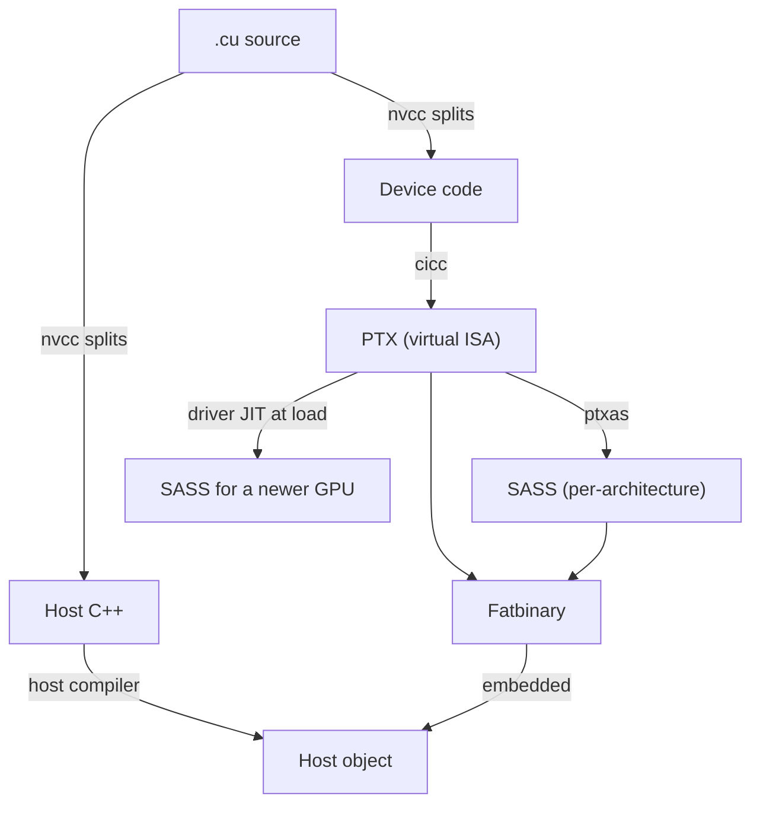

# The Compilation Model

A single `.cu` file contains two programs wearing one extension: host C++ that runs on the CPU, and device code that has to end up as instructions a specific GPU can execute. `nvcc` is the tool that splits those apart, compiles each with the right compiler, and glues the results back into one binary — understanding that split is what makes `-arch`, `-code`, and the difference between a build that runs everywhere and one that only runs on the GPU it was built for make sense.

## What `nvcc` actually does

`nvcc` is not itself a compiler; it is a driver that partitions a `.cu` file into host and device portions, hands the host portion to the system C++ compiler, and runs the device portion through NVIDIA's own device compiler (`cicc`) and assembler (`ptxas`), then stitches the results together into a single object file the host linker can consume.



## PTX, the virtual ISA

PTX (Parallel Thread Execution) is not the GPU's real instruction set — it is a stable, forward-compatible virtual ISA that device code compiles to first. Targeting PTX instead of real machine code is what lets a single compiled artifact run, via JIT, on GPU architectures that did not exist when the code was built.

## SASS, the machine code

SASS is the actual machine code a specific GPU architecture executes; it is generated from PTX by `ptxas` and is tied to the compute capability it was assembled for. SASS for one architecture is not guaranteed to run, or run well, on another — this is the tradeoff PTX's portability exists to solve.

## Fatbinaries

A fatbinary is the container that lets one compiled object carry more than one representation of the same device code — PTX for forward compatibility, plus precompiled SASS for one or more specific architectures for fast startup with no JIT step. At load time, the driver picks whichever embedded SASS matches the running GPU, falling back to JIT-compiling the embedded PTX if no matching SASS is present.

## JIT compilation

When a GPU's compute capability has no matching SASS in the fatbinary, the driver JIT-compiles the embedded PTX for the actual hardware at load time. This is exactly what makes running compiled CUDA binaries on newer GPUs than they were built for possible — at the cost of a one-time JIT compilation delay the first time that binary runs on that hardware.

## Reading the output

Producing and inspecting each stage directly makes the pipeline concrete rather than theoretical:

```bash
nvcc -O2 -arch=sm_90 -ptx kernel.cu -o kernel.ptx
cuobjdump -sass ./kernel        # SASS
nvdisasm -c kernel.cubin        # control-flow annotated
```

`-arch` and `-code` map onto two different stops in the diagram above: `-arch=compute_90` tells `nvcc` which virtual PTX architecture to target and stops there, while `-code=sm_90` tells it to continue past PTX and assemble real SASS for that specific architecture. A production build typically supplies both, plus a PTX fallback for forward compatibility; [Compute Capability](../02-gpu-hardware-architecture/compute-capability.md) covers the shipping recipe for choosing which architectures to target.

:::tip[`-Xptxas -v` is the cheapest optimization feedback available]
Passing `-Xptxas -v` to `nvcc` prints per-kernel register and shared-memory usage at compile time, with no profiler run required:

```text
ptxas info    : Used 32 registers, 4096 bytes smem, 360 bytes cmem[0]
```

Register and shared-memory usage directly determine occupancy, so this single flag is often the first thing worth checking before reaching for a profiler.
:::

## See also

- [Separate Compilation and Linking](./separate-compilation-and-linking.md) — what happens when device code spans multiple translation units.
- [Compute Capability](../02-gpu-hardware-architecture/compute-capability.md) — choosing which `-arch`/`-code` pairs to ship.
- [PTX and Inline Assembly](../07-kernel-optimization/ptx-and-inline-assembly.md) — reading and writing PTX directly.
- [GPU & Accelerators](../readme.md) — the section index and its three learning paths.
