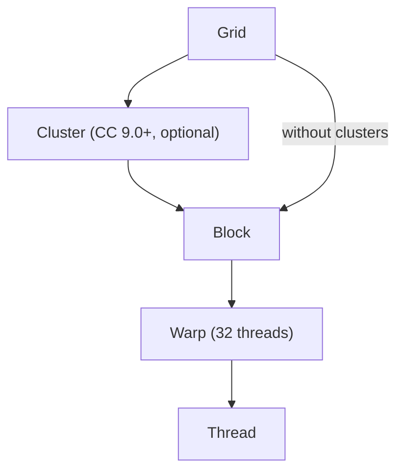

# Threads, Blocks, and Grids

A kernel launch like `saxpy<<<blocks, threads>>>(...)` doesn't just start "some threads" — it starts a precisely structured hierarchy, and the shape of that hierarchy is what lets the same compiled kernel run correctly on a small laptop GPU and a data-center accelerator with an order of magnitude more SMs. Understanding the levels of that hierarchy, and which ones can and can't communicate, is the difference between a kernel that scales and one that only happens to work on the GPU it was tested on.

## The hierarchy

A launch creates a **grid** of **blocks**, each block a group of **threads**. The hardware executes threads in groups of 32 called **warps** (covered fully in [Warps and Warp Schedulers](../02-gpu-hardware-architecture/warps-and-schedulers.md)), and on compute capability 9.0+ GPUs, blocks can additionally be grouped into **clusters** — an optional level between grid and block that lets blocks in the same cluster cooperate more directly than blocks elsewhere in the grid.



:::note[Clusters need compute capability 9.0+]
Thread block clusters are a Hopper-and-later feature. See [Compute Capability](../02-gpu-hardware-architecture/compute-capability.md) for how to check a target GPU supports them, and [Thread Block Clusters](./thread-block-clusters.md) for how to launch one.
:::

## `dim3` and multi-dimensional launches

Grid and block dimensions are each a `dim3` — three integers (x, y, z), any of which can be left at 1. `saxpy<<<blocks, threads>>>` is shorthand for a 1-D launch where `blocks` and `threads` are implicitly `dim3(blocks, 1, 1)` and `dim3(threads, 1, 1)`; declaring the `dim3` explicitly is what enables 2-D or 3-D launches, which are convenient whenever the data itself is naturally 2-D or 3-D, such as an image.

```cpp showLineNumbers
dim3 threadsPerBlock(16, 16);
dim3 numBlocks((width + threadsPerBlock.x - 1) / threadsPerBlock.x,
               (height + threadsPerBlock.y - 1) / threadsPerBlock.y);

processImage<<<numBlocks, threadsPerBlock>>>(d_image, width, height);
```

Inside the kernel, `blockIdx` and `threadIdx` are themselves `dim3` values, so `blockIdx.y * blockDim.y + threadIdx.y` gives the row and the analogous `.x` expression gives the column — the 2-D generalization of the same formula [Your First Kernel](./your-first-kernel.md) used in one dimension. [Thread Indexing](./thread-indexing.md) covers this in depth.

## Why blocks must be independent

Blocks may run in any order, concurrently or serially, on any SM the hardware assigns them to, and there is no portable way to synchronize across blocks within a plain kernel launch — no barrier a thread in one block can use to wait on a thread in another. This is not a missing feature; it's the property that makes the hierarchy scale: because the runtime is never required to run all blocks at once, the same grid can be spread across a GPU with 20 SMs or one with 130, in whatever order the scheduler finds convenient, and the result is identical either way. [Grid-Wide Synchronization](../05-execution-and-synchronization/grid-wide-synchronization.md) covers the one mechanism — cooperative launches — that relaxes this rule at the cost of giving up that flexibility.

## How blocks map to SMs

The hardware scheduler assigns whole blocks to SMs — a block never splits across two SMs, and all of a block's threads execute on the same SM for the block's lifetime, which is what lets threads within a block share on-chip resources like shared memory and use `__syncthreads()` to coordinate. An SM can hold several resident blocks at once, up to whatever the register file, shared memory, and thread-slot limits allow — the exact calculation is [The Register File and Occupancy](../02-gpu-hardware-architecture/register-file-and-occupancy.md)'s subject.

## The limits

| Limit | Value |
|---|---|
| Max threads per block | 1024 |
| Max block dimensions (x, y, z) | 1024, 1024, 64 (product ≤ 1024) |
| Max grid dimensions (x, y, z) | 2³¹−1, 65535, 65535 |
| Warp size | 32 |

These are architectural ceilings, not tuning targets — most kernels use far fewer than 1024 threads per block. They, along with the resource limits from the previous section, are queryable at runtime via `cudaDeviceProp` rather than hardcoded, since they can vary across compute capabilities.

## See also

- [Thread Indexing](./thread-indexing.md) — turning `blockIdx`/`threadIdx` into the array index a thread should touch.
- [Thread Block Clusters](./thread-block-clusters.md) — the optional CC 9.0+ level shown above.
- [Warps and Warp Schedulers](../02-gpu-hardware-architecture/warps-and-schedulers.md) — how a block's threads are actually scheduled in groups of 32.
- [Grid-Wide Synchronization](../05-execution-and-synchronization/grid-wide-synchronization.md) — the cooperative-launch exception to block independence.
- [GPU & Accelerators](../readme.md) — the section index and its three learning paths.
