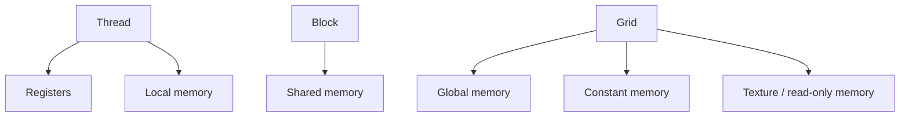

# Memory Spaces Overview

A CUDA kernel does not have one undifferentiated pool of memory to work with — it has six, each with its own scope, lifetime, and performance profile, and picking the wrong one for a given piece of data is one of the most common ways a kernel ends up an order of magnitude slower than it should be. This page is the map: what each space is, who can see it, how long it lives, and the rough latency and bandwidth numbers that make the choice matter. The pages that follow work through each space in depth.

## The six spaces

| Space | Declared as | Scope | Lifetime | Cached | Typical latency | Typical size |
|---|---|---|---|---|---|---|
| Register | plain local variable | thread | thread | N/A (on-chip) | ~1 cycle | 65,536 32-bit registers/SM |
| Local | spilled variable, non-constant-indexed local array | thread | thread | L1/L2 | few hundred cycles | limited only by device memory |
| Shared | `__shared__` | block | block | N/A (on-chip, explicit) | ~20-30 cycles | up to 164 KB/SM (opt-in; up to 227 KB/SM on Hopper, CC 9.0) |
| Global | `cudaMalloc`, `__device__` | grid / host | application (until freed) | L1/L2 | few hundred cycles | device memory, GBs |
| Constant | `__constant__` | grid / host | application | dedicated constant cache | ~few cycles when broadcast | 64 KB |
| Texture / read-only | `cudaTextureObject_t`, `const __restrict__` | grid / host | application (or bound object's lifetime) | dedicated read-only cache | ~few cycles when cached | device memory-backed |

These are Ampere-class (compute capability 8.0) figures — [Compute Capability](../02-gpu-hardware-architecture/compute-capability.md) covers how they shift across generations, and [The Register File and Occupancy](../02-gpu-hardware-architecture/register-file-and-occupancy.md) works the register and shared-memory numbers into a full occupancy calculation.

:::note[Numbers vary by compute capability]
The register file size, maximum shared memory per SM, and constant memory limit are all compute-capability-dependent. See [Compute Capability](../02-gpu-hardware-architecture/compute-capability.md) before treating any of the figures above as universal.
:::

## Scope and lifetime

Scope and lifetime don't always move together, and the mismatch is worth noticing. Registers and local memory are scoped and lived entirely within one thread — nothing else can see them, and they vanish when the thread retires. Shared memory is scoped to a block and lives for that block's residency on the SM: every thread in the block can read what any other thread in the block wrote, but a different block — even one running concurrently on the same SM — has its own separate instance. Global, constant, and texture memory are visible to every thread in every block of the grid (and to the host, via `cudaMemcpy` and friends), and they persist independently of any single kernel launch — an allocation made before a kernel runs is still there after it returns, until it's explicitly freed.

## Latency and bandwidth

The ordering that matters in practice: registers are fastest, shared memory is next and close behind, and everything else — local, global, constant, and texture — ultimately routes through the same on-chip caches and off-chip device memory, differing mainly in *how* the hardware serves an access rather than where the bytes physically live. Constant and texture/read-only memory reach register-like effective latency only under their respective best cases (a broadcast read, or a cache hit on spatially local data); outside those cases they cost the same as an ordinary global load. [Global Memory and Coalescing](./global-memory-and-coalescing.md) and [Constant and Texture Memory](./constant-and-texture-memory.md) cover the access patterns that hit those best cases.

:::warning["Local" memory is not local to anything fast]
Despite the name, local memory is not a fast per-thread scratchpad — it is ordinary device memory with per-thread addressing, subject to the same latency as any other global access. A register spill lands here, and a kernel that spills heavily pays full memory latency for accesses the source code still writes as plain local variables. See [Registers and Local Memory](./registers-and-local-memory.md) for what forces a spill and how to detect one.
:::

## Choosing a space

Most of the decision reduces to a short list:

- Per-thread scratch that only this thread ever needs → registers (and let the compiler manage them).
- Data reused by multiple threads within the same block → shared memory.
- Read-only data that every thread in a warp reads from the same address → constant memory.
- Everything else — the default — → global memory.

## See also

- [Global Memory and Coalescing](./global-memory-and-coalescing.md) — the access-pattern mechanics behind the global-memory row above.
- [Shared Memory](./shared-memory.md) — allocation, lifetime, and synchronization rules for the block-scoped space.
- [Cache Hierarchy](../02-gpu-hardware-architecture/cache-hierarchy.md) — how L1 and L2 actually serve the "cached" column.
- [Glossary](../00-overview/glossary.md) — canonical definitions for shared memory, coalescing, and occupancy.
- [GPU & Accelerators](../readme.md) — the section index and its three learning paths.
