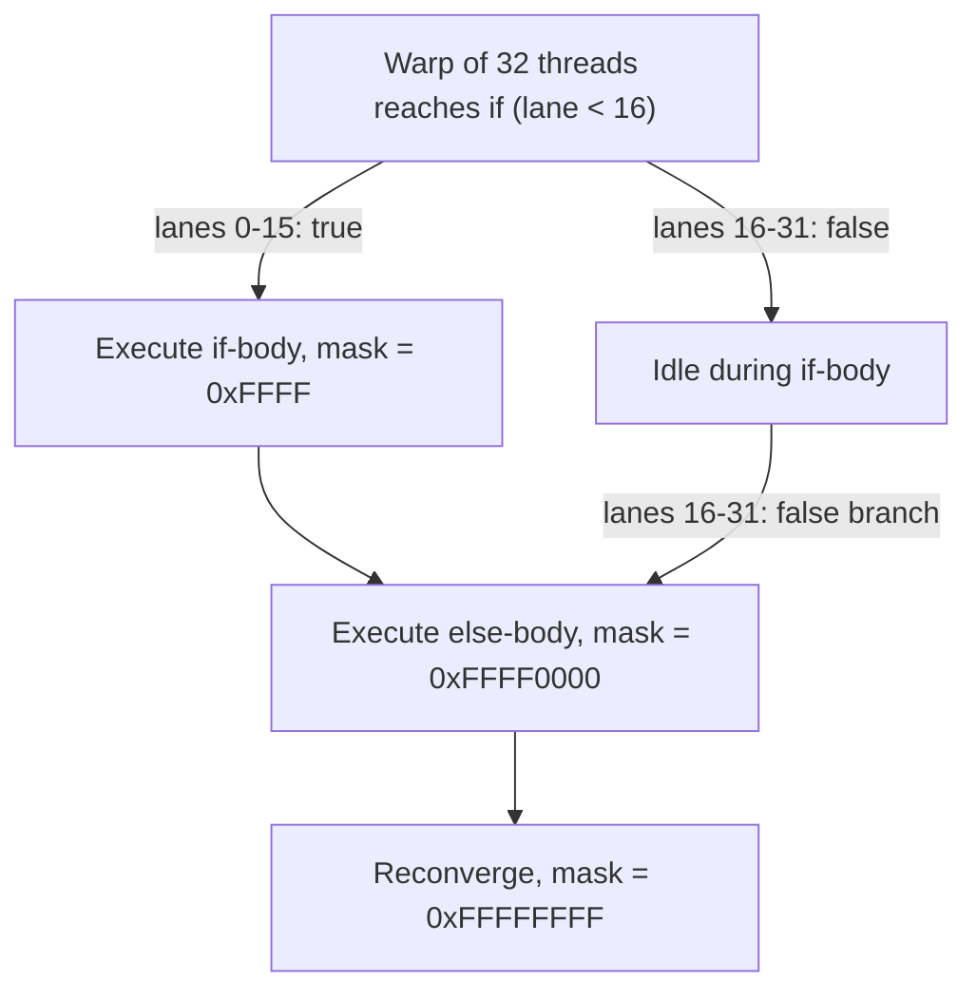

# Warp Execution and Divergence

[Warps and Warp Schedulers](../02-gpu-hardware-architecture/warps-and-schedulers.md) established that a warp scheduler issues one instruction to all 32 lanes of a warp at once. That raises an obvious question: what happens when those 32 threads disagree about which instruction to execute next, because a branch condition evaluated differently across lanes? The answer — the warp executes both outcomes and masks off the lanes that don't apply to each one — is the single most important cost model in CUDA kernel design, and getting it precise is the point of this page.

## One instruction, 32 threads

The hardware has no mechanism to issue different instructions to different lanes of the same warp in the same cycle. When every thread in a warp takes the same path through an `if`, a loop, or a `switch`, the warp simply executes that path at full width — one instruction per cycle, 32 lanes active, no different from straight-line code. The cost model below only matters once lanes within a warp disagree.

## The active mask

When a warp reaches a branch, the hardware evaluates the condition per lane and computes an **active mask** — a 32-bit set of which lanes are "live" for the instructions that follow. If the mask isn't all-32, the warp is diverged: it will execute the taken paths one at a time, each with only the mask's lanes active and the rest idle. The active mask is exactly what the mask argument to `__shfl_sync`, `__ballot_sync`, and friends is meant to describe — see [Independent Thread Scheduling](./independent-thread-scheduling.md) for why every intrinsic now requires the caller to state it explicitly.



## What divergence costs

The cost model is additive, not a maximum: if an `if`/`else` inside a warp sends some lanes down the `if` and others down the `else`, the warp issues the instructions for *both* paths, sequentially, each time masking off the lanes that don't belong to that path. A warp that spends 10 cycles in the `if` body and 6 in the `else` body pays 16 cycles total for that branch, not 10 — every lane in the warp, including the ones that were idle for a given path, sits through the full sequence. The same logic scales linearly: a 32-way `switch` where every lane takes a different case forces the warp through all 32 cases in sequence, one at a time, even though only one lane is ever doing useful work in each pass.

```cpp showLineNumbers
// Diverges within the warp: some lanes take one branch, others the other.
// The warp pays the SUM of both paths' instruction counts.
__global__ void divergentKernel(int* data, int n) {
    int i = blockIdx.x * blockDim.x + threadIdx.x;
    if (i >= n) return;
    if (data[i] % 2 == 0) {
        data[i] = expensiveEvenPath(data[i]);   // some lanes take this
    } else {
        data[i] = expensiveOddPath(data[i]);    // other lanes take this
    }
}
```

## Divergence that does not cost anything

A branch only costs extra when lanes *within the same warp* disagree. A condition that is uniform across every lane of a warp — true for all 32 or false for all 32 — is not divergence at all, even though it is still a branch and still shows up as an `if` in the source. Two conditions are guaranteed warp-uniform because of how thread indices map to warps: branching on `blockIdx.x` (every thread in a warp shares the same block), and branching on `threadIdx.x / 32` (the warp index itself, since a warp is always 32 consecutive `threadIdx.x` values within a block's linear layout).

```cpp showLineNumbers
// Warp-uniform: every lane in a given warp shares the same blockIdx.x
// and the same threadIdx.x / 32, so every lane in the warp takes the
// same side. No divergence, no extra cost.
__global__ void uniformBranchKernel(float* data) {
    int warpId = threadIdx.x / 32;
    if (blockIdx.x % 2 == 0) {
        data[threadIdx.x] *= 2.0f;      // whole warp takes this, or none of it does
    }
    if (warpId < 4) {
        data[threadIdx.x] += 1.0f;      // whole warp takes this, or none of it does
    }
}
```

## Restructuring to converge

Because the cost is per-warp, not per-thread, the fix for divergence is rarely "eliminate the branch" — it's making sure a warp's 32 threads agree on which side they take. Sorting or bucketing work ahead of time so that threads doing the same kind of work land in the same warp turns what would have been per-thread divergence into a warp-uniform branch between warps, which is free. Branchless rewrites (arithmetic instead of `if`) help too, but they trade a cheap-when-uniform branch for unconditional extra instructions on every lane, which is not always a win.

:::tip[Sort before you branch-eliminate]
Grouping similar work into the same warp — by sorting indices, bucketing by category, or restructuring the grid so a warp's threads share a code path — is usually a bigger win than rewriting a branch to be branchless. A branchless rewrite pays its cost on every lane, every time; a warp that never diverges in the first place pays nothing. See [Reducing Divergence](../07-kernel-optimization/reducing-divergence.md) for concrete restructuring patterns.
:::

## See also

- [Independent Thread Scheduling](./independent-thread-scheduling.md) — how per-thread program counters changed what divergence and reconvergence actually look like on CC 7.0+.
- [Warp-Level Primitives](./warp-level-primitives.md) — the `_sync` intrinsics whose mask argument describes exactly the active mask this page introduces.
- [Reducing Divergence](../07-kernel-optimization/reducing-divergence.md) — restructuring techniques to keep warps uniform.
- [Warps and Warp Schedulers](../02-gpu-hardware-architecture/warps-and-schedulers.md) — the scheduler hardware this page's cost model runs on.
- [GPU & Accelerators](../readme.md) — the section index and its three learning paths.
