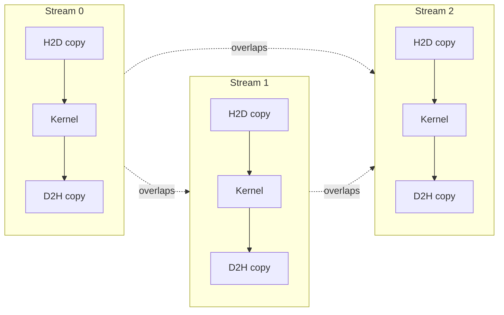

# Streams and Concurrency

[Pinned Memory and Host Transfers](../04-cuda-memory-model/pinned-memory-and-transfers.md) split a transfer into four chunks, each on its own stream, to overlap H2D copies with kernel execution — but it left unanswered exactly what a stream guarantees, why that overlap can silently fail to happen even with the code written correctly, and how to reason about ordering across streams on purpose. That's this page.

## What a stream is

A CUDA stream is an ordered queue of work — kernel launches, memory copies, host callbacks. Operations issued into the *same* stream execute in the order they were issued, one completing before the next begins. Operations issued into *different* streams have no ordering relationship at all unless the program creates one explicitly, with an event (below) or a synchronization call. That lack of cross-stream ordering is precisely what makes concurrency possible: the driver is free to run stream A's kernel and stream B's copy at the same time, because nothing said it couldn't.

## The null stream

Every CUDA program has a **default stream**, and its behavior is the single most common way concurrency silently disappears. On the classic (legacy) default stream, an operation issued to it implicitly synchronizes with every other **blocking** stream in the program — it waits for all of them to drain, and they wait for it. A pipeline can be carefully split across four explicit streams and still serialize completely if one stray `kernel<<<g, b>>>(...)` call — with no stream argument, and therefore issued to the legacy default stream — sits in the middle of it; that one call drains and blocks every other stream around it.

Two fixes:

- Create streams with the `cudaStreamNonBlocking` flag (`cudaStreamCreateWithFlags(&s, cudaStreamNonBlocking)`). A stream created this way is exempt from the legacy default stream's implicit synchronization — the default stream no longer waits for it or blocks it.
- Compile with `--default-stream per-thread`. This changes what the default stream *is*: each host thread gets its own regular, non-synchronizing stream instead of sharing one legacy synchronizing stream process-wide, so an un-streamed call no longer serializes against every other thread's work.

## Per-thread default stream

`--default-stream per-thread` doesn't just add a flag to an existing stream — it changes the identity of `cudaStreamLegacy`'s replacement, `cudaStreamPerThread`, from a special implicitly-synchronizing stream into an ordinary one scoped to the calling host thread. Code that never explicitly names a stream still behaves correctly under this model without being rewritten; it simply stops silently serializing against other threads' streams.

## Concurrent kernels

Whether two kernels from different streams can actually run on the GPU at the same time depends on the device's `concurrentKernels` property (see [Device Management](./device-management.md)) and on whether each kernel leaves SMs free — a kernel that already saturates every SM leaves nothing for a concurrent second kernel to run on, regardless of how the streams are arranged.

## Overlapping transfer and compute

The four-stream loop from [Pinned Memory and Host Transfers](../04-cuda-memory-model/pinned-memory-and-transfers.md) — one stream per chunk, each issuing its H2D copy, kernel, and D2H copy in sequence — is the pattern that makes the timeline below possible: the driver can run chunk 1's kernel at the same time as chunk 2's H2D copy and chunk 0's D2H copy, because those operations sit in different streams with no ordering between them.

Within each stream the three operations are strictly ordered left to right; the dashed cross-stream edges are the absence of any such ordering between streams, which is exactly what lets the driver run any two of them at once.

## Priorities

`cudaStreamCreateWithPriority` creates a stream with a priority level, and `cudaDeviceGetStreamPriorityRange` reports the device's valid range (lower numeric value means higher priority). Priority affects the order in which the scheduler dispatches **new** blocks to an SM when more than one stream has eligible work waiting — it is not preemption: a block that's already running on an SM keeps running to completion regardless of what higher-priority work becomes ready afterward.

## Making concurrency actually happen

Code that looks correctly streamed still frequently shows no overlap in the profiler. The usual reasons, as a checklist:

- Host memory involved in the transfers isn't pinned — see [Pinned Memory and Host Transfers](../04-cuda-memory-model/pinned-memory-and-transfers.md) for why a pageable pointer silently falls back to synchronous behavior.
- Not enough work per kernel to leave any SMs free for a second, concurrent kernel.
- The device has only one copy engine, so an H2D copy and a D2H copy can't overlap *each other* even though each can overlap kernel execution.
- An implicit synchronization point snuck in — `cudaMalloc`, `cudaFree`, the synchronous form of `cudaMemcpy`, or `cudaDeviceSynchronize` — draining every stream at that point in the program.

:::tip[Verify overlap in the profiler, not by reading the code]
Whether a given program actually achieves overlap is a claim about the scheduler's runtime behavior, not something reliably determined by reasoning about the source. Check the Nsight Systems timeline directly rather than assuming the streaming pattern worked. See [Nsight Systems](../09-tooling-profiling-and-debugging/nsight-systems.md).
:::

## See also

- [Events and Timing](./events-and-timing.md) — using events to build the cross-stream dependencies this page's ordering rules make possible.
- [CUDA Graphs](./cuda-graphs.md) — capturing a multi-stream sequence like this one into a single replayable graph.
- [Pinned Memory and Host Transfers](../04-cuda-memory-model/pinned-memory-and-transfers.md) — the overlap pattern this page explains the scheduling behind.
- [Nsight Systems](../09-tooling-profiling-and-debugging/nsight-systems.md) — where to actually confirm overlap happened.
- [GPU & Accelerators](../readme.md) — the section index and its three learning paths.
