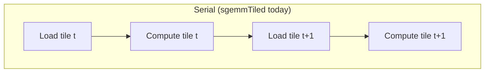
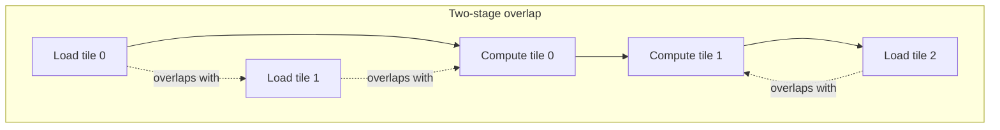

# Software Pipelining and Double Buffering

[Shared Memory Tiling](./shared-memory-tiling.md) ends on the bubble its own `sgemmTiled` kernel still has: every iteration of the tile loop is `load → __syncthreads() → compute → __syncthreads()`, and that structure forces the memory system and the ALUs to take turns rather than work at the same time. Software pipelining removes the turn-taking by starting the *next* tile's load before the *current* tile's compute has finished, so the two phases run concurrently across iterations instead of serially within one.

## The bubble in the tiled loop

In `sgemmTiled`, both `__syncthreads()` calls are full-block barriers: the first waits for every thread's load to land before any thread may read the tile back, and the second waits for every thread to finish reading before the next iteration's loads may overwrite it. Between those two barriers, exactly one thing happens — either loading or computing, never both. While the `k` loop is accumulating into `acc`, the load/store units and the DRAM pipeline sit idle; while the tile is loading, the FMA units sit idle. Neither phase overlaps the other, so the loop pays the full latency of each in sequence every iteration.





## Double buffering with shared memory

The classic fix needs no new API: keep two shared-memory tiles instead of one, load into whichever one the current iteration isn't reading from, and toggle an index each pass. This is a modification of `sgemmTiled` from [Shared Memory Tiling](./shared-memory-tiling.md) — the original kernel on that page is unchanged; this is the double-buffered variant built from it:

```cpp showLineNumbers title="sgemm_tiled_double_buffered.cu"
#define TILE 32

__global__ void sgemmTiledDoubleBuffered(int N, const float* __restrict__ A,
                                          const float* __restrict__ B, float* __restrict__ C) {
    __shared__ float As[2][TILE][TILE + 1];
    __shared__ float Bs[2][TILE][TILE + 1];

    const int row = blockIdx.y * TILE + threadIdx.y;
    const int col = blockIdx.x * TILE + threadIdx.x;
    float acc = 0.0f;

    int cur = 0;
    As[cur][threadIdx.y][threadIdx.x] = A[row * N + threadIdx.x];
    Bs[cur][threadIdx.y][threadIdx.x] = B[threadIdx.y * N + col];
    __syncthreads();

    for (int t = 0; t < N / TILE; ++t) {
        int nxt = cur ^ 1;
        if (t + 1 < N / TILE) {
            // Load tile t+1 into the *other* buffer while tile t is still being read below.
            As[nxt][threadIdx.y][threadIdx.x] = A[row * N + (t + 1) * TILE + threadIdx.x];
            Bs[nxt][threadIdx.y][threadIdx.x] = B[((t + 1) * TILE + threadIdx.y) * N + col];
        }
        // ... acc += As[cur][threadIdx.y][k] * Bs[cur][k][threadIdx.x] for k in [0, TILE) ...
        __syncthreads();
        cur = nxt;
    }
    C[row * N + col] = acc;
}
```

The load for `t + 1` is issued before the barrier that guards tile `t`'s compute, so — subject to the compiler and hardware actually overlapping the two, which manual double buffering can only request, not guarantee — the load instructions and the compute instructions are in flight together rather than one strictly following the other. There is still only one `__syncthreads()` per iteration instead of two, because the buffer swap removes the write-after-read hazard the second barrier existed to prevent.

## `memcpy_async` and `cuda::pipeline`

Manual double buffering still routes every load through a thread's registers on the way into shared memory, which occupies the thread for the whole transfer. [Asynchronous Data Movement](../04-cuda-memory-model/asynchronous-data-movement.md) covers the modern replacement in full — `cuda::memcpy_async` and the `cuda::pipeline` producer/consumer protocol built on `producer_acquire` / `producer_commit` / `consumer_wait` / `consumer_release` — so this page shows only the delta against the manual version above rather than repeating that skeleton.

The delta is narrow: each tile load becomes a `cuda::memcpy_async` call instead of a plain assignment, wrapped by `producer_acquire()` / `producer_commit()` on the pipeline object; and instead of a `__syncthreads()` before reading a tile, the loop calls `pipe.consumer_wait()` for the stage that tile lives in, then `pipe.consumer_release()` once the reads are done. The loop shape is otherwise the same as the manual version: issue next stage's load, wait on current stage, compute, release. The pipeline's advantage is that the copy for the next tile is now handled by hardware asynchronously (from CC 8.0+; see the note on [Asynchronous Data Movement](../04-cuda-memory-model/asynchronous-data-movement.md)) instead of tying up a thread's registers, freeing that thread to help with compute in the meantime.

## Multi-stage pipelines

A two-stage pipeline hides at most one tile's worth of load latency behind one tile's worth of compute. When DRAM latency for a tile exceeds the time the compute phase takes to consume the previous tile, two stages aren't enough — the compute finishes and stalls waiting for a load that hasn't landed yet. Adding a third or fourth stage gives the load more tiles' worth of compute time to hide behind before its result is needed, which is exactly what `cuda::pipeline`'s `stages` template parameter is for (the skeleton in [Asynchronous Data Movement](../04-cuda-memory-model/asynchronous-data-movement.md) uses `stages = 2`; raising it to 3 or 4 is a constant change plus proportionally more shared-memory buffers).

The cost is shared memory: each additional stage needs its own full copy of every tile buffer, so a 4-stage pipeline over the `TILE = 32` buffers from [Shared Memory Tiling](./shared-memory-tiling.md) needs roughly twice the shared memory a 2-stage pipeline does. Past some stage count, that footprint starts capping blocks-per-SM the same way an oversized single tile does, per [The Register File and Occupancy](../02-gpu-hardware-architecture/register-file-and-occupancy.md) — so stage count, like tile size, is tuned against the shared-memory limiter rather than maximized.

## TMA-based pipelines

:::note[Requires CC 9.0+]
The Tensor Memory Accelerator is a Hopper-and-later feature — see the same note on [Asynchronous Data Movement](../04-cuda-memory-model/asynchronous-data-movement.md). Check [Compute Capability](../02-gpu-hardware-architecture/compute-capability.md) before targeting it.
:::

A TMA-based pipeline moves the copy off the whole block's worth of threads entirely: one thread issues a single bulk tensor-copy instruction describing the tile's shape and strides, dedicated hardware executes the transfer including address generation, and the rest of the block waits on an `mbarrier` rather than participating in the copy at all. This is the pipeline shape CUTLASS 3.x uses for its Hopper GEMM kernels — the tensor-map setup and the TMA calls are generated by the library rather than hand-written; see [CUTLASS](../08-libraries-and-ecosystem/cutlass.md).

## When it pays

:::tip[Pipelining pays only when the kernel is already tiled and latency-bound]
Software pipelining overlaps the *load* of one tile with the *compute* of another — it has nothing to overlap if the kernel isn't tiled in the first place, and it changes nothing on a kernel that is already saturating memory bandwidth, because the DRAM pipeline is already as busy as it can be regardless of how the compute phase is scheduled around it. It earns its complexity on a tiled kernel whose bottleneck is latency — DRAM round-trip time not hidden by enough independent work — not on a kernel that's already bandwidth-bound or that has no reuse to tile in the first place.
:::

## See also

- [Shared Memory Tiling](./shared-memory-tiling.md) — the `sgemmTiled` kernel and the bubble this page opens on.
- [Asynchronous Data Movement](../04-cuda-memory-model/asynchronous-data-movement.md) — the full `cuda::memcpy_async` / `cuda::pipeline` skeleton this page's delta builds on.
- [CUTLASS](../08-libraries-and-ecosystem/cutlass.md) — where TMA-based multi-stage pipelines ship as generated, tuned code.
- [GPU & Accelerators](../readme.md) — the section index and its three learning paths.
